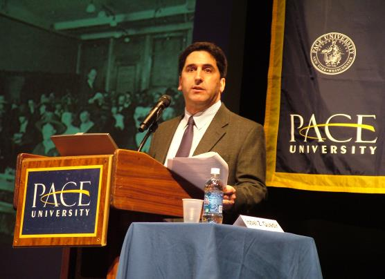

# Bruce Bachenheimer
- **_Clinical Professor of Management, [Pace University](http://www.pace.edu)_**
- **_Executive Director, [Entrepreneurship Lab](http://www.elab.nyc)_**
- **_Program Director, [Entrepreneurship @ Lubin](http://www.pace.edu/lubin/departments-and-research-centers/entrepreneurship-lubin)_**
- **_Faculty Fellow, [Wilson Center for Social Entrepreneurship](http://www.pace.edu/wilsoncenter)_**

---

---

## Spring 2020 Office Hours:
- Mon: 3:30 – 6:00, 163 William Street, Room 342 (NYC)
- Thurs: 3:30 – 6:00, Goldstein Academic Center, Room 116 (PLV)

## Online
- LinkedIn: [www.linkedin.com/in/brucebach](http://www.linkedin.com/in/brucebach)
- Twitter:  [www.twitter.com/brucebach](http://twitter.com/brucebach) @brucebach
- Google+:  [www.google.com/+BruceBachenheimer](http://www.google.com/+BruceBachenheimer)
- Skype:    bruce.bachenheimer
