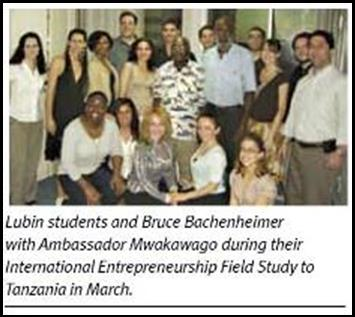
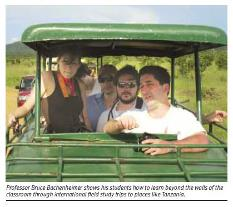

# Pace University Media

  
[Original Link](https://www.pace.edu/mypace/world-changing-impact-covid-19)  
**PACESPECTIVES: The World-Changing Impact of COVID-19**  
April 2020  
> **COVID-19 and Entrepreneurship**  
> Bruce Bachenheimer  
> eLab Director, Lubin School of Business
>
> Entrepreneurship is often associated with some form of disruption, the creation of a significant change in the market. There is perhaps no time more ‘ripe for disruption’ than during a crisis. Airbnb and Uber were founded amid the 2008 financial crisis, and probably would not have succeeded if either was launched a few years earlier or later. Why? Ordinary people would not have been willing to turn their home into a hotel or their car into a taxi absent the financial distress they were facing. Same for customers, who were suddenly willing to sleep in a stranger’s bed and pay for a ride in a regular car. Once these concepts proved successful, they were able to become a new normal.
> 
> What innovative business concepts will be born out of the COVID-19 crisis? We’ll have to wait and see. But what’s important to remember is that it’s not about coming up with an interesting idea; it’s about the passion, persistence, and perseverance to actually make it happen.

  
[Original Link](https://www.pace.edu/mypace/pacespectives-operation-varsity-blues)  
**PACESPECTIVES: OPERATION VARSITY BLUES**  
April  2019  
> Bruce Bachenheimer  
> Clinical Professor of Management  
> Executive Director, Entrepreneurship Lab  
> Lubin School of Business  
> 
> ***"Live by the sword, die by the sword"***
> 
> The "bulldozer parents" who seek to "clear a path" for their child to gain admission to a top ranked college, live by the rankings. Prospective students who define themselves by the numerical rank of the college they attend, live by the rankings. Colleges whose mission is simply to advance in the rankings, live by the rankings. And all may suffer tremendously because of college rankings.
> 
> So why live by the rankings? They offer a simplistic sorting mechanism and play on human nature. Why perpetuate them? Money. Mainly for the publishers of these rankings, but also for the institutions that rely on them as THE source for new student enrollment (i.e. tuition dollars). 
> 
> What’s a better alternative? Provide broad ratings around topics that could help students better select the college that’s the best FIT for them and rank colleges based on the VALUE they actually add. In other words: rank them on "outputs" (how well they prepare graduates) rather than "inputs" (high school grades, SAT scores, acceptance rates). Consider the incentives, having colleges select students based on who will help them advance in the rankings versus earning a reputation by preparing successful graduates.
> 
> Some colleges have successfully rejected the "games" associated with admissions and privilege. MIT does not offer athletic scholarships, have legacy admissions, include Latin honors upon graduation, or award honorary degrees. The institute is the epitome of a meritocracy. Others have excelled at adding value. Pace was ranked the best private university in the country for upward economic mobility of students. We are the embodiment of Opportunitas!

  
[Original Link](https://www.pace.edu/mypace/pacespectives-holiday-edition)  
**PACESPECTIVES: HOLIDAY EDITION**  
December 2018  
> **Is All That Shopping Giving You Business Ideas? Test Them Out!***
> 
> **Bruce Bachenheimer**
> Clinical Professor of Management, Lubin School of Business
> Executive Director, Entrepreneurship Lab  
> 
> One of the most important things for entrepreneurs to achieve is customer validation: proof that you have targeted the correct customer segment, identified a real need, and are providing a product or service that actually solves that need. The definitive form of customer validation is getting someone to open their wallet and actually make a purchase.
> 
> The holidays tend to be a time that people are more inclined to try something new and spend impulsively, so get out there and take advantage of the opportunity. Whether you make a sale or not, learn as much as possible about the market and your customers.

  
[Original Link](https://www.pace.edu/mypace/professor-in-bruce-bachenheimer)  
**THE PROFESSOR IS IN: BRUCE BACHENHEIMER**  
May 2018  
> Bruce Bachenheimer
> Clinical Professor of Management, Lubin School of Business
> Executive Director, Entrepreneurship Lab
> 
> Thirty-five years ago this month, Bruce Bachenheimer (BBA ’83) graduated from Pace with a degree in international management. Today, Bachenheimer is a vocal and vital member of the Pace Community, helping shape the minds of future business leaders in management and entrepreneurship. Bachenheimer recently took some time to chat with Opportunitas about what he’s working on, what he likes about Pace, and the current dynamism of New York City.
> 
> You’re both a professor at Lubin and in charge of the Entrepreneurship Lab. Tell us more about those roles.
> 
> What’s nice about teaching and running the Entrepreneurship Lab (eLab) is that I’m able to use the eLab and its many resources for my classes. It directly supports curricular instruction—things that happen in the classroom—but also provides co-curricular and extra-curricular support. For example, the eLab runs a pitch contest and business plan competition, in class we are pitching new business concepts and developing business plans.
> 
> Do you see that type of blending happening more in the future?
> The whole nature of education is changing. This idea of what’s called the “sage on the stage”—one person lecturing to a room of students lined up in rows—that worked during the industrial revolution. But now, people aren’t learning well that way and students want a lot more. Society has changed. Everyone has a short attention span, whether it's texting, Twitter, or one paragraph Yelp reviews. If students aren’t learning the way I teach, I have to change the way I teach.
> 
> Is there anything you’re working on that you’re particularly excited about?
> 
> I do research, read, and speak regularly about New York City’s entrepreneurial ecosystem. One thing I find particularly interesting is just how and why New York City transformed itself into an entrepreneurial city. We were big finance, traditional media, Madison Avenue ad agencies, iconic department stores. We had all of these major industries and Fortune 500 companies, but after the 2008 financial crisis we had to become a lot more entrepreneurial. How New York City did that is incredibly interesting. After the financial crisis, there’s so many things that have been done in a very strategic way. Everything from cutting some red tape to opening up Cornell Tech on Roosevelt Island. And now, New York City has surpassed Boston/Cambridge as the number two metro area for VC investment after Silicon Valley.
> 
> Do you think that entrepreneurial spirit is built into the DNA of the city?
> 
> There’s certainly some of that DNA—the immigrant story, Ellis Island, if I can make it here I can make it anywhere. Additionally, there are numerous entrepreneurial ecosystem models, delineating critical components of success. What is interesting about New York is a concept called the perception of desirability. An entrepreneur can locate almost anywhere, but right now New York City is a very desirable place to be. When I was growing up back in the 70s, nobody wanted to be here. That perception has changed so much, people from around the world want to live and work here, and sometimes you’re really not sure why. That perception of what’s cool and what’s desirable changes, and right now New York City has it.
> 
> What’s your favorite thing about working at Pace?
> 
> It was always a dream to teach. Without having a PhD and publishing regularly, the thought of being able to do so on a full-time basis at a major metropolitan University was something I didn’t think was possible. Pace made it possible and it’s been incredibly satisfying. I could be entering the classroom exhausted after a long day, wondering how I’m going to make it through a 3-hour night class, and within minutes, the energy from the students...I love it.
> 
> In regards to the eLab, the autonomy. I’m happy to work toward institutional goals, the mission and objectives of the University or my School set, but the ability to do that independently and autonomously is very empowering and motivational. Given the mission and objectives, I’ve been afforded a huge degree of freedom to figure out how to best achieve them, and the resources to do it.
> 
> You can have a dinner party for any four people, living or dead. Who would you invite?
> 
> My mother, my mother-in-law, and my daughter. My mother and mother-in-law both passed away before I was married and never knew our daughter. If it was possible for my mother and mother-in-law to meet our daughter, that would be an amazing dinner for four. 

  
[Original Link](http://www.pace.edu/mypace/pacespectives-celebrity-in-2017)
**PROFSPECTIVES: CELEBRITY CULTURE TODAY**  
September 2017  
> Bruce Bachenheimer  
> Clinical Professor of Management, Lubin School of Business  
> Executive Director, Entrepreneurship Lab  
> 
> **Celebrity and Personal Branding**
> 
> What’s your personal brand? Can you state what you’d like it to be in a few sentences? How might someone you never met describe you as a brand after an online search?
> 
> In terms of a professional career, chances are your brand will not be based on a resume and cover letter. It will likely be shaped by a quick Google search, and your concern should go well beyond what embarrassing pictures might show up. No relevant results could be viewed as a blank resume.
> 
> Great companies are generally not looking for people that hope to follow instructions in return for a paycheck. They are looking for talent that can add value by solving problems and creating benefits. Instead of thinking about a firm hiring an individual employee, think about what that firm would look for in a new vendor or contractor.
> 
> Think of yourself as the CEO of ‘state your name here’ and figure out how to create a celebrity brand (okay, let’s start with niche micro-celebrity recognition). This is the start of an entrepreneurial mindset. Think about how you can add value and for whom. The company you want to work for should be a customer of your brand.
> 
> Up until recently, it was primarily entertainers and politicians that paid attention to their celebrity brand. Now the proliferation of user generated content via social media and the ease of search has created de facto personal branding and the rise of micro-celebrities (e.g. bloggers and YouTubers with a huge following).
> 
> So, what would you like your brand to be and how should you go about creating it?

  
**PROFSPECTIVES: ADVICE FOR THE CLASS OF 2021**  
May 2017

> “Don’t just think of college as a series of courses. It’s a unique opportunity to explore and discover, experiment and evaluate, to be challenged and to grow. Some of these opportunities can be found in the classroom, many others are not. Seek them out.”
> 
> Bruce Bachenheimer
> Professor and Director of the Entrepreneurship Lab
> Lubin School of Business

  
**PROFSPECTIVES: THE GIG ECONOMY**    
May 2017

> Bruce Bachenheimer
> Clinical Professor of Management, Lubin School of Business
> Executive Director, Entrepreneurship Lab
> 
> The gig economy can provide workers with flexibility and independence, removing the walls and ceiling of a traditional job. It can also remove the floor of stability and security. The technology that enables individuals to provide these services directly to customers on such a large scale has relied on data analytics to do so efficiently and effectively. The resulting analytical information and insights are incredibly valuable, but can also be somewhat Orwellian.
> 
> An ever-increasing number of traditional jobs are incorporating elements of those in the gig economy. Our hypercompetitive, globalized, and constantly connected economy has placed new demands on employees, tracking value delivered and measuring efficiency. As with gig economy workers, employees will have to constantly demonstrate their worth. To me, this is the essence of an entrepreneurial mindset—a way of thinking and acting that is focused on imagining new ways to solve problems and provide benefits that create value. A lesson I learned early as my career began as a Wall Street trader where the motto was “You’re only as good as your last trade!”
> 
> Charles Handy, a British author and management philosopher, predicted the "portfolio worker" decades ago and his advice to his own children was "look for customers, not bosses."

  
[PDF Version](https://issuu.com/urmarketing/docs/pace_magazine_fall_2016/30)  
**Generation Z in the Workforce**  
Fall 2016  
By **Arize Lee**

> **They are creating their own career paths.*** Landing a job at a Fortune 500 company isn’t for everyone, but studies show that Gen Z is more interested in entrepreneurship than previous generations. Why? Professor Bruce Bachenheimer, executive director of Pace’s Entrepreneurship Lab, says they’re skeptical, having grown up during the recession. “Gen Z has seen their parents work as loyal employees for a big company, come home every day at 6:00 p.m. for dinner, and take their annual two weeks of vacation,” he says. “But then they watched as their parents were laid off, lost their dignity, and had to take two menial jobs to support themselves and the family. They questioned this loyalty to big companies and thought, ‘Do I have more control over my destiny id I go the entrepreneurial route?’”

  
[PDF Version](files/PacePress_10-29-14.pdf)  
**Entrepreneurship takes the University by storm**  
October 29, 2014  
By **Arize Lee**  

> Undoubtedly, the eLab founded in 2004 (sic), provides students and others with valuable knowledge and capital to pursue entrepreneurial aspirations, but eLab director Bruce Bachenheimer pointed out “It’s not about being an entrepreneurship major.”
> 
> “I’m here to bring University students in a collaborative work setting,” Bachenheimer explained. “What I would say to anyone interested, is come to the entrepreneurship lab, look around, ask some questions and apply.”
> 
> Through the application, “we understand what students are looking for and match them up with other students interested in doing something similar,” said Bachenheimer.
> 
> In addition to the video studio and private meeting room, the eLab has “a 3-D printer, poster printers and Alienware high-speed computers that are great for 3-D modeling and video editing,” Bachenheimer added.
> 
> Bachenheimer describes the facility as an ideal environment for anyone to conceptualize, test and launch a business concept. “There’s the space, there’s the equipment and there’s the people,” he said, identifying graduates in the engineering, finance and computing fields that work within the lab.
> 
> Bachenheimer warns that “this idea of going to look for a job is a problem. It’s no more, like a generation ago, that you just get hired. Almost all net new jobs are being created by small companies, less than 4 years old with under 100 employees.”  
> No matter what your occupation, “it’s about recognizing opportunity and creating value,” Bachenheimer stressed. “Pace University’s motto is Opportunitas and nothing is more synonymous with opportunity than entrepreneurship.”  

  
[PDF Version](images/press/pace_magazine/PacesELabHelpsMakeEntrepreneurialDreamsAReality.pdf)  
**Pace’s eLab Helps Make Entrepreneurial Dreams a Reality**  
Fall 2013  

> 
> 
> “The Entrepreneurship Lab is a collaborative workspace designed to bring together students from Pace's six schools and colleges in order to promote crossdisciplinary problem solving, experiential learning, and the development of an entrepreneurial mindset,” says Bruce Bachenheimer (above), clinical professor of Management and director of the Entrepreneurship Lab.

  
[PDF Version](images/press/pace_magazine/TheFacultyAlumniBond.pdf)  
**The Faculty Alumni Bond**  
Fall 2013 (cover story)  
By **Caitlin Kelly**  

> Sharing a passion for global entrepreneurship
> 
> “I’ve gotten e-mails from him at three in the morning and wondered—‘Does he ever sleep?’”
> 
> Students of Professor Bruce Bachenheimer, a high-energy serial entrepreneur who teaches global entrepreneurship, know that’s a fairly common experience, says Rumit Mehta '03, a former student who has remained close to his former professor, even a decade after graduation.
> 
> Mehta arrived at Pace in 2001 to earn an MBA, and Bachenheimer was one of his professors. Both men, who share a passion for global adventures, had taken unusual and circuitous paths into the classroom where they met.
> 
> Bachenheimer, a clinical professor of Management and director of entrepreneurship at the Lubin School of Business, had trod many successful paths before returning to Pace—where he received his undergraduate business degree—to share his global business expertise. Among other things, he had worked for the Bank of Tokyo and Westpac, a major Australian bank, then lived aboard his 36-foot sailboat in the Caribbean for a few years. After that he started a teak-importing company based in Annapolis, MD, catering largely to fellow sailors. He attended business school himself at 40 in Australia.

  
[PDF Version](images/press/pace_magazine/LubinStudentsInTanzania.pdf)  
**Lubin Students in Tanzania**  
Summer 2008  

> 
> 
> Bruce Bachenheimer, clinical professor of Management and director of Entrepreneurship at the Lubin School, says Pace selected Tanzania for its African program launch because of “the country’s unique and success in implementing a free market economy.” Added Bachenheimer, “While this initial trip is only 10 days in length, it is also designed to serve as a foundation for a long-term relationship between the University of Dar es Salaam and Pace, one which will be truly meaningful and mutually beneficial.

  
[PDF Version](images/press/pace_magazine/CurriculumInnovationsForTomorrow.pdf)  
**Curriculum for Tomorrow**  
Summer 2008 (Page 28)  

> 
> 
> At the graduate level, a group of MBA students were in Africa, exploring entrepreneurship in Tanzania with Professor Bruce Bachenheimer during an intense ten day field exploration with officials from the University of Dar es Salaam and local entrepreneurs.

  
[PDF Version](http://bit.ly/PacePress_3-12-08)  
**MBA students travel to Tanzania for business**  
March 12, 2008  
By **DJ Hopson**  

> Bruce Bachenheimer, Lubin School of Business’ director of entrepreneurship program, along with 15 Masters of Business Administration (MBA) will be traveling to Tanzania to study with community leaders.
> 
> Bachenheimer and the students will also be presenting on “The Changing Role and Increasing Importance of Entrepreneurship in the United States” and “The Recent and Dramatic Growth of Social Entrepreneurship in the United States” at the UDEC.

  
[PDF Version](http://bit.ly/PacePress_11-28-07)  
**Ambassador of Tanzania delivers speech at the University**  
November 28, 2007  
By **Chimene Montgomery**  

> The event was presented by professor Bruce Bachenheimer, who met Mahiga this past summer during a workshop on social entrepreneurship at the Fourth Annual Youth Assembly at UN Headquarters. He met with Tanzania’s Permanent Mission to the UN immediately afterwards to discuss having Mahiga speak at the University.
> 
> Bachenheimer concluded by saying, “I found Mahiga’s assessment of the greatest challenges for the future of Tanzania to be extremely candid and very insightful. I believe we are quite fortunate to have the opportunity to learn about a nation’s past, present, and future directly from the Ambassador to the United Nations right here at the University.”

  
[PDF Version](http://bit.ly/PacePress_4-4-07)  
**Phelps Wins Pace Pitch Contest with Game Design**  
April 4, 2007  
By **Julissa Lopez**  

> The Business Plan contest will be accepting applications until April 20, and will then take place on April 30. Both contests have been organized by head of entrepreneurship Bruce Bachenheimer.
> 
> The Pace Pitch contest was created by Bachenheimer three years ago, after having been inspired by a contest Bachenheimer participated in when he was in school.
> 
> Bachenheimer began the Pitch as a means for allowing students to network and contribute an idea that would mimic the real way business ventures are pitched. Moreover, he believes the contest is a positive experience allowing participants to get more involved in their community.
> 
> "I think it's a good way for people to get out here and do something commercially or socially that will help change the world," Bachenheimer said.
> 
> Additionally, according to Bachenheimer, the types of applicants has shifted, moving to include not only internal students, but faculty members, alumni and students from other universities as well.
> 
> Bachenheimer said, "We're trying to make these contests grow, and it's my hope that they become all inclusive. It's targeted at business students, but I'm glad to get everyone involved-nursing students, law students, and Dyson's as well."
> 
> "We've been lucky with growing in sponsors," Bachenheimer said.
> 
> Bachenheimer claims the Business Plan can be seen as an extension of the Pace Pitch. "It's a lot more involved, like the level after the Pitch contest," he said.

  
[PDF Version](images/press/pace_magazine/LandingAnOpportunity.pdf)  
**Landing an Opportunity**  
Fall 2005  
By **Sheila Smith Noonan**  

> The Bush administration’s current policy toward this labor segment is favorable to small business owners, including immigrants. “Small business is very important to this president,” says Bruce Bachenheimer, PhD, clinical professor of management.
> 
> “One of \[George W. Bush’s\] first executive orders was that government agencies should not make any regulations that place a burden on small businesses.”
> 
> Many immigrants that are small business owners are also potential entrepreneurs. Bachenheimer contends that entrepreneurs possess certain personal characteristics, including a need for achievement, selfdirection, and the ability to accept risks to succeed. Certainly, moving to a new country simply indicates an acceptance of risk, but the goal-oriented “model minority” immigrants are the ones who use these characteristics to their advantage. “For America to be the land of opportunity, you have to create your own opportunity,” he says.

  
[PDF Version](images/press/pace_magazine/StudenHitsHomeRunatPacePitchContest.pdf)  
**Student Hits Home Run at Pace Pitch Contest**  
Fall 2005  

> Says Bruce Bachenheimer, PhD, clinical professor of management, “Pace’s motto is Opportunitas, and I don’t think there’s anything more synonymous with opportunity than entrepreneurship. And there’s nothing more important in teaching entrepreneurship than experiential learning, and this is experiential learning.”

## Pace University Press Releases

- [Pace University’s Entrepreneurship Lab Awarded Three Grants Supporting Students, Veterans and Israeli Start (October 29, 2014)](http://www.pace.edu/news-release/pace-universitys-entrepreneurship-lab-awarded-three-grants-supporting-students)

- [Entrepreneurship NYC:  The role of universities in the NYC ecosystem (October 9, 2013)](http://pressroom.blogs.pace.edu/2013/10/09/news-advisory-entrepreneurship-nyc-the-role-of-universities-in-the-nyc-ecosystem/)

- [Pace University to hold ninth annual Pace Pitch Contest, Thursday, April 18 (April 10 , 2013)](http://pressroom.blogs.pace.edu/2013/04/10/news-advisory-pace-university-to-hold-ninth-annual-pace-pitch-contest-thursday-april-18/)

- “[Entrepreneurial Implementation” at Pace University (December 18, 2012)](http://pressroom.blogs.pace.edu/2012/12/12/news-advisory-entrepreneurial-implementation-at-pace-university-2/)

- [Pace University Opens Entrepreneurship Lab to Foster Student Innovation, Initiative and Commitment; Bruce Bachenheimer Named Lab's First Director (February 12, 2012)](http://pressroom.blogs.pace.edu/2012/02/12/news-release-pace-university-opens-entrepreneurship-lab-to-foster-student-innovation-initiative-and-commitment-bruce-bachenheimer-named-labs-first-director/)

- [In Celebration of Global Entrepreneurship Week, “Technology Innovation and Entrepreneurship in Israel - The Biopharmaceutical Industry” (November 8, 2011)](http://pressroom.blogs.pace.edu/2011/11/08/news-advisory-nov-15-at-6-pm-in-celebration-of-global-entrepreneurship-week-technology-innovation-and-entrepreneurship-in-israel-the-biopharmaceutical-industry-with-guest-speaker-fredric-d-pri/)

- [“The Latest Trends in Emerging Business panel at the 12th Annual Yonkers Business Week event” (May 3, 2011)](http://webpage.pace.edu/bbachenheimer/press/press_releases/2011-05-03.pdf)  

- [“Win Over Investors in 3 Minutes – The Seventh Annual Pace Pitch Contest, April 11; Keynote Speaker: Stanley S. Litow, President of the IBM Foundation”(March 15, 2011)](http://webpage.pace.edu/bbachenheimer/press/press_releases/2011-03-15.pdf)

- [Israel: Land of Tech Promise - More Firms Listed on NASDAQ than Any Country Outside U.S. (April 5, 2010)](http://webpage.pace.edu/bbachenheimer/press/press_releases/2010-04-05.pdf)

- [State of the Union, State of the Stimulus - Pace Offers Case Studies January 27, 2010)](http://webpage.pace.edu/bbachenheimer/press/press_releases/2010-01-27.pdf)

- [Pace Announces Winners of $50,000+ Annual Pitch Contest, Among World’s Richest Pitch Competitions (December 8, 2009)](http://webpage.pace.edu/bbachenheimer/press/press_releases/2009-11-13.pdf)

- [Pace Pitch Contest “Top10” Finalists Named - Entrepreneurs Compete for $50,000+ on Dec 3, Join Us (November 13, 2009)](http://webpage.pace.edu/bbachenheimer/press/press_releases/2009-11-13.pdf)

- [Pace Pitch Contest Seeks Tomorrow’s “Start-Up” Stars - Over $50,000 Cash - New Deadline, Oct 23 (October 15, 2009)](http://webpage.pace.edu/bbachenheimer/press/press_releases/2009-10-15b.pdf)

- [Bruce Bachenheimer Speaks on “Social Entrepreneurship” at 2009 GCEC Conference, Houston, Oct 16 (October 15, 2009)](http://webpage.pace.edu/bbachenheimer/press/press_releases/2009-10-15a.pdf)

- [Pace University Hosts Fifth Annual Pitch Contest Thursday, Dec. 4 (December 3, 2008)](http://webpage.pace.edu/bbachenheimer/press/press_releases/2008-12-03.pdf)

- [Pace MBA Students Spend Spring Break in Tanzania (March 13, 2008)](http://webpage.pace.edu/bbachenheimer/press/press_releases/2008-03-13.pdf)

- [Fourth Annual Pace Pitch Contest; Keynote David Bornstein, Author of “How to Change the World” (November 30, 2007)](http://webpage.pace.edu/bbachenheimer/press/press_releases/2007-11-30.pdf)

- [60-Minute Entrepreneurship Tool-Building Workshop for Women Set for October 23 (October 22, 2007)](http://webpage.pace.edu/bbachenheimer/press/press_releases/2007-10-22.pdf)

- [Pitch Your Wagon to a Star - Pace Starts Contest for Best Business Pitches (November 30, 2004)](http://webpage.pace.edu/bbachenheimer/press/press_releases/2004-11-30.pdf)
