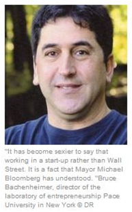

# Print and Internet 2010-2012

  
[Original Link](http://www.industryweek.com/leadership/creating-entrepreneurial-company) | [PDF Version](files/IndustryWeek_12-10-12.pdf)  
**Creating the Entrepreneurial Company**  
December  10, 2012  
By **Steve Minter**  
>
>"It is incredibly important in today's hypercompetitive environment where technology and the macro-economy are changing so quickly that companies think much more entrepreneurially," says Bruce Bachenheimer, clinical professor of management at Pace University.
>
> **Hearing a Different Drum**
>
> Companies that want to encourage innovation and entrepreneurship, or intrapreneurship, in their ranks must ensure that they provide the right incentives to employees. Too often, Bachenheimer says, companies say they want innovative, entrepreneurial employees but "what they really want is disciplined employees that are polite, respectful, come in well-dressed and are not insubordinate." That isn't necessarily the profile of a creative, strong-willed employee who wants to march to a different drum.
>
> The first thing companies should consider is how they will handle risk and reward. "If you have some really bright, innovative employees, if they take the risk to do something and it doesn't work, is their career derailed?" posits Bachenheimer. "On the other hand, what happens if it is wildly successful, if it saves or makes the company millions and millions of dollars? What kind of reward do those employees get?" The reward doesn't have to be as lavish as a large grant of stock options, he says, but it should be "more than some kind of nominal $1,000 bonus."

  
[Original Link](http://nyconvergence.com/2012/12/mitef-clear-concise-and-convincing.html) | [PDF Version](files/NYConvergence_12-5-12.pdf)  
**#MITEF: Clear, Concise and Convincing**  
December  5, 2012  
By **Lauren Keyson**  
>
> **Bruce Bachenheimer, Pace University** director of entrepreneurism and board member, attended with his graduate business development class. He wanted them to see what he called “actual” companies presenting their business plans. “When you do it in the classroom, there is an academic part of doing research and looking at databases,” he said.  “I hope they see what a “real” presenter would look like – someone who has done a lot of pitching, probably has received a seed round or doing an A round now, have polished their pitch and have actual technology.”

  
[Original Link](http://workreimagined.aarp.org/2012/11/how-to-shatter-the-glass-ceiling-go-outside/) | [PDF Version](files/WorkReimagined_11-27-12.pdf)  
**How to Shatter the Glass Ceiling: Go Outside**  
November 27, 2012  
By **Elaine Pofeldt**  
>
> **Have you struggled to get credit for your accomplishments?**
>
> A common frustration for women is that when they’ve done the heavy lifting on executing projects at work, the men on their team seem to score more points with the boss. “Men tend to be much more self-promoting, which helps in corporate America in terms of who is getting ahead and getting attention,” says Bruce Bachenheimer, a professor of management at Pace University.
>
> Starting your own business can be a way to reap more rewards from your hard work, as Leigh discovered. If you keep customers happy, you’re the one who will see your revenues rise. However, to get clients to pay you what you’re worth, you may have to get better at tooting your own horn to clients, as you would to a boss. “In small business and growing ventures, you have to be out there and say how great you are,” says Bachenheimer.
> 
> **Have you been penalized for needing flexibility?**
>
> The downside to limiting your hours in a small business: If you’re not available when customers need you, you may find there are limits to your success. “At some point, if you decide that your objective is to maximize revenues, then you won’t turn down calls and meetings,” says Bachenheimer.

  
[Original Link](http://www.usnews.com/education/best-graduate-schools/top-business-schools/articles/2012/11/12/10-work-life-balance-tips-for-mba-students) | [PDF Version](files/US_News_and_World_Report_11-12-12.pdf)  
**10 Work-Life Balance Tips for MBA Students**  
November 12, 2012  
By **Menachem Wecker**   
>
> **10. Limit TV watching**: If you insist on having a television, store it in a closet and only bring it out for must-see programs, says Lubin management professor Bruce Bachenheimer. But that doesn't mean have no fun.
>
> "Eat, drink, and be merry without feeling guilty," he says. "Work hard for that time to relax and savor it."

  
[Original Link](http://www.usinenouvelle.com/article/numerique-new-york-construit-sa-valley.N182314) | [PDF Version](files/LUsineNouvelle_9-20-12.pdf)  
**Digital: New York built its Valley**  
September 20, 2012  
By **Frederic Autran**  
>
> 
>
> Surprisingly, the 2008 financial crisis has been a catalyst for the technological scene in New York. "Many programmers, engineers and analysts have landed in Silicon Alley after losing or leaving their jobs on Wall Street” says Bruce Bachenheimer, director of the Entrepreneurship Laboratory at Pace University in New York. “And it has become sexier to say that you work in a start-up rather than on Wall Street. It is a situation that the mayor understood."

  
[Original Link](http://www.fuw.ch/article/aufbruchstimmung-an-der-silicon-alley/) | [PDF Version](files/Finanz_und_Wirtschaft_9-10-12.pdf)  
**Optimism in Silicon Alley**  
September 10, 2012  
By **Christopher Gisiger**  
>
> "As far as the number of deals, this year New York came in second behind Silicon Valley, overtaking Boston" says Bruce Bachenheimer, Professor of Business at Pace University.

  
[Original Link](http://epaper.21cbh.com/html/2012-09/10/content_33318.htm) | [PDF Version](files/21stCenturyBusinessHerald_9-10-12.pdf)  
**The Fed’s QE fork: who benefits and who pays the bill**  
September 10, 2012  
By **Ye Hui Jue**  
>
> For the private sector of the economy, QE may not have an entirely a positive effect. Mr. Bachenheimer, who has long been engaged in entrepreneurial studies, stated that as the market stabilizes, it is likely that equities will improve, bond prices will decline slightly, gold will become less attractive, the dollar will strengthen, and start-up enterprises will find it easier to secure debt and raise capital.

  
[Original Link](http://www.crainsnewyork.com/article/20120909/SMALLBIZ/309099992) | [PDF Version](files/Crains_9-9-12.pdf)  
**Woman Entrepreneurs smash an old barrier**  
September 9, 2012  
By **Elizabeth MacBride**  
>
> "Men have always seen themselves as breadwinners: 'If I'm working day and night, I'm supporting my family,' " said Bruce Bachenheimer, clinical professor and director of entrepreneurship at Pace University. "Women [working that hard] saw themselves as not doing a good job for their families. That is starting to change."
>
> "[These networks] are not a vague thing in the background," said Mr. Bachenheimer. "It's whom do you pick up the phone and call ... when you need talent?"

  
[Original Link](http://www.smh.com.au/it-pro/its-the-technology-stupid-20120824-24rc8.html) | [PDF Version](files/SMH_8-24-12.pdf)  
***Also featured in***:  
  
  
  
  
**It’s the technology, stupid**  
August 24, 2012  
By **Mathew Hall**  
>
> The impact of tech cannot be underestimated. “The city recognised this and knew it needed to do something,” explained Bruce Bachenheimer, clinical professor of management and director of entrepreneurship at Pace University, New York. Money isn't the only answer, however. “You need a strategy,” Bachenheimer said.
>
> Knowing what the private sector needs is also a key. “In the '90s, people were chasing money,” Bachenheimer said. “The saying was that if you could say dot-com you got money. Now people want revenue and profits. If you look at what New York is excelling at, it is not creating some technology, it is taking existing technology and applying it where there is real need.”

  
[Original Link](http://epaper.21cbh.com/html/2012-08/13/content_31152.htm) | [PDF Version](files/21stCenturyBusinessHerald_8-13-12.pdf)  
**“IPO blowout Week” Dashed**  
August 13, 2012  
By **Ye Hui Jue**  
>
>In sharp contrast with this, the private equity market remains active. Pace University Professor Bruce Bachenheimer told reporters that an increasing number of businesses are opting for private investments and trade sales. Compared to the strictly regulated IPO market, private equity and M & A can be a more attractive choice.

  
[Original Link](http://www.elpuntavui.cat/noticia/article/4-economia/18-economia/565539-el-cinturo-de-silici.html) | [PDF Version](files/ElPuntAvui_8-5-12.pdf)  
**Silicon Alley**  
August 5, 2012  
By **Dani Triadó**  
>
> "The bursting of the tech bubble collapsed the original Silicon Alley, established between 1996 and 2001", explained Bruce Bachenheimer, Director of Entrepreneurship at the Lubin School of Business, Pace University. "Ironically, the crisis of 2008 is responsible for the birth of the new group of technology firms. Dozens of engineers working on Wall Street lost their jobs and saw an opportunity in new technologies", he adds.
> 
> "Silicon Valley is based on technology; in New York, however, technology companies have been able to exploit their relationship with the financial industries, design, art, advertising and health", concludes Professor Bachenheimer.
>
> **Alternative to Silicon Valley**
> 
> "Silicon Valley is based on the technology; in New York, however, technology companies have been able to exploit their relationship with the finance, design, art, advertising and health '," says Bruce Bachenheimer, Director Entrepreneurship Program at the Lubin School of Business, Pace University.

  
[Original Link](http://www.crainsnewyork.com/article/20120729/SUB/307299993) | [PDF Version](files/Crains_7-29-12.pdf)  
**Funding draws on crowd**  
July 29, 2012  
By **Steve Garmhausen**  
>
> **A THREAT TO VCS**
>
> They also question crowd funding's viability, predicting, for example, that communicating with hundreds of mom-and-pop investors—and being second-guessed by them—will turn off many entrepreneurs, not to mention VCs, when the entrepreneurs attempt to attract later rounds of traditional funding. Unsophisticated investors are more likely to buy shares based on exaggerated valuations, the argument goes. To invest in a later round, more savvy angels or venture capitalists would insist on lowering the valuation—which would incur the wrath of the original shareholders. They argue, too, that entrepreneurs who work with amateur investors will miss out on the advice, networking opportunities and tough love provided by VCs and angels, not to mention the stamp of approval a venture investment confers.
>
> "They give you a huge amount of help finding top talent," said Bruce Bachenheimer, director of the entrepreneurship program at Pace University's Lubin School of Business. "[With crowd funders] if anything, you'll spend all day on the phone with Aunt Jenny."

  
[Original Link](http://www.jstandard.com/content/item/how_to_succeed_in_business_play_games/) | [PDF Version](files/NJJewishStandard_7-27-12.pdf)  
**How to succeed in business – play games**   
July 27, 2012  
By **Abigail Klein Leichman**  
>
> Bruce Bachenheimer, clinical professor of management at Pace University, told the Jewish Standard that he took his MBA students to play FreshBiz last March at Hive at 55, a co-working space in Lower Manhattan.
>
> “We all enjoyed the experience and found it quite insightful,” he said. “While the board game itself is quite well thought out, I believe the real value of the game lies in the facilitators — those coaching players during the game and, more importantly, conducting the debriefing afterward. The game itself is a very good tool, but not in and of itself — the ‘brilliance’ lies in the abilities of those conducting the exercise.”

  
[Original Link](http://www.21cbh.com/HTML/2012-7-26/3NNjUxXzQ4MzM3NQ.html) | [PDF Version](files/21stCenturyBusinessHerald_7-26-12.pdf)  
**Looking forward to the "negative": the possibility of significant increase of the EFSF rating downgrades**  
July 26, 2012  
By **Ye Hui Jue**  
>
> “Market behavior is usually difficult to predict, but it is nothing more than two kinds of emotional control - fear and greed." Pace University, USA Lubin Business School Professor Bruce Bachenheimer pointed out to reporters.

  
[Original Link](http://affaires.lapresse.ca/economie/technologie/201207/23/01-4558004-des-entreprises-technos-par-milliers-a-new-york.php) | [PDF Version](files/LaPresse_7-23-12.pdf)  
**Technology businesses by the thousands in New York**  
July 23, 2012  
By **Richard Hetu**    
>
> **A beneficial crisis**
>
> Paradoxically, the financial crisis of 2008 contributed to the technology boom in New York, according to Bruce Bachenheimer, management professor and director of an entrepreneurship program at Pace University in New York.
>
> "A lot of programmers, engineers and quantitative analysis of cracks met at Silicon Alley after losing their jobs on Wall Street" he said during a meeting. "Wall Street has suddenly ceased to monopolize all the talent. It must be said also that it has become sexier to say that working in Silicon Alley rather than Wall Street. This is something that the mayor understands."
>
> **"It is not enough to say dot-com"**
>
> "It is not enough to say dot-com to raise money," says Bruce Bachenheimer, a professor at Pace University. "The" venture capitalists "watch the revenues and profits. And what startups are doing well in New York is using existing technology and apply it where it can respond to real needs."

  
[Original Link](http://epaper.21cbh.com/html/2012-07/23/content_29455.htm) | [PDF Version](files/21stCenturyBusinessHerald_7-21-12.pdf)  
**The four major banks sigh: America's financial industry fears layoffs**  
July 23, 2012  
By **Ye Hui Jue**  
>
> Analysts believe that the more stringent financial regulation led to many companies to be discouraged by the public market. Pace University Lubin Business School Professor Bruce Bachenheimer said to this reporter: "Due to a series of financial regulatory requirements in the Sarbanes-Oxley Act and other strict rules for operating in the public market, many enterprises do not want to do an IPO at this time, choosing instead a more private and conservative trade sale."

  
[Original Link](http://www.youngentrepreneur.com/blog/must-read-books-to-fuel-your-summer-and-your-startup/) | [PDF Version](files/YoungEntrepreneur_7-13-12.pdf)  
**Must Read Books to Fuel Your Summer — And Your Startup**  
July 13, 2012  
By **Lauren Cannon**   
>
> **Bruce Bachenheimer  
> Director of Entrepreneurship, Pace University’s Lubin School of Business  
> New York, NY**  
>
> *[The Art of the Start: The Time-Tested, Battle-Hardened Guide for Anyone Starting Anything](http://www.amazon.com/dp/1591840562/)*
> **by Guy Kawasaki**
>
> It’s a really fun, easy read — and a very broad book for entrepreneurs starting everything.

  
[Original Link](http://nyconvergence.com/2012/06/mitfnytech-failure-is-liberating-wild-success-is-exhilarating-nytc.html) | [PDF Version](files/NYConvergence_6-20-12.pdf)  
**MITEF/NYTECH Digital Discussion: Failure Is Liberating, Wild Success Is Exhilarating**  
June 20, 2012  
By **Lauren Keyson**  
>
> “NYC digital tech entrepreneurship has had such an impact in NYC on job creation,” said Bruce Bachenheimer, board member for the Enterprise Forum and entrepreneurship director for Pace University.  “In fact NYC is now in the number two spot for VC and angel investment, according to National Venture Capital Association PricewaterhouseCoopers Money Tree survey. While the whole economy is stagnating, NYC companies have received millions in funding.  While we have lagged the nation out of recoveries in the past, we are now ahead — this shows the impact of digital media has had.”
>
> He says that one way to be successful is to be part of the NY entrepreneurial ecosystem. “Get engaged, involved, and look for support because there are a lot of resources and other companies that want to help. Build straight in the eco-system so that we can make sure this isn’t a bubble, but that it’s something that can last.”

  
[Original Link](http://mobileservices.texterity.com/entrepreneursstartups/summer2012/?lm=1338884732000&pg=28#pg28) | [PDF Version](files/EntrepreneursStartups_Summer-2012.pdf)  
***Also featured in:***  
  
**6 Steps to a Successful Start**  
Summer 2012  
By **Nancy Mann Jackson**  
>
> **GO BEYOND THE BUSINESS PLAN.**
>
> Planning carefully before launching a new business is not limited to preparing a business plan, says Bruce Bachenheimer, clinical professor of management and director of the Entrepreneurship Lab at Pace University in New York City. “While preparing a business plan is generally a valuable exercise, there are other ways to plan carefully,” he says. Bachenheimer recommends three planning methods.
>
> • The Apprentice Model: gaining direct industry experience, as the founders of Tender Greens did.
>
> • The Hired-Gun Approach: partnering with experts who have in-depth knowledge and experience.
>
> • The Ultra-Lean School of Hard Knocks Tactic: figuring out a way to rapidly test and refine your model at a very reasonable cost.
>
> If you don't commit to in-depth preparation, launching a new business can be a very expensive lesson in the value of planning. Bachenheimer asks: “Would you enter a high-stakes poker tournament without knowing the game, assuming that you'll figure it out as you go?”
>
> **KNOW THE MARKET.**
>
> Ask questions, conduct research or gain experience to help you learn your market inside and out, including the key suppliers, distributors, competitors and customers, Bachenheimer says. “You also have to really understand the critical metrics of your market, whether it's as simple as sales per square foot and inventory turnover, or an esoteric measure in a highly specialized niche market,” he says.
>
> **ESTABLISH CASH RESOURCES.**
>
> To determine how much cash you'll need, develop a cash-flow statement that estimates your expenses and income. Be sure to include appropriate expense levels by researching actual business costs rather than estimating based on your personal experience as a retail consumer. “For instance, you can host your personal website with unlimited bandwidth for $9.95 a month, but operating a commercial website may cost hundreds or thousands of dollars a month,” Pace University's Bachenheimer says.

   
[Original Link](http://www.youngentrepreneur.com/blog/at-college-pitch-contests-giant-companies-are-listening/) | [PDF Version](files/YoungEntrepreneur_5-22-12.pdf)   
**At College Pitch Contests, Giant Companies Are Listening**   
May 22, 2012   
>
> Is the private incubator model right for your startup? They both have their pros and cons, but incubators backed by major companies may aid your development into a seasoned entrepreneur at a faster rate, says Bruce Bachenheimer, director of entrepreneurship at Pace University’s Lubin School of Business. "They all bring something unique and different and there certainly are a lot of benefits to the different approaches," he adds. "One thing that the Foundry does that’s special is creating the mindset of an entrepreneur primarily as opposed to just counting the number of startup companies they create."

   
[Original Link](http://msn.careerbuilder.com/Article/MSN-3008-College-Internships-First-Jobs-Should-you-work-between-undergrad-and-grad-school/) | [PDF Version](files/MSN_5-9-12.pdf)  
**Should you work between undergrad and grad school?**   
May 9, 2012   
By **Debra Auerbach**    
>
> **4. Does the experience add value?**
>
> While working between undergraduate and graduate school certainly has its benefits, make sure you're not working just to work and that you're gaining experience that will add value to your education. "As far as the type of work a potential applicant should look for, the bottom line is how well that experience will enable you to add value to the classroom experience and contribute to group assignments," says Bruce Bachenheimer, clinical professor of management at Pace University's Lubin School of Business in New York.

   
[Original Link](http://theexchange.aacsb.edu/bized/home/) | [PDF Version](files/BizEd_May-June2012.pdf)  
**News**   
May/June 2012   
>
> **Pace University** has simultaneously opened two Entrepreneurship Labs (E-Labs) on its campuses in Lower Manhattan and Pleasantville, New York. E-Lab’s first director will be Bruce Bachenheimer of Pace’s Lubin School of Business.

   
[Original Link](http://www.crainsnewyork.com/article/20120422/SMALLBIZ/304229998) | [PDF Version](files/Crains_4-22-12.pdf)  
**Colleges become startup factories**   
April 22, 2012  
>
> One of the latest manifestations of the trend: the February launch, by Pace University’s Lubin School of Business, of an entrepreneurship lab that aims to facilitate collaborations between students in schools as diverse as nursing and business.
>
> “The idea is that it will involve all Pace students and faculty from all the schools,” said Bruce Bachenheimer, director of the lab and of the Lubin’s entrepreneurship program. “We’re stressing an interdisciplinary, hands-on experience to find new ways to solve difficult problems.”
>
> When it comes to harder stuff, such as the ability to recognize opportunities, Pace and other schools use case studies, brainstorming lessons and other exercises to nurture that skill.
> 
> “It’s kind of like teaching music or painting,” explained Mr. Bachenheimer.
>
> Pitch Contests have also proved to be a great way to network and meet investors. The most recent contest at Pace drew an audience of 400, including venture capitalists, angel investors and bankers, said Mr. Bachenheimer.
> 
> And by one definition, entrepreneurship training doesn’t have to result in a business launch to be successful. If a person is trained to size up opportunities and take initiatives, and he and his employer have an edge, said Mr. Bachenheimer.
>
> “The nature of the work is changing dramatically,” he said. “There’s no more ‘Give me a job and tell me what to do.’”

   
[Original Link](http://www.crainsnewyork.com/article/20120401/SUB/304019993) | [PDF Version](files/Crains_4-2-12.pdf)  
**Executive Moves**  
April 1, 2012   
>
> **Pace University:**
>
> *Bruce Bachenheimer*, 50, was promoted to director of the university’s entrepreneurship lab. He will continue as clinical professor of management. He was previously program director of entrepreneurship at the Lubin School of Business.

   
[Original Link](http://www.military-advanced-education.com/military-advanced-education/393-mae-volume-7-issue-3-april-2012.html) | [PDF Version](files/MAE_April2012.pdf)   
**Pace to Encourage Entrepreneurship**   
April 2012 (Volume 7, Issue 3, Page 15)   
>
> “Professor Bruce Bachenheimer is ideally suited to lead the E-Labs and grow the program,” continued Braun. “Bruce’s relationships throughout the New York City venture community and beyond will be an important building block as we seek to further enhance our standing and access to professionals in the field.”
>
> Bachenheimer is a member of the board of directors and past chairman of the MIT Enterprise Forum of New York City and has served on the organization’s Global Board. Bachenheimer also serves on the board of directors and advisors of LeadAmerica and has served as a consultant to the NYC Department of Small Services and the New York City Economic Development Corp. He founded Annapolis Maritime Corp. and co-founded StockCentral Australia. “The Entrepreneurship Lab aims to foster an entrepreneurial mindset– a way of thinking and acting that focuses on developing new ways to solve problems and create value,” said Bachenheimer, who rdafted the initial proposal of the E-Lab. “These skills are important not only for those seeking to establish a new venture, but are increasingly critical in a wide variety of professional careers given today’s hyper– competitive marketplace, where rapid technological innovation and globalization has led to corporate downsizing and a dramatic change in the very nature of work.”

   
[Original Link](http://nyconvergence.com/2012/03/fintech-innovation-lab-makes-wall-street-sexy-again.html) | [PDF Version](files/NYConvergence_3-19-12.pdf)  
**FinTech Innovation Lab Makes Wall Street Sexy Again**   
March 19, 2012   
>
> Since Wall Street's profits and prestige have slumped, the best and the brightest are looking elsewhere for jobs, making it harder to lure promising recruits. Bruce Bachenheimer, director of entrepreneurship at Pace University, told Technology Review that in the 1990s it was "exciting and sexy to say you were working on Wall Street."  But that's changed. Those formerly positive perceptions have flipped 180 degrees.  

   
[Original Link](http://www.technologyreview.com/business/39826/) | [PDF Version](files/TechnologyReview_3-16-12.pdf)   
**Wall Street's Search for Innovation**  
March 16, 2012   
By **Erik Sherman**   
>
> After banking deregulation took off in the 1990s, it became "exciting and sexy to say you were working on Wall Street," says Bruce Bachenheimer, clinical professor of management and director of entrepreneurship at Pace University. Money and prestige helped lure top academic talent, including mathematicians and computer scientists, to hedge funds.
> 
> But that has changed, beginning with 2008 and the financial meltdown. "The perception of working on Wall Street went from positive to negative," Bachenheimer says. Wall Street reached its latest low this week when a Goldman Sachs executive resigned and publicly excoriated the company's ethics in a New York Times op-ed.
>
> Meanwhile, places like Silicon Valley, Boston, and other hotbeds of high tech suddenly look like the most attractive places to be. With the recent spate of Web-company IPOs, technology startups are also potentially a faster ticket to wealth than Wall Street, where bonuses fell 14 percent last year, continuing a multi-year slide.
>
> "Perceptions of desirability are very important in entrepreneurship. \[Technologists\] want to go where the action is and want to be doing cool stuff," says Bachenheimer.

   
[Original Link](http://www.mo.com/Bruce-Bachenheimer-Pace-University) | [PDF Version](files/MO_3-9-12.pdf)   
**“Live Deliberately”**   
March 9, 2012   
By **MO**   
>
> ***MO.com interviews entrepreneurs from all walks, across all industries, and from around the world. Below are seven questions MO asked Pace Professor Bruce Bachenheimer; a brief bio and his responses and available at*** **[http://www.mo.com/Bruce-Bachenheimer-Pace-University](http://www.mo.com/Bruce-Bachenheimer-Pace-University).**
> 
> **MO**: Where does your passion for entrepreneurship come from? Who or what were your early influences or inspirations?
> 
> **MO**: How do you foster creativity and innovation in your students? Is creativity something that we’re born with or can it be taught and developed?
>
> **MO**: Have you had any mentors during the course of your career?
>
> **MO**: Why do you think that the field social entrepreneurship has recently exploded? Why are people looking for more meaningful ways to carve out a career and how will this trend impact the start-up landscape?
>
> **MO**: You’re in constant contact with bright, young innovators. What aspects of teaching and mentoring are most inspiring for you? On the flip side, are there any aspects of your job that you find specifically challenging?
>
> **MO**: What is the most important piece of advice you have for those looking to start a business?

   
[Original Link](http://westfaironline.com/2012/19480-westchester-county-business-news-in-brief-2/) | [PDF Version](files/WCBJ_2-27-12.pdf)   
**Bachenheimer now runs E-Lab**   
February 24, 2012  
By **Editorial Staff**   
>
> Pace University’s new Entrepreneurship Lab, known as the E-Lab, now has a CEO –  it’s professor Bruce Bachenheimer of Chappaqua. A clinical professor of management at Pace, Bachenheimer is now also the director of the E-Lab. It is available to all Pace students, in New York City and in Pleasantville.
>
> Bachenheimer will advise all aspiring student entrepreneurs, in everything from accounting and computer science to law and the performing arts.
>
> He came up with the idea for the annual Pace Pitch Contest and Business Plan Competition, which he introduced in 2004, just after joining the Lubin School of Business faculty.
>
> “The Entrepreneurship Lab aims to foster an entrepreneurial mindset – a way of thinking and acting that focuses on developing new ways to solve problems and create value,” said Bachenheimer. “These skills are important not only for those seeking to establish a new venture, but are increasingly critical in a wide variety of professional careers given today’s hyper-competitive marketplace, where rapid technological innovation and globalization has led to corporate downsizing and a dramatic change in the very nature of work.”
>
> Bachenheimer began his career as a Wall Street trader, and then took several years off to sail through the Caribbean to South America. After that, he launched an importing business and then moved into high-tech forensic science before joining Pace.

  
[Original Link](http://intheempire.com/post/17788083605/pace-universitys-entrepreneurship-lab-will-train)  
**Pace University’s Entrepreneurship Lab Will Train People To Think Differently**   
February 17, 2012   
By **Will Wei**   
>
> Pace University officially opened the doors to its Entrepreneurship Lab (aka, E-Lab) last night, and there to cut the ribbon was Professor Bruce Bachenheimer, who was named the lab’s first director.
>
> “It takes innovation and entrepreneurship to develop things that are meaningful,” Bachenheimer tells us over the phone.
>
> “We don’t measure our metrics by how many students launch businesses,” Bachenheimer says. “It’s the ability to come up with new and creative solutions to problems, and the ability to add value in a unique and innovative way.”
>
> To spur innovation, Bachenheimer and his E-Lab will provide students with workspace for creative thinking, in addition to access to workshops, guest speakers, roundtable discussions, and networking events involving members of the entrepreneurial community.
>
> “If you’re looking at very good innovators, they have to be young enough so that their minds are not so rigid in the way things are and the way things should be,” says Bachenheimer. “But they also need to have enough knowledge, skills, and abilities to find and solve problems.”
>
> To mold a mind into innovative shape, college students need an “experiential education.”
>
> “You need to train people to think differently, and if there are specific skills they don’t have, let them know how to get those resources,” Bachenheimer says. “Hopefully, the Entrepreneurship Lab is one of them.”

   
[Original Link](http://wire.inc.com/2012/02/17/new-york-gets-new-start-up-lab/) | [PDF Version](files/InTheEmpire_2-17-12.pdf)  
**New York Gets New Start-up Lab**   
February 17, 2012   
By **Christine Lagorio**  
>
> The lab’s director, Bruce Bachenheimer, who also organizes the Pace Business Plan Competition and Pitch Contest, said he’d gotten a call from a nursing students asking if she could apply for the lab, hopefully to find a collaborator for a piece of health-care software or an app.

   
[Original Link](http://www.crainsnewyork.com/article/20120215/SMALLBIZ/120219935) | [PDF Version](files/Crains_2-15-12.pdf)   
**Pace University launches entrepreneur lab**   
February 15, 2012   
By **Emily Laermer**   
>
> The lab will include space for students to conference with investors, a studio for them to work and a large meeting room for speakers. Bruce Bachenheimer, the director of the lab and a professor at Lubin, says he plans to reach out to some of the thousand-plus Pace-area alums who self identify as entrepreneurs to be potential guests.
>
> “This will be very student focused,” Mr. Bachenheimer said. “It's important for me to see how the students are using the lab and what is providing them with the most value.”
>
> In fact, Mr. Bachenheimer says he has seen an increase in student interest in entrepreneurship in recent years. He blames this on the economy and the high unemployment rate. Students see creating their own companies as a safer route.
>
> “They also want to make something meaningful and create something,” he said.

  
[PDF Version](files/DailyNews_2-6-12.pdf)   
**Bouncing back: Laid-off NYers get fresh start with home businesses**   
February 6, 2012   
By **Fran Golden**  
>
> But before would-be self-employed moguls get started, they need to look realistically at what they’re hoping to accomplish, said Bruce Bachenheimer, a professor of management and Director of Entrepreneurship at Pace University.
>
> “Do you have a real strategy?  A lot of people in this bad economy see home-based as a way to be employed, fill a gap on the resume or whatever,” he said. “But it’s not as easy as it appears.”
>
> EXPERT ADVICE To start a home-based business:
> 
> SET REALISTIC GOALS “To launch a business does take capital, time and money, and always twice as much as you think,” says Pace University’s Bruce Bachenheimer
>
> FIND A MENTOR Talk to people who have started home-based businesses, join entrepreneur and small business groups, and get feedback about start-ups. “Smart entrepreneurs surround themselves with even smarter experts,” said Bachenheimer.
>
> THINK SALES A lot of people have a romantic vision that working at home means making your own hours and making money.  But the reality is, no matter what you’re offering , you need someone to buy it.  “Entrepreneurs are optimistic by nature, but don’t confuse passion and stubbornness.  You need someone to actually open up their wallet and want,” said Bachenheimer.
>
> BE HONEST WITH YOURSELF Not everyone is cut out to be an entrepreneur. “The best are risk-takers confident in themselves and their ideas,” Bachenheimer says.

  
[Original Link](http://www.teenbusinessforum.com/entrepreneurship/why-entrepreneurs-should-celebrate-global-entrepreneurship-week-gew) |
[PDF Version](files/TeenBusinessForum_11-14-11.pdf)  
**Why Entrepreneurs should celebrate the Global Entrepreneurship Week #GEW**  
November 14, 2011  
By **Jack Liu**  
>
> **7. To Celebrate The Entrepreneurial Mindset**
> 
> Because entrepreneurship is a mindset — a way of thinking and acting, not simply about starting a business. It is about imagining new ways to solve problems and create value. These skills are important not only for those seeking to establish a new venture, but are increasingly critical in a wide variety of careers given today’s hyper-competitive marketplace, where rapid technological innovation and globalization has led to corporate downsizing and a dramatic change in the very nature of work.
> 
> Bruce Bachenheimer, [Clinical Professor and Director of Entrepreneurship, Pace University](http://webpage.pace.edu/bbachenheimer/)

  
[Original Link](http://www.kiplinger.com/members/krr) | [PDF Version](files/KRR_Nov2011.pdf)  
**Help Your Child Launch a Business**  
November, 2011  
By **Meghan Streit**  
>
> ■ **Crunch the numbers.**
>
> Bruce Bachenheimer, clinical professor of management and director of entrepreneurship at Pace University in New York City, suggests telling the budding entrepreneur you will invest your $50,000 after he or she finds outside investors willing to put up the other $100,000.
>
>These investors “are going to know what a business plan should look like, what the valuation of the business should be and what the privileges of the investors are,” says Bachenheimer.
>
> ■ **Write up the terms.**
>
> It’s critical to document in writing the terms of your loan or equity investment. At a minimum, your document should spell out the amount being invested, how the funds are to be used and how the parent investor will be repaid. Bachenheimer says you can find sample loan documents on the Internet or seek advice from experts at a small business development center.
>
> “Parents usually have a very valuable amount of social capital,” Bachenheimer says. Your accountant, lawyer, banker, business associates or golf buddies could be potential customers, advisers or investors.

 
[Original Link](http://www.registerstar.com/articles/2011/10/06/chatham_courier/news/doc4e8b8ce42e473471298832.txt) | [PDF Version](files/ChathamCourier_10-5-11.pdf)  

**Women’s drive helps canning company thrive** 
October 5, 2011 
By **Lisa D. Connell** 
>
>Finding the right people and retaining them can actually be much more of a challenge than the idea for the business itself.
>
>“It’s hard to identify them and even if you do, how do you recruit them?” asked Bruce Bachenheimer, clinical professor of management at New York’s Pace University.
>  
>Attracting, recruiting, training, retraining and delegating — all of these factors are key to an entrepreneurial venture, Bachenheimer said during a telephone interview.  
>  
>“It’s about people and innovation and truly growing the business,” he said.

 
[Original Link](http://www.bizplancompetitions.com/2011/09/pitch-contests-gain-popularity/) | [PDF Version](files/BPC_9-28-11.pdf) 

**Pitch contests gain popularity** 
September 28, 2011 
By **Amy Buttell** 
>
>The advantage of a pitch competition is that it’s much easier to enter, organize, participate and judge than a typical
>
>business plan competition, which typically encompasses an entire academic year, according to Bruce Bachenheimer, a
>
>professor of management who runs both the Pace University Pitch and Business Plan Competitions.
>
>“Basically, competitors have three minutes in front of a panel of judges to sell their idea,” he says. “There’s an audience
>
>for our competition, who can suggest questions, and who also get an education in entrepreneurship.” Last year, Pace
>
>gave $50,000 in prizes to the competition winners, he says. The pitch competition has become very popular among
>
>business students.
>
>Pitch contests require different skills than business plan competitions. In a pitch contest, you don’t necessarily need to
>
>have the fully-fleshed out idea that you need to succeed in a business plan competition. Instead, as Bachenheimer puts it, competitors need to “have excellent >presentation skills, be quick on their feet, be able to provide a quick summary and be responsive to the very pointed questions of a panel of very >distinguished judges.”
>
>He’s very pleased with the way the pitch competition, which is now in it’s eighth year, has evolved. “In the beginning,
some of the ideas were kind of crazy, but it’s gotten very serious,” he continues. “It’s very educational and very entertaining for the presenters and the audience. It’s a fast-paced, fun learning opportunity for everyone, including the
audience.”
>
>One big advantage of pitch contests is that they are relatively painless to enter. Instead of writing up a complicated, indepth business plan that participants may have to revise numerous times over the months, a simple 500 word or so entry form, a brief biography and a 10-question form are the sole requirements for the Pace Pitch Contest. Not only is it simpler for the contestants, it is also much easier for the judges and organizers, he says.
>
>And that makes it a good selling point for judges, who have to make a big time commitment to judge a business plan competition. Those can take months and judges must read multiple business plans, evaluate them at various stages and mentor competitions. With the pitch competition, it’s a one-day commitment. It’s also much easier on organizers, which is why it’s easier to start and run a pitch competition than a full business plan competition, he continues.

 
[Original Link](http://www.crainsnewyork.com/article/20110927/SMALLBIZ/110929906) | [PDF Version](files/Crains_9-27-11.pdf) 

**New York exports its entrepreneurial expertise** 
September 27, 2011 
By **Eilene Zimmerman** 
>
>
>
>“Although the new semester had barely begun this year at Pace University's Lubin School of Business, Director of Entrepreneurship Bruce Bachenheimer already had teaching requests from groups and institutions in India, China, Norway and Israel.
>
>Mr. Bachenheimer returned from India in early September, spoke to a Chinese delegation at Pace immediately afterward and then taught a course on writing a business plan for students visiting from the BI Norwegian Business School. He will travel to Israel in early January.
>
>Colleges and universities abroad, especially those located in developing nations, are increasingly trying to establish the kinds of entrepreneurship programs that exist here in the U.S.
>
>Generations of immigrants may have fueled American entrepreneurialism, but, according to Mr. Bachenheimer, entrepreneurship education on the college level is primarily an American export. And local professors are seeing the demand for their expertise grow beyond the occasional request to teach overseas while they're on a school break or a sabbatical. Foreign universities are more and more willing to pay a premium for the know-how of professors from entrepreneurship centers such as Silicon Valley, New York City and Cambridge, Mass., the Lubin professor says.
>
>Reflecting the growing international interest in entrepreneurship education, the Bloomington, Ind.-based Global Consortium of Entrepreneurship Centers, whose members are university-based, switched to its current name three years ago, notes Mr. Bachenheimer. Founded in 1996 as a national consortium, the organization made the change in response to interest from international institutions.
>
>Although students obviously can't absorb everything about running a business while in a classroom setting, the fastest way to get started and learn to manage risk is often with the guidance and assistance available through universities and colleges. (Other kinds of structured support can be invaluable as well: Research from the National Business Incubation Association and the U.S. Small Business Administration show that businesses coming out of incubators have a much lower failure rate than that for startups overall, says Mr. Bachenheimer.)
>
 
[Original Link](http://www.bizplancompetitions.com/2011/09/is-a-bigger-jackpot-better-in-business-plan-competitions/) | [PDF Version](files/BPC_9-22-11.pdf) 

**Is a bigger jackpot better in business plan competitions?** 
September 22, 2011 
By **Amy Buttell** 
>
>Promoting entrepreneurship is also a goal of the [Pace University Business Plan and Pitch Competitions](http://www.pace.edu/lubin/departments-and-research-centers/entrepreneurship-lubin/pace-business-plan-competition), says Bruce Bachenheimer, clinical professor of Management, who runs both of the competitions. “One of our goals is to encourage an entrepreneurial mindset, which is important in today’s hyper competitive global economy, whether you work in an established business or not.”
>
>The brevity of the university’s Pitch Competition is one reason it attracts a 400 person audience and a substantial number of actual competitors. That’s impossible to accomplish in a business plan competition because of the nature of business plans and the sheer length of the competition.
>
>“The participatory nature of the pitch competition means that it’s benefitting the audience as well as the competitors,” he says. “Everyone gets to hear about the ideas and follow the give and take between competitors and the judges as questions are asked and answered.”   
>
 
[Original Link](http://www.crainsnewyork.com/article/20110812/SMALLBIZ/110819966) | [PDF Version](files/Crains_8-12-11.pdf) 

**How to handle, and profit from, last-minute jobs** 
August 12, 2011 
By **Elaine Pofeldt** 
>
>“With all of the uncertainty, tight purse strings and risk-aversion, people are waiting until the last minute” to make purchases, said Bruce Bachenheimer, clinical professor of management and director of the entrepreneurship program at Pace University. Increasing globalization has intensified competition in many fields and destroyed traditional business hours.
>
>“You may have to work on Sunday at 2 a.m. to fill an order going outside of the U.S.” Mr. Bachenheimer said.

 
[Original Link](http://www.crainsnewyork.com/article/20110807/SMALLBIZ/308079990) | [PDF Version](files/Crains_8-8-11.pdf) 

**Number of startups led by women rising** 
August 8, 2011 
By **Anne Field** 
>
>The increased startup activity in New York state most likely is because of an increase in women-owned startups in New York City,” said Bruce Bachenheimer, director of entrepreneurship and clinical professor of management at Pace University.

 
[Original Link](http://pressroom.consumerreports.org/pressroom/money-adviser/) | [PDF Version](files/ConsumerReportsMoneyAdviser_June2011.pdf) 

**Want to be your own boss?** 
June 2011, Volume 8 Issue 6, pages 12-13 
>
>Be honest with yourself. Not everyone is cut out to be an entrepreneur. “The best are risk takers confident in themselves and their ideas,” says Bruce Bachenheimer, a professor of management at Pace University in New York.
>
>Take time to consider what you’re giving up or getting into. Do you need a structured environment? A steady paycheck? “Are you fleeing a boss only to find all customers will be your boss?” Bachenheimer asks. “Are you dumping a time clock but investing 100 hours a week?”
>
>Buying an existing business can be a good route. “Sometimes owners run out of capital or enthusiasm,” Bachenheimer says. “You can get a lot of assets, inventory, and a client base.” Still, he warns buyers to perform due diligence to prevent getting stuck with someone else’s bad debts.
>
>Smart entrepreneurs surround themselves with even smarter experts. Find a financial consultant or lawyer for advice, but choose advisers carefully. “Don’t pay hucksters to do things that are free – like obtaining an employer identification number,” Bachenheimer says. “Anyone can sell themselves as an expert, so get references and proposals.
>
>Once your business has some cash flow, you might find it easier to get a small-business loan, Bachenheimer says.

 
[Original Link](http://www.cpgpublications.com/cp_may2011.pdf) | [PDF Version](files/CollegePreview_May-June2011.pdf) 

**LEADERS WANTED How to become the leader employers will want** 
May/June 2011 
By **Jacqueline Bodnar** 
>
>Putting Leadership Skills into Action
>
>“To position themselves for a valuable career, college students need to demonstrate how they can add value to a prospective employer,” says Bruce Bachenheimer, clinical professor of management and director of entrepreneurship at Pace University.
>
>“They need to be able to solve problems creatively and to effectively implement solutions in a rapidly changing environment. To accomplish this, they will need to think entrepreneurially and take on a leadership role early in their career.”
>
>“The role of a leader is to take people to a new place, to inspire them to do something they otherwise would not have done or even thought they could do,” adds Bachenheimer. “Think about how you can inspire fellow students and motivate them to take action!”

 
[Original Link](http://www.crainsnewyork.com/article/20110508/SMALLBIZ/305089995) | [PDF Version](files/Crains_5-8-11.pdf) 

**Tips for tricky task of raising prices** 
May 8, 2011 
By **Elaine Pofeldt** 
>
>2\. Do a small-scale test.
>
>A pilot hike will help you gauge customer reactions and mitigate risks, according to Bruce Bachenheimer, clinical professor of management and director of the entrepreneurship program at Pace University.
>
>For example, if you have two stores, raise prices on select items or at just one location, Mr. Bachenheimer says.

 
[Original Link](http://www.crainsnewyork.com/article/20110501/SMALLBIZ/305019989) | [PDF Version](files/Crains_5-1-11.pdf) 

**'Mompreneurs' lead the way in infant-goods market** 
May 1, 2011 
By **Cara Trager** 
>
>That's not necessarily a disadvantage for new entrants, including men, who “aren't \[stuck\] in the way things are typically done,” said Bruce Bachenheimer, professor of management and director of entrepreneurship at Pace University's Lubin School of Business. “They may have the ability to recognize and capture an opportunity others don't see.”

 
[Original Link](http://www.nj.com/business/index.ssf/2011/01/mentors_offer_unique_career_su.html) | [PDF Version](files/Star-Ledger_1-30-10.pdf) 

**Mentors offer unique career support** 
January 30, 2011 
By **Lee Miller**  
>
>Professor Bruce Bachenheimer, director of entrepreneurship at Pace University, offers the following guidance on managing the mentor relationship:
>
>“Do some research before seeking a mentor — to help find an appropriate candidate and to be able to ask that person to serve as a mentor in a meaningful way.
>
>“Once you have a mentor, be sure to demonstrate that you value the relationship and are taking affirmative action (i.e. not just saying “thanks” regularly, but really letting the mentor know the efforts are worthwhile).
>
>“Always try to find ways to reciprocate — to demonstrate your gratitude and commitment. Little things that may be of assistance to the mentor can go a long way.”

[PDF Version](files/ASI_11-15-10.pdf) 

**Tip of the Day - 4 Tips to Increase Your Profits in 2011** 
November 15, 2010 
By **Betsy Cummings** 

Also featured in  

[Original Link](http://asicentralblog.com/blog/2010/11/15/tip-of-the-day-4-tips-to-increase-your-profits-in-2011/) 

**Profit Builders: Six ways to improve your company’s profitability in 2011**
December 2010 (page 67)

Step 3: Outwit Bad Buyers 
Sure, the 80/20 rule – where 80% of your revenue comes from 20% of your clients – applies to almost any distributor, but firing bad customers indiscriminately is a dangerous move, says Bruce Bachenheimer, clinical professor of management at Pace University in New York. For years, experts have suggested small-business owners dump the deadweight. Instead, Bachenheimer says, keep the marginal clients – you never know when a small order or difficult customer might pay off handsomely down the road – but make them turn their drain on your company into a potential profit center.

For example, Bachenheimer says, when electronics retailer Best Buy noticed certain types of shoppers would buy a TV to watch the Super Bowl and return it the next day, the money it cost to service the returns and restock those items was a drain on its profits. So it started charging a restocking fee to discourage customers who had no intention of keeping the products they bought. Distributors might consider imposing fees, for example, for clients that repeatedly demand multiple samples, art proofs, shipping returns and other profit-reducing services.

 
[PDF Version](files/Crains_11-14-10.pdf) 

**Social-media needs spur student hires** 
November 14, 2010 
By **Anne Field** 

[Original Link](http://www.crainsnewyork.com/article/20101114/SMALLBIZ/311149986)

Help wanted 
“Five years ago, I might have gotten one call every four or five weeks,” says Bruce Bachenheimer, program director of entrepreneurship at Pace University's Lubin School of Business. “Now, it's more like one a week, at a minimum.”

 
[PDF Version](files/New_Firm_Connects_Overseas_Entrepreneurs_with_US-Based_Partners.pdf) 

**New Firm Connects Overseas Entrepreneurs with U.S.-Based Partners** 
October 22, 2010 
By **Brian Anthony Hernandez** 

[Original Link](http://www.businessnewsdaily.com/foreign-business-startups-american-investors-0642/)

Bruce Bachenheimer, a professor of management at Pace University in New York who teaches about international entrepreneurship, believes foreign startups’ local domestic markets are not big enough to sustain the ventures they’re trying to accomplish.

“They have to be born global from the beginning,” said Bachenheimer, who has taken his students to Tanzania and will take more to Israel in 2011.

“They know they have to sell to several markets and have to look at the whole globe as a market. The domestic market is just too small.”

 
[Original Link](http://businessonmain.msn.com/browseresources/articles/startupfunding.aspx?cp-documentid=25950521) | [PDF Version](files/Win_Over_Investors_in_3_Minutes_or_Less.pdf)

**Win over Investors in 3 minutes or Less** 
October 18, 2010 
By **Joanna Krotz** 

Also featured on Fox Small Business on December 8, 2010 
 

Also featured on Entrepreneur.com on January 14, 2011 
 

“In today’s busy world, with 140-character Twitter \[posts\] and one-paragraph Zagat reviews, everything has to be shorter and persuasive,” says Bruce Bachenheimer, competition founder and director of entrepreneurship at Pace.

Your pitch must also convince investors that you won’t burn through money. “This is the era of the lean startup,” says Bachenheimer. “If the idea costs $1 million, you need to show $100,000 milestones, a working model of how you will get and grow customers to make investors more comfortable.”

And the winners are …

The critical requirement, sums up Bachenheimer, is “venture capitalists need to be convinced not only that it’s a good idea, but that you can make it happen. It’s always better to bet on the jockey rather than the horse.”

 
[PDF Version](http://webpage.pace.edu/bbachenheimer/press/Forbes_9-20-10.pdf) 

**15 Tips For Raising A Young Mogul** 
September 20, 2010 
By **Dale Buss and Melanie Lindner** 

[Original Link](http://www.forbes.com/2010/09/20/how-to-raise-young-mogul-entrepreneurs-human-resources-serial-startups-10.html)

Trigger their imaginations. "Expose them to possibilities through travel, talking about the environment, talking about the news and things that impact the world, and opportunities that may exist for business from all of that," says Bruce Bachenheimer, director of entrepreneurship at Pace University. Drawing their attention to a few magazine profiles of interesting entrepreneurs wouldn't hurt, either.

 
[PDF Version](files/NYPost_8-30-10.pdf) 

**The book of blunders -The most common mistakes entrepreneurs make** 
August 30, 2010 
By **Brian Moore** 

[Original Link](http://www.nypost.com/p/news/business/jobs/the_book_of_blunders_WLar9v8W7vUAwTNHGa8YuN/0) 

Many entrepreneurs have trouble “mixing up stubbornness and arrogance with passion and persistence,” says Pace University professor of management Bruce Bachenheimer. You can’t throw in the towel every time things don’t go your way, but you also can’t ignore circumstances that call for a change in your business plan, no matter how ingenious you may think it is.

Entrepreneurs “just overestimate everything,” says Bachenheimer, citing customer appeal and investor enthusiasm as two areas new business owners typically exaggerate. “They can’t put themselves in other people’s shoes and separate themselves from their own optimism.”

“People underestimate virtually every expense associated with starting and running the business,” says Bachenheimer. He adds that this is particularly true of Web entrepreneurs, who often think a new site can be started with nothing more than a laptop and a $20 domain registration. Actual expenses are exponentially larger. 

  
[Original Link](http://www.nypost.com/p/news/business/jobs/app_stars_uLmOkrqT8K72zY8xD5YLoK) |
[PDF Version](files/NYPost_8-16-10.pdf)  
**App stars—The best smartphone programs for taking care of business**  
August 16, 2010  
By **Linley Taber**  
> **FlightTrack Pro**  
> This business-traveler favorite provides up-to-the-second information on flights’ statuses, gates, cancellations and area weather. It often posts info “before airline personnel appear to have it,” notes devotee Bruce Bachenheimer, a Pace University professor. For Android, iPad, iPhone and iPod Touch; $9.99.

  
[Original Link](http://www.usnews.com/articles/education/best-business-schools/2010/07/21/schools-add-new-entrepreneur-programs-for-mba-students.html) |
[PDF Version](files/USNews_7-21-10.pdf)  
**Schools add new entrepreneur programs for M.B.A. Students**  
July 21, 2010  
By **Katy Hopkins**  
> At [Pace University Lubin School of Business](http://grad-schools.usnews.rankingsandreviews.com/best-graduate-schools/top-business-schools/items/01309), opportunity for inspiration sometimes comes from outside the classroom—even outside the country. In "Special Topics in International Entrepreneurship: Technology, Innovation and Entrepreneurship in Israel," Professor Bruce Bachenheimer will take students to abroad in spring 2011 for a week to study opportunities in the young country's advanced technology infrastructure.
> 
> Bachenheimer has taken entrepreneur students to Tanzania and India in years past. These international opportunities often lend a life-changing perspective of business opportunities in other countries, he says. For Pace graduate Melissa Lopez, this revelation came when she saw Tanzanian women selling handmade clothing to tourists at Mount Kilamanjaro.
>
>"It made it pure to see entrepreneurship at a very small level, but \[to see\] how big people's ideas are," Lopez says. "Prior to taking the course, I had never thought I would have any interest in entrepreneurship. I had always thought I'd be working for a large company.
>
> "After that course, I wanted to see if I could do something for myself."
>
> Classes in entrepreneurship are becoming more universally attractive, Bachenheimer says. About 15 percent of students in his entrepreneur classes are M.B.A. students. The rest are students from different academic disciplines who are considering what an entrepreneurial focus could do for their careers, he says.
>
>"They're all [saying], 'I want to be more entrepreneurial. I don't want to just work in an office or count on a job, especially when the economy is bad," Bachenheimer says. "[They say], 'I want to have more control of my destiny."

  
[Original Link](http://www.entrepreneur.com/startingabusiness/businessplans/article207400.html) |
[PDF Version](files/Entrepreneur_7-14-10.pdf)  
**Becoming an Entrepreneurial Expat**  
July 14, 2010  
By **Michelle Goodman**  
>Even if a region does welcome foreign entrepreneurs, the local infrastructure may not live up to U.S. standards, especially in developing nations.
>
>"Here, we take it for granted that if our business is broken into, we can call the police," says Bruce Bachenheimer, clinical professor of management and program director of [Pace University's entrepreneurship program](http://www.pace.edu/pace/lubin/departments-and-research-centers/entrepreneurship-lubin/). "But in other countries, the rule of law may not be what we expect."
>
>Likewise, Bachenheimer adds, in some locales, the roads, electricity, phone service, internet service, shipping companies and court system may be sorely lacking.

  
[Original Link](http://www.newsday.com/classifieds/jobs/unemployed-liers-embracing-entrepreneurship-1.2080635) |
[PDF Version](files/Newsday_7-5-10.pdf)  
**Reinventing yourself after a job loss**  
July 5, 2010  
By **Carrie Mason-Draffen**  
> Entrepreneurial activity in 2009 was at a 14-year high nationwide, with the highest growth coming among 34- to 44-year-olds, according to the Kauffman Foundation, of Kansas City, Mo., which promotes entrepreneurship.
>
> That's the demographic - with many well-educated, high-wage, middle managers - who were hard hit during the recession, said Bruce Bachenheimer, director of entrepreneurship at Pace University in Manhattan. "They are not the people you generally think of as entrepreneurs," he said.

  
[Original Link](http://www.investors.com/NewsAndAnalysis/Article.aspx?id=527894&Ntt) |
[PDF Version](files/InvestorsBusinessDaily_3-19-10.pdf)  
**New York's Magnolia Bakery Offers Lessons On Small-Business Success**  
March 19, 2010  
By **Gary M. Stern**  
> Some small businesses grow too fast, which can trigger their downfall, says Bruce Bachenheimer, director of entrepreneurship at Pace University's Lubin School of Business. In order to expand, these businesses must establish a solid "infrastructure including accounting, inventory and payroll systems and a system of checks and balances," he said.
