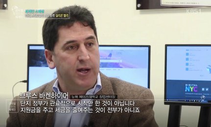

# Television, Radio and Web Broadcasts

[ Original Link](https://anchor.fm/supercities/episodes/Super-Cities-with-Bruce-Bachenheimer-Pace-University-e3ffh5)  
**Super Cities with Bruce Bachenheimer (Pace University)**  
March 15, 2019  
By **Brendan Hart**  
> On this episode of Super Cities, we do a deep dive with Bruce Bachenheimer, Director of Entrepreneurship at Pace University in New York City.
>
> We cover the growth of NYC’s startup ecosystem, trends in education, and the role universities play in innovation.
>
> This is a fun conversation. Let's hear from Bruce.

[ Original Link](http://bit.ly/SBGC_12-11-18)  
**The Small Business 10K Challenge**  
Streamed live on Dec 11, 2018  
> _**Bruce Bachenheimer** Clinical Professor, Management & Executive Director, Entrepreneurship Lab, Pace University_ served as a Judge for the 1010 WINS Small Business Grant Challenge, which was streamed live from the Radio.com Theatre in Manhattan.
>
> [https://eventsplus.cbsradio.com/newyork/wins/e/small-business-grant-challenge-2](https://eventsplus.cbsradio.com/newyork/wins/e/small-business-grant-challenge-2)
>
> 

[ Original Link](https://embed.radio.com/clip/61197413)  
**The Bottom Line For Small Business**  
November 11, 2016  
> In a Veterans Day feature, CBS New York radio 1010WINS mentioned the Pace University Veterans Entrepreneurship Boot Camp and professor Bruce Bachenheimer on ‘The Bottom Line For Small Business’ (0:21 – 0:34):
>
> "At Pace University, professor Bruce Bachenheimer is doing his part with the Veterans Entrepreneurship Boot Camp. It’s a seven-week program that provides practical skills and tools for veterans launching their own startup businesses."

[ Original Link](http://www.ondemandkorea.com/global-talk-show-cosmopolitan-e40.html)  
**Global Talk Show Cosmopolitan**  
January 23, 2016  
> _Pace University Professor Bruce Bachenheimer was interviewed on **Global Talk Show Cosmopolitan**, which aired on **Korean Broadcasting System Channel** 1 January 23, 2016. The program examined New York City’s Silicon Alley. A video clip of the program is available at:_ [http://bit.ly/KBS-BB](http://bit.ly/KBS-BB) _(the Silicon Alley segment starts at 19:50 and Professor Bachenheimer appears at 22:58_
>
> 

---------------------

Television, Radio and Web Broadcasts

  
Super Cities with Bruce Bachenheimer (Pace University)  
By Brendan Hart  
March 15, 2019  

[Original Link](https://anchor.fm/supercities/episodes/Super-Cities-with-Bruce-Bachenheimer-Pace-University-e3ffh5)

On this episode of Super Cities, we do a deep dive with Bruce Bachenheimer, Director of Entrepreneurship at Pace University in New York City.

We cover the growth of NYC’s startup ecosystem, trends in education, and the role universities play in innovation.

This is a fun conversation. Let's hear from Bruce.

The Small Business 10K Challenge

Streamed live on Dec 11, 2018

Bruce Bachenheimer Clinical Professor, Management & Executive Director, Entrepreneurship Lab, Pace University served as a Judge for the 1010 WINS Small Business Grant Challenge, which was streamed live from the Radio.com Theatre in Manhattan. [https://eventsplus.cbsradio.com/newyork/wins/e/small-business-grant-challenge-2](https://eventsplus.cbsradio.com/newyork/wins/e/small-business-grant-challenge-2)  

The Bottom Line For Small Business
November 11, 2016

In a Veterans Day feature, CBS New York radio 1010WINS mentioned the Pace University Veterans Entrepreneurship Boot Camp and professor Bruce Bachenheimer on ‘The Bottom Line For Small Business’ (0:21 – 0:34):

“At Pace University, professor Bruce Bachenheimer is doing his part with the Veterans Entrepreneurship Boot Camp. It’s a seven-week program that provides practical skills and tools for veterans launching their own startup businesses.”

Global Talk Show Cosmopolitan
January 23, 2016

Pace University Professor Bruce Bachenheimer was interviewed on Global Talk Show Cosmopolitan, which aired on Korean Broadcasting System Channel 1 January 23, 2016. The program examined New York City’s Silicon Alley. A video clip of the program is available at: [http://bit.ly/KBS-BB](http://bit.ly/KBS-BB) (the Silicon Alley segment starts at 19:50 and Professor Bachenheimer appears at 22:58).
  

SciTech Now
April 29, 2015
Hosted by Hari Sreenivasan

  

Pace University Professor Bruce Bachenheimer appeared on SciTech Now, which premiered on WLIW Channel 21 April 29, 2015 from 7:00 –7:30 PM. The program also aired on WNET Thirteen and other PBS stations nationally. A video clip of this segment is available at: [http://bit.ly/SciTech\_Now](http://bit.ly/SciTech_Now) 

  
Hiring America
April 25, 2015
Hosted by Gigi Stone Woods 

Pace University Professor Bruce Bachenheimer appeared on Hiring America, which aired on WABC-TV Channel 7 April 25, 2015 from 1:30 –2:00 PM. The program was also broadcast nationally in over 80 markets as well as on the Armed Forces Network. A video clip of this segment is available at: [http://bit.ly/HA\_48](http://bit.ly/HA_48)

Innovation Nation
January 11, 2015
Hosted by Simcha Gluck

  
Pace University Professor Bruce Bachenheimer appeared on the premier episode of Innovation Nation, which aired live on Voice of Israel January 11, 2015 from 2:30 –3:00 PM, in a segment titled Bridging the Israeli and New York City Startup Scenes.  
  

Working Woman Report  
September 1, 2014    
Hosted by Allison Haunss  

Pace University Professor Bruce Bachenheimer appeared on the Working Woman Report, which aired on NYC TV Channel 25 on September 1, 2014 from 8:30 – 9:00 PM. A video clip of this segment is available at: [http://bit.ly/WWR\_NYCTV](http://bit.ly/WWR_NYCTV.)

The Woman’s Playbook - Betting on Vets
July 3, 2014  
Hosted by Joanna Krotz

Pace University Professor Bruce Bachenheimer was mentioned in the program ‘Betting on Vets: A unique public-private program is training ex-military women to start businesses that restart their lives’ on the weekly Internet radio show The Woman’s Playbook, which aired on Talking Alternative Broadcasting from 12:00 pm – 1:00 pm on July 3, 2014. A podcast of the program is available at: [http://bit.ly/BettingOnVets](http://bit.ly/BettingOnVets)

(A Transcript from 46:09 – 47:14)

“It does seem as if there’s somewhat more attention and resources being paid in the private sector to veterans. I just heard, for instance, this morning from a guest whose been on this show, Bruce Bachenheimer, who directs the Entrepreneurship Lab at Pace University, that his Entrepreneurship Lab, which is based in New York, just got a $50,000 grant from the foundation of an investment firm called Blackstone, so it’s called the Charitable Foundation of Blackstone, and they’ve actually earmarked $300,000, and so Pace was only just one of six groups that got that grant and they’re going to be underwriting a seven-week entrepreneurship boot  camp at Pace. It’s for men and a woman, so we would be interested in seeing what the percentages end up, but it’s in New York City’s Tri-State area. And interestingly, Blackstone reacting and responding to the White House initiative to hire veterans, has committed to hiring 50,000 veterans across its portfolio of companies so, over a five year period, and they’ve already done about 10,000 since they launched about a year ago.”

The Woman’s Playbook - Leaning Out
June 5, 2014  
Hosted by Joanna Krotz

Pace University Professor Bruce Bachenheimer was interviewed about ‘Leaning Out: Women are weary of corporate ladders to nowhere and launching businesses of their own to find success and satisfaction’  on the weekly Internet radio show The Woman’s Playbook, which aired on Talking Alternative Broadcasting from 12:00 pm – 1:00 pm on June 5, 2014. A podcast of the program is available at: [http://bit.ly/WomansPlaybook](http://bit.ly/WomansPlaybook) and on iTunes: [http://bit.ly/LeaningOut](http://bit.ly/LeaningOut)

Paying It Forward
December 18, 2013  
Hosted by Josephine Geraci

Pace University Professor Bruce Bachenheimer was interviewed about ‘The importance of Business Plans’  on the weekly Internet radio show Paying It Forward, which aired on Toginet Radio from 10:00 am – 11:00 am  on December 18, 2013. A podcast of the program is available at: [http://toginet.com/podcasts/payingitforward/PayingitForwardLIVE\_2013-12-18.mp3](http://toginet.com/podcasts/payingitforward/PayingitForwardLIVE_2013-12-18.mp3).

Residents overwhelmed with ‘Obamacare’
October 2, 2013  
Reported by Grace Noone

Pace University Professor Bruce Bachenheimer was interviewed by Grace Noone for a segment on Obamacare and small business that aired on the 5:00 news.

![Text Box: Inside Enstitute
April 17, 2013
]

(image4558.png)

Pace University Professor Bruce Bachenheimer was included in a video feature titled Inside Enstitute on Forbes [http://bit.ly/enstitute](http://bit.ly/enstitute) The video is also available on YouTube at: [http://youtu.be/CP893YkqNL4](http://youtu.be/CP893YkqNL4) 

Paying It Forward
October 24, 2012  
Hosted by Josephine Geraci

Pace University Professor Bruce Bachenheimer was interviewed on the weekly Internet radio show Paying It Forward, which aired on Toginet Radio on October 24, 2012.A podcast of the program is available on iTunes and at: [http://bit.ly/PayingItForward\_10-24-12](http://bit.ly/PayingItForward_10-24-12)

Working Woman Report
September 30, 2012 Hosted  
Hosted by Allison Haunss

Pace University Professor Bruce Bachenheimer appeared on the premier of Working Woman Report, which aired on WPIX Channel 11 on September 30, 2012. This segment was rebroadcast and is available at: [http://bit.ly/WWR\_BB](http://bit.ly/WWR_BB)  

New York: the New Silicon Valley?
July 26, 2012  
Reported by Charlotte Alix

Pace University Professor Bruce Bachenheimer was interviewed on the Radio France station le mouv’ for a special feature on technology start-ups in New York City. The program aired on July 26, 2012 and a podcast, in French, is available at: [http://bit.ly/Radio-France](http://bit.ly/Radio-France).

A Whole New World, Brought to Us by Gizmos and Gadgets
December 26, 2010  
Hosted by June Simms and Steve Ember

Pace University Professor Bruce Bachenheimer was interviewed for Voice of America’s Special English Technology Report. The complete article and audio of the broadcast is available at the above URL. The following is a partial transcript of the program:

Bruce Bachenheimer is with the MIT Enterprise Forum in New York. He is also the director of entrepreneurship at Pace University. We spoke with him about what he believes are the most important developments of the twenty-first century.

BRUCE BACHENHEIMER: “If I were looking at technology that has really impacted us over the last ten years, I would go in order: mobile computing, the proliferation of digital media content, broadband -- mobile and at-home access -- social media platforms and user-generated content, cloud computing, digital photography and GPS. And what I mean by GPS is GPS for the masses, although global positioning systems have been around for quite a while.”

Mr. Bachenheimer says all of these things have worked together to revolutionize technology. And, he says the technology is constantly changing, faster than at any other time in history.

BRUCE BACHENHEIMER: “The life cycle of these products are so much shorter. If you look at having a telephone, a home phone back in the nineteen fifties, sixties, seventies and eighties, it was exactly the same phone. Nothing changed for three or four decades.

"Basically you had a choice of three colors, tan, white or black. And you could either have it mounted on a wall or on a table top, whereas now you look at something like a cell phone. How many people have a cell phone that's more than a year or two old?”

Better Your Business
December 15, 2010  
Hosted by JJ Ramberg

Pace University Professor Bruce Bachenheimer appeared on the Better Your Business feature of MSNBC’s YOUR BUSINESS program, which was released on December 15, 2010. This segment is available at:[http://www.openforum.com/idea-hub/topics/technology/video/better-your-business-bruce-bachenheimer-ramon-ray](http://www.openforum.com/idea-hub/topics/technology/video/better-your-business-bruce-bachenheimer-ramon-ray) 

All About Apps
October 24, 2010  
Hosted by JJ Ramberg

Pace University Professor Bruce Bachenheimer was a panelist on MSNBC’s YOUR BUSINESS program, which aired on October 24, 2010 from 7:30 am to 8:00 am. A segment of that broadcast is available at: [http://www.openforum.com/idea-hub/topics/technology/video/business-answers-software-development-back-up-services](http://www.openforum.com/idea-hub/topics/technology/video/business-answers-software-development-back-up-services) 

Greenwich Entrepreneurs
May 28, 2010
Hosted by Gregory Skidmore and Daniel Crosby

Pace University Professor Bruce Bachenheimer was interviewed as a guest on the WGCH radio program Greenwich Entrepreneurs, which aired on May 28, 2010 from 9:30 am to 10:00 am. The broadcast is available at: [http://bit.ly/wgchradio](http://bit.ly/wgchradio).

The Impacts of Social Media
December 13, 2009  
Hosted by Alan Schnurman
(rebroadcast on 2/14/10, 5/23/10, 10/31/10, 2/20/11, 5/1/11, 7/3/11, 10/30/11 & 2/26/12)

Pace University Professor Bruce Bachenheimer was a guest on the NYC TV program Lawline, which aired on December 13, 2009 from 5:30 pm to 6:00 pm. The broadcast is available at: [http://bit.ly/Lawline](http://bit.ly/Lawline)

Rice University recently held a consortium on the growing field of teaching entrepreneurship.
October 19, 2009
Hosted by Ed Mayberry

The following is a transcript of the WKUHF interview:

Bruce Bachenheimer is director of entrepreneurship studies at Pace University's Lubin School of Business in New York City.

"Entrepreneurship is really a way of thinking and acting.  It's about being able to recognize opportunities, analyze opportunities and make them happen.  Entrepreneurs are very motivated, driven, passionate, persistent people, and I believe the only real difference between a commercial entrepreneur and a social entrepreneur is their underlying purpose.  The social entrepreneur is trying to make the world a better place, basically to enhance the capacity of society someway." 

Social entrepreneurs focus their efforts on a social issue.  That can mean setting up a business or non-profit that benefits another country, for example. 

"Domestically, like early childhood education opportunities.  It could be internationally providing, you know, clean drinking water in sub-Sahara Africa, or fighting AIDS or poverty or protecting natural resources.  And the idea is just how do you harness that spirit and focus that on a pressing social issue, as opposed to simply a new business."

Bachenheimer says the field of social entrepreneurship has exploded in the past five years, and that says a lot about this generation wanting work with meaning.

A podcast of the interview is available at: [http://bit.ly/RadioKUHF](http://bit.ly/RadioKUHF).

