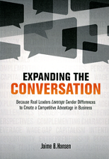
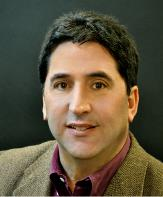

# Print and Internet 2019-Present

  
[Original Link](https://www.sundaymail.co.zw/entrepreneurship-is-a-mindset)  
**Entrepreneurship is a mindset**  
February 21, 2021  
By **Dr Kudzanai Vere**  
> Bruce Bachenheimer, clinical professor of management and executive director of the entrepreneurship laboratory at Pace University, defined entrepreneurship as imagining new ways to solve problems and create value. It is about the ability to recognise and methodically analyse an opportunity and, ultimately capture its value.
>
> I picked five dimensions of an entrepreneurship mindset in Professor Bachenheimer’s sentiments that I will explore.

  
[Original Link](https://www.theladders.com/career-advice/is-the-mba-dead-experts-weigh-in)  
**Is the MBA dead? Experts weigh in**  
February 19, 2021  
By **Ryan Luke**  
> Bruce Bachenheimer, a professor of management at the Lubin School of Business, told USNews, “project-based learning activities in MBA courses allow students to practice solving real business problems. Ultimately, this can help students become more creative thinkers, and this type of education tends to have a lasting impact.”
>
> Bachenheimer continued, “An MBA can be much more than the knowledge and skills acquired through coursework; it can truly expand you and your world.” It’s apparent by the significant increase in MBA enrollment that students believe the MBA program is still alive and relevant.

  
[Original Link](https://www.usnews.com/education/best-graduate-schools/top-business-schools/articles/what-to-know-about-getting-an-mba-during-the-coronavirus-pandemic)  
**Should You Pursue an MBA Amid Coronavirus?**  
June 4, 2020  
By **Ilana Kowarski**  
> 
> Bruce Bachenheimer, a clinical professor of management with the Pace University [Lubin School of Business](https://www.usnews.com/best-graduate-schools/top-business-schools/pace-university-new-york-01309) in New York City, suggests that admitted MBA students account for the type of MBA program they were accepted into when determining whether to enroll or postpone their study plans.
>
> "When considering a top tier MBA program, interactions among one’s cohort, academic and social, is absolutely one of the most valuable aspects of the program and I would recommend deferring admission until traditional classes and regular activities are certain to resume," Bachenheimer wrote in an email. "For other programs, where there is not necessarily a strong cohort model, chancing a semester of remote learning is not as consequential. This would especially be the case for part-time programs."

  
[Original Link](https://www.crainsnewyork.com/op-ed/entrepreneurs-are-sure-find-inspiration-pandemic)  
**Op-Ed: Entrepreneurs are sure to find inspiration in the pandemic**  
April 20, 2020  
By **Bruce Bachenheimer**  
> 
> The great baseball philosopher Yogi Berra once said, "It's difficult to make predictions, especially about the future."
>
> That might sound somewhat inane, but the underlying message is astute: The future is not only unpredictable, it’s unknowable.
>
> Although that is especially true when it comes to human behavior and societal norms—and so many variables are changing the way we teach, learn, worship and socialize these days—we can expect that innovative business concepts will be born out of the Covid-19 crisis.
>
> How do we know?
>
> Entrepreneurship often is associated with some form of disruption, the creation of a significant change in the market. There is perhaps no time more ripe for disruption than during a crisis.
>
> Airbnb and Uber were founded amid the 2008 financial crisis, and they probably would not have succeeded if either was launched a few years earlier—or later, for that matter. Why? Ordinary people would not have been willing to turn their home into a hotel or their car into a taxi absent the financial distress they were facing. Same for customers, who suddenly were willing to sleep in a stranger’s bed and pay for a ride in a regular car.
>
> Once those concepts proved successful, they were able to become parts of the new normal.
>
> We’re seeing emerging trends in meetings, deliveries, production and manufacturing that no doubt will evolve in an era defined by the coronavirus, social distancing and remote working.
>
> It’s important to remember that entrepreneurship is not solely about coming up with an interesting idea; it’s about the passion, persistence and perseverance to actually make it happen. Successful entrepreneurs stay focused on creating solutions that provide value to customers by solving problems and providing benefits.
>
> In these unprecedented times, everyone should bear in mind that entrepreneurship is much broader than the creation of a new business venture. At its core, it is a mindset—a way of thinking and acting. It is about imagining new ways to solve problems and create value.
>
> Fundamentally, entrepreneurship is about the ability to recognize, analyze and ultimately capture the value of an opportunity. Such skills are important for those seeking to establish new ventures. And they’re critical for a variety of professional careers, given today’s hypercompetitive marketplace, where rapid technological innovation and globalization has changed the very nature of work.
>
> Today every institution is facing enormous uncertainty and unique challenges. How are we helping to solve problems and provide benefits to our organizations?
>
> Where might entrepreneurial thinking and innovation play critical roles in dealing with the challenges and uncertainty we are confronting, particularly in the New York metropolitan area? Clearly, one place to start would be dealing with critical supply shortages, from personal protective equipment and medical testing kits to common household supplies and specialized industrial components. Perhaps a transformation of the supply chain and modernized manufacturing will bring new commercial opportunities to our region.
>
> For decades the push has been toward lean manufacturing, with massive economies of scale and just-in-time inventory systems coupled with efficient international supply chains. It has led to globalization and an unrelenting drive toward low-cost manufacturing. That efficiency is not effective when people can’t get items as simple as toilet paper, protective masks and hand sanitizer. When manufacturing is idled due to the inability to source a few key components that were being delivered daily to lower costs by fractions of a percent, that’s not efficient.
>
> When we don’t manufacture critical medical supplies and states are forced to outbid each other with foreign suppliers, that is beyond inefficient and ineffective. The lowest price is irrelevant when there is no supply. There might be a shift from depending on overseas manufacturers and global supply chains to more reliable local alternatives, at least for a number of key industries.
>
> New York is well-positioned to develop new businesses that shift manufacturing from massive to nimble and distribution from scale to flexibility. Our workforce is driven and adaptable, with the spirit to think and act more like committed entrepreneurs than just employees. The shift might even lead to a type of localized industrial revolution, disrupting industries and transforming our systems of management and production. Or just a "locavore" movement for industry.
>
> Whatever happens, making predictions and coming up with ideas won’t solve the challenges we are facing, but innovation and entrepreneurship might.
>
> Remember what Yogi Berra said: "It ain’t over ’til it’s over."
>
> *Bruce Bachenheimer is a clinical professor of management and executive director of the Entrepreneurship Lab at Pace University.*

  
[Original Link](https://link.medium.com/CuDeKUTkw5)  
**Entrepreneurship During the Time of COVID-19**  
April 8, 2020  
By **Bruce Bachenheimer, @PaceUniversity**  
> 
> ***In these unprecedented times, everyone should bear in mind that entrepreneurship is much broader than the creation of a new business venture. At its core, it is a mindset — a way of thinking and acting.***
> 
> *By Bruce Bachenheimer*  
> *Director of the Entrepreneurship Lab, Pace University*
> 
> Entrepreneurship is often associated with some form of disruption, the creation of a significant change in the market. There is perhaps no time more ‘ripe for disruption’ than during a crisis. Airbnb and Uber were founded amid the 2008 financial crisis, and probably would not have succeeded if either was launched a few years earlier or later. Why? Ordinary people would not have been willing to turn their home into a hotel or their car into a taxi absent the financial distress they were facing. Same for customers, who were suddenly willing to sleep in a stranger’s bed and pay for a ride in a regular car. Once these concepts proved successful, they were able to become a new normal.
>
> What innovative business concepts will be born out of the COVID-19 crisis? We’ll have to wait and see. But what’s important to remember is that it’s not about coming up with an interesting idea; it’s about the passion, persistence, and perseverance to actually make it happen.
>
> In these unprecedented times, everyone should bear in mind that entrepreneurship is much broader than the creation of a new business venture. At its core, it is a mindset — a way of thinking and acting. It is about imagining new ways to solve problems and create value. Fundamentally, entrepreneurship is about opportunity; the ability to recognize a new opportunity, to methodically analyze the opportunity, and ultimately, to capture the value of that opportunity. Such skills are important for those seeking to establish new ventures, and critical for a variety of professional careers given today’s hyper-competitive marketplace where rapid technological innovation and globalization has changed the very nature of work.
>
> Today, every institution is facing enormous uncertainty and unique challenges. How are you helping to solve problems and provide benefits for your organization?

  
[Original Link](https://www.wsj.com/articles/new-yorkers-step-up-to-help-mom-and-pop-businesses-11586268001)  
**New Yorkers Step Up to Help Mom-and-Pop Businesses**  
April 7, 2020 (in print on April 8th, Page A12B)  
By **Anne Kadet**  
> 
> Like many New Yorkers, Ms. Struss fears that many mom-and-pop shops won’t survive the shutdown, and she’s determined to help them stay afloat.
> 
> Such concerns aren’t unfounded. Even a well-run small business typically has less than two months of operating capital in reserve, says Bruce Bachenheimer, a management professor at Pace University’s Lubin School of Business.
> 
> The businesses best positioned to survive, meanwhile, are the most creative and flexible outfits, says Mr. Bachenheimer, the Pace professor, citing the example of a pottery studio that recently started assembling and delivering DIY pottery kits to people stuck at home. “Darwin didn’t say it’s the strongest species that survive,” he says. “It’s those that are able to adapt.”
> 
> Still, the Chappaqua, N.Y., resident wants to see local stores stay afloat. To that end, he suggests customers buy gift cards from neighborhood shops and restaurants to use when they reopen, and ask for a credit rather than a refund on services not delivered, such as a canceled catering event.
> 
> It can be for a selfish reason. “If all these stores go out of business, what happens to your neighborhood life and property values?” he asks.

  
[Original Link](https://magazine.boatus.com/publication/?i=645552&ver=html5&p=57)  
**Is Your Boat Still Right For You?**  
February/March 2020  
By **Rich Armstrong**  
>
> **Bachelor Boater No More**
> 
> I started with a Rhodes 22 sailboat that I purchased new in 1989 for daysailing on the Hudson River. In 1990, I purchased a Pearson 36 Cutter, which I lived aboard for several years and sailed from New England through the Caribbean to South America and back to Annapolis, Maryland. Now a family man, I own an Island Packet 27, which I bought in 2016 and use for coastal cruising in Long Island Sound and along the Rhode Island and Massachusetts coasts.
> 
> I went from a daysailer to a bluewater cruiser to now something in the middle. Each change met my lifestyle at different points. Now I typically do two two-week cruises with my family (wife, teenage daughter, and sometimes our dog) and a bunch of shorter/weekend trips — about half of those solo.
> 
> — *Bruce Bachenheimer, New York*

  
[Original Link](https://www.forbes.com/sites/johnhall/2019/12/15/why-we-dont-send-gifts-to-clients-during-the-holidays)  
**Why We Don’t Send Gifts To Clients During The Holidays**  
December 15, 2019  
By **John Hall**  
> 
> **It can send the wrong message to clients and employees.**
> 
> “In the 1980s, you couldn't spend enough money," Bruce Bachenheimer, director of the Entrepreneurship Lab at Pace University in New York, told The Street. "But today clients are saying, 'Forget the hunting trip, forget the lavish treatment — just give me a better price."
> 
> Bachenheimer added, "If you're rolling out the red carpet for a customer, they're going to assume you have incredibly high margins to do all that spending. They're going to think, 'Oh, he's overcharging everyone — including me — in order to afford all this."
> 
> Besides sending the wrong message to clients, it could also anger employees. If you’re going all-in on lavish presents for clients, while your teammates haven’t received a bonus, they’ll question why. Remember, your team can make or break your business. You need to keep your teammates happy and ensure they feel appreciated.

  
[Original Link](https://rightwingeconomics.com/2019/11/12/greatest-economy-ever-small-businesses-forced-to-use-gofundme-to-stay-solvent/)  
**Greatest Economy Ever: Small Businesses Forced To Use GoFundMe To Stay Solvent**  
November 12, 2019  
By **Jordan**  
> 
> Bruce Bachenheimer, a professor at the Lubin School of Business at Pace University, said that the GoFundMe campaigns provide more than just money – they provide reassurance.
>
> After a successful campaign, owners may say “‘I should hang on, I should keep going,’” Bachenheimer concluded.

  
[Original Link](https://www.wsj.com/articles/cash-strapped-small-businesses-turn-to-gofundme-11573304401)  
**Cash-Strapped Small Businesses Turn to GoFundMe**  
November 9, 2019  
By **Kate King**  
> 
> Bruce Bachenheimer, a professor at the Lubin School of Business at Pace University, said even more important than cash is the validation business owners receive from GoFundMe campaigns. Two-thousand customers contributing $20 or $40 each might not be enough to keep a business open, but it can give owners reassurance.
> 
> After a successful GoFundMe campaign, owners might say to themselves, “‘I should hang on, I should keep going,’” Mr. Bachenheimer said.

  
[Original Link](https://www.newsweek.com/ubers-response-california-worker-bill-legal-ploy-that-denies-drivers-fair-deal-experts-say-1459249)  
**Uber's Response to California Worker Bill Is 'Legal Ploy' That Denies Drivers Fair Deal, Experts Say**  
September 13, 2019  
By **Daniel Moritz-Rabson**  
>
>While labor advocates have cheered the law, others have raised concerns that it could be damaging to the flexible schedules of contractor work and thereby limit worker freedom. The legislation will likely have wide-ranging impacts, affecting companies far beyond Lyft and Uber, leading some experts to raise questions about how to improve regulation without being overbearing.
>
>"Is clamping down on this hurting progress and the evolution of the market?" Bruce Bachenheimer, a clinical professor of Management at Pace University said to *Newsweek*.

  
[Original Link](http://www.newsday.com/news/money-fix-crowdfunding-for-investors-1.6496386)  
**Long Beach mattress company's founders regroup - more than once**  
June 9, 2019  
By **Cara Trager**  
>
> According to Bruce Bachenheimer, a clinical management professor and the executive director of the Entrepreneurship Lab at Pace University, enlisting doctors to drive online sales is not a unique marketing approach. Getroman.com, for instance, connects consumers with its online network’s doctors so that they can purchase pharmaceuticals including Viagra.
>
> “For price and convenience, more things are going online,” Bachenheimer said.

  
[Original Link](https://www.usnews.com/education/best-graduate-schools/top-business-schools/articles/2019-05-17/is-an-mba-worth-it-how-to-decide)  
**Is an MBA Worth It? How to Decide**  
May 17, 2019  
By **Ilana Kowarski**  
>
> Bruce Bachenheimer, a clinical professor of management at Pace University's [Lubin School of Business](https://www.usnews.com/best-graduate-schools/top-business-schools/pace-university-new-york-01309) in New York City, says that project-based learning activities in MBA courses allow students to practice solving real business problems. Ultimately, this can help students become more creative thinkers, and he says this type of education tends to have a lasting impact.
>
> Bachenheimer adds that an MBA can offer a formative experience that helps a student shape his or her professional identity. "An MBA can be much more than the knowledge and skills acquired through coursework; it can truly expand you and your world," he wrote in an email.

  
[Original Link](http://canorthamerica.icas.com/may-2019#!/north-america-most-powerful-cities/)  
**North America’s Powerful Cities**  
May 2019  
By **Andrea Murad**  
>
> **Regulations**  
> While regulations can create high expenses for companies, those that go through tremendous regulatory hurdles for the SEC, auditors or other regulatory bodies have higher valuations, because the regulations work to prevent fraud and accurately identify risk.
>
> “What’s a problem is regulations that don’t make sense, but the idea that regulation is hurting business is misunderstood at best,” said Bruce Bachenheimer, Clinical Professor of Management and Executive Director of the Entrepreneurship Lab at Pace University. “Financial regulation will cost companies money in compliance, but the value of their stock is exponentially higher because they comply with that regulation.”
> 
> Regulations do serve to protect businesses and their operations, but they can also prevent innovation. Lobbying for restrictions to maintain the status quo and protect businesses might work for a short period, but then the city will eventually falter, said Bruce.
>
> **Talent**  
> When companies look to establish operations somewhere new, they look at the ability to hire talent to help that business grow. What these companies often look for is the integration of universities and their degree programs into the local ecosystem.
>
> Areas with universities that have programs in AI, robotics and machine learning, for example, attract forward-looking companies.
>
> Talent serves many roles though. Today, the basis for a competitive advantage is innovation in all forms, and the only source of innovation is human talent, said Bruce: “These days with globalization, hyper competition and shorter lifecycles, the only way to survive is with innovation.”

# Print and Internet 2016-2018

  
[Original Link](http://www.money.com)  
**Want to Diversify? Start Here**  
September 2018 (Vol. 47, Issue 7, Page 17 print edition)  
By **Elizabeth O'Brien**  
> "It's important for you to think of yourself as CEO of \[Your Name Here\]," says Bruce Bachenheimer, professor of management at Pace University in Manhattan. No matter what your field, you can put an entrepreneurial mindset to your advantage. Here's what to do:
>
> **\> THINK LIKE A DISRUPTER.**
>
> This attitude is essential, no matter where you work. Think about your industry and how you can help your employer respond to change. Bring those solutions to your bosses and peers.
>
> **\> ADOPT A SIDE HUSTLE.**
>
> Driving for Uber or selling on Etsy are legitimate ways to earn extra cash. (Just don't forget to report that income to the IRS.) You'll want to make sure that your side gig doesn't infringe on your main gig, Bachenheimer says.
>
> **\> MAKE IT OFFICIAL.**
>
> If you have an outside gig that takes off, you'll want to start treating it more like a business and less like a hobby, Bachenheimer says. Also, think about opening a dedicated bank account and setting up the ability to accept credit card payments. If you take your business seriously, your customers and clients will too.

  
[Original Link](https://www.bizjournals.com/newyork/news/2018/05/08/jopwell-helps-track-down-minority-talent.html)  
**Jowell helps track down minority talent**  
April 30, 2018  
By **Gary M. Stern**  
> Bruce Bachenheimer, executive director of the Entrepreneurship Lab at Pace University in New York, said companies are paying increasing attention to hiring minorities with good reason.
> 
> “There is a growing body of research demonstrating that diversity leads to better decisions, performance and profitability,” Bachenheimer said. 
>
> Hiring a diverse staff helps companies boost revenue because it helps companies better reach multicultural consumers, he added.
>
> Bachenheimer suggested that Jopwell can likely carve out a niche in diversity hiring. 
>
> “Companies have to look for talented employees from a variety of sources — not just traditional listings and referrals,” he said.

  
[Original Link](https://www.bizjournals.com/newyork/news/2018/05/08/jopwell-helps-track-down-minority-talent.html)  
**The Origins of Disruptive Technologists®….and their Entrepreneurial Culture in New York City (book)**  
Copyright April 26, 2018  
By **Lauren Keyson**  
> **The Accidental Entrepreneur**
>
> Bruce Bachenheimer, the accidental entrepreneur, is a clinical professor of management and the director of Pace University’s Entrepreneurship Lab. He tells his students that passion is a must for entrepreneurs and that if they don’t yet know what that passion is, they should keep looking. Sometimes it can happen when it’s least expected –and he is a great example of this.
>
> “Passion is very important. When I found a passion for something, whether it was an entrepreneurial venture or something else, it was very important that I pursue it. Where is that passion going to come from? It can come from almost anywhere and at any time. Early on I discovered a passion for Japanese. I found an exchange program and went to college there for a semester. Later, inspired by Thoreau’s Walden, I decided to leave a career on Wall Street and go sailing. And just as Thoreau decided to leave the woods after his path from the cabin to the pond became too worn in, it was time for me to find something else.
>
> “Just over a decade ago I found a passion for teaching and I did whatever it took to get a teaching position without a typical academic background. Examples of my entrepreneurial passion include having started an online financial services company in Australia and a woodworking business in Maryland. With passion it’s very easy to focus all your time and energy and accomplish something.
>
> “When I talk to my students and they don’t know what their passion is, I tell them it’s fine –wait and keep looking, don’t just settle. I lost the desire for my job as a Wall Street trader and was basically just going through the motions. It was exciting and paid a lot of money, but I knew I wanted to do something else, I just didn’t know what at the time. When you don’t have passion, you can’t force it on yourself. I think it’s a mistake. But keep that radar open and try a lot of different things because you never know where your passion will come from. Sometimes that passion can last a lifetime. For me, some things run their course after a couple of years.”[![]

  
[Original Link](https://www.businessnewsdaily.com/7275-entrepreneurship-defined.html)  
**Entrepreneurship Defined: What It Means to Be an Entrepreneur**  
February 19, 2018  
By **Paula Fernandes**  
> 3\. "At its core, \[entrepreneurship\] is a mindset – a way of thinking and acting. It is about **imagining new ways to solve problems and create value**. Fundamentally, entrepreneurship is about ... the ability to recognize \[and\] methodically analyze \[an\] opportunity, and ultimately, to capture \[its\] value."
>
> – Bruce Bachenheimer, clinical professor of management and executive director of the [Entrepreneurship Lab](http://www.elab.nyc/) at Pace University

  
[Original Link](https://www.bizjournals.com/newyork/news/2018/01/23/inside-pymetrics-new-york-office.html)  
**Inside Pymetrics' New York office: Can it make hiring more objective?**  
January 23, 2018  
By **By Gary M. Stern**  
> **The importance of the right hire**
>
> Bruce Bachenheimer, the executive director of the Entrepreneurship Lab at [Pace University](http://companies.bizjournals.com/profile/pace-university/148181/) in New York, underscores the critical role that hiring the right staff plays in a company’s success.
>
> “In this highly-competitive globalized economy, with rapid technological innovation, firms can no longer view HR as ‘finding square pegs for square holes’ based on a standardized job description and qualifications document,” he says.
>
> Moreover, Bachenheimer notes that many companies make quick judgments about resumes, often overlooking appealing candidates who may have graduated from community colleges or lack Ivy League credentials.
>
> “A holistic assessment based on a broad range of cognitive and emotional traits could offer a much more reliable indicator, but would be very difficult, if not impossible, to administer without AI,” he notes.
>
> Nonetheless, Bachenheimer notes that even hiring by AI has its limitations. “AI is not magic,” he says. “It’s computer programming based on algorithms and training sets input by people. Companies creating and using AI must rigorously test results for accuracy and reliability.”

  
[Original Link](https://www.usnews.com/best-graduate-schools/top-business-schools/pace-university-lubin-01309)  
**Inside Pymetrics' New York office: Can it make hiring more objective?**  
January 5, 2018  
By **Ilana Kowarski**  
> **Attending a school with accomplished classmates is valuable**. Experts say it's especially helpful if your classmates have leadership experience in diverse industries.
>
> "While the school’s reputation, ranking and accreditation are obviously extremely important, applicants frequently do not consider just about how vital their peers will be in preparing them for a career in corporate strategy," Bruce Bachenheimer, a clinical professor of management at Pace University's [Lubin School of Business](https://www.usnews.com/best-graduate-schools/top-business-schools/pace-university-lubin-01309), where he teaches both undergraduate and MBA strategy courses, said via email.
>
> Bachenheimer says discussing business strategy case studies with classmates who have a significant amount of work experience can yield insights beyond those given by a strategy professor in a lecture, so strategy MBA applicants should target schools with a seasoned student body, where the average student has several years of work experience.

  
[Original Link](https://www.bizjournals.com/newyork/news/2017/11/28/the-army-navy-store-in-greenwich-village-still.html)  
**The Army/Navy Store in Greenwich Village: Still surviving**  
November 28, 2017  
By **By Gary M. Stern**  
> [Bruce Bachenheimer](https://www.bizjournals.com/newyork/search/results?q=Bruce%20Bachenheimer), executive director of the Entrepreneurship Lab at [Pace University](http://companies.bizjournals.com/profile/pace-university/148181/) in New York, says several factors contributed to the demise of Army and Navy stores. “The U.S. simply hasn’t been creating the amount of surplus it once did,” he says.
>
> While 10 million soldiers fought in the Vietnam War and 16 million in World War II, only 2.5 million served in Afghanistan. And the United States runs online public auctions, which cuts into Army and Navy store sales.
> 
> “The 1950s and 1960s were the heydays of these stores, when they were largely seen as a great place to buy inexpensive camping and hunting gear,” Bachenheimer notes.
>
> Uncle Sam’s has survived for several reasons, Bachenheimer says, including doing a better job of sourcing supplies, becoming a local institution with a loyal following, and via economies of scale with its multiple stores.

  
[Original Link](http://www.expandtheconvo.com/the-book)  
**Expanding the Conversation**  
© 2017  
By **Jaime B. Hansen**  
> At a basic level, entrepreneurship comes down to ventures that turn an idea into a profit. But even that feels like it’s missing something. Entrepreneurship is an umbrella word; it covers so much at one time. In my opinion, Bruce Bachenheimer, a clinical professor of management and executive director of the Entrepreneurship Lab at Pace University, defines it best. He said, “Entrepreneurship is much broader than the creation of a new business venture. At its core, it’s a mindset, a way of thinking and acting.”

  
[Original Link](http://www.bizjournals.com/newyork/news/2017/05/30/shoptiques-growth.html)  
**Shoptiques: Can the websites for independent boutiques keep growing?**  
May 30, 2017  
By **Gary M. Stern**  
> **Thinking like a partner**
> 
> Once a boutique joins the network, Vidisheva expects it to operate and think like a “partner.” While boutiques are permitted to maintain their own site, most don’t.
> 
> Bruce Bachenheimer, executive director of the Entrepreneurship Lab at Pace University in New York, said Shoptiques’ rapid growth suggests that it “must be offering the boutiques it serves a real value proposition.” Moreover, exclusivity with Shoptiques provides an “ability to participate in the network, which should provide additional revenue,” he noted.
> 
> However, its growth has its pitfalls. If shoppers sense that by entering Shoptiques it’s “just being directed through a conglomerated chain of stores rather than discovering a special boutique,” it could lose its charm and pizzazz.
> 
> Hence Bachenheimer concluded, “If they can successfully consolidate this fragmented market segment, they will likely build a profitable and scalable business.” But in order to sustain their dominant position, Shoptiques must “develop a distinct and trusted brand that is widely recognized by boutiques and shoppers,” he said.

  
[Original Link](http://www.heraldtribune.com/news/20170327/do-you-have-what-it-takes-to-be-successful-leader)  
**Do you have what it takes to be a successful leader?**  
March 27, 2017  
By **Dennis Zink**  
> Being a good leader will have a lot to do with your success. But how do you measure it?
> 
> As Bruce Bachenheimer of Pace University says, "A definition of a leader is someone with followers. The top quality of a leader is the ability to attract top-quality followers."

  
[Original Link](http://www.bizjournals.com/newyork/news/2017/02/13/this-indian-restaurateur-owns-5-eateries-including.html)  
**This Indian restaurateur owns 5 eateries, including 3 in Curry Hill**  
February 13, 2017  
By **Gary M. Stern**  
> **Expansion challenges**
>
> Many independent retail stores including Chinese restaurants, barber shops and nail salons haven’t “effectively developed a business model to consolidate these fragmented industries,” explained Bruce Bachenheimer, executive director of the Entrepreneurial Lab at Pace University in New York. “The most common reason behind consolidation is economies of scale,” he said.
>
> Moreover, he noted the restaurant business is challenging for individual entrepreneurs to expand. “The restaurant business is extremely competitive and subject to numerous trends and fads. It’s hard enough to manage one, much more complex to keep five thriving,” pointed out Bachenheimer.
>
> Sustaining a loyal staff is another hurdle. “Aside from external factors such as competition and changing trends, high employee turnover is a challenge, attracting, retaining and motivating staff is difficult,” he asserted.
>
> Having several eateries in one location is a way to attract, not discourage, more patrons. “Think about Chinatown or Little Italy,” Bachenheimer pointed out. “Larger numbers of people are interested in going there than would otherwise go to multiple diverse locations,” he said.

  
[Original Link](http://www.computerworld.com/article/3158797/it-careers/obamacare-repeal-could-hurt-the-gig-economy.html)  
**Obamacare repeal could hurt the gig economy**  
January 18, 2017  
By **Patrick Thibodeau**  
> Older workers, said Bruce Bachenheimer, a professor of management and executive director of the Entrepreneurship Lab at Pace University, need health insurance. These are workers with the industry experience, contacts and ability to start a business. But access to health insurance, especially if they or a family member could be turned down because of a pre-existing condition, can play a major role in whether or not to start a business.

  
[Original Link](http://fortune.com/2016/12/20/amazons-echo-snag-entrepreneurs)  
**What Amazon’s Echo Snag Can Teach Entrepreneurs**  
December 20, 2016  
By **Jeremy Quittner**  
> There’s a lesson here for businesses much smaller than Amazon: You need to be diligent about your supply chain, particularly during the holidays.
>
> “This is why it is so important for small-business owners to stay close to their customers, maintain strong relationships with suppliers, follow market trends, and really know their industry,” says Bruce Bachenheimer, a clinical professor of management at Pace University in New York. “They cannot simply rely on the recommendations of a sales rep and act as stock keepers or inventory managers.”

  
[Original Link](http://fortune.com/2016/09/30/small-chain-chipotle)  
**What It Will Take for This Fast-Growing Chain to Become the Next Chipotle**  
September 30, 2016  
By **Jeremy Quittner**  
> But expanding any restaurant beyond its home turf comes with challenges. For one, the U.S. is an enormous market, and what has worked well in Texas may not succeed as well in other regions.
>
> “They will need really qualified people who know logistics and strategy and how to run a restaurant in the New York region,” says Bruce Bachenheimer, clinical professor of management and director of the Entrepreneurship Lab at Pace University.

  
[Original Link](http://enterprisectr.org/steps-starting-successful-business)  
**Steps to Starting a Successful Business**  
September 13, 2016  
By **Mike Sperling**  
> *Plan, Plan, Plan* – “Planning carefully before launching a new business is not limited to preparing a business plan”, says Bruce Bachenheimer, clinical professor of management and director of the Entrepreneurship Lab at Pace University in New York City. While writing a business plan is certainly helpful, the real value is not in having the finished product in hand, but rather in the process of researching and thinking about your business in a systematic way.

  
[Original Link](http://www.bizjournals.com/newyork/news/2016/09/02/how-this-entrepreneur-took-a-two-wheeled-problem.html)  
**How this entrepreneur took a two-wheeled problem and created a fashion business**  
September 2, 2016  
By **Gary M. Stern**  
> Targeting a niche audience is one way for start-ups to make a dent in the marketplace, explains Bruce Bachenheimer, the executive director of the Entrepreneurship Lab at Pace University in New York. “Understanding who your customer is, what their unmet needs are, and whether your products actually meet those needs requires a great deal of customer contact, testing and product iteration,” he says.
>
> Bachenheimer says Tandem NY could employ several strategies to grow but best bets are “increasing their online sales, which likely provides the best margins, and expanding the number and size of retailers.”

  
[Original Link](http://thriveorjustsurvive.com/stand-out-with-an-entrepreneurial-mindset)  
**Stand Out with an Entrepreneurial Mindset**  
August 5, 2016  
By **Neal Spencer**  
> **What Is an Entrepreneur, Anyway?**
>
> Is it the Silicon Valley tech genius? The Wall Street hotshot? That neighbor who owns the gift shop down the block?
>
> Being an entrepreneur is about much more than starting a business, or even whether you’re “the boss.” Bruce Bachenheimer, who leads the Entrepreneurship Lab at Pace University, defines entrepreneurship as a **mindset**. It’s about **imagining new ways to solve problems and create value**.

  
[Original Link](http://tedxhyderabad.com/on-your-own-entrepreneur)  
**On Your Own ‘Entrepreneur’**  
July 28, 2016  
By **Kavya Krishna**  
> The word ‘**Entrepreneur**’ is derived from the French word ‘**Entrependre**’ which means ‘**the one who undertakes**’ i.e. the individuals who take the risk of starting a new enterprise/startup/business.
>
> Bruce Bachenheimer, a clinical professor of management and executive director of the Entrepreneurship Lab at Pace University explains, — *“Entrepreneurship is much broader than the creation of a new business venture. At its core, it is a mind-set — a way of thinking and acting. It is about imagining new ways to solve problems and create value.”*

  
[Original Link](http://www.post-gazette.com/in-the-lead/itl-2016-companies/2016/05/27/Commentary-Len-Boselovic-Companies-make-up-then-break-up/stories/201605270027)  
**Companies make up, then break up**  
May 27, 2016  
By **Len Boselovic**  
> After spending billions on acquisitions that stoked its downstream business of making parts for the aerospace, automotive and other markets, Alcoa will spin the unit off into a new company, Arconic, later this year. The thinking: investors are not putting a high enough price tag on Arconic’s fast-growing downstream operations because they perceive Alcoa to be a commodity aluminum producer plagued by global overcapacity and depressed metals prices.
>
> “It’s hard for investors to get excited about that, particularly when commodities prices are falling,” said Bruce Bachenheimer, executive director of Pace University’s Entrepreneurship Lab.
>
> Those challenges notwithstanding, Mr. Bachenheimer believes corporate divorces are generally more productive than marriages. He said that too often companies pursue a merger or acquisition for the wrong reason: to grow just for the sake of growing.
>
> “Spinoffs are generally done for the right reason and do work,” he said.

  
[Original Link](http://www.inc.com/jeremy-quittner/krispy-kreme-goes-private-to-rebuild-brand-cachet.html)  
**Why Some Companies--No Matter How Successful--Should Stay Private**  
May 9, 2016  
By **Jeremy Quittner**  
> Freed from the demands of public market investors who tend to focus on short-term returns, some companies may find renewed life that harks back to when they were small and privately held, business experts say. They can strengthen their brands, double down in the communities in which they operate, and get back to their roots as innovators.
>
> "\[Krispy Kreme\] could take an approach to the business that is more family-friendly and more small-business friendly when you don't have the pressure of quarterly returns," says Bruce Bachenheimer, a clinical professor of management at Pace University in New York.
>
> It's not inconceivable that Krispy Kreme would go public again, Bachenheimer says, as time off the public market can increase the company's cachet and value.
>
> "For the employees and for the primary stakeholders, the distributors and retailers they are associated with, it could be taking a smaller business, longer-term approach" that could help increase the brand's value, Bachenheimer says.

  
[Original Link](http://www.inc.com/jeremy-quittner/olive-garden-battle-over-breadsticks-a-big-lesson-on-managing-small-stuff.html)  
**Why Some Companies--No Matter How Successful--Should Stay Private**  
April 6, 2016  
By **Jeremy Quittner**  
> While Olive Garden is a giant chain, its lessons could be instructive to small business owners. Namely, you should indeed sweat the small stuff, because even minor details akin to a free bread policy can make a big difference to your bottom line.
>
> "When you talk about a company or an industry with very thin margins, tiny changes can have an enormous impact," says Bruce Bachenheimer, a clinical professor of management at Pace University.
>
> The history of business is filled with second chances stemming from minor changes. Many years ago, the company that produces Angostura bitters doubled its sales by widening the size of its bottle opening, which caused consumers to pour more into their drinks. Bachenheimer says. Similarly, some gyms have gotten a revenue boost in recent years simply by adding kettlebells, which tend to appeal to a wider spectrum of gym-goers than traditional dumbbells.
>
> Test changes to products and price points with a limited set of customers, for example, and for a limited amount of time to see how it goes, experts say.
>
> "Call it A/B testing," Bachenheimer says. "It's a nice way to try things on an experimental basis and to measure the results, but not suffer huge consequences if it's not successful."

  
[Original Link](http://www.businessnewsdaily.com/2642-entrepreneurship.html)  
**What is Entrepreneurship?**  
March 21, 2016  
By **Paula Fernandes**  
> "Entrepreneurship is much broader than the creation of a new business venture," added Bruce Bachenheimer, a clinical professor of management and executive director of the Entrepreneurship Lab at Pace University. "At its core, it is a mind-set — a way of thinking and acting. It is about imagining new ways to solve problems and create value."
>
> **Be passionate.** Successful entrepreneurs are driven primarily by a need for achievement and the desire to make a meaningful difference, Bachenheimer said. "The most important traits are passion and persistence, but these must not be confused with arrogance and stubbornness," he said.

  
[Original Link](http://www.inc.com/jeremy-quittner/four-important-traits-the-fastest-growing-startups-all-share.html)  
**4 Moves You Must Make to Create a Billion-Dollar Company**  
March 7, 2016  
By **Jeremy Quittner**  
> Still, some of the findings may be cause for skepticism. [Bruce Bachenheimer](http://thehill.com/blogs/congress-blog/economy-budget/242132-us-must-support-new-entrepreneurial-ventures-to-create), a clinical professor of management at Pace University, disagrees with the point about shorter, non-local names, calling it a red herring. One example of a company that grew from startup phase to gargantuan proportions is Sun Microsystems, whose name, he points out, originally stood for Stanford University Network. And, he says, filing for a patent early on could work against a company because it can be expensive to file for one, or costly to defend against infringement claims.
>
> Bachenheimer agrees with the researchers that the [economic environment](http://www.inc.com/jeremy-quittner/milstein-commission-and-salvaging-the-american-dream.html) has changed dramatically for entrepreneurs, making it much more difficult for young companies to form and grow. One key reason is the decimation of savings and home ownership rates, which both provided much-needed financing to startups in prior decades.
>
> "\[The declining rate of entrepreneurship\] has to do with the financial crisis, wage stagnation, and housing price declines since 2008, and it has to do with the erosion of the middle class," Bachenheimer says.

  
[Original Link](http://westfaironline.com/77871/age-old-profession-of-accounting-changing-with-the-economy/)  
**Age-old profession of accounting changing with the economy**  
March 4, 2016  
By **Reece Alvarez**  
> The perception of desirability and loyalty to the old-guard of corporations is waning and being replaced with the innovative spirit of the entrepreneur, said Bruce Bachenheimer, clinical professor of management at Pace University and executive director of the school’s entrepreneurship lab.
>
> “A very large percentage of students say they are interested in starting their own company or working at a startup as opposed to the previous generation before, where the goal was to get a job with a big name company,” he said. “Partially that is because of all the changes we have seen in the economy, but also these students have seen their parents laid-off and unemployed and looking for other work, so I think there has been a shift in the mentality.”
>
> In the world of entrepreneurs, the role of accounting has moved beyond bookkeeping to one of critical importance as a strategic role in a company’s positioning for future growth, he said.
>
> Startups looking to raise outside funds from angel and venture investors or who have their eyes on going public or being acquired must manage their books in a tactical way from the get-go, he said.
>
> “The last thing you want to do when you are looking to raise angel money, venture capital money and then ultimately to be acquired or to do an IPO is to have backwards books where you really didn’t know what you were doing and kept a bunch of receipts in a shoebox,” he said.

  
[Original Link](http://pleasantville.dailyvoice.com/schools/pace-people-this-week-bachenheimer-featured-on-south-korean-tv/624833)  
**Pace People This Week: Bachenheimer Featured On South Korean TV**  
February 17, 2016  
By **John Haffey**  
>  Bruce Bachenheimer was featured on South Korea's national public television station to discuss New York's growing 'Silicon Alley'. Photo Credit: *Pace*
>
> Pace Clinical Professor of Management and Executive Director of the schools' Entrepreneurship Lab, **Bruce Bachenheimer**, was interviewed about NYC's burgeoning 'Silicon Alley' on KBS Channel 1, South Korea's national public television station. Click [here](http://www.ondemandkorea.com/global-talk-show-cosmopolitan-e40.html) to watch his interview. The 'Silicon Alley' segment starts at 19:50 and Bachenheimer appears at 22:58.

  
[Original Link](http://www.inc.com/jeremy-quittner/small-health-care-cooperatives-could-follow-large-company-coalition.html)  
**Here's How Health Care Could Get Cheaper in 2016**  
February 5, 2016  
By **Jeremy Quittner**  
> Small companies currently have access to a federal exchange, called SHOP, that leverages their combined purchasing heft to buy plans. But the large company model could percolate down to create an additional option for entrepreneurs.
>
> "What's interesting for small businesses is that similar pools could come from trade unions and trade guilds and business associations," says Bruce Bachenheimer, a professor of clinical management at Pace University. In addition to small companies banding together, Bachenheimer adds that other types of pools also could form, for example within the growing ranks of the self-employed in the so-called gig economy, represented by Uber and TaskRabbit. Even startups that bring together entrepreneurs, such as WeWork, could also present large pooling opportunities.
>
> There are concerns about the sensitivity of data that companies exchange and how they use it, Bachenheimer says, as well as whether these pools will really provide cost savings, as the WSJ suggests. Further, regional nonprofit co-ops that have relied on more limited networks of health care providers have struggled to remain solvent over the years, in large part because they have attracted a preponderance of older workers who need more care.
>
> Yet cooperative networks that service startups would tend to have younger workers, and could have a better chance.
>
> "It will never make economic sense until younger, healthier employees join in," says Bachenheimer. "These plans could be catered to young, tech workers."

  
[Original Link](http://creativeroom4talk.com/interview-bruce-bachenheimer)  
**Interview: Bruce Bachenheimer**  
January 28, 2016  
> 
>
> Professor Bruce Bachenheimer was interviewed in the February 2016 issue of Creativeroom4talk, an international magazine for communications & creativity. The digital magazine (Issue 10) is available at:[http://bit.ly/InterviewBB](http://bit.ly/InterviewBB).
>
> *An excerpt of the interview:*
> 
> **A recommendation for those who think about starting and running a creative business?**
> 
> Determine what is really important to you. Not what others would define as important or something that would make you successful, but what you are truly passionate about.
>
> **What is the most important thing in a workplace/studio for you?**
>
> Independence. I will work towards institutional goals and within organizational boundaries, but want the freedom and flexibility to pursue a creative path autonomously.
> 
> **What is the nicest compliment you’ve received for your creative work, and from whom?**
> 
> A former professor of mine wrote: “In Hindu tradition, the greatest guru (teacher) is one whose shishya (student) surpasses the guru. By that criterion, I am the greatest guru, and very proud of you!”
> 
> **Who is your professional role model/inspiration?**
> 
> Professors that come to mind include Randy Pausch (Carnegie Mellon University) and Walter Lewin (MIT).
> 
> **How would you describe your work style (academic field or fashion style, or both, or something entirely different)?**
> 
> I like to teach by revealing a path to discovery. I try to be empathetic and engaging, but have little patience for apathetic dolts.
> 
> **What inspires you?**
> 
> That continuous learning is a job requirement and inspiring others to learn is the most important aspect of my job.

# Print and Internet 2013-2015

  
[Original Link](https://www.inc.com/jeremy-quittner/how-to-protect-yourself-from-big-box-supplier-cost-demands.html)  
**Walmart to Vendors: Give Us a Discount**  
September 28, 2015  
By **Jeremy Quittner**  
>“To do business with a company like Walmart, vendors are really pushed to the maximum of what they can do,” says Bruce Bachenheimer, a clinical professor of management at Pace University in New York.
>
>**1. Consider a currency hedging strategy.**
>
>It makes sense, if you’re manufacturing overseas and paying for things using local money, to get a handle on costs by protecting against currency swings. One way to do that is by purchasing a currency contract, known as a hedge, that allows you to exchange dollars into the local currency, but at a fixed price and at a predetermined time in the future. 
>
>You benefit if the value of the local currency goes up, but not necessarily when it drops in value. With the strong greenback in recent months, you’re likely to feel some pain. But here’s an additional thing to be wary of, Bachenheimer says: If the currency you’ve hedged decreases in value, and the retailer you supply also asks for a price concession, you’ll take a double hit to your bottom line. 
>
>**2. Create more flexibility in your overseas production.**
>
>While that’s not as easy at it sounds, you could explore adding in other countries that peg their currency to the dollar. That includes many Caribbean nations, suh as Barbados, Antigua, and Belize, Bachenheimer says.

 
[Original Link](http://westfaironline.com/73960/experts-opportunity-lies-in-chinese-stock-collapse/) 
**Experts: Opportunity lies in Chinese stock collapse** 
September 3, 2015 
By **Evan Fallor** 
>
>  
> While most may see the recent Chinese stock market collapse as an indicator of economic despair, some business experts see it as a golden opportunity for Westchester and Fairfield County firms.
>
>Bruce Bachenheimer, a clinical professor of management at Pace University and the executive director of Entrepreneurship Lab — a Lubin School of Business networking and development program — said now is as good a time as ever for local companies to explore opportunities for partnerships and strategic alliances with Chinese companies.
>
>“If I was a Chinese firm and saw this going on, I wouldn’t want to have all my eggs in one basket,” he said. “New York City is the financial capital of the world, and there is a lot of talent here in Westchester County and Fairfield County. I see it as an opportunity for small firms to do business.”
>
>Despite China having the second largest economy in the world after experiencing accelerated growth in recent years, the Shanghai Stock Exchange has been on a downward slump for much of the summer.
>
>Aug. 24, now widely known as “Black Monday” in the financial world, saw the Shanghai main share index lose 8.49 percent.
>
>Calling the U.S. a safe haven economy, Bachenheimer said Westchester’s standing as a wealthy county with large amounts of intellectual capital make it a desirable destination for Chinese companies. Investments in the tech industry would help these firms diversify.
>
>Investors in Westchester, he said, can do one of two things: buy from China, where products and services are less expensive, or conversely, sell to Chinese companies. The selling opportunities, he said, are plentiful in a big market where specialty products may not be impacted by the shrinking Chinese growth rate.
>
>At roughly $10 trillion in gross domestic product, the Chinese economy is still the second largest in the world and has been growing at a very rapid rate for decades. Though the rate is slowing now, it continues to grow. The latest crash does not mean a direct negative impact on Westchester’s small businesses, Bachenheimer said.
>
>“I think, if anything, the Chinese stock market crisis provides more opportunities than stability does,” Bachenheimer said. “They should take these market jitters as an opportunity, not a reason to withdraw into a shell. The Chinese symbol for crisis is the same symbol for opportunity.”

 
[Original Link](http://www.inc.com/travis-wright/28-favorite-tech-tools-for-small-business-entrepreneurs-in-2015.html) 
**What You Can Learn From Carly Fiorina's Smackdown of Trump** 
August 15, 2015 
By **Jeremy Quittner** 
>
>Her record at Hewlett-Packard, which she led form 1999 until 2005, is controversial at best. Under her leadership, the company’s share price decreased by more than half, she oversaw the layoffs of tens of thousands of employees, and she engineered a merger with computer maker Compaq that resulted in an ugly public feud with Hewlett family members. Fiorina was also ultimately fired by the computer company’s board.
>
>With those things in mind, Fiorina’s strategy then, as now, is closest to something called agency theory, says Bruce Bachenheimer, a clinical professor of management at Pace University in New York.
>
>Loosely defined, it describes the way public shareholders hire agents--such as chief executives--to make decisions for their companies. Sometimes these agents don’t work in the best interests of the company, Bachenheimer says, which could include having a greater appetite for risk than the owners have, because it’s not really their money at stake. And that appetite for risk sometimes increases as a company underperforms, because the agent’s skin in the game--such as stock options--are worth less. So it can cause an agent to aim for the bleachers, in an all or nothing strategy.
>
>“For Carly Fiorina, it was worth taking a risk \[in the debates\], because the consequences would have been death by a thousand cuts, and becoming completely marginalized,” Bachenheimer say. “By attacking Donald Trump, she could get to five or seven percent in the polls.”

 
[Original Link](http://www.computerworld.com/article/2952732/it-industry/the-worst-thing-about-tech-bubbles-isnt-what-you-may-think.html) 
**The worst thing about tech bubbles isn't what you may think** 
July 27, 2015 
By **Patrick Thibodeau** 
>
>"It's often difficult to recognize a bubble while you're in it, as unreasonable optimism and speculative greed lead to the belief that a 'new paradigm' will validate wildly aggressive projections," said Bruce Bachenheimer, clinical professor of management at Pace University and executive director of its Entrepreneurship Lab. "It certainly appears that certain sectors of the market are due for a major correction," he said.

 
[Original Link](http://www.bizjournals.com/newyork/news/2015/07/10/pommes-frites-gett-business-cooperation.html) 
**Pommes Frittes tries to rebuild with a little help from Uber-competitor Gett** 
July 10, 2015 
By **Gary M. Stern**  
>
>[Bruce Bachenheimer](http://www.bizjournals.com/newyork/search/results?q=Bruce%20Bachenheimer), executive director of the Entrepreneurship Lab at Pace University, says the rise of the Internet is fostering these co-marketing ventures. “When your only options to promote such partnerships were expensive television, radio or newspaper ads, it wasn’t really a viable proposition,” he says.
>
>With the Internet and social media, companies can join forces and avoid spending expensive marketing dollars.
>
>Moreover, corporate social responsibility is playing a more potent role in consumer choices. When Toms shoes donated a free pair of shoes to the disadvantaged for every pair of shoes bought, it inspired confidence in the company and boosted business.
>
>But some of these partnerships are “publicity stunts” and antagonize customers, acknowledges Bachenheimer.
>
>In the case of Pommes Frites’ disaster, the circumstances were so “out of control, along the lines of an act of God,” that it warranted a charitable outpouring, hints the Pace University professor. Hence, Pommes Frites was considered a worthy recipient for Gett’s assistance.
>
>This partnership could generate attention and business for Gett, which faces a very competitive market in going head-to-head versus Uber and Lyft. Most for-profit businesses assist non-profits, not profitable enterprises, but this situation is a special one.
>
But Pommes Frites may benefit long after the check is cashed. “It should build brand awareness for a restaurant that many probably didn’t hear of,” Bachenheimer asserts.

 
[Original Link](http://www.staples.com/sbd/cre/education/k-5/how-to-raise-an-entrepreneurial-child.html) 
**How to Raise an Entrepreneurial Child** 
July 5, 2015 
By **Steve Peha** 
>
>Talk about value creation. Sounds like a lofty topic, but even the youngest kids can understand value. "Entrepreneurship is really about opportunity and value creation - the ability to recognize, analyze and capture opportunity in order to create value by solving problems or providing benefits,” says Bruce Bachenheimer, clinical professor of management and executive director of the [Entrepreneurship Lab](http://www.pace.edu/elab) at Pace University in New York. "This is important for kids to learn because jobs, and more importantly meaningful careers, are much less about ‘Tell me what to do and I will do my best to accomplish it' and more about ‘What can you do for me?' - i.e., how can you create value by capturing opportunity in this position. Focus on recognizing opportunities, discussing how to analyze them, and seeing if there is some way to test how to capture them by trying some aspect of the idea in the real world.”
>
>"Everyone looks to Silicon Valley as a mecca of innovation and entrepreneurship," said Bruce Bachenheimer, director of the Entrepreneurship Lab at Pace University in New York City. "They have to be here."

 
[Original Link](http://www.usatoday.com/story/tech/2015/06/19/taiwan-silicon-valley-soft-landing-bridge/28928305/) 
**Taiwan becomes first Asian nation with Silicon Valley launch pad** 
June 19, 2015 
By **Elizabeth Weise** 
>
>"Everyone looks to Silicon Valley as a mecca of innovation and entrepreneurship," said Bruce Bachenheimer, director of the Entrepreneurship Lab at Pace University in New York City. "They have to be here."

 
[Original Link](http://www.wsj.com/articles/how-to-survive-being-an-overnight-success-1432318577) 
**How to Survive Being an Overnight Success** 
June 19, 2015 
By **Neil Parmar** 
>
>As a company grows, it’s “very difficult for them to maintain that culture,” warns Bruce Bachenheimer, a management professor and executive director of the Entrepreneurship Lab at Pace University.

 
[Original Link](http://thehill.com/blogs/congress-blog/economy-budget/242132-us-must-support-new-entrepreneurial-ventures-to-create) 
**US must support new entrepreneurial ventures to create jobs and remain competitive** 
May 15, 2015 
By **Bruce Bachenheimer** 
>
>During National Small Business Week, Sen. Mazie K. Hirono (D-Hawaii), a member of the Senate Small Business and Entrepreneurship Committee, introduced [legislation](http://www.hirono.senate.gov/press-releases/during-national-small-business-week-hirono-introduces-legislation-to-help-hawaii-small-businesses-get-started-and-grow-green-jobs) to help small businesses in Hawaii and across the country grow and succeed.
>
>The United States needs to support new entrepreneurial ventures in order to create jobs, sustain innovation and remain competitive in a global economy. But lumping small business owners and innovative entrepreneurs in the same category will only serve to mask the problem.
>
>Small business and entrepreneurship is not synonymous. Small businesses are certainly an important part of our economy, but they are quite different than high-growth entrepreneurial start-ups.
>
>Small business is not the engine of job growth. The prevailing belief to the contrary is appealing to populist policy makers and small business advocates, but is not supported by analytical research.
>
>Census data demonstrates that young firms, those one to five years old, are responsible for about two-thirds of job creation (Kauffman 2014). And this is not a new phenomenon. David L. Birch studied 5.6 million businesses between 1969 and 1976 and found that two-thirds of net new jobs were created by firms with twenty or fewer employees. Perhaps more importantly, he found that approximately 80 percent of those jobs were created by firms four years old and younger (‘The Job Generation Process' 1979). While entrepreneurial ventures generally start small, they are intended to scale rapidly. Small businesses generally stay small in support of the owner’s lifestyle.
>
>Small businesses are often founded as an alternative to traditional employment, sustaining a level of income for its founders. An independent contractor, solo-professional, mom-and-pop shop, and family business are examples. Some of these certainly grow to become very large firms that create a significant number of jobs, but those are the exception.
>
>Entrepreneurship is the ability to recognize, analyze and capture opportunity in order to create value by solving problems or creating a bundle of benefits. The three key elements that distinguish an entrepreneurial venture from a small business are a truly new business innovation, a basis of sustainable competitive advantage, and an inherently scalable business model.
>
>High-growth entrepreneurial ventures are needed to transform the economy. A large number of small businesses does not translate into job creation, commercial innovation and national economic competitiveness. With only 3.8% of adults engaged in early-stage entrepreneurial activity, Japan is ranked among the least entrepreneurial economies in the Global Entrepreneurship Monitor (GEM) 2014 Global Report. It is, however, often referred to as a ‘nation of shopkeepers’ (i.e. small business owners), which may explain why it has been in a recession for more than two decades. The nation’s economic success in the 1970s and 80s was largely due to manufacturing efficiencies, which were eventually competed away to the consumer in the form of lower prices. In the end, innovation is the only basis of sustainable competitive advantage.
>
>Unfortunately, for the past 30 years business startups have been steadily declining in the United States (US Census). This is likely due to financing difficulties and a sharp decline in average household net worth, which fell 48% for those under 30 since 2007 (Pew 2014).
>
>SBA guaranteed loans can help small businesses, but will not significantly spur the growth of entrepreneurial start-ups. These firms need private equity investments, something President Eisenhower recognized in 1958 when he signed the Small Business Investment Act, a time when public support for venture capital to promote American innovation was galvanized by Sputnik.
>
>Bachenheimer is clinical professor of Management at Pace University's Lubin School of Business and executive director of its Entrepreneurship Lab. He was also the founder of a small business, Annapolis Maritime Corp., and co-founder of an entrepreneurial venture, StockCentral Australia.

 
[Original Link](http://www.onlinedegrees.com/degree360/student-focus/best-business-degrees-2015.html) 
**Most Employable Degrees for Business 2015** 
April 20, 2015 
By **Francesca Di Meglio** 
>
>**1. Entrepreneurship/Entrepreneurial Studies**
>
>People assume that studying entrepreneurship automatically means you're planning to go into business for yourself. In fact, early on, many questioned whether business schools could even teach entrepreneurship or if the required talents were innate. But today, many employers look favorably at the study of entrepreneurship. After all, companies need people who know how to grow a business.
>
>"These days companies large and small are recognizing the value of an 'entrepreneurial mindset' and see the unique value in hiring someone who has a demonstrated interest and commitment to entrepreneurial thinking (i.e., by pursuing a degree in the subject)," says Bruce Bachenheimer, clinical professor of management at Pace University.

 
[Original Link](http://americanentrepreneurship.com/ny/aetstories/entrepreneur-profiles/pace-university-s-elab-provides-crucial-entrepreneurial-education-to-veterans.html) 
**Pace University’s eLab Provides Crucial Entrepreneurial Education to Veterans** 
April 10, 2015 
>
>
>
> With hundreds of military veterans enrolled, Pace University places considerable importance on being responsive to veteran needs.  The Entrepreneurship Lab or eLab run by Bruce Bachenheimer is a case in point. 
>
> Thanks to a $50,000 grant they received from the Blackstone Charitable Foundation for veteran entrepreneurial initiatives, the eLab runs boot camps to provide veterans with the critical skills they need to pursue entrepreneurship. Pace was one of only six organizations nationwide to receive such a grant out of 200 plus applicants. Needless to say, they feel quite honored by their selection and have a special commitment to the programs they are running for veterans.
>
> “Blackstone is obviously a very prestigious name and they’re doing some important work,” Director of the Pace University Entrepreneurial Lab Bruce Bachenheimer said in an interview. “It’s great to have been selected by them in a competitive process.”
>
> “We don’t just want to take their skills and transition them into the workforce; we want to get them thinking and acting entrepreneurially,” Bachenheimer said. “It’s about unleashing the entrepreneurial mindset, discovering it, and harnessing it.”
>
> Bachenheimer, along with Associate Director Nikhil Kalyankar, teach the courses. Bachenheimer focuses on fundamentals such as marketing, strategy, and entrepreneurship while Kalyankar teaches technical hands-on courses that ground veterans in the current technology that they can apply to their specific business venture.
>
> “For me personally, when I saw the opportunity to provide a service to those who served, it was really rewarding,” Bachenheimer said.

 
[Original Link](http://www.forbes.com/sites/mikemontgomery/2015/04/08/after-the-sharing-economy-companies-that-connect-people-in-real-life/) 
**After The Sharing Economy -- Companies That Connect People In Real Life** 
April 8, 2015 
By **Mike Montgomery**
>
>Bruce Bachenheimer, the executive director of [Pace University](http://www.forbes.com/colleges/pace-university-new-york/)’s Entrepreneurship Lab, says that he’s seeing more and more startup businesses that are incorporating a face-to-face element.
>
>“We are social animals by nature,” says Bachenheimer.
>
>In the past, entrepreneurs (outside of dating companies) were hesitant to include a real-life element in startups. Putting people together offline can be messy, and potentially dangerous. It’s hard to give 100% assurance that a driver isn’t going to rob his customer or that a temporary guest isn’t going to smash the place up. But that has been the case for taxis and hotels for decades.
>
>It’s also challenging to scale something that requires human interaction. It’s easier to attract millions of people to click on your website than it is to convince millions of people to share their cars or their homes.
>
>“But now that someone has done it, other people see that it can work,” says Bachenheimer. “Companies like Uber and Airbnb created a perception of feasibility.”
>
>And that hard work put into securing drivers, landlords and chefs pays off in stickiness. Bachenheimer says that once people have committed to a company, it’s less likely they will jump ship to a competitor.

 
[Original Link](http://ny.americanentrepreneurship.com/latest-news/investor-entrepreneur-discussion-highlights-disruptive-technologists-of-nyc.html) 
**Investor-Entrepreneur Discussion Highlights Disruptive Technologists of NYC** 
April 6, 2015 
>
>**Bruce Bachenheimer**, a Clinical Professor of Management and Executive Director of the [Entrepreneurship Lab](http://www.pace.edu/elab) at Pace University, moderated the discussion.
>
>As posed by moderator Bachenheimer on the issue of just focusing on the venture idea, two of the panelists attempted to provide a more balanced perspective.
>
>During a discussion about Shark Tank, a reality TV entrepreneurship competition, Bachenheimer expressed the importance of the venture’s potential profitability when pitching to investors. Revenue or customer traction and profitability catch an investor’s more quickly than just a "cool" idea.
>
>"The one thing that impresses me is that when the person making the pitch has this idea... \[The judges\] don’t seem to be too thrilled with the idea or think it's a cool idea. But then, if they ask about sales or profitability and the person does in fact have real sales and decent profitability, they're like sharks in a feeding frenzy. They want to be part of it," said Bachenheimer. "Even when they didn’t think the idea was cool, when they're able to prove to them that there's real traction, real sales and real profit; they were very interested."

 
[Original Link](http://www.officeleasecenter.com/articles/execution-trumps-ideas-but-immigration-can-bring-in-more-talent.html) 
**Execution trumps ideas but immigration can bring in more talent**  
April 4, 2015 
By **Dennis Clemente** 
>
>NEW YORK--Sometimes the title of a meetup ends up being more. You simply need a host who knows how to push the right buttons and no demos.
>
>Last April 1, the Disruptive Technologists group planned a forum called “Balancing a Cool Idea with Profitability” with host/moderator Bruce Bachenheimer, a Pace University professor. It turned out to be about a lot more, including a call for immigration reform to fill up the critical need for developers and other talented people in the United States.
>
>Bachenheimer asked his panel questions that made for an interesting evening at Microsoft’s office at Times Square. It helped that there were no demos, just talk.

  
[Original Link](http://www.crainsnewyork.com/article/20150217/FINANCE/302159998)  
**Bankers, lawyers ready for the return of the dealmakers**  
February 16, 2015  
By **Andrew Osterland**  
> “The recovery of M&A is important to the city. It’s usually accompanied by a rising stock market and improving economy,” said Bruce Bachenheimer, a professor of management with the Lubin School of Business at Pace University. “When the bankers make this kind of money, a lot of it gets recycled into the New York City economy.”
>
>“The 2008 crisis was not just another downturn,” said Mr. Bachenheimer. “We need to further diversify the economy.”

  
[Original Link](http://www.westchestermagazine.com/914-INC/Q1-2015/Why-And-How-You-Can-Make-Vital-Team-Building-Actually-Work/)  
**Team Building 2.0**  
Q1 2015  
By **Elaine Pofeldt**  
> Companies of all sizes face challenges such as heightened competition in a more digital and increasingly global marketplace, shorter product lifespans, rapidly evolving technology, and changes in the nature of work that bring more freelance and other flexible talent to their teams, according to Bruce Bachenheimer, a clinical professor of management at Pace University and executive director of its Entrepreneurship Lab.
>
>“You’re seeing much more need for entrepreneurial, faster-moving teams,” says Bachenheimer. “Companies have to be much more agile now.”

  
[Original Link](http://hiring.monster.com/hr/hr-best-practices/small-business/conducting-an-interview/your-next-hire.aspx)  
**Conduct your Next Interview as if it were the First**  
February 2015  
By **John Rossheim**  
> Devote sufficient time to conduct -- and prepare for -- interviews. You know from experience (perhaps both positive and negative) that hiring decisions are among the most significant that you make. So allocate proportionate time to the process, especially for interviewing.
>
> "It’s important to slow down," says [Bruce Bachenheimer](http://webpage.pace.edu/bbachenheimer/), professor of management at Pace University. "Small business owners are typically dealing with a myriad of critical issues and many are in a rush to hire." Consider using an [interview guide](http://hiring.monster.com/hr/hr-best-practices/recruiting-hiring-advice/interviewing-candidates/hiring-interview.aspx) for better hiring.
>
> Observe their communication style. You may have seen it happen: An otherwise competent hire starts work at a small business and a wave of misunderstandings begets a tsunami of mishaps. Now's your chance to try to head off such trouble.
>
> "Have the candidate join a staff discussion, react to a difficult test situation, engage in a discussion on an issue important to the team over a casual lunch," says Bachenheimer. "Carefully observe [body language](http://hiring.monster.com/hr/hr-best-practices/recruiting-hiring-advice/interviewing-candidates/interview-body-language.aspx), temper, congeniality and other traits -- not just oral communications."

  
[Original Link](http://www.fa-mag.com/news/new-journeys-20570.html)  
**New Journeys**  
January 27, 2015  
By **Caren Chesler**  
> In his book, Walden, Henry David Thoreau wrote, “I went to the woods because I wished to live deliberately, to front only the essential facts of life, and see if I could not learn what it had to teach, and not, when I came to die, discover that I had not lived.”
>
> Bruce Bachenheimer, a former derivatives trader for Westpac Banking Corp., said the book and that quote resonated with him, so much so that years after reading it, he felt compelled to leave a well-paying job on Wall Street to go sailing for two years—about the same amount of time Thoreau spent in the woods surrounding Walden Pond.
>
> “That quote stuck in my mind. I knew that whatever I was doing, I wanted to do it deliberately,” Bachenheimer says.
>
> Bachenheimer sailed from New England, through the Caribbean, to South America for two years on a 36-foot Pearson Cutter sailboat that he named “Deliberate.”  He then lived on the boat for another three years, though he kept it docked in Annapolis, Md., where he had found a job training companies how to use a new firearms fingerprinting system.
>
> Bachenheimer says it wasn’t that he was unhappy at Westpac, or even at the Bank of Tokyo, where he had worked previously. He liked trading, he found the process interesting and he was making good money.
>
> “I was an officer at the bank, right on Broadway between Wall Street and Pine Street. It was the 1980s. It was an exciting time to be working on Wall Street,” Bachenheimer says.
>
> But something was missing. He didn’t feel like he was living his life to the fullest. His mother had died of cancer a few years earlier, an event he says only reminded him of the fragility of life.
>
> “In hindsight, my mother’s death may have had more of an effect on me than I thought at the time,” he says. “But that poem had always had an impact on me. Living deliberately. It hit home the way 9/11 made people pursue things they were passionate about.”
>
> Now a management professor at Pace University and director of their entrepreneurship program, Bachenheimer is among those who decided to forgo a large Wall Street salary to pursue a passion—though in Bachenheimer’s case, his passion was to live life more fully, more consciously. For others, that passion was a career or hobby, like art or woodworking.

  
[Original Link](http://ny.americanentrepreneurship.com/press-releases/pace-university-s-entrepreneurship-lab-awarded-three-grants-supporting-students-veterans-and-israeli-start-ups.html)  
**Pace University’s Entrepreneurship Lab Awarded Three Grants Supporting Students, Veterans and Israeli Start-Ups**  
November 18, 2014  
> “These generous donations will not only positively impact Pace students and military veterans, but will provide benefits to many others through job creation, exciting new product innovations, and innovative service offerings,” said Professor Bruce Bachenheimer, Executive Director of the Entrepreneurship Lab and Administrator of the three grants. “Through the generosity of our donors, we strive to create new opportunities that provide a social benefit and lead to successful and fulfilling careers.”

  
[Original Link](http://ny.americanentrepreneurship.com/featured-articles/disruptive-technologists-panel-discussed-future-of-nyc-tech-startup-community.html)  
**Disruptive Technologists’ Panel Discussed Future of NYC Tech Startup Community**  
November 17, 2014  
By **Jeanne Gray**  
> 
>
> The panel consisted of angel investor and serial entrepreneur **David Rose**, **Chaz Mee**, a brand innovation strategist and entrepreneur, and **Bruce Bachenheimer**, a Professor and Director at the **Pace University Entrepreneurship Lab**.
>
> Bachenheimer began the evening with a slide presentation of the notable inflection points that have occurred in New York City’s history. He included the 1929 Crash, the City’s virtual bankruptcy in the 1970’s, and the financial crash in 2008. The financial crash directly and adversely impacted the City’s economy which led to changes initiated by the Bloomberg administration.  A new course was set to make the City less dependent on the financial industry which the panel felt contributed to the accelerated growth of the City’s tech startup community.
>
> “After the financial crisis, there has been a greater emphasis on non-financial businesses in the City. Also, technology which was previously limited in scope to technology businesses, now runs across almost all business sectors at one time,” said Bachenheimer. As a result technology is being disruptive on a much wider scale in the New York City economy and fostering broader startup formation.
>
> “Additionally, large companies on the east coast are mimmicking the small work environments of the west coast,” noted Bachenheimer.   Entrepreneur Mee agreed that a shift to a more entrepreneurial culture in large businesses is another indicator that the City’s tech ecosystem is becoming more similar to Silicon Valley.
>
> Bachenheimer’s slide presentation listed the important elements necessary to spawn high growth ventures. The top three listed were a trained workforce, formal and informal diverse networks, and education in entrepreneurship.  All areas that the panel felt New York City has shown depth.

  
[Original Link](http://mashable.com/2014/11/09/girl-scouts-leadership/)  
**The Girl Scout troop teaching girls to be CEOs**  
November 9, 2014  
By **Iris Mansour**  
> “These kids can seem more energetic and willing to take a risk than college students,” says troop parent Bruce Bachenheimer, who teaches entrepreneurship at Pace University. He was surprised by their capacity for reflection, as well as their ability to iterate when they hit roadblocks.

  
[Original Link](http://bit.ly/NYPost_Vets)  
**The Right Stuff**  
November 7, 2014  
By **Erika Prafder**  
> 
>
> At Pace University, through a grant from the Blackstone Charitable Foundation, the school recently launched a Veterans Entrepreneurship Boot Camp. The intensive seven-week program meets regularly at Pace’s Entrepreneurship Lab, a newly launched facility.
>
> The series covers business and entrepreneurship instruction, technical skills and hands-on lab work, says Bruce Bachenheimer, executive director of the Entrepreneurship Lab. Held at Pace’s Manhattan campus, the boot camps are offered to Pace student vets and vets throughout the Tri-State area.

  
[Original Link](http://www.officeleasecenter.com/articles/october-27th-2014-nyc-social-infrastructure-andamp-tech-ecosystem-are-we-at-an-inflection-point.html)  
**Entrepreneurship takes the University by storm**  
October 29, 2014  
By **Arize Lee**  
> Undoubtedly, the eLab founded in 2004 (sic), provides students and others with valuable knowledge and capital to pursue entrepreneurial aspirations, but eLab director Bruce Bachenheimer pointed out “It’s not about being an entrepreneurship major.”
>
> “I’m here to bring University students in a collaborative work setting,” Bachenheimer explained. “What I would say to anyone interested, is come to the entrepreneurship lab, look around, ask some questions and apply.”
>
> Through the application, “we understand what students are looking for and match them up with other students interested in doing something similar,” said Bachenheimer.
>
> In addition to the video studio and private meeting room, the eLab has “a 3-D printer, poster printers and Alienware high-speed computers that are great for 3-D modeling and video editing,” Bachenheimer added.
>
> Bachenheimer describes the facility as an ideal environment for anyone to conceptualize, test and launch a business concept. “There’s the space, there’s the equipment and there’s the people,” he said, identifying graduates in the engineering, finance and computing fields that work within the lab.
>
> Bachenheimer warns that “this idea of going to look for a job is a problem. It’s no more, like a generation ago, that you just get hired. Almost all net new jobs are being created by small companies, less than 4 years old with under 100 employees.”
>
> No matter what your occupation, “it’s about recognizing opportunity and creating value,” Bachenheimer stressed. “Pace University’s motto is Opportunitas and nothing is more synonymous with opportunity than entrepreneurship.”

  
[Original Link](http://www.officeleasecenter.com/articles/october-27th-2014-nyc-social-infrastructure-andamp-tech-ecosystem-are-we-at-an-inflection-point.html)  
**NYC Social Infrastructure & Tech Ecosystem: Are We At An Inflection Point?**  
October 27, 2014  
By **Danielle Brody**  
> 
>
> Gone are the days when smart professionals dreamt of being Wall Street bankers, said moderator Bruce Bachenheimer, Director of Pace’s Entrepreneurship Lab. Hustling to start your own company is the new “sexy.” People want The Social Network\-type success rather than Bonfire of the Vanities excess.

  
[Original Link](http://www.mbaprograms.org/mbaprograms/entrepreneurship)  
**The Online MBA in Entrepreneurship Explained**  
October 1, 2014  
> Even though some people argue that entrepreneurship cannot be taught, business schools are giving it their best shot with programs aimed at helping students launch startups. Actually, while most of the coursework is targeting those who want to be their own boss, some programs are also offering general management training and introduction to an entrepreneurial mindset, which can be applied to traditional jobs.
>
>"These skills are important not only for those seeking to establish a new venture, but are increasingly critical in a wide variety of professional careers given today's hyper-competitive marketplace, where rapid technological innovation and globalization has led to corporate downsizing and a dramatic change in the very nature of work," says Bruce Bachenheimer, clinical professor of management and director of the Entrepreneurship Lab at Pace University.

  
[Original Link](http://www.wiley.com/WileyCDA/WileyTitle/productCd-1118837606.html)  
**The New Entrepreneurz: Changing the way you play life**  
© 2014  
By **Ronen Gafni** and **Simcha Gluck**  
> Pace University Professor Bruce Bachenheimer was profiled in The New Entrepreneurz, a book written by Ronen Gafni and Simcha Gluck, which was published by Wiley in 2014. The profile appears on pages 32 to 35. The following is an excerpt (the profile may be found at [http://bit.ly/TheNewEntrepreneurz](http://bit.ly/TheNewEntrepreneurz)):
>
> Here's a story of a Life Hacker, someone who plays many games in life and is an awesome human being as well. We met Professor Bruce Bachenheimer when we prelaunched the FreshBiz workshops in New York City and one of our partners had set up a morning meeting for us.
>
> Bruce started out as a successful Wall Street trader. He remembers the first time he did a trade for a billion dollars in one clip. Everyone viewed him as hugely successful. The sensible thing for him to do would have been to continue making money on Wall Street and live the American Dream. But Bruce, an entrepreneurial thinker, had other plans. Reading Walden; or, Life in the Woods by Henry David Thoreau led him to realize how uninspired he was. He felt that doing more of the same for money and prestige lacked purpose and pleasure. He left his job, bought a boat, learned to sail, and spent the next seven years sailing. He even named his 36-foot yacht Deliberate from a passage in Thoreau's book. It was his reminder always to live life deliberately, with choice, power, and conviction.
>
> He explained to us how much he loves living the type of life where anything could happen next. This is exactly what we mean by New Entrepreneurz, Life Hackers, and Gamers who play multiple games. We'd love to see more professors like Bruce inspiring students and entrepreneurs through their real-life know-how and not just through classroom knowledge.

  
[Original Link](http://www.crainsnewyork.com/article/20140610/SMALLBIZ/306089995/owners-get-squeezed)  
**Owners get squeezed**  
June 9, 2014  
By Anne Field  
> Meanwhile, as in the nation as a whole, median household income in the New York area has declined recently. As a result, these consumers are watching their pennies—and the companies serving them are feeling it. “The middle-class income squeeze is definitely hurting small businesses,” said Bruce Bachenheimer, clinical professor of management and director of the Entrepreneurship Lab at Pace University.
>
> The situation is particularly acute in New York. “Because of the high cost of living in general in New York, you see these pressures on the middle class even more,” said Mr. Bachenheimer.

  
[Original Link](http://www.ecommercetimes.com/story/Facebook-Seeks-Better-Fit-With-Small-Biz-80413.html)  
**Facebook Seeks Better Fit With Small Biz**  
May 7, 2014  
By **John P. Mello Jr.**  
> Facebook is reaching out to small businesses with a series of summer boot camps designed to load them with expert advice on how to become successful. Of course, part of that advice includes "advertise on Facebook." This "could really pay off, both in terms of additional revenue and driving interaction between small businesses and their customers on Facebook," said business prof Bruce Bachenheimer.
>
> The Facebook Fit boot camps can bring home to small business owners how easy it is to reach an audience for their products and services, noted Bruce Bachenheimer, a management professor at Pace University's Lubin School of Business.
>
> "A big bulk of small businesses are people who don't use Facebook or only use it casually, so they wouldn't know how to use it to promote a business," he told the E-Commerce Times.
>
> "They are a potentially huge, untapped market, and by investing a small amount of money in educating people and training them how to use it -- hand-holding them on how to use it -- it could really pay off, both in terms of additional revenue and driving interaction between small businesses and their customers on Facebook," Bachenheimer explained.
>
>"This a bright strategy that could increase small business advertising on Facebook through word of mouth," he added.

  
[Original Link](https://wallethub.com/edu/best-cities-for-wallet-wellness/2862/)  
**BizAsk The Experts: Wallet Wellness Tips**  
April 3, 2014  
By **John S. Kiernan**  
> 10\. Find Your Passion: We’ve all heard others described as never having worked a day their lives -- figuratively, of course. Why can’t that be us? The work week doesn’t have to be drudgery; it can actually be fun. You just have to find something you love and leave the less important stuff – exorbitant riches, perhaps – behind. Ultimately, passion is what will help us make it through the tough times that inevitably wait ahead. “If you haven’t found your passion, keep looking, don’t try to force something on yourself or settle for what might be of interest,” Bachenheimer says. “Keep looking for new opportunities and experiences, expand your network, keep your radar on, and don’t settle!”

  
[Original Link](http://www.crainsnewyork.com/article/20140318/PROFESSIONAL_SERVICES/303169996/biz-school-courses-focus-on-giving-back)  
**Biz-school courses focus on giving back**  
March 17, 2014  
By **Anne Field**  
> Today's M.B.A.s are well aware that big corporations now expect executives to be conversant in matters related to a company's broader impact, such as its carbon footprint and practices in vetting its supply chain for human-rights violations—and expect to have access to courses that help them learn this area of business. "This is coming from the bottom up," said Bruce Bachenheimer, director of the Entrepreneurship Lab at Pace University.

  
[Original Link](http://www.computerworld.com/s/article/9246907/White_House_urges_geeks_to_get_healthcare_coverage_launch_start_ups)  
**White House urges ‘geeks’ to get healthcare coverage, launch startups**  
March 12, 2014  
By **Patrick Thibodeau**  
> Bruce Bachenheimer, a professor of management at Pace University and director of its Entrepreneurship Lab, said the White House effort "is a not so thinly veiled attempt to get younger and healthier Americans to register for Obamacare."
>
> Bachenheimer said this latest effort is in the same vein as President Obama's recent appearance on Between Two Ferns, a Web-based video show with Zach Galifianakis, on the FunnyOrDie website.
> 
> Bachenheimer said the term geeks "may still be perceived with a somewhat negative connotation and not broadly associated with entrepreneurs in general. Meaning an entrepreneur would be the business leader that makes the decision to get coverage, while the geek may be the employee that expects to have coverage at the start-up he or she works for.
>
> "I really believe Marshall McLuhan was right when he said 'the medium is the message.' "A canned infomercial on WhiteHouse.gov is not the right medium -- think viral," Bachenheimer said.

  
[Original Link](http://workreimagined.aarp.org/explore-your-options/ace-grad-school-decades-after-your-ba)  
**Ace Grad School, Decades After Your BA**  
March 6, 2014  
By **Elaine Pofeldt**  
> Motivated by a desire to get ahead in their careers or pivot into new ones, they bring tremendous drive to their studies, say professors who work with them. “People of typical college age might be going through the motions. Adult students are determined,” says Bruce Bachenheimer, 53, who runs the Entrepreneurship Lab at Pace University in New York (and went back to school for an MBA just before he turned 40).
>
> Embrace Being a Novice Work experience can be a powerful advantage, especially if you’ve road tested what you are studying, notes Bachenheimer. Nonetheless, you’re there to learn—not prove your expertise as you would at work. Giving yourself permission to not know the course material before you walk in the door can help you relax and keep pace with younger students who, without feeling the need to prove their authority, just dive in.
> 
> Socialize Your Own Way Joining study groups with fellow students or showing up for career networking activities can help you get more out of any academic program, but it can be tricky for midlife students to navigate other opportunities to socialize.

  
[Original Link](http://www.officeleasecenter.com/articles/january-27th-2014-disruptive-technologists-in-nyc.html)  
**January 27th, 2014 Disruptive Technologists in NYC**  
February 4, 2014  
By **Stephanie Lowe**  
> 
>
> Bruce Bachenheimer, Professor and Director of Entrepreneurship Lab at Pace University, discussed social media uses and growing trends on topics of anonymity and authenticity on the internet. Questions raised by the audience include the role privacy plays to which Bachenheimer emphasized the “importance in developing a means for authentic anonymity” to thrive online. To learn about the Pace University Entrepreneurship Lab, visit their [website](http://www.pace.edu/lubin/departments-and-research-centers/entrepreneurship-lubin/entrepreneurship-lab).

  
[Original Link](http://www.inc.com/magazine/201402/elaine-pofeldt/starting-a-company-without-a-partner.html)  
**The Perils of Starting a Business On Your Own**  
January 16, 2014  
By **Elaine Pofeldt**  
> Myopia is another hazard. Without constant reality checks from a co-founder, it's easy to fall in love with your own plans and waste resources on bad ideas. Setting up an active advisory board of startup veterans can help you avoid that trap, says Bruce Bachenheimer, a management professor who runs the Entrepreneurship Lab at Pace University. He's talking about the kind of people who will ask in-your-face questions that you--and, later, your employees--might be afraid to pose, such as: "Why are you putting all your time into this?" "How come we're not going after a different client?" "Shouldn't we be raising our prices and investing in infrastructure?

  
[Original Link](http://www.cnbc.com/id/101313179/page/6)  
Also featured in:  
  
  
**Ten tips for making the perfect pitch**  
January 4, 2014  
By **Daniel Bukszpan**
> “You must effectively communicate genuine passion and real expertise," said Bruce Bachenheimer, director of the Entrepreneurship Lab at Pace University. "Investors know that even truly great business ideas are incredibly hard to successfully execute, so you better convince them you are committed and know what you're doing if you want their money."

  
[Original Link](http://www.newsday.com/news/money-fix-crowdfunding-for-investors-1.6496386) | [PDF Version](files/Newsday_12-1-13.pdf)  
**Crowdfunding for investors**  
December 1, 2013  
By **Sheryl Nance-Nash**  
> These start-ups represent a new asset class for individual investors, allowing them to diversify and participate in a potentially lucrative sector of the market, says Bruce Bachenheimer, director of the Entrepreneurship Lab and professor at Pace University in New York.
>
> "You could lose your entire investment quickly," warns Bachenheimer.

  
[Original Link](http://myinternationaladventure.com/11/young-american-entrepreneurs-abroad) | [PDF Version](files/MyInternationalAdventure_11-25-13.pdf)  
**Young American Entrepreneurs Abroad**  
November 25, 2013  
> To provide perspectives on entrepreneurial opportunities abroad, we spoke with [Bruce Bachenheimer](http://appsrv.pace.edu/lubin/faculty/departments/showFacultyDetail.cfm?Name=Bruce%20Bachenheimer), clinical professor of management and director of the entrepreneurship laboratory at Pace University in New York, and Katie Davies, senior director of consulting services for High Street Partners, which provides consulting services for international business expansion and operations. Bachenheimer set the stage for our discussion with a parable: “Most who visit an emerging country with high poverty rates only see people with no shoes. Entrepreneurs see an opportunity to sell shoes.” Bachenheimer knows what he is talking about. He went to Australia on a scholarship in 1999 to get his MBA and started a business in his spare time. That business – Stock Central Australia – quickly became the third-largest finance site in Australia and was valued at US$1 million after just one year. He also left his job on Wall Street to sail the Caribbean for a few years, found a partner on the island of Trinidad and started another business importing teak lumber to the United States.
>
> We asked Bachenheimer what the best start-up opportunities are for Americans. “I see a couple of different paths to success for young Americans thinking about starting a business in a new country,” he said. “The first one – and the largest opportunity – is leveraging family or other connections you have in your new country. Very often Americans return to their country of origin or a country where they have spent a lot of time and built up a network of connections. Most often, they set up a business they can bring from the U.S. that does not exist in that country. The second opportunity is what I call ‘opportunistic entrepreneurship.’ I happened to be in Trinidad while sailing the Caribbean and saw an opportunity that had great potential. It turned out to be a great business. The third opportunity is the intentional or deliberate path. For example, China is huge and growing, which is attracting many entrepreneurs who see great potential for new businesses.”
>
> We asked Bachenheimer what the best start-up opportunities are for Americans. “I see a couple of different paths to success for young Americans thinking about starting a business in a new country,” he said. “The first one – and the largest opportunity – is leveraging family or other connections you have in your new country. Very often Americans return to their country of origin or a country where they have spent a lot of time and built up a network of connections. Most often, they set up a business they can bring from the U.S. that does not exist in that country. The second opportunity is what I call ‘opportunistic entrepreneurship.’ I happened to be in Trinidad while sailing the Caribbean and saw an opportunity that had great potential. It turned out to be a great business. The third opportunity is the intentional or deliberate path. For example, China is huge and growing, which is attracting many entrepreneurs who see great potential for new businesses.”
>
> Bachenheimer says that young American entrepreneurs are not moving abroad because of the lack of opportunities at home, but rather are satisfying their desire for an adventure, to experience new cultures and have a chance to live in another country.
>
> Bachenheimer pegs the average age of tech entrepreneurs at 39 and agrees that technology businesses are generally U.S.-based and interested primarily in expanding into new global markets. “International entrepreneurs are definitely younger, free to travel and take risks,” he said. “Those entrepreneurs expanding into other countries, though, tend to be a little older because they have already set up businesses in the U.S. and have the money to expand into new markets.”
>
> Which countries are best for entrepreneurs? Bachenheimer says the United Kingdom, Chile, Ireland, Canada, Australia and New Zealand all have aggressive entrepreneurial programs.
>
> How can young American entrepreneurs improve their chance of start-up success? “I would highly recommend that they do their homework,” Bachenheimer says. “What are the country’s immigration laws as they pertain to working and starting a business? What are the employment rules? What are the tax rules? Do your due diligence thoroughly.”

  
[Original Link](http://www.nycmedialab.org/blog/2013/11/panel-convenes-to-spotlight-universities-role-in-nycs-entrepreneurial-ecosystem) | [PDF Version](files/NYCMediaLab_11-8-13.pdf)  
**Panel Convenes to Spotlight Universities’ Role in NYC’s Entrepreneurial Ecosystem**  
November 8, 2013  
> 
> On Thursday, November 7, Pace University’s [Entrepreneurship Lab](http://www.pace.edu/elab) and the [MIT Enterprise Forum of NYC](http://www.mitef-nyc.org) hosted a forum to discuss the significance of universities in today’s rapidly changing ecosystem. Bruce Bachenheimer, Clinical Professor of Management and Director of the Entrepreneurship Lab at Pace University, moderated a panel stacked with those who can speak best to the potential of university collaborations: panelists included NYC Media Lab Oversight Board members Eric Gertler, Executive Vice President for [the New York City Economic Development Corporation](http://www.nycedc.com) and Managing Director for the Center for Economic Transformation and Orin Herskowitz, VP of Intellectual Property and [Tech Transfer at Columbia University](http://www.techventures.columbia.edu); as well as Debera Johnson, Executive Director, [Center for Sustainable Design Studies and Research](http://csds.pratt.edu) at Pratt and Geoffrey W. Smith, Director,[Center for Technology, Innovation, and Entrepreneurship](http://icahn.mssm.edu/research/centers/center-for-technology-innovation-and-entrepreneurship) at the Icahn School of Medicine at Mount Sinai Hospital.

  
[Original Link](http://www.metromba.com/2013/11/entrepreneurship-centers-reaching-students) | [PDF Version](files/MetroMBA_11-5-13.pdf)  
**MBA Entrepreneurship Centers Reaching Out To More Students**  
November 5, 2013  
> The [Entrepreneurship Lab (eLab)](http://www.pace.edu/elab) at [Pace University’s Lubin School of Business](http://www.pace.edu/lubin) in New York City also has been pursuing interdisciplinary relationships. The center was opened in 2012, and it intends to support the school’s entrepreneurship classes by offering services and events, and to bring together Pace’s schools of arts and sciences, education computer science, business, and health. When speaking to BizEd, the director of the eLab, Bruce Bachenheimer, observed that the eLab has worked with students who wanted to develop new educational technologies to teach STEM subjects to high school students, and nursing students who want to develop mobile apps.

  
[Original Link](http://www.bizedmagazine.com/features/articles/idea-central.asp)  
**Bright Ideas: B-schools spark entrepreneurial thinking across campus**  
November/December 2013  
By **Tricia Bisoux**  
> **Building Excitement** 
> Embracing an interdisciplinary purpose brings a sense of excitement to a business school and its entrepreneurial center, says Bruce Bachenheimer, who directs the Entrepreneurship Lab (eLab) at Pace University’s Lubin School of Business. Opened in February 2012 in a building near New York City Hall, eLab’s purpose is not only to augment the school’s entrepreneurship curriculum with events and services, but also to bring together the schools of business, arts and sciences, health professions, education, and computer science and information systems in cross disciplinary problem solving.
>
> “I recently met with education students who want to develop new educational technologies to teach STEM subjects to New York City high school students—they call themselves ‘edupreneurs,’” says Bachenheimer. “We’re working with nursing students to help them collaborate with computer science students to develop mobile apps for the field of gerontology. Bringing together students from different colleges has been exciting.” 
>
> **What Makes a Great Center?** 
> Listen to users. “There’s an old saying, ‘Why give customers what they want when we know what they need?’” jokes Bruce Bachenheimer of Pace University. But he emphasizes that entrepreneurship centers must let users help direct their design. Pace’s eLab is equipped with the latest computer equipment, but it turns out most students “just need big tables, power outlets, fast wi-fi , and a refrigerator.”

  
[Original Link](http://www.ecommercetimes.com/story/SEC-Opens-the-Door-to-Crowdfunding-79267.html) | [PDF Version](files/E-CommerceTimes_10-23-13.pdf)  
**SEC Opens the Door to Crowdfunding**  
October, 23 2013  
By **Erika Morphy**  
> **'Field of Dreams'**
>
> Even with the SEC's cautious approach, however, crowd funding's appeal will likely translate into, at the very least, dashed hopes on the part of both investors and businesses, Bruce Bachenheimer, a professor of management at Pace University, told the E-Commerce Times.
>
> "While there are many exciting possibilities that could come from the act, I'm afraid it will result in an amateur 'field of dreams,'" he said -- "early startups dreaming of easy funding and nascent individual investors dreaming of big returns."

  
[Original Link](http://www.thestreet.com/story/12061484/1/entertaining-clients-save-your-money.html) | [PDF Version](files/TheStreet_10-9-13.pdf)  
Also featured in:  
[Dodge Globe](http://business-news.thestreet.com/dodgeglobe/story/how-much-should-you-spend-top-clients-lot-less-you-may-think/1), [Finanzen.ch](http://www.finanzen.ch/Nachrichten/Entertaining-Clients-Save-Your-Money-2704218), [Fowler Tribune](http://business-news.thestreet.com/fowlertribune/story/how-much-should-you-spend-top-clients-lot-less-you-may-think/1), [Galva News](http://business-news.thestreet.com/galvanews/story/how-much-should-you-spend-top-clients-lot-less-you-may-think/1), [Geneseo Republic](http://business-news.thestreet.com/geneseorepublic/story/how-much-should-you-spend-top-clients-lot-less-you-may-think/1), [Hamburg Reporter](http://business-news.thestreet.com/hamburgreporter/story/how-much-should-you-spend-top-clients-lot-less-you-may-think/1), [Journal Star](http://business-news.thestreet.com/pjstar/story/how-much-should-you-spend-top-clients-lot-less-you-may-think/1), [Nevada County Picayune](http://business-news.thestreet.com/picayune-times/story/how-much-should-you-spend-top-clients-lot-less-you-may-think/1), [Oak Ridger](http://business-news.thestreet.com/oakridger/story/how-much-should-you-spend-top-clients-lot-less-you-may-think/1), [Philly.com](http://business-news.thestreet.com/philly/story/how-much-should-you-spend-top-clients-lot-less-you-may-think/1), [SC Sun Times](http://business-news.thestreet.com/scsuntimes/story/how-much-should-you-spend-top-clients-lot-less-you-may-think/1), [Sussex Countian](http://business-news.thestreet.com/sussexcountian/story/how-much-should-you-spend-top-clients-lot-less-you-may-think/1), and [The Daily Republican](http://business-news.thestreet.com/dailyrepublicannews/story/how-much-should-you-spend-top-clients-lot-less-you-may-think/1)  
**Entertaining Clients? Save Your Money**  
October 9, 2013  
By **Kathryn Tuggle**  
> "In the 1980s, you couldn't spend enough money," says Bruce Bachenheimer, director of the Entrepreneurship Lab at Pace University in New York. "But today clients are saying, 'Forget the hunting trip, forget the lavish treatment -- just give me a better price."
>
> Client spending -- and the perception of what "acceptable" client spending is -- has evolved over the past decade, Bachenheimer says. The dot-com crash in 2000 inspired companies to re-examine their investment priorities, and after 9/11 companies saw more urgency in preparing for the inevitable "rainy day." The "final straw" occurred most recently in 2008, when businesses were forced to pare down to their most essential operating costs -- and extravagant client treatment just didn't make the cut.
>
> "Nowadays there's just a level of uncomfortability for the giver and the receiver," Bachenheimer says. "If you're rolling out the red carpet for a customer, they're going to assume you have incredibly high margins to do all that spending. They're going to think, 'Oh, he's overcharging everyone -- including me -- in order to afford all this."
>
> Some of them may even start to wonder, "Did I sign this contract because I was effectively bribed?" Bachenheimer says.
>
> With that said, a company's business is much easier to buy than it was just a few years ago, Bachenheimer says.
>
> "American firms spend roughly 10% of their revenue on marketing. That's not a lot, and gifts and entertainment can eat up a lot of that," he says. "But when you start looking at how cheap digital marketing is -- more importantly, how effective it is -- suddenly, spending big money to wine and dine doesn't seem very cost effective, and companies have realized this."
>
> But there are always a few exceptions to the rule, Bachenheimer says.
>
> "Companies need to examine the cost of new customer acquisition and the lifetime value of a customer. If you're forced to compete with a slew of other companies for someone's business, but that relationship will be lifelong, then it's worth the extra expense," he says. "Also, if you're in an industry where your clients are very high net worth individuals, you're not going to get their business by going by their home in Greenwich and sticking a flier under the windshield wiper of their Rolls-Royce."
>
> Another interesting exception is if your client is potentially sitting on the "next big thing," in business, Bachenheimer says.
>
> "Say there's a hot new social media company. It could be just a bunch of kids, but if everyone believes it will be the next Instagram or Twitter, then it's worth getting them on your side," he says.

  
[Original Link](http://briarcliff.dailyvoice.com/news/pace-professor-discusses-obamacares-impact-tech-startups) | [PDF Version](files/DailyVoice_10-4-13.pdf)  
Also featured in:  
  
**Pace Professor Discusses Obamacare’s Impact On Tech Startups**  
October 4, 2013  
By **Joe Jenkins**  
> 
>
> Bruce Bachenheimer, director of the Entrepreneurship Lab at Pace University told computerworld.com that Obamacare could have a positive impact on tech startups.
>
> The director of Pace University's Entrepreneurship Lab in Pleasantville recently discussed the positive impact that Obamacare could have on tech startups with computerworld.com.
>
> Bruce Bachenheimer stated in the article that people often take jobs that they don't want just to obtain health insurance. If the Affordable Healthcare Act lowers insurance premiums, it would make health insurance more accessible and therefore make a tech start up less of a financial risk, according to Bachenheimer.
>
> Bachenheimer went on to say that most people that create tech startups are in their late 30s and not in their 20s. People in that age range are willing to take risks on a business idea, but not necessarily on their health. Since a serious illness or a car accident can't be controlled, some entrepreneurs view the unmanageable risk as too great.

  
[Original Link](http://www.metromba.com/2013/10/pace-featured-article-campus-resources-entrepreneurs) | [PDF Version](files/MetroMBA_10-3-13.pdf)  
**Pace Featured In Articles About Campus Resources For Entrepreneurs**  
October 3, 2013  
> A [new article in Entrepreneur](http://www.entrepreneur.com/article/228625) discusses the resources at business schools that can help MBA students on the path to starting and developing their own business, and the article features [Pace University’s Lubin School of Business](http://www.metromba.com/school/lubin-school-of-business-pace-university/) as an example
>
> The article says that business schools can benefit student entrepreneurs by providing them with free or reduced cost technology. To illustrate this point, Entrepreneur talked to Bruce Bachenheimer, the director of Pace’s entrepreneurship program, about the Entrepreneurship Lab. The lab is intended to be a space for students to produce innovative ideas and work with others. The lab provides students with an array of technological devices, including a wide selection of computers (desktop, laptop, and tablet), a 3D printer, advanced software programs, a professional-level video studio, and a surface computer.

  
[Original Link](http://online.wsj.com/news/articles/SB10001424127887323623304579054622258666900) | [PDF Version](files/WSJ_9-30-13.pdf)  
Also featured in:  
  
**You Have a Great Idea. Now What Do You Do?**  
September 30, 2013 *(featured on page A1, appears on pages R1-2)*  
By **Neil Parmar**  
> ***Signing On for Steady Income***
>
> Most of the caveats about outright sales apply here, too, and there's something else to bear in mind: Some companies include a "best efforts" clause in their licensing agreements, noting that they'll try to sell as many products as possible. But some companies may interpret that very loosely—if not ignore it altogether. Bruce Bachenheimer, a clinical professor of management and director of the Entrepreneurship Lab at Pace University, gives an example from the gem industry. A conglomerate, he says, may seem keen to license a device that can transform carbon into diamonds—and agree to pay $1,000 for every carat produced. Yet they may take the agreement, "file that in a drawer and never produce a single carat," he says. "They want to control supply."

  
[Original Link](http://www.entrepreneur.com/article/228625) | [PDF Version](files/Entrepreneur_9-30-13.pdf)  
Also featured in:  
  
  
  
**Top Campus-Based Resources for Aspiring College Entrepreneurs**  
September 30, 2013  
By **Laura Schaefer**  
> Free or reduced cost technology, software and apps: Access to valuable equipment is a major bonus of being an entrepreneur still enrolled in school. Bruce Bachenheimer, clinical professor of management at Pace University as well as director of its entrepreneurship program, explains one aspect of why his school's program is so valuable to student startups: “The Entrepreneurship Lab has assembled an impressive collection of technology resources, including high-performance computers, sophisticated software, a professional video studio, a surface computer, and a 3D printer; as well as a wide variety of desktop, laptop and tablet computers.”

  
[Original Link](http://www.computerworld.com/s/article/9242833/Obamacare_could_help_fuel_a_tech_start_up_boom) | [PDF Version](files/Computerworld_9-30-13.pdf)  
Also featured in:  
  
**Obamacare could help fuel a tech start-up boom**  
September 30, 2013  
By **Patrick Thibodeau**  
> "A relatively short stay in a hospital can bankrupt someone," said Bruce Bachenheimer, a professor of management at Pace University and director of its Entrepreneurship Lab. He said that, anecdotally, he's seen many people who will take a job they don't even care about just to get health coverage. "It's become such an important factor," he said.
>
> The average age of people who create a tech start-up is 39, and not 20-something," said Bachenheimer, despite the famous examples created by people such as Steve Jobs and Bill Gates. On top of that, there are twice as many tech start-up founders who are over the age of 50 as those who are younger than 25, he said.
>
> Entrepreneurs are willing to take on risks, but health care is not a manageable risk, said Bachenheimer.
>
> "There is a big difference between mortgaging your house on something you can control, and risking going bankrupt by an illness because of something you can't control," said Bachenheimer. No one can predict a car accident or a serious illness, he said.
>
> "Entrepreneurs actually don't see starting a business as risky as many people think, because they are so confident in their abilities and their idea," said Bachenheimer. "But they would see going around without health insurance as a risk."
>
> While Obamacare may lead to an increase in start-ups, there's another side to the coin. Once a start-up nears 50 full-time employees -- the threshold for taking on insurance coverage responsibilities under the law -- it might prompt the company to shift people to part-time work and rely more on outsourced contractors, said Bachenheimer.

  
[Original Link](http://money.usnews.com/money/blogs/outside-voices-careers/2013/09/03/3-smart-ways-to-earn-business-credentials-without-an-mba) | [PDF Version](files/USNews_9-3-13.pdf)  
**3 Smart Ways to Earn Business Credentials Without an MBA**  
September 3, 2013  
By **Ben Weiss**  
> 1\. **Raise your hand.**. As Professor Bruce Bachenheimer, the program director for entrepreneurship at Pace University's Lubin School of Business, explains, "While experiential learning should be part of a traditional MBA program, it is imperative to those seeking to gain critical business skills independently."
>
> 2\. **Volunteer outside your organization:** Perhaps your current career keeps you so boxed in that you can't find internal volunteer opportunities to refine important skills. As such, you're considering investing in an MBA to facilitate a career change.
>
> Should you decide you don't have the time, finances or direction to do so, Bachenheimer suggests developing meaningful business skills outside your firm with nonprofits or the countless other organizations that would welcome free help.
>
> 3\. **Develop a business (no matter the magnitude):** Many professionals are attracted to an MBA to become qualified as a manager or strategic director. However, Bachenheimer explains there is likely no better way to illustrate managerial, leadership and business operations credentials than jumping in the fire and starting your own business.

  
[Original Link](http://disruptivetechnologists.com/2013/06/21/the-accidental-entrepreneur) | [PDF Version](files/DisruptiveTechnologists_6-21-13.pdf)  
**The Accidental Entrepreneur**  
June 21, 2013  
By **Lauren Keyson**  
> 
>
> Bruce Bachenheimer, the accidental entrepreneur, is a clinical professor of management and the director of [Pace University’s Entrepreneurship Lab](http://www.pace.edu/lubin/departments-and-research-centers/entrepreneurship-lubin/entrepreneurship-lab/). He tells his students that passion is a must for entrepreneurs and that if they don’t yet know what that passion is, they should keep looking. Sometimes it can happen when it’s least expected – and he is a great example of this.
> 
> “Passion is very important. When I found a passion for something, whether it was an entrepreneurial venture or something else, it was very important that I pursue it. Where is that passion going to come from? It can come from almost anywhere and at any time. Early on I discovered a passion for Japanese. I found an exchange program and went to college there for a semester. Later, inspired by Thoreau’s Walden, I decided to leave a career on Wall Street and go sailing. And just as Thoreau decided to leave the woods after his path from the cabin to the pond became too worn in, it was time for me to find something else.
> 
> “Just over a decade ago I found a passion for teaching and I did what it took to get a teaching position without a typical academic background. Examples of my entrepreneurial passion include having started an online financial services company in Australia and a woodworking business in Maryland. With passion it is very easy to focus all your time and energy and accomplish something.
>
> “When I talk to my students and they don’t know what their passion is, I tell them it’s fine – wait and keep looking, don’t just settle. I lost the desire for my job as a Wall Street trader and was basically just going through the motions. It was exciting and paid a lot of money, but I knew I wanted to do something else, just not what at the time. When you don’t have it, you can’t force a passion on yourself. I think it’s a mistake. But keep that radar open and try a lot of different things because you never know where that passion will come from.”
>
> “Sometimes that one passion can last a lifetime. For me, some things run their course after a couple of years.”

  
[Original Link](http://www.forbes.com/sites/meghancasserly/2013/04/17/the-apprentices-learn-by-doing-entrepreneurship-at-enstitute-2) | [PDF Version](files/Forbes_4-17-13.pdf)  
**The Apprentices: Learn-By-Doing Entrepreneurship At Enstitute**  
April 17, 2013 (May 6, 2013 print issue)  
By **Meghan Casserly**  
> Twice a week the housemates cook dinner for a guest speaker. Among them: fashion designer Marc Ecko and Scott Belsky of Behance. Tonight they’re hosting Bruce Bachenheimer, head of Pace University’s entrepreneurship lab. Turns out he quit as a Wall Street trader to sail for several years, then started a teak lumber import company, taught himself boatbuilding, then latched on to high-tech forensics, got an M.B.A., launched a financial website and learned Japanese.
>
> A good entrepreneurial lesson in his story: If you can, exploit every unexpected twist in life.
>
> **Life At Enstitute: A Photo Essay**
>
>  
>
> **Family Dinner**
>
> Twice a month Enstitute hosts speakers--and treats them to a home-cooked meal. Bruce Bachenheimer is the head of Pace University's entrepreneurship lab.
>
> **Bruce Bachenheimer, Man of Mystery**
>
> Bachenheimer, who is working on an autobiography, has stories for days. From his official bio: "Bachenheimer began his career as a Wall Street trader then had the courage to take a step back from the rat race and go sailing … for several years. After sailing through the Caribbean to South America, he headed to Annapolis, Maryland, where he launched a business importing teak lumber and taught himself yacht joinery. Bachenheimer then transitioned to a career in high-tech forensic science, where he served as the International Product Manager for an entrepreneurial venture, conducting business in over 20 countries." Trust he makes for an amazing dinner guest.

  
[Original Link](http://www.crainsnewyork.com/article/20130414/SMALLBIZ/304149990) | [PDF Version](files/Crains_4-14-13.pdf)  
**Delivering the perfect pitch**  
April 14, 2013  
By **Lori Ioannou**  
> "In this era of the lean startup, when entrepreneurs must continuously refine their business models in a fast-moving marketplace, these competitions are like rocket fuel," said professor Bruce Bachenheimer, director of entrepreneurship at Pace University's Lubin School of Business, which hosts its own business-plan competition.

  
[Original Link](https://admin.openforum.com/articles/6-lessons-sbos-can-learn-from-shark-tank) | [PDF Version](files/amex_4-8-13.pdf)  
**“Shark Tank” Lessons for Entrepreneurs**  
April 8, 2013  
By **Angela Stringfellow**  
> **1\. Shift your focus to attracting other owners.** Bruce Bachenheimer, director of the Entrepreneurship Lab at Pace University, says too many entrepreneurs pitch their business with the mindset of getting investors to help them. But investors want to know what’s in it for them, not what’s in it for you. Your focus should be on attracting other owners “by demonstrating real value creation and an acceptable level of risk and return.”

  
[Original Link](http://www.crainsnewyork.com/article/20130220/TECHNOLOGY/130219895) | [PDF Version](files/Crains_2-20-13.pdf)  
**6 ways to solve tech talent crunch**  
February 20, 2013  
By **Anne Field**  
> "We don't have a jobs crisis," said Bruce Bachenheimer, clinical professor of management at Pace University. "We have a skills crisis."
>
> Last spring and fall, about 700 students attended sessions at seven schools run by representatives of more than 40 startups. "This is a way to take a lot of small companies and leverage them, so you're recruiting for a collection of cool startups," said Mr. Bachenheimer. "It's an economies-of-scale thing."

  
[Original Link](http://www.smh.com.au/it-pro/business-it/lose-the-tickets-on-yourself-to-make-it-in-the-states-20130122-2d3t9.html) | [PDF Version](files/SMH_1-28-13.pdf)  
Also featured in:  
  
  
  
  
**Lose the tickets on yourself to make it in the States**  
January 28, 2013  
By **Matthew Hall**  
> Lode adds the US is not the super-efficient and best-practice paradise it is sometimes perceived to be, a point that Bruce Bachenheimer, professor of management at Pace University in New York and a board member of MIT Enterprise Forum, believes is dependent on what sector you do business in.
>
> “It's really about the entrepreneurial ecosystem in regions of the US,” said Bachenheimer, an American who has studied and worked in Australia. “Silicon Valley, Boston and Cambridge, New York City, the Research Triangle in North Carolina, and Austin Texas. Learn how to plug yourself into that.”
>
> Bachenheimer said there's a difference in American perception between doing business with a company in Australia and doing business with an Australian in the US.
>
> “We see an Australian in America pretty much the way we would view anyone else,” he said. “All kinds of successful businessmen, entrepreneurs, professors, and doctors are from overseas. If they had the wherewithal to make it to the US and are successful, good on them.”

  
[Original Link](http://www.wiley.com/WileyCDA/WileyTitle/productCd-1118340477.html)  
**Leading the Epic Revolution: How CIOs Drive Innovation and Create Value Across the Enterprise**  
© 2013  
By **Hunter Muller**  
>  Pace University Professor Bruce Bachenheimer was profiled in Leading the Epic Revolution, a book written by Hunter Muller, which was published by Wiley in 2013. The profile appears on pages 55 to 57 and 221 - 223. The following is an excerpt (the profile may be found at [http://bit.ly/ProfessorOfInnovation](http://bit.ly/ProfessorOfInnovation)):
>
> **Professor of Innovation**
>
> I was recently introduced to Bruce Bachenheimer, Clinical Professor of Management at Pace University’s Lubin School of Business and Director of the University’s Entrepreneurship Lab. I think it’s fair to say that Bruce lives and breathes innovation and entrepreneurship. A serial entrepreneur himself, Bruce is an expert on the important role that innovation plays in business growth.
>
> In a lengthy interview, Bruce outlined some of the reasons he’s passionate about innovation and entrepreneurship. Here’s a brief summary of what he said in the interview:
>
> “As Thomas Friedman says, the world is flat. Countries compete on a much more equal basis that in the past. On a national level, the only sustainable competitive advantages come from innovation.
>
> “Competing on the basis of low labor costs is a temporary strategy. It’s a race to the bottom and it won’t keep you competitive in the long run. Nations with high standards of living, low unemployment, trade surpluses and general prosperity tend to compete on innovation.
>
> “For a while, it seemed like Japan’s strategy of competing on the basis that manufacturing efficiency was a winning strategy, but the gains they achieved disappeared as competition drove down prices, which benefited consumers, not manufacturers. It was a temporary victory, and now they’ve been in a recession for nearly two decades.
>
> “If you look at countries that are leaders in innovation – the U.S., Australia, New Zealand, Israel, and the countries in northern Europe – you see high levels of education and high levels of entrepreneurship. In Japan, for example, the culture and regulatory system make it very difficult for entrepreneurs to succeed. If you are an entrepreneur in Japan, you face a lot of barriers. As a society, Japan is very intolerant of failure. That fear of failure stops people from taking risks, and you need to take risks to succeed as an entrepreneur.
>
> “On the other hand, countries like the U.S. and Israel are much more tolerant of failure – especially when you fail on someone else’s dime. Failure isn’t exactly a badge of honor, but it’s not the end of the world either. In the U.S., when someone’s business fails, people are likely to say, “That guy really learned a lesson. He sure won’t make that mistake again.” People in entrepreneurial cultures tend to see failure as a learning experience.
>
> “Company cultures have a similar impact on innovation. Companies that encourage innovation and tolerate a certain amount of failure are more likely to be the serial innovators.”
>
> I love how Bruce puts innovation and entrepreneurship into context, and shows us the impact of innovation on multiple levels.  Bruce also advises his students to think like innovative entrepreneurs when envisioning their career paths.  In today’s rapidly evolving and ever-changing economy, I think that’s excellent advice for all of us.

