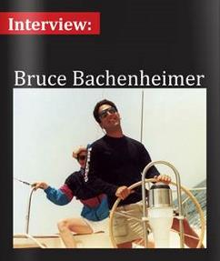

# Print and Internet 2019-Present

  
[Original Link](https://www.sundaymail.co.zw/entrepreneurship-is-a-mindset)  
**Entrepreneurship is a mindset**  
February 21, 2021  
By **Dr Kudzanai Vere**  
> Bruce Bachenheimer, clinical professor of management and executive director of the entrepreneurship laboratory at Pace University, defined entrepreneurship as imagining new ways to solve problems and create value. It is about the ability to recognise and methodically analyse an opportunity and, ultimately capture its value.
>
> I picked five dimensions of an entrepreneurship mindset in Professor Bachenheimer’s sentiments that I will explore.

  
[Original Link](https://www.theladders.com/career-advice/is-the-mba-dead-experts-weigh-in)  
**Is the MBA dead? Experts weigh in**  
February 19, 2021  
By **Ryan Luke**  
> Bruce Bachenheimer, a professor of management at the Lubin School of Business, told USNews, “project-based learning activities in MBA courses allow students to practice solving real business problems. Ultimately, this can help students become more creative thinkers, and this type of education tends to have a lasting impact.”
>
> Bachenheimer continued, “An MBA can be much more than the knowledge and skills acquired through coursework; it can truly expand you and your world.” It’s apparent by the significant increase in MBA enrollment that students believe the MBA program is still alive and relevant.

  
[Original Link](https://www.usnews.com/education/best-graduate-schools/top-business-schools/articles/what-to-know-about-getting-an-mba-during-the-coronavirus-pandemic)  
**Should You Pursue an MBA Amid Coronavirus?**  
June 4, 2020  
By **Ilana Kowarski**  
> 
> Bruce Bachenheimer, a clinical professor of management with the Pace University [Lubin School of Business](https://www.usnews.com/best-graduate-schools/top-business-schools/pace-university-new-york-01309) in New York City, suggests that admitted MBA students account for the type of MBA program they were accepted into when determining whether to enroll or postpone their study plans.
>
> "When considering a top tier MBA program, interactions among one’s cohort, academic and social, is absolutely one of the most valuable aspects of the program and I would recommend deferring admission until traditional classes and regular activities are certain to resume," Bachenheimer wrote in an email. "For other programs, where there is not necessarily a strong cohort model, chancing a semester of remote learning is not as consequential. This would especially be the case for part-time programs."

  
[Original Link](https://www.crainsnewyork.com/op-ed/entrepreneurs-are-sure-find-inspiration-pandemic)  
**Op-Ed: Entrepreneurs are sure to find inspiration in the pandemic**  
April 20, 2020  
By **Bruce Bachenheimer**  
> 
> The great baseball philosopher Yogi Berra once said, "It's difficult to make predictions, especially about the future."
>
> That might sound somewhat inane, but the underlying message is astute: The future is not only unpredictable, it’s unknowable.
>
> Although that is especially true when it comes to human behavior and societal norms—and so many variables are changing the way we teach, learn, worship and socialize these days—we can expect that innovative business concepts will be born out of the Covid-19 crisis.
>
> How do we know?
>
> Entrepreneurship often is associated with some form of disruption, the creation of a significant change in the market. There is perhaps no time more ripe for disruption than during a crisis.
>
> Airbnb and Uber were founded amid the 2008 financial crisis, and they probably would not have succeeded if either was launched a few years earlier—or later, for that matter. Why? Ordinary people would not have been willing to turn their home into a hotel or their car into a taxi absent the financial distress they were facing. Same for customers, who suddenly were willing to sleep in a stranger’s bed and pay for a ride in a regular car.
>
> Once those concepts proved successful, they were able to become parts of the new normal.
>
> We’re seeing emerging trends in meetings, deliveries, production and manufacturing that no doubt will evolve in an era defined by the coronavirus, social distancing and remote working.
>
> It’s important to remember that entrepreneurship is not solely about coming up with an interesting idea; it’s about the passion, persistence and perseverance to actually make it happen. Successful entrepreneurs stay focused on creating solutions that provide value to customers by solving problems and providing benefits.
>
> In these unprecedented times, everyone should bear in mind that entrepreneurship is much broader than the creation of a new business venture. At its core, it is a mindset—a way of thinking and acting. It is about imagining new ways to solve problems and create value.
>
> Fundamentally, entrepreneurship is about the ability to recognize, analyze and ultimately capture the value of an opportunity. Such skills are important for those seeking to establish new ventures. And they’re critical for a variety of professional careers, given today’s hypercompetitive marketplace, where rapid technological innovation and globalization has changed the very nature of work.
>
> Today every institution is facing enormous uncertainty and unique challenges. How are we helping to solve problems and provide benefits to our organizations?
>
> Where might entrepreneurial thinking and innovation play critical roles in dealing with the challenges and uncertainty we are confronting, particularly in the New York metropolitan area? Clearly, one place to start would be dealing with critical supply shortages, from personal protective equipment and medical testing kits to common household supplies and specialized industrial components. Perhaps a transformation of the supply chain and modernized manufacturing will bring new commercial opportunities to our region.
>
> For decades the push has been toward lean manufacturing, with massive economies of scale and just-in-time inventory systems coupled with efficient international supply chains. It has led to globalization and an unrelenting drive toward low-cost manufacturing. That efficiency is not effective when people can’t get items as simple as toilet paper, protective masks and hand sanitizer. When manufacturing is idled due to the inability to source a few key components that were being delivered daily to lower costs by fractions of a percent, that’s not efficient.
>
> When we don’t manufacture critical medical supplies and states are forced to outbid each other with foreign suppliers, that is beyond inefficient and ineffective. The lowest price is irrelevant when there is no supply. There might be a shift from depending on overseas manufacturers and global supply chains to more reliable local alternatives, at least for a number of key industries.
>
> New York is well-positioned to develop new businesses that shift manufacturing from massive to nimble and distribution from scale to flexibility. Our workforce is driven and adaptable, with the spirit to think and act more like committed entrepreneurs than just employees. The shift might even lead to a type of localized industrial revolution, disrupting industries and transforming our systems of management and production. Or just a "locavore" movement for industry.
>
> Whatever happens, making predictions and coming up with ideas won’t solve the challenges we are facing, but innovation and entrepreneurship might.
>
> Remember what Yogi Berra said: "It ain’t over ’til it’s over."
>
> *Bruce Bachenheimer is a clinical professor of management and executive director of the Entrepreneurship Lab at Pace University.*

  
[Original Link](https://link.medium.com/CuDeKUTkw5)  
**Entrepreneurship During the Time of COVID-19**  
April 8, 2020  
By **Bruce Bachenheimer, @PaceUniversity**  
> 
> ***In these unprecedented times, everyone should bear in mind that entrepreneurship is much broader than the creation of a new business venture. At its core, it is a mindset — a way of thinking and acting.***
> 
> *By Bruce Bachenheimer*  
> *Director of the Entrepreneurship Lab, Pace University*
> 
> Entrepreneurship is often associated with some form of disruption, the creation of a significant change in the market. There is perhaps no time more ‘ripe for disruption’ than during a crisis. Airbnb and Uber were founded amid the 2008 financial crisis, and probably would not have succeeded if either was launched a few years earlier or later. Why? Ordinary people would not have been willing to turn their home into a hotel or their car into a taxi absent the financial distress they were facing. Same for customers, who were suddenly willing to sleep in a stranger’s bed and pay for a ride in a regular car. Once these concepts proved successful, they were able to become a new normal.
>
> What innovative business concepts will be born out of the COVID-19 crisis? We’ll have to wait and see. But what’s important to remember is that it’s not about coming up with an interesting idea; it’s about the passion, persistence, and perseverance to actually make it happen.
>
> In these unprecedented times, everyone should bear in mind that entrepreneurship is much broader than the creation of a new business venture. At its core, it is a mindset — a way of thinking and acting. It is about imagining new ways to solve problems and create value. Fundamentally, entrepreneurship is about opportunity; the ability to recognize a new opportunity, to methodically analyze the opportunity, and ultimately, to capture the value of that opportunity. Such skills are important for those seeking to establish new ventures, and critical for a variety of professional careers given today’s hyper-competitive marketplace where rapid technological innovation and globalization has changed the very nature of work.
>
> Today, every institution is facing enormous uncertainty and unique challenges. How are you helping to solve problems and provide benefits for your organization?

  
[Original Link](https://www.wsj.com/articles/new-yorkers-step-up-to-help-mom-and-pop-businesses-11586268001)  
**New Yorkers Step Up to Help Mom-and-Pop Businesses**  
April 7, 2020 (in print on April 8th, Page A12B)  
By **Anne Kadet**  
> 
> Like many New Yorkers, Ms. Struss fears that many mom-and-pop shops won’t survive the shutdown, and she’s determined to help them stay afloat.
> 
> Such concerns aren’t unfounded. Even a well-run small business typically has less than two months of operating capital in reserve, says Bruce Bachenheimer, a management professor at Pace University’s Lubin School of Business.
> 
> The businesses best positioned to survive, meanwhile, are the most creative and flexible outfits, says Mr. Bachenheimer, the Pace professor, citing the example of a pottery studio that recently started assembling and delivering DIY pottery kits to people stuck at home. “Darwin didn’t say it’s the strongest species that survive,” he says. “It’s those that are able to adapt.”
> 
> Still, the Chappaqua, N.Y., resident wants to see local stores stay afloat. To that end, he suggests customers buy gift cards from neighborhood shops and restaurants to use when they reopen, and ask for a credit rather than a refund on services not delivered, such as a canceled catering event.
> 
> It can be for a selfish reason. “If all these stores go out of business, what happens to your neighborhood life and property values?” he asks.

  
[Original Link](https://magazine.boatus.com/publication/?i=645552&ver=html5&p=57)  
**Is Your Boat Still Right For You?**  
February/March 2020  
By **Rich Armstrong**  
>
> **Bachelor Boater No More**
> 
> I started with a Rhodes 22 sailboat that I purchased new in 1989 for daysailing on the Hudson River. In 1990, I purchased a Pearson 36 Cutter, which I lived aboard for several years and sailed from New England through the Caribbean to South America and back to Annapolis, Maryland. Now a family man, I own an Island Packet 27, which I bought in 2016 and use for coastal cruising in Long Island Sound and along the Rhode Island and Massachusetts coasts.
> 
> I went from a daysailer to a bluewater cruiser to now something in the middle. Each change met my lifestyle at different points. Now I typically do two two-week cruises with my family (wife, teenage daughter, and sometimes our dog) and a bunch of shorter/weekend trips — about half of those solo.
> 
> — *Bruce Bachenheimer, New York*

  
[Original Link](https://www.forbes.com/sites/johnhall/2019/12/15/why-we-dont-send-gifts-to-clients-during-the-holidays)  
**Why We Don’t Send Gifts To Clients During The Holidays**  
December 15, 2019  
By **John Hall**  
> 
> **It can send the wrong message to clients and employees.**
> 
> “In the 1980s, you couldn't spend enough money," Bruce Bachenheimer, director of the Entrepreneurship Lab at Pace University in New York, told The Street. "But today clients are saying, 'Forget the hunting trip, forget the lavish treatment — just give me a better price."
> 
> Bachenheimer added, "If you're rolling out the red carpet for a customer, they're going to assume you have incredibly high margins to do all that spending. They're going to think, 'Oh, he's overcharging everyone — including me — in order to afford all this."
> 
> Besides sending the wrong message to clients, it could also anger employees. If you’re going all-in on lavish presents for clients, while your teammates haven’t received a bonus, they’ll question why. Remember, your team can make or break your business. You need to keep your teammates happy and ensure they feel appreciated.

  
[Original Link](https://rightwingeconomics.com/2019/11/12/greatest-economy-ever-small-businesses-forced-to-use-gofundme-to-stay-solvent/)  
**Greatest Economy Ever: Small Businesses Forced To Use GoFundMe To Stay Solvent**  
November 12, 2019  
By **Jordan**  
> 
> Bruce Bachenheimer, a professor at the Lubin School of Business at Pace University, said that the GoFundMe campaigns provide more than just money – they provide reassurance.
>
> After a successful campaign, owners may say “‘I should hang on, I should keep going,’” Bachenheimer concluded.

  
[Original Link](https://www.wsj.com/articles/cash-strapped-small-businesses-turn-to-gofundme-11573304401)  
**Cash-Strapped Small Businesses Turn to GoFundMe**  
November 9, 2019  
By **Kate King**  
> 
> Bruce Bachenheimer, a professor at the Lubin School of Business at Pace University, said even more important than cash is the validation business owners receive from GoFundMe campaigns. Two-thousand customers contributing $20 or $40 each might not be enough to keep a business open, but it can give owners reassurance.
> 
> After a successful GoFundMe campaign, owners might say to themselves, “‘I should hang on, I should keep going,’” Mr. Bachenheimer said.

  
[Original Link](https://www.newsweek.com/ubers-response-california-worker-bill-legal-ploy-that-denies-drivers-fair-deal-experts-say-1459249)  
**Uber's Response to California Worker Bill Is 'Legal Ploy' That Denies Drivers Fair Deal, Experts Say**  
September 13, 2019  
By **Daniel Moritz-Rabson**  
>
>While labor advocates have cheered the law, others have raised concerns that it could be damaging to the flexible schedules of contractor work and thereby limit worker freedom. The legislation will likely have wide-ranging impacts, affecting companies far beyond Lyft and Uber, leading some experts to raise questions about how to improve regulation without being overbearing.
>
>"Is clamping down on this hurting progress and the evolution of the market?" Bruce Bachenheimer, a clinical professor of Management at Pace University said to *Newsweek*.

  
[Original Link](http://www.newsday.com/news/money-fix-crowdfunding-for-investors-1.6496386)  
**Long Beach mattress company's founders regroup - more than once**  
June 9, 2019  
By **Cara Trager**  
>
> According to Bruce Bachenheimer, a clinical management professor and the executive director of the Entrepreneurship Lab at Pace University, enlisting doctors to drive online sales is not a unique marketing approach. Getroman.com, for instance, connects consumers with its online network’s doctors so that they can purchase pharmaceuticals including Viagra.
>
> “For price and convenience, more things are going online,” Bachenheimer said.

  
[Original Link](https://www.usnews.com/education/best-graduate-schools/top-business-schools/articles/2019-05-17/is-an-mba-worth-it-how-to-decide)  
**Is an MBA Worth It? How to Decide**  
May 17, 2019  
By **Ilana Kowarski**  
>
> Bruce Bachenheimer, a clinical professor of management at Pace University's [Lubin School of Business](https://www.usnews.com/best-graduate-schools/top-business-schools/pace-university-new-york-01309) in New York City, says that project-based learning activities in MBA courses allow students to practice solving real business problems. Ultimately, this can help students become more creative thinkers, and he says this type of education tends to have a lasting impact.
>
> Bachenheimer adds that an MBA can offer a formative experience that helps a student shape his or her professional identity. "An MBA can be much more than the knowledge and skills acquired through coursework; it can truly expand you and your world," he wrote in an email.

  
[Original Link](http://canorthamerica.icas.com/may-2019#!/north-america-most-powerful-cities/)  
**North America’s Powerful Cities**  
May 2019  
By **Andrea Murad**  
>
> **Regulations**  
> While regulations can create high expenses for companies, those that go through tremendous regulatory hurdles for the SEC, auditors or other regulatory bodies have higher valuations, because the regulations work to prevent fraud and accurately identify risk.
>
> “What’s a problem is regulations that don’t make sense, but the idea that regulation is hurting business is misunderstood at best,” said Bruce Bachenheimer, Clinical Professor of Management and Executive Director of the Entrepreneurship Lab at Pace University. “Financial regulation will cost companies money in compliance, but the value of their stock is exponentially higher because they comply with that regulation.”
> 
> Regulations do serve to protect businesses and their operations, but they can also prevent innovation. Lobbying for restrictions to maintain the status quo and protect businesses might work for a short period, but then the city will eventually falter, said Bruce.
>
> **Talent**  
> When companies look to establish operations somewhere new, they look at the ability to hire talent to help that business grow. What these companies often look for is the integration of universities and their degree programs into the local ecosystem.
>
> Areas with universities that have programs in AI, robotics and machine learning, for example, attract forward-looking companies.
>
> Talent serves many roles though. Today, the basis for a competitive advantage is innovation in all forms, and the only source of innovation is human talent, said Bruce: “These days with globalization, hyper competition and shorter lifecycles, the only way to survive is with innovation.”

# Print and Internet 2016-2018

  
[Original Link](http://www.money.com)  
**Want to Diversify? Start Here**  
September 2018 (Vol. 47, Issue 7, Page 17 print edition)  
By **Elizabeth O'Brien**  
> "It's important for you to think of yourself as CEO of \[Your Name Here\]," says Bruce Bachenheimer, professor of management at Pace University in Manhattan. No matter what your field, you can put an entrepreneurial mindset to your advantage. Here's what to do:
>
> **\> THINK LIKE A DISRUPTER.**
>
> This attitude is essential, no matter where you work. Think about your industry and how you can help your employer respond to change. Bring those solutions to your bosses and peers.
>
> **\> ADOPT A SIDE HUSTLE.**
>
> Driving for Uber or selling on Etsy are legitimate ways to earn extra cash. (Just don't forget to report that income to the IRS.) You'll want to make sure that your side gig doesn't infringe on your main gig, Bachenheimer says.
>
> **\> MAKE IT OFFICIAL.**
>
> If you have an outside gig that takes off, you'll want to start treating it more like a business and less like a hobby, Bachenheimer says. Also, think about opening a dedicated bank account and setting up the ability to accept credit card payments. If you take your business seriously, your customers and clients will too.

  
[Original Link](https://www.bizjournals.com/newyork/news/2018/05/08/jopwell-helps-track-down-minority-talent.html)  
**Jowell helps track down minority talent**  
April 30, 2018  
By **Gary M. Stern**  
> Bruce Bachenheimer, executive director of the Entrepreneurship Lab at Pace University in New York, said companies are paying increasing attention to hiring minorities with good reason.
> 
> “There is a growing body of research demonstrating that diversity leads to better decisions, performance and profitability,” Bachenheimer said. 
>
> Hiring a diverse staff helps companies boost revenue because it helps companies better reach multicultural consumers, he added.
>
> Bachenheimer suggested that Jopwell can likely carve out a niche in diversity hiring. 
>
> “Companies have to look for talented employees from a variety of sources — not just traditional listings and referrals,” he said.

  
[Original Link](https://www.bizjournals.com/newyork/news/2018/05/08/jopwell-helps-track-down-minority-talent.html)  
**The Origins of Disruptive Technologists®….and their Entrepreneurial Culture in New York City (book)**  
Copyright April 26, 2018  
By **Lauren Keyson**  
> **The Accidental Entrepreneur**
>
> Bruce Bachenheimer, the accidental entrepreneur, is a clinical professor of management and the director of Pace University’s Entrepreneurship Lab. He tells his students that passion is a must for entrepreneurs and that if they don’t yet know what that passion is, they should keep looking. Sometimes it can happen when it’s least expected –and he is a great example of this.
>
> “Passion is very important. When I found a passion for something, whether it was an entrepreneurial venture or something else, it was very important that I pursue it. Where is that passion going to come from? It can come from almost anywhere and at any time. Early on I discovered a passion for Japanese. I found an exchange program and went to college there for a semester. Later, inspired by Thoreau’s Walden, I decided to leave a career on Wall Street and go sailing. And just as Thoreau decided to leave the woods after his path from the cabin to the pond became too worn in, it was time for me to find something else.
>
> “Just over a decade ago I found a passion for teaching and I did whatever it took to get a teaching position without a typical academic background. Examples of my entrepreneurial passion include having started an online financial services company in Australia and a woodworking business in Maryland. With passion it’s very easy to focus all your time and energy and accomplish something.
>
> “When I talk to my students and they don’t know what their passion is, I tell them it’s fine –wait and keep looking, don’t just settle. I lost the desire for my job as a Wall Street trader and was basically just going through the motions. It was exciting and paid a lot of money, but I knew I wanted to do something else, I just didn’t know what at the time. When you don’t have passion, you can’t force it on yourself. I think it’s a mistake. But keep that radar open and try a lot of different things because you never know where your passion will come from. Sometimes that passion can last a lifetime. For me, some things run their course after a couple of years.”[![]

  
[Original Link](https://www.businessnewsdaily.com/7275-entrepreneurship-defined.html)  
**Entrepreneurship Defined: What It Means to Be an Entrepreneur**  
February 19, 2018  
By **Paula Fernandes**  
> 3\. "At its core, \[entrepreneurship\] is a mindset – a way of thinking and acting. It is about **imagining new ways to solve problems and create value**. Fundamentally, entrepreneurship is about ... the ability to recognize \[and\] methodically analyze \[an\] opportunity, and ultimately, to capture \[its\] value."
>
> – Bruce Bachenheimer, clinical professor of management and executive director of the [Entrepreneurship Lab](http://www.elab.nyc/) at Pace University

  
[Original Link](https://www.bizjournals.com/newyork/news/2018/01/23/inside-pymetrics-new-york-office.html)  
**Inside Pymetrics' New York office: Can it make hiring more objective?**  
January 23, 2018  
By **By Gary M. Stern**  
> **The importance of the right hire**
>
> Bruce Bachenheimer, the executive director of the Entrepreneurship Lab at [Pace University](http://companies.bizjournals.com/profile/pace-university/148181/) in New York, underscores the critical role that hiring the right staff plays in a company’s success.
>
> “In this highly-competitive globalized economy, with rapid technological innovation, firms can no longer view HR as ‘finding square pegs for square holes’ based on a standardized job description and qualifications document,” he says.
>
> Moreover, Bachenheimer notes that many companies make quick judgments about resumes, often overlooking appealing candidates who may have graduated from community colleges or lack Ivy League credentials.
>
> “A holistic assessment based on a broad range of cognitive and emotional traits could offer a much more reliable indicator, but would be very difficult, if not impossible, to administer without AI,” he notes.
>
> Nonetheless, Bachenheimer notes that even hiring by AI has its limitations. “AI is not magic,” he says. “It’s computer programming based on algorithms and training sets input by people. Companies creating and using AI must rigorously test results for accuracy and reliability.”

  
[Original Link](https://www.usnews.com/best-graduate-schools/top-business-schools/pace-university-lubin-01309)  
**Inside Pymetrics' New York office: Can it make hiring more objective?**  
January 5, 2018  
By **Ilana Kowarski**  
> **Attending a school with accomplished classmates is valuable**. Experts say it's especially helpful if your classmates have leadership experience in diverse industries.
>
> "While the school’s reputation, ranking and accreditation are obviously extremely important, applicants frequently do not consider just about how vital their peers will be in preparing them for a career in corporate strategy," Bruce Bachenheimer, a clinical professor of management at Pace University's [Lubin School of Business](https://www.usnews.com/best-graduate-schools/top-business-schools/pace-university-lubin-01309), where he teaches both undergraduate and MBA strategy courses, said via email.
>
> Bachenheimer says discussing business strategy case studies with classmates who have a significant amount of work experience can yield insights beyond those given by a strategy professor in a lecture, so strategy MBA applicants should target schools with a seasoned student body, where the average student has several years of work experience.

  
[Original Link](https://www.bizjournals.com/newyork/news/2017/11/28/the-army-navy-store-in-greenwich-village-still.html)  
**The Army/Navy Store in Greenwich Village: Still surviving**  
November 28, 2017  
By **By Gary M. Stern**  
> [Bruce Bachenheimer](https://www.bizjournals.com/newyork/search/results?q=Bruce%20Bachenheimer), executive director of the Entrepreneurship Lab at [Pace University](http://companies.bizjournals.com/profile/pace-university/148181/) in New York, says several factors contributed to the demise of Army and Navy stores. “The U.S. simply hasn’t been creating the amount of surplus it once did,” he says.
>
> While 10 million soldiers fought in the Vietnam War and 16 million in World War II, only 2.5 million served in Afghanistan. And the United States runs online public auctions, which cuts into Army and Navy store sales.
> 
> “The 1950s and 1960s were the heydays of these stores, when they were largely seen as a great place to buy inexpensive camping and hunting gear,” Bachenheimer notes.
>
> Uncle Sam’s has survived for several reasons, Bachenheimer says, including doing a better job of sourcing supplies, becoming a local institution with a loyal following, and via economies of scale with its multiple stores.

  
[Original Link](http://www.expandtheconvo.com/the-book)  
**Expanding the Conversation**  
© 2017  
By **Jaime B. Hansen**  
> At a basic level, entrepreneurship comes down to ventures that turn an idea into a profit. But even that feels like it’s missing something. Entrepreneurship is an umbrella word; it covers so much at one time. In my opinion, Bruce Bachenheimer, a clinical professor of management and executive director of the Entrepreneurship Lab at Pace University, defines it best. He said, “Entrepreneurship is much broader than the creation of a new business venture. At its core, it’s a mindset, a way of thinking and acting.”

  
[Original Link](http://www.bizjournals.com/newyork/news/2017/05/30/shoptiques-growth.html)  
**Shoptiques: Can the websites for independent boutiques keep growing?**  
May 30, 2017  
By **Gary M. Stern**  
> **Thinking like a partner**
> 
> Once a boutique joins the network, Vidisheva expects it to operate and think like a “partner.” While boutiques are permitted to maintain their own site, most don’t.
> 
> Bruce Bachenheimer, executive director of the Entrepreneurship Lab at Pace University in New York, said Shoptiques’ rapid growth suggests that it “must be offering the boutiques it serves a real value proposition.” Moreover, exclusivity with Shoptiques provides an “ability to participate in the network, which should provide additional revenue,” he noted.
> 
> However, its growth has its pitfalls. If shoppers sense that by entering Shoptiques it’s “just being directed through a conglomerated chain of stores rather than discovering a special boutique,” it could lose its charm and pizzazz.
> 
> Hence Bachenheimer concluded, “If they can successfully consolidate this fragmented market segment, they will likely build a profitable and scalable business.” But in order to sustain their dominant position, Shoptiques must “develop a distinct and trusted brand that is widely recognized by boutiques and shoppers,” he said.

  
[Original Link](http://www.heraldtribune.com/news/20170327/do-you-have-what-it-takes-to-be-successful-leader)  
**Do you have what it takes to be a successful leader?**  
March 27, 2017  
By **Dennis Zink**  
> Being a good leader will have a lot to do with your success. But how do you measure it?
> 
> As Bruce Bachenheimer of Pace University says, "A definition of a leader is someone with followers. The top quality of a leader is the ability to attract top-quality followers."

  
[Original Link](http://www.bizjournals.com/newyork/news/2017/02/13/this-indian-restaurateur-owns-5-eateries-including.html)  
**This Indian restaurateur owns 5 eateries, including 3 in Curry Hill**  
February 13, 2017  
By **Gary M. Stern**  
> **Expansion challenges**
>
> Many independent retail stores including Chinese restaurants, barber shops and nail salons haven’t “effectively developed a business model to consolidate these fragmented industries,” explained Bruce Bachenheimer, executive director of the Entrepreneurial Lab at Pace University in New York. “The most common reason behind consolidation is economies of scale,” he said.
>
> Moreover, he noted the restaurant business is challenging for individual entrepreneurs to expand. “The restaurant business is extremely competitive and subject to numerous trends and fads. It’s hard enough to manage one, much more complex to keep five thriving,” pointed out Bachenheimer.
>
> Sustaining a loyal staff is another hurdle. “Aside from external factors such as competition and changing trends, high employee turnover is a challenge, attracting, retaining and motivating staff is difficult,” he asserted.
>
> Having several eateries in one location is a way to attract, not discourage, more patrons. “Think about Chinatown or Little Italy,” Bachenheimer pointed out. “Larger numbers of people are interested in going there than would otherwise go to multiple diverse locations,” he said.

  
[Original Link](http://www.computerworld.com/article/3158797/it-careers/obamacare-repeal-could-hurt-the-gig-economy.html)  
**Obamacare repeal could hurt the gig economy**  
January 18, 2017  
By **Patrick Thibodeau**  
> Older workers, said Bruce Bachenheimer, a professor of management and executive director of the Entrepreneurship Lab at Pace University, need health insurance. These are workers with the industry experience, contacts and ability to start a business. But access to health insurance, especially if they or a family member could be turned down because of a pre-existing condition, can play a major role in whether or not to start a business.

  
[Original Link](http://fortune.com/2016/12/20/amazons-echo-snag-entrepreneurs)  
**What Amazon’s Echo Snag Can Teach Entrepreneurs**  
December 20, 2016  
By **Jeremy Quittner**  
> There’s a lesson here for businesses much smaller than Amazon: You need to be diligent about your supply chain, particularly during the holidays.
>
> “This is why it is so important for small-business owners to stay close to their customers, maintain strong relationships with suppliers, follow market trends, and really know their industry,” says Bruce Bachenheimer, a clinical professor of management at Pace University in New York. “They cannot simply rely on the recommendations of a sales rep and act as stock keepers or inventory managers.”

  
[Original Link](http://fortune.com/2016/09/30/small-chain-chipotle)  
**What It Will Take for This Fast-Growing Chain to Become the Next Chipotle**  
September 30, 2016  
By **Jeremy Quittner**  
> But expanding any restaurant beyond its home turf comes with challenges. For one, the U.S. is an enormous market, and what has worked well in Texas may not succeed as well in other regions.
>
> “They will need really qualified people who know logistics and strategy and how to run a restaurant in the New York region,” says Bruce Bachenheimer, clinical professor of management and director of the Entrepreneurship Lab at Pace University.

  
[Original Link](http://enterprisectr.org/steps-starting-successful-business)  
**Steps to Starting a Successful Business**  
September 13, 2016  
By **Mike Sperling**  
> *Plan, Plan, Plan* – “Planning carefully before launching a new business is not limited to preparing a business plan”, says Bruce Bachenheimer, clinical professor of management and director of the Entrepreneurship Lab at Pace University in New York City. While writing a business plan is certainly helpful, the real value is not in having the finished product in hand, but rather in the process of researching and thinking about your business in a systematic way.

  
[Original Link](http://www.bizjournals.com/newyork/news/2016/09/02/how-this-entrepreneur-took-a-two-wheeled-problem.html)  
**How this entrepreneur took a two-wheeled problem and created a fashion business**  
September 2, 2016  
By **Gary M. Stern**  
> Targeting a niche audience is one way for start-ups to make a dent in the marketplace, explains Bruce Bachenheimer, the executive director of the Entrepreneurship Lab at Pace University in New York. “Understanding who your customer is, what their unmet needs are, and whether your products actually meet those needs requires a great deal of customer contact, testing and product iteration,” he says.
>
> Bachenheimer says Tandem NY could employ several strategies to grow but best bets are “increasing their online sales, which likely provides the best margins, and expanding the number and size of retailers.”

  
[Original Link](http://thriveorjustsurvive.com/stand-out-with-an-entrepreneurial-mindset)  
**Stand Out with an Entrepreneurial Mindset**  
August 5, 2016  
By **Neal Spencer**  
> **What Is an Entrepreneur, Anyway?**
>
> Is it the Silicon Valley tech genius? The Wall Street hotshot? That neighbor who owns the gift shop down the block?
>
> Being an entrepreneur is about much more than starting a business, or even whether you’re “the boss.” Bruce Bachenheimer, who leads the Entrepreneurship Lab at Pace University, defines entrepreneurship as a **mindset**. It’s about **imagining new ways to solve problems and create value**.

  
[Original Link](http://tedxhyderabad.com/on-your-own-entrepreneur)  
**On Your Own ‘Entrepreneur’**  
July 28, 2016  
By **Kavya Krishna**  
> The word ‘**Entrepreneur**’ is derived from the French word ‘**Entrependre**’ which means ‘**the one who undertakes**’ i.e. the individuals who take the risk of starting a new enterprise/startup/business.
>
> Bruce Bachenheimer, a clinical professor of management and executive director of the Entrepreneurship Lab at Pace University explains, — *“Entrepreneurship is much broader than the creation of a new business venture. At its core, it is a mind-set — a way of thinking and acting. It is about imagining new ways to solve problems and create value.”*

  
[Original Link](http://www.post-gazette.com/in-the-lead/itl-2016-companies/2016/05/27/Commentary-Len-Boselovic-Companies-make-up-then-break-up/stories/201605270027)  
**Companies make up, then break up**  
May 27, 2016  
By **Len Boselovic**  
> After spending billions on acquisitions that stoked its downstream business of making parts for the aerospace, automotive and other markets, Alcoa will spin the unit off into a new company, Arconic, later this year. The thinking: investors are not putting a high enough price tag on Arconic’s fast-growing downstream operations because they perceive Alcoa to be a commodity aluminum producer plagued by global overcapacity and depressed metals prices.
>
> “It’s hard for investors to get excited about that, particularly when commodities prices are falling,” said Bruce Bachenheimer, executive director of Pace University’s Entrepreneurship Lab.
>
> Those challenges notwithstanding, Mr. Bachenheimer believes corporate divorces are generally more productive than marriages. He said that too often companies pursue a merger or acquisition for the wrong reason: to grow just for the sake of growing.
>
> “Spinoffs are generally done for the right reason and do work,” he said.

  
[Original Link](http://www.inc.com/jeremy-quittner/krispy-kreme-goes-private-to-rebuild-brand-cachet.html)  
**Why Some Companies--No Matter How Successful--Should Stay Private**  
May 9, 2016  
By **Jeremy Quittner**  
> Freed from the demands of public market investors who tend to focus on short-term returns, some companies may find renewed life that harks back to when they were small and privately held, business experts say. They can strengthen their brands, double down in the communities in which they operate, and get back to their roots as innovators.
>
> "\[Krispy Kreme\] could take an approach to the business that is more family-friendly and more small-business friendly when you don't have the pressure of quarterly returns," says Bruce Bachenheimer, a clinical professor of management at Pace University in New York.
>
> It's not inconceivable that Krispy Kreme would go public again, Bachenheimer says, as time off the public market can increase the company's cachet and value.
>
> "For the employees and for the primary stakeholders, the distributors and retailers they are associated with, it could be taking a smaller business, longer-term approach" that could help increase the brand's value, Bachenheimer says.

  
[Original Link](http://www.inc.com/jeremy-quittner/olive-garden-battle-over-breadsticks-a-big-lesson-on-managing-small-stuff.html)  
**Why Some Companies--No Matter How Successful--Should Stay Private**  
April 6, 2016  
By **Jeremy Quittner**  
> While Olive Garden is a giant chain, its lessons could be instructive to small business owners. Namely, you should indeed sweat the small stuff, because even minor details akin to a free bread policy can make a big difference to your bottom line.
>
> "When you talk about a company or an industry with very thin margins, tiny changes can have an enormous impact," says Bruce Bachenheimer, a clinical professor of management at Pace University.
>
> The history of business is filled with second chances stemming from minor changes. Many years ago, the company that produces Angostura bitters doubled its sales by widening the size of its bottle opening, which caused consumers to pour more into their drinks. Bachenheimer says. Similarly, some gyms have gotten a revenue boost in recent years simply by adding kettlebells, which tend to appeal to a wider spectrum of gym-goers than traditional dumbbells.
>
> Test changes to products and price points with a limited set of customers, for example, and for a limited amount of time to see how it goes, experts say.
>
> "Call it A/B testing," Bachenheimer says. "It's a nice way to try things on an experimental basis and to measure the results, but not suffer huge consequences if it's not successful."

  
[Original Link](http://www.businessnewsdaily.com/2642-entrepreneurship.html)  
**What is Entrepreneurship?**  
March 21, 2016  
By **Paula Fernandes**  
> "Entrepreneurship is much broader than the creation of a new business venture," added Bruce Bachenheimer, a clinical professor of management and executive director of the Entrepreneurship Lab at Pace University. "At its core, it is a mind-set — a way of thinking and acting. It is about imagining new ways to solve problems and create value."
>
> **Be passionate.** Successful entrepreneurs are driven primarily by a need for achievement and the desire to make a meaningful difference, Bachenheimer said. "The most important traits are passion and persistence, but these must not be confused with arrogance and stubbornness," he said.

  
[Original Link](http://www.inc.com/jeremy-quittner/four-important-traits-the-fastest-growing-startups-all-share.html)  
**4 Moves You Must Make to Create a Billion-Dollar Company**  
March 7, 2016  
By **Jeremy Quittner**  
> Still, some of the findings may be cause for skepticism. [Bruce Bachenheimer](http://thehill.com/blogs/congress-blog/economy-budget/242132-us-must-support-new-entrepreneurial-ventures-to-create), a clinical professor of management at Pace University, disagrees with the point about shorter, non-local names, calling it a red herring. One example of a company that grew from startup phase to gargantuan proportions is Sun Microsystems, whose name, he points out, originally stood for Stanford University Network. And, he says, filing for a patent early on could work against a company because it can be expensive to file for one, or costly to defend against infringement claims.
>
> Bachenheimer agrees with the researchers that the [economic environment](http://www.inc.com/jeremy-quittner/milstein-commission-and-salvaging-the-american-dream.html) has changed dramatically for entrepreneurs, making it much more difficult for young companies to form and grow. One key reason is the decimation of savings and home ownership rates, which both provided much-needed financing to startups in prior decades.
>
> "\[The declining rate of entrepreneurship\] has to do with the financial crisis, wage stagnation, and housing price declines since 2008, and it has to do with the erosion of the middle class," Bachenheimer says.

  
[Original Link](http://westfaironline.com/77871/age-old-profession-of-accounting-changing-with-the-economy/)  
**Age-old profession of accounting changing with the economy**  
March 4, 2016  
By **Reece Alvarez**  
> The perception of desirability and loyalty to the old-guard of corporations is waning and being replaced with the innovative spirit of the entrepreneur, said Bruce Bachenheimer, clinical professor of management at Pace University and executive director of the school’s entrepreneurship lab.
>
> “A very large percentage of students say they are interested in starting their own company or working at a startup as opposed to the previous generation before, where the goal was to get a job with a big name company,” he said. “Partially that is because of all the changes we have seen in the economy, but also these students have seen their parents laid-off and unemployed and looking for other work, so I think there has been a shift in the mentality.”
>
> In the world of entrepreneurs, the role of accounting has moved beyond bookkeeping to one of critical importance as a strategic role in a company’s positioning for future growth, he said.
>
> Startups looking to raise outside funds from angel and venture investors or who have their eyes on going public or being acquired must manage their books in a tactical way from the get-go, he said.
>
> “The last thing you want to do when you are looking to raise angel money, venture capital money and then ultimately to be acquired or to do an IPO is to have backwards books where you really didn’t know what you were doing and kept a bunch of receipts in a shoebox,” he said.

  
[Original Link](http://pleasantville.dailyvoice.com/schools/pace-people-this-week-bachenheimer-featured-on-south-korean-tv/624833)  
**Pace People This Week: Bachenheimer Featured On South Korean TV**  
February 17, 2016  
By **John Haffey**  
>  Bruce Bachenheimer was featured on South Korea's national public television station to discuss New York's growing 'Silicon Alley'. Photo Credit: *Pace*
>
> Pace Clinical Professor of Management and Executive Director of the schools' Entrepreneurship Lab, **Bruce Bachenheimer**, was interviewed about NYC's burgeoning 'Silicon Alley' on KBS Channel 1, South Korea's national public television station. Click [here](http://www.ondemandkorea.com/global-talk-show-cosmopolitan-e40.html) to watch his interview. The 'Silicon Alley' segment starts at 19:50 and Bachenheimer appears at 22:58.

  
[Original Link](http://www.inc.com/jeremy-quittner/small-health-care-cooperatives-could-follow-large-company-coalition.html)  
**Here's How Health Care Could Get Cheaper in 2016**  
February 5, 2016  
By **Jeremy Quittner**  
> Small companies currently have access to a federal exchange, called SHOP, that leverages their combined purchasing heft to buy plans. But the large company model could percolate down to create an additional option for entrepreneurs.
>
> "What's interesting for small businesses is that similar pools could come from trade unions and trade guilds and business associations," says Bruce Bachenheimer, a professor of clinical management at Pace University. In addition to small companies banding together, Bachenheimer adds that other types of pools also could form, for example within the growing ranks of the self-employed in the so-called gig economy, represented by Uber and TaskRabbit. Even startups that bring together entrepreneurs, such as WeWork, could also present large pooling opportunities.
>
> There are concerns about the sensitivity of data that companies exchange and how they use it, Bachenheimer says, as well as whether these pools will really provide cost savings, as the WSJ suggests. Further, regional nonprofit co-ops that have relied on more limited networks of health care providers have struggled to remain solvent over the years, in large part because they have attracted a preponderance of older workers who need more care.
>
> Yet cooperative networks that service startups would tend to have younger workers, and could have a better chance.
>
> "It will never make economic sense until younger, healthier employees join in," says Bachenheimer. "These plans could be catered to young, tech workers."

  
[Original Link](http://creativeroom4talk.com/interview-bruce-bachenheimer)  
**Interview: Bruce Bachenheimer**  
January 28, 2016  
> 
>
> Professor Bruce Bachenheimer was interviewed in the February 2016 issue of Creativeroom4talk, an international magazine for communications & creativity. The digital magazine (Issue 10) is available at:[http://bit.ly/InterviewBB](http://bit.ly/InterviewBB).
>
> *An excerpt of the interview:*
> 
> **A recommendation for those who think about starting and running a creative business?**
> 
> Determine what is really important to you. Not what others would define as important or something that would make you successful, but what you are truly passionate about.
>
> **What is the most important thing in a workplace/studio for you?**
>
> Independence. I will work towards institutional goals and within organizational boundaries, but want the freedom and flexibility to pursue a creative path autonomously.
> 
> **What is the nicest compliment you’ve received for your creative work, and from whom?**
> 
> A former professor of mine wrote: “In Hindu tradition, the greatest guru (teacher) is one whose shishya (student) surpasses the guru. By that criterion, I am the greatest guru, and very proud of you!”
> 
> **Who is your professional role model/inspiration?**
> 
> Professors that come to mind include Randy Pausch (Carnegie Mellon University) and Walter Lewin (MIT).
> 
> **How would you describe your work style (academic field or fashion style, or both, or something entirely different)?**
> 
> I like to teach by revealing a path to discovery. I try to be empathetic and engaging, but have little patience for apathetic dolts.
> 
> **What inspires you?**
> 
> That continuous learning is a job requirement and inspiring others to learn is the most important aspect of my job.
