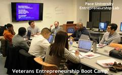
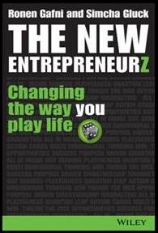
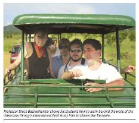

# Print and Internet 2019-Present

  
[Original Link](https://www.sundaymail.co.zw/entrepreneurship-is-a-mindset)  
**Entrepreneurship is a mindset**  
February 21, 2021  
By **Dr Kudzanai Vere**  
> Bruce Bachenheimer, clinical professor of management and executive director of the entrepreneurship laboratory at Pace University, defined entrepreneurship as imagining new ways to solve problems and create value. It is about the ability to recognise and methodically analyse an opportunity and, ultimately capture its value.
>
> I picked five dimensions of an entrepreneurship mindset in Professor Bachenheimer’s sentiments that I will explore.

  
[Original Link](https://www.theladders.com/career-advice/is-the-mba-dead-experts-weigh-in)  
**Is the MBA dead? Experts weigh in**  
February 19, 2021  
By **Ryan Luke**  
> Bruce Bachenheimer, a professor of management at the Lubin School of Business, told USNews, “project-based learning activities in MBA courses allow students to practice solving real business problems. Ultimately, this can help students become more creative thinkers, and this type of education tends to have a lasting impact.”
>
> Bachenheimer continued, “An MBA can be much more than the knowledge and skills acquired through coursework; it can truly expand you and your world.” It’s apparent by the significant increase in MBA enrollment that students believe the MBA program is still alive and relevant.

  
[Original Link](https://www.usnews.com/education/best-graduate-schools/top-business-schools/articles/what-to-know-about-getting-an-mba-during-the-coronavirus-pandemic)  
**Should You Pursue an MBA Amid Coronavirus?**  
June 4, 2020  
By **Ilana Kowarski**  
> 
> Bruce Bachenheimer, a clinical professor of management with the Pace University [Lubin School of Business](https://www.usnews.com/best-graduate-schools/top-business-schools/pace-university-new-york-01309) in New York City, suggests that admitted MBA students account for the type of MBA program they were accepted into when determining whether to enroll or postpone their study plans.
>
> "When considering a top tier MBA program, interactions among one’s cohort, academic and social, is absolutely one of the most valuable aspects of the program and I would recommend deferring admission until traditional classes and regular activities are certain to resume," Bachenheimer wrote in an email. "For other programs, where there is not necessarily a strong cohort model, chancing a semester of remote learning is not as consequential. This would especially be the case for part-time programs."

  
[Original Link](https://www.crainsnewyork.com/op-ed/entrepreneurs-are-sure-find-inspiration-pandemic)  
**Op-Ed: Entrepreneurs are sure to find inspiration in the pandemic**  
April 20, 2020  
By **Bruce Bachenheimer**  
> 
> The great baseball philosopher Yogi Berra once said, "It's difficult to make predictions, especially about the future."
>
> That might sound somewhat inane, but the underlying message is astute: The future is not only unpredictable, it’s unknowable.
>
> Although that is especially true when it comes to human behavior and societal norms—and so many variables are changing the way we teach, learn, worship and socialize these days—we can expect that innovative business concepts will be born out of the Covid-19 crisis.
>
> How do we know?
>
> Entrepreneurship often is associated with some form of disruption, the creation of a significant change in the market. There is perhaps no time more ripe for disruption than during a crisis.
>
> Airbnb and Uber were founded amid the 2008 financial crisis, and they probably would not have succeeded if either was launched a few years earlier—or later, for that matter. Why? Ordinary people would not have been willing to turn their home into a hotel or their car into a taxi absent the financial distress they were facing. Same for customers, who suddenly were willing to sleep in a stranger’s bed and pay for a ride in a regular car.
>
> Once those concepts proved successful, they were able to become parts of the new normal.
>
> We’re seeing emerging trends in meetings, deliveries, production and manufacturing that no doubt will evolve in an era defined by the coronavirus, social distancing and remote working.
>
> It’s important to remember that entrepreneurship is not solely about coming up with an interesting idea; it’s about the passion, persistence and perseverance to actually make it happen. Successful entrepreneurs stay focused on creating solutions that provide value to customers by solving problems and providing benefits.
>
> In these unprecedented times, everyone should bear in mind that entrepreneurship is much broader than the creation of a new business venture. At its core, it is a mindset—a way of thinking and acting. It is about imagining new ways to solve problems and create value.
>
> Fundamentally, entrepreneurship is about the ability to recognize, analyze and ultimately capture the value of an opportunity. Such skills are important for those seeking to establish new ventures. And they’re critical for a variety of professional careers, given today’s hypercompetitive marketplace, where rapid technological innovation and globalization has changed the very nature of work.
>
> Today every institution is facing enormous uncertainty and unique challenges. How are we helping to solve problems and provide benefits to our organizations?
>
> Where might entrepreneurial thinking and innovation play critical roles in dealing with the challenges and uncertainty we are confronting, particularly in the New York metropolitan area? Clearly, one place to start would be dealing with critical supply shortages, from personal protective equipment and medical testing kits to common household supplies and specialized industrial components. Perhaps a transformation of the supply chain and modernized manufacturing will bring new commercial opportunities to our region.
>
> For decades the push has been toward lean manufacturing, with massive economies of scale and just-in-time inventory systems coupled with efficient international supply chains. It has led to globalization and an unrelenting drive toward low-cost manufacturing. That efficiency is not effective when people can’t get items as simple as toilet paper, protective masks and hand sanitizer. When manufacturing is idled due to the inability to source a few key components that were being delivered daily to lower costs by fractions of a percent, that’s not efficient.
>
> When we don’t manufacture critical medical supplies and states are forced to outbid each other with foreign suppliers, that is beyond inefficient and ineffective. The lowest price is irrelevant when there is no supply. There might be a shift from depending on overseas manufacturers and global supply chains to more reliable local alternatives, at least for a number of key industries.
>
> New York is well-positioned to develop new businesses that shift manufacturing from massive to nimble and distribution from scale to flexibility. Our workforce is driven and adaptable, with the spirit to think and act more like committed entrepreneurs than just employees. The shift might even lead to a type of localized industrial revolution, disrupting industries and transforming our systems of management and production. Or just a "locavore" movement for industry.
>
> Whatever happens, making predictions and coming up with ideas won’t solve the challenges we are facing, but innovation and entrepreneurship might.
>
> Remember what Yogi Berra said: "It ain’t over ’til it’s over."
>
> *Bruce Bachenheimer is a clinical professor of management and executive director of the Entrepreneurship Lab at Pace University.*

  
[Original Link](https://link.medium.com/CuDeKUTkw5)  
**Entrepreneurship During the Time of COVID-19**  
April 8, 2020  
By **Bruce Bachenheimer, @PaceUniversity**  
> 
> ***In these unprecedented times, everyone should bear in mind that entrepreneurship is much broader than the creation of a new business venture. At its core, it is a mindset — a way of thinking and acting.***
> 
> *By Bruce Bachenheimer*  
> *Director of the Entrepreneurship Lab, Pace University*
> 
> Entrepreneurship is often associated with some form of disruption, the creation of a significant change in the market. There is perhaps no time more ‘ripe for disruption’ than during a crisis. Airbnb and Uber were founded amid the 2008 financial crisis, and probably would not have succeeded if either was launched a few years earlier or later. Why? Ordinary people would not have been willing to turn their home into a hotel or their car into a taxi absent the financial distress they were facing. Same for customers, who were suddenly willing to sleep in a stranger’s bed and pay for a ride in a regular car. Once these concepts proved successful, they were able to become a new normal.
>
> What innovative business concepts will be born out of the COVID-19 crisis? We’ll have to wait and see. But what’s important to remember is that it’s not about coming up with an interesting idea; it’s about the passion, persistence, and perseverance to actually make it happen.
>
> In these unprecedented times, everyone should bear in mind that entrepreneurship is much broader than the creation of a new business venture. At its core, it is a mindset — a way of thinking and acting. It is about imagining new ways to solve problems and create value. Fundamentally, entrepreneurship is about opportunity; the ability to recognize a new opportunity, to methodically analyze the opportunity, and ultimately, to capture the value of that opportunity. Such skills are important for those seeking to establish new ventures, and critical for a variety of professional careers given today’s hyper-competitive marketplace where rapid technological innovation and globalization has changed the very nature of work.
>
> Today, every institution is facing enormous uncertainty and unique challenges. How are you helping to solve problems and provide benefits for your organization?

  
[Original Link](https://www.wsj.com/articles/new-yorkers-step-up-to-help-mom-and-pop-businesses-11586268001)  
**New Yorkers Step Up to Help Mom-and-Pop Businesses**  
April 7, 2020 (in print on April 8th, Page A12B)  
By **Anne Kadet**  
> 
> Like many New Yorkers, Ms. Struss fears that many mom-and-pop shops won’t survive the shutdown, and she’s determined to help them stay afloat.
> 
> Such concerns aren’t unfounded. Even a well-run small business typically has less than two months of operating capital in reserve, says Bruce Bachenheimer, a management professor at Pace University’s Lubin School of Business.
> 
> The businesses best positioned to survive, meanwhile, are the most creative and flexible outfits, says Mr. Bachenheimer, the Pace professor, citing the example of a pottery studio that recently started assembling and delivering DIY pottery kits to people stuck at home. “Darwin didn’t say it’s the strongest species that survive,” he says. “It’s those that are able to adapt.”
> 
> Still, the Chappaqua, N.Y., resident wants to see local stores stay afloat. To that end, he suggests customers buy gift cards from neighborhood shops and restaurants to use when they reopen, and ask for a credit rather than a refund on services not delivered, such as a canceled catering event.
> 
> It can be for a selfish reason. “If all these stores go out of business, what happens to your neighborhood life and property values?” he asks.

  
[Original Link](https://magazine.boatus.com/publication/?i=645552&ver=html5&p=57)  
**Is Your Boat Still Right For You?**  
February/March 2020  
By **Rich Armstrong**  
>
> **Bachelor Boater No More**
> 
> I started with a Rhodes 22 sailboat that I purchased new in 1989 for daysailing on the Hudson River. In 1990, I purchased a Pearson 36 Cutter, which I lived aboard for several years and sailed from New England through the Caribbean to South America and back to Annapolis, Maryland. Now a family man, I own an Island Packet 27, which I bought in 2016 and use for coastal cruising in Long Island Sound and along the Rhode Island and Massachusetts coasts.
> 
> I went from a daysailer to a bluewater cruiser to now something in the middle. Each change met my lifestyle at different points. Now I typically do two two-week cruises with my family (wife, teenage daughter, and sometimes our dog) and a bunch of shorter/weekend trips — about half of those solo.
> 
> — *Bruce Bachenheimer, New York*

  
[Original Link](https://www.forbes.com/sites/johnhall/2019/12/15/why-we-dont-send-gifts-to-clients-during-the-holidays)  
**Why We Don’t Send Gifts To Clients During The Holidays**  
December 15, 2019  
By **John Hall**  
> 
> **It can send the wrong message to clients and employees.**
> 
> “In the 1980s, you couldn't spend enough money," Bruce Bachenheimer, director of the Entrepreneurship Lab at Pace University in New York, told The Street. "But today clients are saying, 'Forget the hunting trip, forget the lavish treatment — just give me a better price."
> 
> Bachenheimer added, "If you're rolling out the red carpet for a customer, they're going to assume you have incredibly high margins to do all that spending. They're going to think, 'Oh, he's overcharging everyone — including me — in order to afford all this."
> 
> Besides sending the wrong message to clients, it could also anger employees. If you’re going all-in on lavish presents for clients, while your teammates haven’t received a bonus, they’ll question why. Remember, your team can make or break your business. You need to keep your teammates happy and ensure they feel appreciated.

  
[Original Link](https://rightwingeconomics.com/2019/11/12/greatest-economy-ever-small-businesses-forced-to-use-gofundme-to-stay-solvent/)  
**Greatest Economy Ever: Small Businesses Forced To Use GoFundMe To Stay Solvent**  
November 12, 2019  
By **Jordan**  
> 
> Bruce Bachenheimer, a professor at the Lubin School of Business at Pace University, said that the GoFundMe campaigns provide more than just money – they provide reassurance.
>
> After a successful campaign, owners may say “‘I should hang on, I should keep going,’” Bachenheimer concluded.

  
[Original Link](https://www.wsj.com/articles/cash-strapped-small-businesses-turn-to-gofundme-11573304401)  
**Cash-Strapped Small Businesses Turn to GoFundMe**  
November 9, 2019  
By **Kate King**  
> 
> Bruce Bachenheimer, a professor at the Lubin School of Business at Pace University, said even more important than cash is the validation business owners receive from GoFundMe campaigns. Two-thousand customers contributing $20 or $40 each might not be enough to keep a business open, but it can give owners reassurance.
> 
> After a successful GoFundMe campaign, owners might say to themselves, “‘I should hang on, I should keep going,’” Mr. Bachenheimer said.

  
[Original Link](https://www.newsweek.com/ubers-response-california-worker-bill-legal-ploy-that-denies-drivers-fair-deal-experts-say-1459249)  
**Uber's Response to California Worker Bill Is 'Legal Ploy' That Denies Drivers Fair Deal, Experts Say**  
September 13, 2019  
By **Daniel Moritz-Rabson**  
>
>While labor advocates have cheered the law, others have raised concerns that it could be damaging to the flexible schedules of contractor work and thereby limit worker freedom. The legislation will likely have wide-ranging impacts, affecting companies far beyond Lyft and Uber, leading some experts to raise questions about how to improve regulation without being overbearing.
>
>"Is clamping down on this hurting progress and the evolution of the market?" Bruce Bachenheimer, a clinical professor of Management at Pace University said to *Newsweek*.

  
[Original Link](http://www.newsday.com/news/money-fix-crowdfunding-for-investors-1.6496386)  
**Long Beach mattress company's founders regroup - more than once**  
June 9, 2019  
By **Cara Trager**  
>
> According to Bruce Bachenheimer, a clinical management professor and the executive director of the Entrepreneurship Lab at Pace University, enlisting doctors to drive online sales is not a unique marketing approach. Getroman.com, for instance, connects consumers with its online network’s doctors so that they can purchase pharmaceuticals including Viagra.
>
> “For price and convenience, more things are going online,” Bachenheimer said.

  
[Original Link](https://www.usnews.com/education/best-graduate-schools/top-business-schools/articles/2019-05-17/is-an-mba-worth-it-how-to-decide)  
**Is an MBA Worth It? How to Decide**  
May 17, 2019  
By **Ilana Kowarski**  
>
> Bruce Bachenheimer, a clinical professor of management at Pace University's [Lubin School of Business](https://www.usnews.com/best-graduate-schools/top-business-schools/pace-university-new-york-01309) in New York City, says that project-based learning activities in MBA courses allow students to practice solving real business problems. Ultimately, this can help students become more creative thinkers, and he says this type of education tends to have a lasting impact.
>
> Bachenheimer adds that an MBA can offer a formative experience that helps a student shape his or her professional identity. "An MBA can be much more than the knowledge and skills acquired through coursework; it can truly expand you and your world," he wrote in an email.

  
[Original Link](http://canorthamerica.icas.com/may-2019#!/north-america-most-powerful-cities/)  
**North America’s Powerful Cities**  
May 2019  
By **Andrea Murad**  
>
> **Regulations**  
> While regulations can create high expenses for companies, those that go through tremendous regulatory hurdles for the SEC, auditors or other regulatory bodies have higher valuations, because the regulations work to prevent fraud and accurately identify risk.
>
> “What’s a problem is regulations that don’t make sense, but the idea that regulation is hurting business is misunderstood at best,” said Bruce Bachenheimer, Clinical Professor of Management and Executive Director of the Entrepreneurship Lab at Pace University. “Financial regulation will cost companies money in compliance, but the value of their stock is exponentially higher because they comply with that regulation.”
> 
> Regulations do serve to protect businesses and their operations, but they can also prevent innovation. Lobbying for restrictions to maintain the status quo and protect businesses might work for a short period, but then the city will eventually falter, said Bruce.
>
> **Talent**  
> When companies look to establish operations somewhere new, they look at the ability to hire talent to help that business grow. What these companies often look for is the integration of universities and their degree programs into the local ecosystem.
>
> Areas with universities that have programs in AI, robotics and machine learning, for example, attract forward-looking companies.
>
> Talent serves many roles though. Today, the basis for a competitive advantage is innovation in all forms, and the only source of innovation is human talent, said Bruce: “These days with globalization, hyper competition and shorter lifecycles, the only way to survive is with innovation.”

# Print and Internet 2016-2018

  
[Original Link](http://www.money.com)  
**Want to Diversify? Start Here**  
September 2018 (Vol. 47, Issue 7, Page 17 print edition)  
By **Elizabeth O'Brien**  
> "It's important for you to think of yourself as CEO of \[Your Name Here\]," says Bruce Bachenheimer, professor of management at Pace University in Manhattan. No matter what your field, you can put an entrepreneurial mindset to your advantage. Here's what to do:
>
> **\> THINK LIKE A DISRUPTER.**
>
> This attitude is essential, no matter where you work. Think about your industry and how you can help your employer respond to change. Bring those solutions to your bosses and peers.
>
> **\> ADOPT A SIDE HUSTLE.**
>
> Driving for Uber or selling on Etsy are legitimate ways to earn extra cash. (Just don't forget to report that income to the IRS.) You'll want to make sure that your side gig doesn't infringe on your main gig, Bachenheimer says.
>
> **\> MAKE IT OFFICIAL.**
>
> If you have an outside gig that takes off, you'll want to start treating it more like a business and less like a hobby, Bachenheimer says. Also, think about opening a dedicated bank account and setting up the ability to accept credit card payments. If you take your business seriously, your customers and clients will too.

  
[Original Link](https://www.bizjournals.com/newyork/news/2018/05/08/jopwell-helps-track-down-minority-talent.html)  
**Jowell helps track down minority talent**  
April 30, 2018  
By **Gary M. Stern**  
> Bruce Bachenheimer, executive director of the Entrepreneurship Lab at Pace University in New York, said companies are paying increasing attention to hiring minorities with good reason.
> 
> “There is a growing body of research demonstrating that diversity leads to better decisions, performance and profitability,” Bachenheimer said. 
>
> Hiring a diverse staff helps companies boost revenue because it helps companies better reach multicultural consumers, he added.
>
> Bachenheimer suggested that Jopwell can likely carve out a niche in diversity hiring. 
>
> “Companies have to look for talented employees from a variety of sources — not just traditional listings and referrals,” he said.

  
[Original Link](https://www.bizjournals.com/newyork/news/2018/05/08/jopwell-helps-track-down-minority-talent.html)  
**The Origins of Disruptive Technologists®….and their Entrepreneurial Culture in New York City (book)**  
Copyright April 26, 2018  
By **Lauren Keyson**  
> **The Accidental Entrepreneur**
>
> Bruce Bachenheimer, the accidental entrepreneur, is a clinical professor of management and the director of Pace University’s Entrepreneurship Lab. He tells his students that passion is a must for entrepreneurs and that if they don’t yet know what that passion is, they should keep looking. Sometimes it can happen when it’s least expected –and he is a great example of this.
>
> “Passion is very important. When I found a passion for something, whether it was an entrepreneurial venture or something else, it was very important that I pursue it. Where is that passion going to come from? It can come from almost anywhere and at any time. Early on I discovered a passion for Japanese. I found an exchange program and went to college there for a semester. Later, inspired by Thoreau’s Walden, I decided to leave a career on Wall Street and go sailing. And just as Thoreau decided to leave the woods after his path from the cabin to the pond became too worn in, it was time for me to find something else.
>
> “Just over a decade ago I found a passion for teaching and I did whatever it took to get a teaching position without a typical academic background. Examples of my entrepreneurial passion include having started an online financial services company in Australia and a woodworking business in Maryland. With passion it’s very easy to focus all your time and energy and accomplish something.
>
> “When I talk to my students and they don’t know what their passion is, I tell them it’s fine –wait and keep looking, don’t just settle. I lost the desire for my job as a Wall Street trader and was basically just going through the motions. It was exciting and paid a lot of money, but I knew I wanted to do something else, I just didn’t know what at the time. When you don’t have passion, you can’t force it on yourself. I think it’s a mistake. But keep that radar open and try a lot of different things because you never know where your passion will come from. Sometimes that passion can last a lifetime. For me, some things run their course after a couple of years.”[![]

  
[Original Link](https://www.businessnewsdaily.com/7275-entrepreneurship-defined.html)  
**Entrepreneurship Defined: What It Means to Be an Entrepreneur**  
February 19, 2018  
By **Paula Fernandes**  
> 3\. "At its core, \[entrepreneurship\] is a mindset – a way of thinking and acting. It is about **imagining new ways to solve problems and create value**. Fundamentally, entrepreneurship is about ... the ability to recognize \[and\] methodically analyze \[an\] opportunity, and ultimately, to capture \[its\] value."
>
> – Bruce Bachenheimer, clinical professor of management and executive director of the [Entrepreneurship Lab](http://www.elab.nyc/) at Pace University

  
[Original Link](https://www.bizjournals.com/newyork/news/2018/01/23/inside-pymetrics-new-york-office.html)  
**Inside Pymetrics' New York office: Can it make hiring more objective?**  
January 23, 2018  
By **By Gary M. Stern**  
> **The importance of the right hire**
>
> Bruce Bachenheimer, the executive director of the Entrepreneurship Lab at [Pace University](http://companies.bizjournals.com/profile/pace-university/148181/) in New York, underscores the critical role that hiring the right staff plays in a company’s success.
>
> “In this highly-competitive globalized economy, with rapid technological innovation, firms can no longer view HR as ‘finding square pegs for square holes’ based on a standardized job description and qualifications document,” he says.
>
> Moreover, Bachenheimer notes that many companies make quick judgments about resumes, often overlooking appealing candidates who may have graduated from community colleges or lack Ivy League credentials.
>
> “A holistic assessment based on a broad range of cognitive and emotional traits could offer a much more reliable indicator, but would be very difficult, if not impossible, to administer without AI,” he notes.
>
> Nonetheless, Bachenheimer notes that even hiring by AI has its limitations. “AI is not magic,” he says. “It’s computer programming based on algorithms and training sets input by people. Companies creating and using AI must rigorously test results for accuracy and reliability.”

  
[Original Link](https://www.usnews.com/best-graduate-schools/top-business-schools/pace-university-lubin-01309)  
**Inside Pymetrics' New York office: Can it make hiring more objective?**  
January 5, 2018  
By **Ilana Kowarski**  
> **Attending a school with accomplished classmates is valuable**. Experts say it's especially helpful if your classmates have leadership experience in diverse industries.
>
> "While the school’s reputation, ranking and accreditation are obviously extremely important, applicants frequently do not consider just about how vital their peers will be in preparing them for a career in corporate strategy," Bruce Bachenheimer, a clinical professor of management at Pace University's [Lubin School of Business](https://www.usnews.com/best-graduate-schools/top-business-schools/pace-university-lubin-01309), where he teaches both undergraduate and MBA strategy courses, said via email.
>
> Bachenheimer says discussing business strategy case studies with classmates who have a significant amount of work experience can yield insights beyond those given by a strategy professor in a lecture, so strategy MBA applicants should target schools with a seasoned student body, where the average student has several years of work experience.

  
[Original Link](https://www.bizjournals.com/newyork/news/2017/11/28/the-army-navy-store-in-greenwich-village-still.html)  
**The Army/Navy Store in Greenwich Village: Still surviving**  
November 28, 2017  
By **By Gary M. Stern**  
> [Bruce Bachenheimer](https://www.bizjournals.com/newyork/search/results?q=Bruce%20Bachenheimer), executive director of the Entrepreneurship Lab at [Pace University](http://companies.bizjournals.com/profile/pace-university/148181/) in New York, says several factors contributed to the demise of Army and Navy stores. “The U.S. simply hasn’t been creating the amount of surplus it once did,” he says.
>
> While 10 million soldiers fought in the Vietnam War and 16 million in World War II, only 2.5 million served in Afghanistan. And the United States runs online public auctions, which cuts into Army and Navy store sales.
> 
> “The 1950s and 1960s were the heydays of these stores, when they were largely seen as a great place to buy inexpensive camping and hunting gear,” Bachenheimer notes.
>
> Uncle Sam’s has survived for several reasons, Bachenheimer says, including doing a better job of sourcing supplies, becoming a local institution with a loyal following, and via economies of scale with its multiple stores.

  
[Original Link](http://www.expandtheconvo.com/the-book)  
**Expanding the Conversation**  
© 2017  
By **Jaime B. Hansen**  
> At a basic level, entrepreneurship comes down to ventures that turn an idea into a profit. But even that feels like it’s missing something. Entrepreneurship is an umbrella word; it covers so much at one time. In my opinion, Bruce Bachenheimer, a clinical professor of management and executive director of the Entrepreneurship Lab at Pace University, defines it best. He said, “Entrepreneurship is much broader than the creation of a new business venture. At its core, it’s a mindset, a way of thinking and acting.”

  
[Original Link](http://www.bizjournals.com/newyork/news/2017/05/30/shoptiques-growth.html)  
**Shoptiques: Can the websites for independent boutiques keep growing?**  
May 30, 2017  
By **Gary M. Stern**  
> **Thinking like a partner**
> 
> Once a boutique joins the network, Vidisheva expects it to operate and think like a “partner.” While boutiques are permitted to maintain their own site, most don’t.
> 
> Bruce Bachenheimer, executive director of the Entrepreneurship Lab at Pace University in New York, said Shoptiques’ rapid growth suggests that it “must be offering the boutiques it serves a real value proposition.” Moreover, exclusivity with Shoptiques provides an “ability to participate in the network, which should provide additional revenue,” he noted.
> 
> However, its growth has its pitfalls. If shoppers sense that by entering Shoptiques it’s “just being directed through a conglomerated chain of stores rather than discovering a special boutique,” it could lose its charm and pizzazz.
> 
> Hence Bachenheimer concluded, “If they can successfully consolidate this fragmented market segment, they will likely build a profitable and scalable business.” But in order to sustain their dominant position, Shoptiques must “develop a distinct and trusted brand that is widely recognized by boutiques and shoppers,” he said.

  
[Original Link](http://www.heraldtribune.com/news/20170327/do-you-have-what-it-takes-to-be-successful-leader)  
**Do you have what it takes to be a successful leader?**  
March 27, 2017  
By **Dennis Zink**  
> Being a good leader will have a lot to do with your success. But how do you measure it?
> 
> As Bruce Bachenheimer of Pace University says, "A definition of a leader is someone with followers. The top quality of a leader is the ability to attract top-quality followers."

  
[Original Link](http://www.bizjournals.com/newyork/news/2017/02/13/this-indian-restaurateur-owns-5-eateries-including.html)  
**This Indian restaurateur owns 5 eateries, including 3 in Curry Hill**  
February 13, 2017  
By **Gary M. Stern**  
> **Expansion challenges**
>
> Many independent retail stores including Chinese restaurants, barber shops and nail salons haven’t “effectively developed a business model to consolidate these fragmented industries,” explained Bruce Bachenheimer, executive director of the Entrepreneurial Lab at Pace University in New York. “The most common reason behind consolidation is economies of scale,” he said.
>
> Moreover, he noted the restaurant business is challenging for individual entrepreneurs to expand. “The restaurant business is extremely competitive and subject to numerous trends and fads. It’s hard enough to manage one, much more complex to keep five thriving,” pointed out Bachenheimer.
>
> Sustaining a loyal staff is another hurdle. “Aside from external factors such as competition and changing trends, high employee turnover is a challenge, attracting, retaining and motivating staff is difficult,” he asserted.
>
> Having several eateries in one location is a way to attract, not discourage, more patrons. “Think about Chinatown or Little Italy,” Bachenheimer pointed out. “Larger numbers of people are interested in going there than would otherwise go to multiple diverse locations,” he said.

  
[Original Link](http://www.computerworld.com/article/3158797/it-careers/obamacare-repeal-could-hurt-the-gig-economy.html)  
**Obamacare repeal could hurt the gig economy**  
January 18, 2017  
By **Patrick Thibodeau**  
> Older workers, said Bruce Bachenheimer, a professor of management and executive director of the Entrepreneurship Lab at Pace University, need health insurance. These are workers with the industry experience, contacts and ability to start a business. But access to health insurance, especially if they or a family member could be turned down because of a pre-existing condition, can play a major role in whether or not to start a business.

  
[Original Link](http://fortune.com/2016/12/20/amazons-echo-snag-entrepreneurs)  
**What Amazon’s Echo Snag Can Teach Entrepreneurs**  
December 20, 2016  
By **Jeremy Quittner**  
> There’s a lesson here for businesses much smaller than Amazon: You need to be diligent about your supply chain, particularly during the holidays.
>
> “This is why it is so important for small-business owners to stay close to their customers, maintain strong relationships with suppliers, follow market trends, and really know their industry,” says Bruce Bachenheimer, a clinical professor of management at Pace University in New York. “They cannot simply rely on the recommendations of a sales rep and act as stock keepers or inventory managers.”

  
[Original Link](http://fortune.com/2016/09/30/small-chain-chipotle)  
**What It Will Take for This Fast-Growing Chain to Become the Next Chipotle**  
September 30, 2016  
By **Jeremy Quittner**  
> But expanding any restaurant beyond its home turf comes with challenges. For one, the U.S. is an enormous market, and what has worked well in Texas may not succeed as well in other regions.
>
> “They will need really qualified people who know logistics and strategy and how to run a restaurant in the New York region,” says Bruce Bachenheimer, clinical professor of management and director of the Entrepreneurship Lab at Pace University.

  
[Original Link](http://enterprisectr.org/steps-starting-successful-business)  
**Steps to Starting a Successful Business**  
September 13, 2016  
By **Mike Sperling**  
> *Plan, Plan, Plan* – “Planning carefully before launching a new business is not limited to preparing a business plan”, says Bruce Bachenheimer, clinical professor of management and director of the Entrepreneurship Lab at Pace University in New York City. While writing a business plan is certainly helpful, the real value is not in having the finished product in hand, but rather in the process of researching and thinking about your business in a systematic way.

  
[Original Link](http://www.bizjournals.com/newyork/news/2016/09/02/how-this-entrepreneur-took-a-two-wheeled-problem.html)  
**How this entrepreneur took a two-wheeled problem and created a fashion business**  
September 2, 2016  
By **Gary M. Stern**  
> Targeting a niche audience is one way for start-ups to make a dent in the marketplace, explains Bruce Bachenheimer, the executive director of the Entrepreneurship Lab at Pace University in New York. “Understanding who your customer is, what their unmet needs are, and whether your products actually meet those needs requires a great deal of customer contact, testing and product iteration,” he says.
>
> Bachenheimer says Tandem NY could employ several strategies to grow but best bets are “increasing their online sales, which likely provides the best margins, and expanding the number and size of retailers.”

  
[Original Link](http://thriveorjustsurvive.com/stand-out-with-an-entrepreneurial-mindset)  
**Stand Out with an Entrepreneurial Mindset**  
August 5, 2016  
By **Neal Spencer**  
> **What Is an Entrepreneur, Anyway?**
>
> Is it the Silicon Valley tech genius? The Wall Street hotshot? That neighbor who owns the gift shop down the block?
>
> Being an entrepreneur is about much more than starting a business, or even whether you’re “the boss.” Bruce Bachenheimer, who leads the Entrepreneurship Lab at Pace University, defines entrepreneurship as a **mindset**. It’s about **imagining new ways to solve problems and create value**.

  
[Original Link](http://tedxhyderabad.com/on-your-own-entrepreneur)  
**On Your Own ‘Entrepreneur’**  
July 28, 2016  
By **Kavya Krishna**  
> The word ‘**Entrepreneur**’ is derived from the French word ‘**Entrependre**’ which means ‘**the one who undertakes**’ i.e. the individuals who take the risk of starting a new enterprise/startup/business.
>
> Bruce Bachenheimer, a clinical professor of management and executive director of the Entrepreneurship Lab at Pace University explains, — *“Entrepreneurship is much broader than the creation of a new business venture. At its core, it is a mind-set — a way of thinking and acting. It is about imagining new ways to solve problems and create value.”*

  
[Original Link](http://www.post-gazette.com/in-the-lead/itl-2016-companies/2016/05/27/Commentary-Len-Boselovic-Companies-make-up-then-break-up/stories/201605270027)  
**Companies make up, then break up**  
May 27, 2016  
By **Len Boselovic**  
> After spending billions on acquisitions that stoked its downstream business of making parts for the aerospace, automotive and other markets, Alcoa will spin the unit off into a new company, Arconic, later this year. The thinking: investors are not putting a high enough price tag on Arconic’s fast-growing downstream operations because they perceive Alcoa to be a commodity aluminum producer plagued by global overcapacity and depressed metals prices.
>
> “It’s hard for investors to get excited about that, particularly when commodities prices are falling,” said Bruce Bachenheimer, executive director of Pace University’s Entrepreneurship Lab.
>
> Those challenges notwithstanding, Mr. Bachenheimer believes corporate divorces are generally more productive than marriages. He said that too often companies pursue a merger or acquisition for the wrong reason: to grow just for the sake of growing.
>
> “Spinoffs are generally done for the right reason and do work,” he said.

  
[Original Link](http://www.inc.com/jeremy-quittner/krispy-kreme-goes-private-to-rebuild-brand-cachet.html)  
**Why Some Companies--No Matter How Successful--Should Stay Private**  
May 9, 2016  
By **Jeremy Quittner**  
> Freed from the demands of public market investors who tend to focus on short-term returns, some companies may find renewed life that harks back to when they were small and privately held, business experts say. They can strengthen their brands, double down in the communities in which they operate, and get back to their roots as innovators.
>
> "\[Krispy Kreme\] could take an approach to the business that is more family-friendly and more small-business friendly when you don't have the pressure of quarterly returns," says Bruce Bachenheimer, a clinical professor of management at Pace University in New York.
>
> It's not inconceivable that Krispy Kreme would go public again, Bachenheimer says, as time off the public market can increase the company's cachet and value.
>
> "For the employees and for the primary stakeholders, the distributors and retailers they are associated with, it could be taking a smaller business, longer-term approach" that could help increase the brand's value, Bachenheimer says.

  
[Original Link](http://www.inc.com/jeremy-quittner/olive-garden-battle-over-breadsticks-a-big-lesson-on-managing-small-stuff.html)  
**Why Some Companies--No Matter How Successful--Should Stay Private**  
April 6, 2016  
By **Jeremy Quittner**  
> While Olive Garden is a giant chain, its lessons could be instructive to small business owners. Namely, you should indeed sweat the small stuff, because even minor details akin to a free bread policy can make a big difference to your bottom line.
>
> "When you talk about a company or an industry with very thin margins, tiny changes can have an enormous impact," says Bruce Bachenheimer, a clinical professor of management at Pace University.
>
> The history of business is filled with second chances stemming from minor changes. Many years ago, the company that produces Angostura bitters doubled its sales by widening the size of its bottle opening, which caused consumers to pour more into their drinks. Bachenheimer says. Similarly, some gyms have gotten a revenue boost in recent years simply by adding kettlebells, which tend to appeal to a wider spectrum of gym-goers than traditional dumbbells.
>
> Test changes to products and price points with a limited set of customers, for example, and for a limited amount of time to see how it goes, experts say.
>
> "Call it A/B testing," Bachenheimer says. "It's a nice way to try things on an experimental basis and to measure the results, but not suffer huge consequences if it's not successful."

  
[Original Link](http://www.businessnewsdaily.com/2642-entrepreneurship.html)  
**What is Entrepreneurship?**  
March 21, 2016  
By **Paula Fernandes**  
> "Entrepreneurship is much broader than the creation of a new business venture," added Bruce Bachenheimer, a clinical professor of management and executive director of the Entrepreneurship Lab at Pace University. "At its core, it is a mind-set — a way of thinking and acting. It is about imagining new ways to solve problems and create value."
>
> **Be passionate.** Successful entrepreneurs are driven primarily by a need for achievement and the desire to make a meaningful difference, Bachenheimer said. "The most important traits are passion and persistence, but these must not be confused with arrogance and stubbornness," he said.

  
[Original Link](http://www.inc.com/jeremy-quittner/four-important-traits-the-fastest-growing-startups-all-share.html)  
**4 Moves You Must Make to Create a Billion-Dollar Company**  
March 7, 2016  
By **Jeremy Quittner**  
> Still, some of the findings may be cause for skepticism. [Bruce Bachenheimer](http://thehill.com/blogs/congress-blog/economy-budget/242132-us-must-support-new-entrepreneurial-ventures-to-create), a clinical professor of management at Pace University, disagrees with the point about shorter, non-local names, calling it a red herring. One example of a company that grew from startup phase to gargantuan proportions is Sun Microsystems, whose name, he points out, originally stood for Stanford University Network. And, he says, filing for a patent early on could work against a company because it can be expensive to file for one, or costly to defend against infringement claims.
>
> Bachenheimer agrees with the researchers that the [economic environment](http://www.inc.com/jeremy-quittner/milstein-commission-and-salvaging-the-american-dream.html) has changed dramatically for entrepreneurs, making it much more difficult for young companies to form and grow. One key reason is the decimation of savings and home ownership rates, which both provided much-needed financing to startups in prior decades.
>
> "\[The declining rate of entrepreneurship\] has to do with the financial crisis, wage stagnation, and housing price declines since 2008, and it has to do with the erosion of the middle class," Bachenheimer says.

  
[Original Link](http://westfaironline.com/77871/age-old-profession-of-accounting-changing-with-the-economy/)  
**Age-old profession of accounting changing with the economy**  
March 4, 2016  
By **Reece Alvarez**  
> The perception of desirability and loyalty to the old-guard of corporations is waning and being replaced with the innovative spirit of the entrepreneur, said Bruce Bachenheimer, clinical professor of management at Pace University and executive director of the school’s entrepreneurship lab.
>
> “A very large percentage of students say they are interested in starting their own company or working at a startup as opposed to the previous generation before, where the goal was to get a job with a big name company,” he said. “Partially that is because of all the changes we have seen in the economy, but also these students have seen their parents laid-off and unemployed and looking for other work, so I think there has been a shift in the mentality.”
>
> In the world of entrepreneurs, the role of accounting has moved beyond bookkeeping to one of critical importance as a strategic role in a company’s positioning for future growth, he said.
>
> Startups looking to raise outside funds from angel and venture investors or who have their eyes on going public or being acquired must manage their books in a tactical way from the get-go, he said.
>
> “The last thing you want to do when you are looking to raise angel money, venture capital money and then ultimately to be acquired or to do an IPO is to have backwards books where you really didn’t know what you were doing and kept a bunch of receipts in a shoebox,” he said.

  
[Original Link](http://pleasantville.dailyvoice.com/schools/pace-people-this-week-bachenheimer-featured-on-south-korean-tv/624833)  
**Pace People This Week: Bachenheimer Featured On South Korean TV**  
February 17, 2016  
By **John Haffey**  
>  Bruce Bachenheimer was featured on South Korea's national public television station to discuss New York's growing 'Silicon Alley'. Photo Credit: *Pace*
>
> Pace Clinical Professor of Management and Executive Director of the schools' Entrepreneurship Lab, **Bruce Bachenheimer**, was interviewed about NYC's burgeoning 'Silicon Alley' on KBS Channel 1, South Korea's national public television station. Click [here](http://www.ondemandkorea.com/global-talk-show-cosmopolitan-e40.html) to watch his interview. The 'Silicon Alley' segment starts at 19:50 and Bachenheimer appears at 22:58.

  
[Original Link](http://www.inc.com/jeremy-quittner/small-health-care-cooperatives-could-follow-large-company-coalition.html)  
**Here's How Health Care Could Get Cheaper in 2016**  
February 5, 2016  
By **Jeremy Quittner**  
> Small companies currently have access to a federal exchange, called SHOP, that leverages their combined purchasing heft to buy plans. But the large company model could percolate down to create an additional option for entrepreneurs.
>
> "What's interesting for small businesses is that similar pools could come from trade unions and trade guilds and business associations," says Bruce Bachenheimer, a professor of clinical management at Pace University. In addition to small companies banding together, Bachenheimer adds that other types of pools also could form, for example within the growing ranks of the self-employed in the so-called gig economy, represented by Uber and TaskRabbit. Even startups that bring together entrepreneurs, such as WeWork, could also present large pooling opportunities.
>
> There are concerns about the sensitivity of data that companies exchange and how they use it, Bachenheimer says, as well as whether these pools will really provide cost savings, as the WSJ suggests. Further, regional nonprofit co-ops that have relied on more limited networks of health care providers have struggled to remain solvent over the years, in large part because they have attracted a preponderance of older workers who need more care.
>
> Yet cooperative networks that service startups would tend to have younger workers, and could have a better chance.
>
> "It will never make economic sense until younger, healthier employees join in," says Bachenheimer. "These plans could be catered to young, tech workers."

  
[Original Link](http://creativeroom4talk.com/interview-bruce-bachenheimer)  
**Interview: Bruce Bachenheimer**  
January 28, 2016  
> 
>
> Professor Bruce Bachenheimer was interviewed in the February 2016 issue of Creativeroom4talk, an international magazine for communications & creativity. The digital magazine (Issue 10) is available at:[http://bit.ly/InterviewBB](http://bit.ly/InterviewBB).
>
> *An excerpt of the interview:*
> 
> **A recommendation for those who think about starting and running a creative business?**
> 
> Determine what is really important to you. Not what others would define as important or something that would make you successful, but what you are truly passionate about.
>
> **What is the most important thing in a workplace/studio for you?**
>
> Independence. I will work towards institutional goals and within organizational boundaries, but want the freedom and flexibility to pursue a creative path autonomously.
> 
> **What is the nicest compliment you’ve received for your creative work, and from whom?**
> 
> A former professor of mine wrote: “In Hindu tradition, the greatest guru (teacher) is one whose shishya (student) surpasses the guru. By that criterion, I am the greatest guru, and very proud of you!”
> 
> **Who is your professional role model/inspiration?**
> 
> Professors that come to mind include Randy Pausch (Carnegie Mellon University) and Walter Lewin (MIT).
> 
> **How would you describe your work style (academic field or fashion style, or both, or something entirely different)?**
> 
> I like to teach by revealing a path to discovery. I try to be empathetic and engaging, but have little patience for apathetic dolts.
> 
> **What inspires you?**
> 
> That continuous learning is a job requirement and inspiring others to learn is the most important aspect of my job.

# Print and Internet 2013-2015

  
[Original Link](https://www.inc.com/jeremy-quittner/how-to-protect-yourself-from-big-box-supplier-cost-demands.html)  
**Walmart to Vendors: Give Us a Discount**  
September 28, 2015  
By **Jeremy Quittner**  
>“To do business with a company like Walmart, vendors are really pushed to the maximum of what they can do,” says Bruce Bachenheimer, a clinical professor of management at Pace University in New York.
>
>**1. Consider a currency hedging strategy.**
>
>It makes sense, if you’re manufacturing overseas and paying for things using local money, to get a handle on costs by protecting against currency swings. One way to do that is by purchasing a currency contract, known as a hedge, that allows you to exchange dollars into the local currency, but at a fixed price and at a predetermined time in the future. 
>
>You benefit if the value of the local currency goes up, but not necessarily when it drops in value. With the strong greenback in recent months, you’re likely to feel some pain. But here’s an additional thing to be wary of, Bachenheimer says: If the currency you’ve hedged decreases in value, and the retailer you supply also asks for a price concession, you’ll take a double hit to your bottom line. 
>
>**2. Create more flexibility in your overseas production.**
>
>While that’s not as easy at it sounds, you could explore adding in other countries that peg their currency to the dollar. That includes many Caribbean nations, suh as Barbados, Antigua, and Belize, Bachenheimer says.

 
[Original Link](http://westfaironline.com/73960/experts-opportunity-lies-in-chinese-stock-collapse/) 
**Experts: Opportunity lies in Chinese stock collapse** 
September 3, 2015 
By **Evan Fallor** 
>
>  
> While most may see the recent Chinese stock market collapse as an indicator of economic despair, some business experts see it as a golden opportunity for Westchester and Fairfield County firms.
>
>Bruce Bachenheimer, a clinical professor of management at Pace University and the executive director of Entrepreneurship Lab — a Lubin School of Business networking and development program — said now is as good a time as ever for local companies to explore opportunities for partnerships and strategic alliances with Chinese companies.
>
>“If I was a Chinese firm and saw this going on, I wouldn’t want to have all my eggs in one basket,” he said. “New York City is the financial capital of the world, and there is a lot of talent here in Westchester County and Fairfield County. I see it as an opportunity for small firms to do business.”
>
>Despite China having the second largest economy in the world after experiencing accelerated growth in recent years, the Shanghai Stock Exchange has been on a downward slump for much of the summer.
>
>Aug. 24, now widely known as “Black Monday” in the financial world, saw the Shanghai main share index lose 8.49 percent.
>
>Calling the U.S. a safe haven economy, Bachenheimer said Westchester’s standing as a wealthy county with large amounts of intellectual capital make it a desirable destination for Chinese companies. Investments in the tech industry would help these firms diversify.
>
>Investors in Westchester, he said, can do one of two things: buy from China, where products and services are less expensive, or conversely, sell to Chinese companies. The selling opportunities, he said, are plentiful in a big market where specialty products may not be impacted by the shrinking Chinese growth rate.
>
>At roughly $10 trillion in gross domestic product, the Chinese economy is still the second largest in the world and has been growing at a very rapid rate for decades. Though the rate is slowing now, it continues to grow. The latest crash does not mean a direct negative impact on Westchester’s small businesses, Bachenheimer said.
>
>“I think, if anything, the Chinese stock market crisis provides more opportunities than stability does,” Bachenheimer said. “They should take these market jitters as an opportunity, not a reason to withdraw into a shell. The Chinese symbol for crisis is the same symbol for opportunity.”

 
[Original Link](http://www.inc.com/travis-wright/28-favorite-tech-tools-for-small-business-entrepreneurs-in-2015.html) 
**What You Can Learn From Carly Fiorina's Smackdown of Trump** 
August 15, 2015 
By **Jeremy Quittner** 
>
>Her record at Hewlett-Packard, which she led form 1999 until 2005, is controversial at best. Under her leadership, the company’s share price decreased by more than half, she oversaw the layoffs of tens of thousands of employees, and she engineered a merger with computer maker Compaq that resulted in an ugly public feud with Hewlett family members. Fiorina was also ultimately fired by the computer company’s board.
>
>With those things in mind, Fiorina’s strategy then, as now, is closest to something called agency theory, says Bruce Bachenheimer, a clinical professor of management at Pace University in New York.
>
>Loosely defined, it describes the way public shareholders hire agents--such as chief executives--to make decisions for their companies. Sometimes these agents don’t work in the best interests of the company, Bachenheimer says, which could include having a greater appetite for risk than the owners have, because it’s not really their money at stake. And that appetite for risk sometimes increases as a company underperforms, because the agent’s skin in the game--such as stock options--are worth less. So it can cause an agent to aim for the bleachers, in an all or nothing strategy.
>
>“For Carly Fiorina, it was worth taking a risk \[in the debates\], because the consequences would have been death by a thousand cuts, and becoming completely marginalized,” Bachenheimer say. “By attacking Donald Trump, she could get to five or seven percent in the polls.”

 
[Original Link](http://www.computerworld.com/article/2952732/it-industry/the-worst-thing-about-tech-bubbles-isnt-what-you-may-think.html) 
**The worst thing about tech bubbles isn't what you may think** 
July 27, 2015 
By **Patrick Thibodeau** 
>
>"It's often difficult to recognize a bubble while you're in it, as unreasonable optimism and speculative greed lead to the belief that a 'new paradigm' will validate wildly aggressive projections," said Bruce Bachenheimer, clinical professor of management at Pace University and executive director of its Entrepreneurship Lab. "It certainly appears that certain sectors of the market are due for a major correction," he said.

 
[Original Link](http://www.bizjournals.com/newyork/news/2015/07/10/pommes-frites-gett-business-cooperation.html) 
**Pommes Frittes tries to rebuild with a little help from Uber-competitor Gett** 
July 10, 2015 
By **Gary M. Stern**  
>
>[Bruce Bachenheimer](http://www.bizjournals.com/newyork/search/results?q=Bruce%20Bachenheimer), executive director of the Entrepreneurship Lab at Pace University, says the rise of the Internet is fostering these co-marketing ventures. “When your only options to promote such partnerships were expensive television, radio or newspaper ads, it wasn’t really a viable proposition,” he says.
>
>With the Internet and social media, companies can join forces and avoid spending expensive marketing dollars.
>
>Moreover, corporate social responsibility is playing a more potent role in consumer choices. When Toms shoes donated a free pair of shoes to the disadvantaged for every pair of shoes bought, it inspired confidence in the company and boosted business.
>
>But some of these partnerships are “publicity stunts” and antagonize customers, acknowledges Bachenheimer.
>
>In the case of Pommes Frites’ disaster, the circumstances were so “out of control, along the lines of an act of God,” that it warranted a charitable outpouring, hints the Pace University professor. Hence, Pommes Frites was considered a worthy recipient for Gett’s assistance.
>
>This partnership could generate attention and business for Gett, which faces a very competitive market in going head-to-head versus Uber and Lyft. Most for-profit businesses assist non-profits, not profitable enterprises, but this situation is a special one.
>
But Pommes Frites may benefit long after the check is cashed. “It should build brand awareness for a restaurant that many probably didn’t hear of,” Bachenheimer asserts.

 
[Original Link](http://www.staples.com/sbd/cre/education/k-5/how-to-raise-an-entrepreneurial-child.html) 
**How to Raise an Entrepreneurial Child** 
July 5, 2015 
By **Steve Peha** 
>
>Talk about value creation. Sounds like a lofty topic, but even the youngest kids can understand value. "Entrepreneurship is really about opportunity and value creation - the ability to recognize, analyze and capture opportunity in order to create value by solving problems or providing benefits,” says Bruce Bachenheimer, clinical professor of management and executive director of the [Entrepreneurship Lab](http://www.pace.edu/elab) at Pace University in New York. "This is important for kids to learn because jobs, and more importantly meaningful careers, are much less about ‘Tell me what to do and I will do my best to accomplish it' and more about ‘What can you do for me?' - i.e., how can you create value by capturing opportunity in this position. Focus on recognizing opportunities, discussing how to analyze them, and seeing if there is some way to test how to capture them by trying some aspect of the idea in the real world.”
>
>"Everyone looks to Silicon Valley as a mecca of innovation and entrepreneurship," said Bruce Bachenheimer, director of the Entrepreneurship Lab at Pace University in New York City. "They have to be here."

 
[Original Link](http://www.usatoday.com/story/tech/2015/06/19/taiwan-silicon-valley-soft-landing-bridge/28928305/) 
**Taiwan becomes first Asian nation with Silicon Valley launch pad** 
June 19, 2015 
By **Elizabeth Weise** 
>
>"Everyone looks to Silicon Valley as a mecca of innovation and entrepreneurship," said Bruce Bachenheimer, director of the Entrepreneurship Lab at Pace University in New York City. "They have to be here."

 
[Original Link](http://www.wsj.com/articles/how-to-survive-being-an-overnight-success-1432318577) 
**How to Survive Being an Overnight Success** 
June 19, 2015 
By **Neil Parmar** 
>
>As a company grows, it’s “very difficult for them to maintain that culture,” warns Bruce Bachenheimer, a management professor and executive director of the Entrepreneurship Lab at Pace University.

 
[Original Link](http://thehill.com/blogs/congress-blog/economy-budget/242132-us-must-support-new-entrepreneurial-ventures-to-create) 
**US must support new entrepreneurial ventures to create jobs and remain competitive** 
May 15, 2015 
By **Bruce Bachenheimer** 
>
>During National Small Business Week, Sen. Mazie K. Hirono (D-Hawaii), a member of the Senate Small Business and Entrepreneurship Committee, introduced [legislation](http://www.hirono.senate.gov/press-releases/during-national-small-business-week-hirono-introduces-legislation-to-help-hawaii-small-businesses-get-started-and-grow-green-jobs) to help small businesses in Hawaii and across the country grow and succeed.
>
>The United States needs to support new entrepreneurial ventures in order to create jobs, sustain innovation and remain competitive in a global economy. But lumping small business owners and innovative entrepreneurs in the same category will only serve to mask the problem.
>
>Small business and entrepreneurship is not synonymous. Small businesses are certainly an important part of our economy, but they are quite different than high-growth entrepreneurial start-ups.
>
>Small business is not the engine of job growth. The prevailing belief to the contrary is appealing to populist policy makers and small business advocates, but is not supported by analytical research.
>
>Census data demonstrates that young firms, those one to five years old, are responsible for about two-thirds of job creation (Kauffman 2014). And this is not a new phenomenon. David L. Birch studied 5.6 million businesses between 1969 and 1976 and found that two-thirds of net new jobs were created by firms with twenty or fewer employees. Perhaps more importantly, he found that approximately 80 percent of those jobs were created by firms four years old and younger (‘The Job Generation Process' 1979). While entrepreneurial ventures generally start small, they are intended to scale rapidly. Small businesses generally stay small in support of the owner’s lifestyle.
>
>Small businesses are often founded as an alternative to traditional employment, sustaining a level of income for its founders. An independent contractor, solo-professional, mom-and-pop shop, and family business are examples. Some of these certainly grow to become very large firms that create a significant number of jobs, but those are the exception.
>
>Entrepreneurship is the ability to recognize, analyze and capture opportunity in order to create value by solving problems or creating a bundle of benefits. The three key elements that distinguish an entrepreneurial venture from a small business are a truly new business innovation, a basis of sustainable competitive advantage, and an inherently scalable business model.
>
>High-growth entrepreneurial ventures are needed to transform the economy. A large number of small businesses does not translate into job creation, commercial innovation and national economic competitiveness. With only 3.8% of adults engaged in early-stage entrepreneurial activity, Japan is ranked among the least entrepreneurial economies in the Global Entrepreneurship Monitor (GEM) 2014 Global Report. It is, however, often referred to as a ‘nation of shopkeepers’ (i.e. small business owners), which may explain why it has been in a recession for more than two decades. The nation’s economic success in the 1970s and 80s was largely due to manufacturing efficiencies, which were eventually competed away to the consumer in the form of lower prices. In the end, innovation is the only basis of sustainable competitive advantage.
>
>Unfortunately, for the past 30 years business startups have been steadily declining in the United States (US Census). This is likely due to financing difficulties and a sharp decline in average household net worth, which fell 48% for those under 30 since 2007 (Pew 2014).
>
>SBA guaranteed loans can help small businesses, but will not significantly spur the growth of entrepreneurial start-ups. These firms need private equity investments, something President Eisenhower recognized in 1958 when he signed the Small Business Investment Act, a time when public support for venture capital to promote American innovation was galvanized by Sputnik.
>
>Bachenheimer is clinical professor of Management at Pace University's Lubin School of Business and executive director of its Entrepreneurship Lab. He was also the founder of a small business, Annapolis Maritime Corp., and co-founder of an entrepreneurial venture, StockCentral Australia.

 
[Original Link](http://www.onlinedegrees.com/degree360/student-focus/best-business-degrees-2015.html) 
**Most Employable Degrees for Business 2015** 
April 20, 2015 
By **Francesca Di Meglio** 
>
>**1. Entrepreneurship/Entrepreneurial Studies**
>
>People assume that studying entrepreneurship automatically means you're planning to go into business for yourself. In fact, early on, many questioned whether business schools could even teach entrepreneurship or if the required talents were innate. But today, many employers look favorably at the study of entrepreneurship. After all, companies need people who know how to grow a business.
>
>"These days companies large and small are recognizing the value of an 'entrepreneurial mindset' and see the unique value in hiring someone who has a demonstrated interest and commitment to entrepreneurial thinking (i.e., by pursuing a degree in the subject)," says Bruce Bachenheimer, clinical professor of management at Pace University.

 
[Original Link](http://americanentrepreneurship.com/ny/aetstories/entrepreneur-profiles/pace-university-s-elab-provides-crucial-entrepreneurial-education-to-veterans.html) 
**Pace University’s eLab Provides Crucial Entrepreneurial Education to Veterans** 
April 10, 2015 
>
>
>
> With hundreds of military veterans enrolled, Pace University places considerable importance on being responsive to veteran needs.  The Entrepreneurship Lab or eLab run by Bruce Bachenheimer is a case in point. 
>
> Thanks to a $50,000 grant they received from the Blackstone Charitable Foundation for veteran entrepreneurial initiatives, the eLab runs boot camps to provide veterans with the critical skills they need to pursue entrepreneurship. Pace was one of only six organizations nationwide to receive such a grant out of 200 plus applicants. Needless to say, they feel quite honored by their selection and have a special commitment to the programs they are running for veterans.
>
> “Blackstone is obviously a very prestigious name and they’re doing some important work,” Director of the Pace University Entrepreneurial Lab Bruce Bachenheimer said in an interview. “It’s great to have been selected by them in a competitive process.”
>
> “We don’t just want to take their skills and transition them into the workforce; we want to get them thinking and acting entrepreneurially,” Bachenheimer said. “It’s about unleashing the entrepreneurial mindset, discovering it, and harnessing it.”
>
> Bachenheimer, along with Associate Director Nikhil Kalyankar, teach the courses. Bachenheimer focuses on fundamentals such as marketing, strategy, and entrepreneurship while Kalyankar teaches technical hands-on courses that ground veterans in the current technology that they can apply to their specific business venture.
>
> “For me personally, when I saw the opportunity to provide a service to those who served, it was really rewarding,” Bachenheimer said.

 
[Original Link](http://www.forbes.com/sites/mikemontgomery/2015/04/08/after-the-sharing-economy-companies-that-connect-people-in-real-life/) 
**After The Sharing Economy -- Companies That Connect People In Real Life** 
April 8, 2015 
By **Mike Montgomery**
>
>Bruce Bachenheimer, the executive director of [Pace University](http://www.forbes.com/colleges/pace-university-new-york/)’s Entrepreneurship Lab, says that he’s seeing more and more startup businesses that are incorporating a face-to-face element.
>
>“We are social animals by nature,” says Bachenheimer.
>
>In the past, entrepreneurs (outside of dating companies) were hesitant to include a real-life element in startups. Putting people together offline can be messy, and potentially dangerous. It’s hard to give 100% assurance that a driver isn’t going to rob his customer or that a temporary guest isn’t going to smash the place up. But that has been the case for taxis and hotels for decades.
>
>It’s also challenging to scale something that requires human interaction. It’s easier to attract millions of people to click on your website than it is to convince millions of people to share their cars or their homes.
>
>“But now that someone has done it, other people see that it can work,” says Bachenheimer. “Companies like Uber and Airbnb created a perception of feasibility.”
>
>And that hard work put into securing drivers, landlords and chefs pays off in stickiness. Bachenheimer says that once people have committed to a company, it’s less likely they will jump ship to a competitor.

 
[Original Link](http://ny.americanentrepreneurship.com/latest-news/investor-entrepreneur-discussion-highlights-disruptive-technologists-of-nyc.html) 
**Investor-Entrepreneur Discussion Highlights Disruptive Technologists of NYC** 
April 6, 2015 
>
>**Bruce Bachenheimer**, a Clinical Professor of Management and Executive Director of the [Entrepreneurship Lab](http://www.pace.edu/elab) at Pace University, moderated the discussion.
>
>As posed by moderator Bachenheimer on the issue of just focusing on the venture idea, two of the panelists attempted to provide a more balanced perspective.
>
>During a discussion about Shark Tank, a reality TV entrepreneurship competition, Bachenheimer expressed the importance of the venture’s potential profitability when pitching to investors. Revenue or customer traction and profitability catch an investor’s more quickly than just a "cool" idea.
>
>"The one thing that impresses me is that when the person making the pitch has this idea... \[The judges\] don’t seem to be too thrilled with the idea or think it's a cool idea. But then, if they ask about sales or profitability and the person does in fact have real sales and decent profitability, they're like sharks in a feeding frenzy. They want to be part of it," said Bachenheimer. "Even when they didn’t think the idea was cool, when they're able to prove to them that there's real traction, real sales and real profit; they were very interested."

 
[Original Link](http://www.officeleasecenter.com/articles/execution-trumps-ideas-but-immigration-can-bring-in-more-talent.html) 
**Execution trumps ideas but immigration can bring in more talent**  
April 4, 2015 
By **Dennis Clemente** 
>
>NEW YORK--Sometimes the title of a meetup ends up being more. You simply need a host who knows how to push the right buttons and no demos.
>
>Last April 1, the Disruptive Technologists group planned a forum called “Balancing a Cool Idea with Profitability” with host/moderator Bruce Bachenheimer, a Pace University professor. It turned out to be about a lot more, including a call for immigration reform to fill up the critical need for developers and other talented people in the United States.
>
>Bachenheimer asked his panel questions that made for an interesting evening at Microsoft’s office at Times Square. It helped that there were no demos, just talk.

  
[Original Link](http://www.crainsnewyork.com/article/20150217/FINANCE/302159998)  
**Bankers, lawyers ready for the return of the dealmakers**  
February 16, 2015  
By **Andrew Osterland**  
> “The recovery of M&A is important to the city. It’s usually accompanied by a rising stock market and improving economy,” said Bruce Bachenheimer, a professor of management with the Lubin School of Business at Pace University. “When the bankers make this kind of money, a lot of it gets recycled into the New York City economy.”
>
>“The 2008 crisis was not just another downturn,” said Mr. Bachenheimer. “We need to further diversify the economy.”

  
[Original Link](http://www.westchestermagazine.com/914-INC/Q1-2015/Why-And-How-You-Can-Make-Vital-Team-Building-Actually-Work/)  
**Team Building 2.0**  
Q1 2015  
By **Elaine Pofeldt**  
> Companies of all sizes face challenges such as heightened competition in a more digital and increasingly global marketplace, shorter product lifespans, rapidly evolving technology, and changes in the nature of work that bring more freelance and other flexible talent to their teams, according to Bruce Bachenheimer, a clinical professor of management at Pace University and executive director of its Entrepreneurship Lab.
>
>“You’re seeing much more need for entrepreneurial, faster-moving teams,” says Bachenheimer. “Companies have to be much more agile now.”

  
[Original Link](http://hiring.monster.com/hr/hr-best-practices/small-business/conducting-an-interview/your-next-hire.aspx)  
**Conduct your Next Interview as if it were the First**  
February 2015  
By **John Rossheim**  
> Devote sufficient time to conduct -- and prepare for -- interviews. You know from experience (perhaps both positive and negative) that hiring decisions are among the most significant that you make. So allocate proportionate time to the process, especially for interviewing.
>
> "It’s important to slow down," says [Bruce Bachenheimer](http://webpage.pace.edu/bbachenheimer/), professor of management at Pace University. "Small business owners are typically dealing with a myriad of critical issues and many are in a rush to hire." Consider using an [interview guide](http://hiring.monster.com/hr/hr-best-practices/recruiting-hiring-advice/interviewing-candidates/hiring-interview.aspx) for better hiring.
>
> Observe their communication style. You may have seen it happen: An otherwise competent hire starts work at a small business and a wave of misunderstandings begets a tsunami of mishaps. Now's your chance to try to head off such trouble.
>
> "Have the candidate join a staff discussion, react to a difficult test situation, engage in a discussion on an issue important to the team over a casual lunch," says Bachenheimer. "Carefully observe [body language](http://hiring.monster.com/hr/hr-best-practices/recruiting-hiring-advice/interviewing-candidates/interview-body-language.aspx), temper, congeniality and other traits -- not just oral communications."

  
[Original Link](http://www.fa-mag.com/news/new-journeys-20570.html)  
**New Journeys**  
January 27, 2015  
By **Caren Chesler**  
> In his book, Walden, Henry David Thoreau wrote, “I went to the woods because I wished to live deliberately, to front only the essential facts of life, and see if I could not learn what it had to teach, and not, when I came to die, discover that I had not lived.”
>
> Bruce Bachenheimer, a former derivatives trader for Westpac Banking Corp., said the book and that quote resonated with him, so much so that years after reading it, he felt compelled to leave a well-paying job on Wall Street to go sailing for two years—about the same amount of time Thoreau spent in the woods surrounding Walden Pond.
>
> “That quote stuck in my mind. I knew that whatever I was doing, I wanted to do it deliberately,” Bachenheimer says.
>
> Bachenheimer sailed from New England, through the Caribbean, to South America for two years on a 36-foot Pearson Cutter sailboat that he named “Deliberate.”  He then lived on the boat for another three years, though he kept it docked in Annapolis, Md., where he had found a job training companies how to use a new firearms fingerprinting system.
>
> Bachenheimer says it wasn’t that he was unhappy at Westpac, or even at the Bank of Tokyo, where he had worked previously. He liked trading, he found the process interesting and he was making good money.
>
> “I was an officer at the bank, right on Broadway between Wall Street and Pine Street. It was the 1980s. It was an exciting time to be working on Wall Street,” Bachenheimer says.
>
> But something was missing. He didn’t feel like he was living his life to the fullest. His mother had died of cancer a few years earlier, an event he says only reminded him of the fragility of life.
>
> “In hindsight, my mother’s death may have had more of an effect on me than I thought at the time,” he says. “But that poem had always had an impact on me. Living deliberately. It hit home the way 9/11 made people pursue things they were passionate about.”
>
> Now a management professor at Pace University and director of their entrepreneurship program, Bachenheimer is among those who decided to forgo a large Wall Street salary to pursue a passion—though in Bachenheimer’s case, his passion was to live life more fully, more consciously. For others, that passion was a career or hobby, like art or woodworking.

  
[Original Link](http://ny.americanentrepreneurship.com/press-releases/pace-university-s-entrepreneurship-lab-awarded-three-grants-supporting-students-veterans-and-israeli-start-ups.html)  
**Pace University’s Entrepreneurship Lab Awarded Three Grants Supporting Students, Veterans and Israeli Start-Ups**  
November 18, 2014  
> “These generous donations will not only positively impact Pace students and military veterans, but will provide benefits to many others through job creation, exciting new product innovations, and innovative service offerings,” said Professor Bruce Bachenheimer, Executive Director of the Entrepreneurship Lab and Administrator of the three grants. “Through the generosity of our donors, we strive to create new opportunities that provide a social benefit and lead to successful and fulfilling careers.”

  
[Original Link](http://ny.americanentrepreneurship.com/featured-articles/disruptive-technologists-panel-discussed-future-of-nyc-tech-startup-community.html)  
**Disruptive Technologists’ Panel Discussed Future of NYC Tech Startup Community**  
November 17, 2014  
By **Jeanne Gray**  
> 
>
> The panel consisted of angel investor and serial entrepreneur **David Rose**, **Chaz Mee**, a brand innovation strategist and entrepreneur, and **Bruce Bachenheimer**, a Professor and Director at the **Pace University Entrepreneurship Lab**.
>
> Bachenheimer began the evening with a slide presentation of the notable inflection points that have occurred in New York City’s history. He included the 1929 Crash, the City’s virtual bankruptcy in the 1970’s, and the financial crash in 2008. The financial crash directly and adversely impacted the City’s economy which led to changes initiated by the Bloomberg administration.  A new course was set to make the City less dependent on the financial industry which the panel felt contributed to the accelerated growth of the City’s tech startup community.
>
> “After the financial crisis, there has been a greater emphasis on non-financial businesses in the City. Also, technology which was previously limited in scope to technology businesses, now runs across almost all business sectors at one time,” said Bachenheimer. As a result technology is being disruptive on a much wider scale in the New York City economy and fostering broader startup formation.
>
> “Additionally, large companies on the east coast are mimmicking the small work environments of the west coast,” noted Bachenheimer.   Entrepreneur Mee agreed that a shift to a more entrepreneurial culture in large businesses is another indicator that the City’s tech ecosystem is becoming more similar to Silicon Valley.
>
> Bachenheimer’s slide presentation listed the important elements necessary to spawn high growth ventures. The top three listed were a trained workforce, formal and informal diverse networks, and education in entrepreneurship.  All areas that the panel felt New York City has shown depth.

  
[Original Link](http://mashable.com/2014/11/09/girl-scouts-leadership/)  
**The Girl Scout troop teaching girls to be CEOs**  
November 9, 2014  
By **Iris Mansour**  
> “These kids can seem more energetic and willing to take a risk than college students,” says troop parent Bruce Bachenheimer, who teaches entrepreneurship at Pace University. He was surprised by their capacity for reflection, as well as their ability to iterate when they hit roadblocks.

  
[Original Link](http://bit.ly/NYPost_Vets)  
**The Right Stuff**  
November 7, 2014  
By **Erika Prafder**  
> 
>
> At Pace University, through a grant from the Blackstone Charitable Foundation, the school recently launched a Veterans Entrepreneurship Boot Camp. The intensive seven-week program meets regularly at Pace’s Entrepreneurship Lab, a newly launched facility.
>
> The series covers business and entrepreneurship instruction, technical skills and hands-on lab work, says Bruce Bachenheimer, executive director of the Entrepreneurship Lab. Held at Pace’s Manhattan campus, the boot camps are offered to Pace student vets and vets throughout the Tri-State area.

  
[Original Link](http://www.officeleasecenter.com/articles/october-27th-2014-nyc-social-infrastructure-andamp-tech-ecosystem-are-we-at-an-inflection-point.html)  
**Entrepreneurship takes the University by storm**  
October 29, 2014  
By **Arize Lee**  
> Undoubtedly, the eLab founded in 2004 (sic), provides students and others with valuable knowledge and capital to pursue entrepreneurial aspirations, but eLab director Bruce Bachenheimer pointed out “It’s not about being an entrepreneurship major.”
>
> “I’m here to bring University students in a collaborative work setting,” Bachenheimer explained. “What I would say to anyone interested, is come to the entrepreneurship lab, look around, ask some questions and apply.”
>
> Through the application, “we understand what students are looking for and match them up with other students interested in doing something similar,” said Bachenheimer.
>
> In addition to the video studio and private meeting room, the eLab has “a 3-D printer, poster printers and Alienware high-speed computers that are great for 3-D modeling and video editing,” Bachenheimer added.
>
> Bachenheimer describes the facility as an ideal environment for anyone to conceptualize, test and launch a business concept. “There’s the space, there’s the equipment and there’s the people,” he said, identifying graduates in the engineering, finance and computing fields that work within the lab.
>
> Bachenheimer warns that “this idea of going to look for a job is a problem. It’s no more, like a generation ago, that you just get hired. Almost all net new jobs are being created by small companies, less than 4 years old with under 100 employees.”
>
> No matter what your occupation, “it’s about recognizing opportunity and creating value,” Bachenheimer stressed. “Pace University’s motto is Opportunitas and nothing is more synonymous with opportunity than entrepreneurship.”

  
[Original Link](http://www.officeleasecenter.com/articles/october-27th-2014-nyc-social-infrastructure-andamp-tech-ecosystem-are-we-at-an-inflection-point.html)  
**NYC Social Infrastructure & Tech Ecosystem: Are We At An Inflection Point?**  
October 27, 2014  
By **Danielle Brody**  
> 
>
> Gone are the days when smart professionals dreamt of being Wall Street bankers, said moderator Bruce Bachenheimer, Director of Pace’s Entrepreneurship Lab. Hustling to start your own company is the new “sexy.” People want The Social Network\-type success rather than Bonfire of the Vanities excess.

  
[Original Link](http://www.mbaprograms.org/mbaprograms/entrepreneurship)  
**The Online MBA in Entrepreneurship Explained**  
October 1, 2014  
> Even though some people argue that entrepreneurship cannot be taught, business schools are giving it their best shot with programs aimed at helping students launch startups. Actually, while most of the coursework is targeting those who want to be their own boss, some programs are also offering general management training and introduction to an entrepreneurial mindset, which can be applied to traditional jobs.
>
>"These skills are important not only for those seeking to establish a new venture, but are increasingly critical in a wide variety of professional careers given today's hyper-competitive marketplace, where rapid technological innovation and globalization has led to corporate downsizing and a dramatic change in the very nature of work," says Bruce Bachenheimer, clinical professor of management and director of the Entrepreneurship Lab at Pace University.

  
[Original Link](http://www.wiley.com/WileyCDA/WileyTitle/productCd-1118837606.html)  
**The New Entrepreneurz: Changing the way you play life**  
© 2014  
By **Ronen Gafni** and **Simcha Gluck**  
> Pace University Professor Bruce Bachenheimer was profiled in The New Entrepreneurz, a book written by Ronen Gafni and Simcha Gluck, which was published by Wiley in 2014. The profile appears on pages 32 to 35. The following is an excerpt (the profile may be found at [http://bit.ly/TheNewEntrepreneurz](http://bit.ly/TheNewEntrepreneurz)):
>
> Here's a story of a Life Hacker, someone who plays many games in life and is an awesome human being as well. We met Professor Bruce Bachenheimer when we prelaunched the FreshBiz workshops in New York City and one of our partners had set up a morning meeting for us.
>
> Bruce started out as a successful Wall Street trader. He remembers the first time he did a trade for a billion dollars in one clip. Everyone viewed him as hugely successful. The sensible thing for him to do would have been to continue making money on Wall Street and live the American Dream. But Bruce, an entrepreneurial thinker, had other plans. Reading Walden; or, Life in the Woods by Henry David Thoreau led him to realize how uninspired he was. He felt that doing more of the same for money and prestige lacked purpose and pleasure. He left his job, bought a boat, learned to sail, and spent the next seven years sailing. He even named his 36-foot yacht Deliberate from a passage in Thoreau's book. It was his reminder always to live life deliberately, with choice, power, and conviction.
>
> He explained to us how much he loves living the type of life where anything could happen next. This is exactly what we mean by New Entrepreneurz, Life Hackers, and Gamers who play multiple games. We'd love to see more professors like Bruce inspiring students and entrepreneurs through their real-life know-how and not just through classroom knowledge.

  
[Original Link](http://www.crainsnewyork.com/article/20140610/SMALLBIZ/306089995/owners-get-squeezed)  
**Owners get squeezed**  
June 9, 2014  
By Anne Field  
> Meanwhile, as in the nation as a whole, median household income in the New York area has declined recently. As a result, these consumers are watching their pennies—and the companies serving them are feeling it. “The middle-class income squeeze is definitely hurting small businesses,” said Bruce Bachenheimer, clinical professor of management and director of the Entrepreneurship Lab at Pace University.
>
> The situation is particularly acute in New York. “Because of the high cost of living in general in New York, you see these pressures on the middle class even more,” said Mr. Bachenheimer.

  
[Original Link](http://www.ecommercetimes.com/story/Facebook-Seeks-Better-Fit-With-Small-Biz-80413.html)  
**Facebook Seeks Better Fit With Small Biz**  
May 7, 2014  
By **John P. Mello Jr.**  
> Facebook is reaching out to small businesses with a series of summer boot camps designed to load them with expert advice on how to become successful. Of course, part of that advice includes "advertise on Facebook." This "could really pay off, both in terms of additional revenue and driving interaction between small businesses and their customers on Facebook," said business prof Bruce Bachenheimer.
>
> The Facebook Fit boot camps can bring home to small business owners how easy it is to reach an audience for their products and services, noted Bruce Bachenheimer, a management professor at Pace University's Lubin School of Business.
>
> "A big bulk of small businesses are people who don't use Facebook or only use it casually, so they wouldn't know how to use it to promote a business," he told the E-Commerce Times.
>
> "They are a potentially huge, untapped market, and by investing a small amount of money in educating people and training them how to use it -- hand-holding them on how to use it -- it could really pay off, both in terms of additional revenue and driving interaction between small businesses and their customers on Facebook," Bachenheimer explained.
>
>"This a bright strategy that could increase small business advertising on Facebook through word of mouth," he added.

  
[Original Link](https://wallethub.com/edu/best-cities-for-wallet-wellness/2862/)  
**BizAsk The Experts: Wallet Wellness Tips**  
April 3, 2014  
By **John S. Kiernan**  
> 10\. Find Your Passion: We’ve all heard others described as never having worked a day their lives -- figuratively, of course. Why can’t that be us? The work week doesn’t have to be drudgery; it can actually be fun. You just have to find something you love and leave the less important stuff – exorbitant riches, perhaps – behind. Ultimately, passion is what will help us make it through the tough times that inevitably wait ahead. “If you haven’t found your passion, keep looking, don’t try to force something on yourself or settle for what might be of interest,” Bachenheimer says. “Keep looking for new opportunities and experiences, expand your network, keep your radar on, and don’t settle!”

  
[Original Link](http://www.crainsnewyork.com/article/20140318/PROFESSIONAL_SERVICES/303169996/biz-school-courses-focus-on-giving-back)  
**Biz-school courses focus on giving back**  
March 17, 2014  
By **Anne Field**  
> Today's M.B.A.s are well aware that big corporations now expect executives to be conversant in matters related to a company's broader impact, such as its carbon footprint and practices in vetting its supply chain for human-rights violations—and expect to have access to courses that help them learn this area of business. "This is coming from the bottom up," said Bruce Bachenheimer, director of the Entrepreneurship Lab at Pace University.

  
[Original Link](http://www.computerworld.com/s/article/9246907/White_House_urges_geeks_to_get_healthcare_coverage_launch_start_ups)  
**White House urges ‘geeks’ to get healthcare coverage, launch startups**  
March 12, 2014  
By **Patrick Thibodeau**  
> Bruce Bachenheimer, a professor of management at Pace University and director of its Entrepreneurship Lab, said the White House effort "is a not so thinly veiled attempt to get younger and healthier Americans to register for Obamacare."
>
> Bachenheimer said this latest effort is in the same vein as President Obama's recent appearance on Between Two Ferns, a Web-based video show with Zach Galifianakis, on the FunnyOrDie website.
> 
> Bachenheimer said the term geeks "may still be perceived with a somewhat negative connotation and not broadly associated with entrepreneurs in general. Meaning an entrepreneur would be the business leader that makes the decision to get coverage, while the geek may be the employee that expects to have coverage at the start-up he or she works for.
>
> "I really believe Marshall McLuhan was right when he said 'the medium is the message.' "A canned infomercial on WhiteHouse.gov is not the right medium -- think viral," Bachenheimer said.

  
[Original Link](http://workreimagined.aarp.org/explore-your-options/ace-grad-school-decades-after-your-ba)  
**Ace Grad School, Decades After Your BA**  
March 6, 2014  
By **Elaine Pofeldt**  
> Motivated by a desire to get ahead in their careers or pivot into new ones, they bring tremendous drive to their studies, say professors who work with them. “People of typical college age might be going through the motions. Adult students are determined,” says Bruce Bachenheimer, 53, who runs the Entrepreneurship Lab at Pace University in New York (and went back to school for an MBA just before he turned 40).
>
> Embrace Being a Novice Work experience can be a powerful advantage, especially if you’ve road tested what you are studying, notes Bachenheimer. Nonetheless, you’re there to learn—not prove your expertise as you would at work. Giving yourself permission to not know the course material before you walk in the door can help you relax and keep pace with younger students who, without feeling the need to prove their authority, just dive in.
> 
> Socialize Your Own Way Joining study groups with fellow students or showing up for career networking activities can help you get more out of any academic program, but it can be tricky for midlife students to navigate other opportunities to socialize.

  
[Original Link](http://www.officeleasecenter.com/articles/january-27th-2014-disruptive-technologists-in-nyc.html)  
**January 27th, 2014 Disruptive Technologists in NYC**  
February 4, 2014  
By **Stephanie Lowe**  
> 
>
> Bruce Bachenheimer, Professor and Director of Entrepreneurship Lab at Pace University, discussed social media uses and growing trends on topics of anonymity and authenticity on the internet. Questions raised by the audience include the role privacy plays to which Bachenheimer emphasized the “importance in developing a means for authentic anonymity” to thrive online. To learn about the Pace University Entrepreneurship Lab, visit their [website](http://www.pace.edu/lubin/departments-and-research-centers/entrepreneurship-lubin/entrepreneurship-lab).

  
[Original Link](http://www.inc.com/magazine/201402/elaine-pofeldt/starting-a-company-without-a-partner.html)  
**The Perils of Starting a Business On Your Own**  
January 16, 2014  
By **Elaine Pofeldt**  
> Myopia is another hazard. Without constant reality checks from a co-founder, it's easy to fall in love with your own plans and waste resources on bad ideas. Setting up an active advisory board of startup veterans can help you avoid that trap, says Bruce Bachenheimer, a management professor who runs the Entrepreneurship Lab at Pace University. He's talking about the kind of people who will ask in-your-face questions that you--and, later, your employees--might be afraid to pose, such as: "Why are you putting all your time into this?" "How come we're not going after a different client?" "Shouldn't we be raising our prices and investing in infrastructure?

  
[Original Link](http://www.cnbc.com/id/101313179/page/6)  
Also featured in:  
  
  
**Ten tips for making the perfect pitch**  
January 4, 2014  
By **Daniel Bukszpan**
> “You must effectively communicate genuine passion and real expertise," said Bruce Bachenheimer, director of the Entrepreneurship Lab at Pace University. "Investors know that even truly great business ideas are incredibly hard to successfully execute, so you better convince them you are committed and know what you're doing if you want their money."

  
[Original Link](http://www.newsday.com/news/money-fix-crowdfunding-for-investors-1.6496386) | [PDF Version](files/Newsday_12-1-13.pdf)  
**Crowdfunding for investors**  
December 1, 2013  
By **Sheryl Nance-Nash**  
> These start-ups represent a new asset class for individual investors, allowing them to diversify and participate in a potentially lucrative sector of the market, says Bruce Bachenheimer, director of the Entrepreneurship Lab and professor at Pace University in New York.
>
> "You could lose your entire investment quickly," warns Bachenheimer.

  
[Original Link](http://myinternationaladventure.com/11/young-american-entrepreneurs-abroad) | [PDF Version](files/MyInternationalAdventure_11-25-13.pdf)  
**Young American Entrepreneurs Abroad**  
November 25, 2013  
> To provide perspectives on entrepreneurial opportunities abroad, we spoke with [Bruce Bachenheimer](http://appsrv.pace.edu/lubin/faculty/departments/showFacultyDetail.cfm?Name=Bruce%20Bachenheimer), clinical professor of management and director of the entrepreneurship laboratory at Pace University in New York, and Katie Davies, senior director of consulting services for High Street Partners, which provides consulting services for international business expansion and operations. Bachenheimer set the stage for our discussion with a parable: “Most who visit an emerging country with high poverty rates only see people with no shoes. Entrepreneurs see an opportunity to sell shoes.” Bachenheimer knows what he is talking about. He went to Australia on a scholarship in 1999 to get his MBA and started a business in his spare time. That business – Stock Central Australia – quickly became the third-largest finance site in Australia and was valued at US$1 million after just one year. He also left his job on Wall Street to sail the Caribbean for a few years, found a partner on the island of Trinidad and started another business importing teak lumber to the United States.
>
> We asked Bachenheimer what the best start-up opportunities are for Americans. “I see a couple of different paths to success for young Americans thinking about starting a business in a new country,” he said. “The first one – and the largest opportunity – is leveraging family or other connections you have in your new country. Very often Americans return to their country of origin or a country where they have spent a lot of time and built up a network of connections. Most often, they set up a business they can bring from the U.S. that does not exist in that country. The second opportunity is what I call ‘opportunistic entrepreneurship.’ I happened to be in Trinidad while sailing the Caribbean and saw an opportunity that had great potential. It turned out to be a great business. The third opportunity is the intentional or deliberate path. For example, China is huge and growing, which is attracting many entrepreneurs who see great potential for new businesses.”
>
> We asked Bachenheimer what the best start-up opportunities are for Americans. “I see a couple of different paths to success for young Americans thinking about starting a business in a new country,” he said. “The first one – and the largest opportunity – is leveraging family or other connections you have in your new country. Very often Americans return to their country of origin or a country where they have spent a lot of time and built up a network of connections. Most often, they set up a business they can bring from the U.S. that does not exist in that country. The second opportunity is what I call ‘opportunistic entrepreneurship.’ I happened to be in Trinidad while sailing the Caribbean and saw an opportunity that had great potential. It turned out to be a great business. The third opportunity is the intentional or deliberate path. For example, China is huge and growing, which is attracting many entrepreneurs who see great potential for new businesses.”
>
> Bachenheimer says that young American entrepreneurs are not moving abroad because of the lack of opportunities at home, but rather are satisfying their desire for an adventure, to experience new cultures and have a chance to live in another country.
>
> Bachenheimer pegs the average age of tech entrepreneurs at 39 and agrees that technology businesses are generally U.S.-based and interested primarily in expanding into new global markets. “International entrepreneurs are definitely younger, free to travel and take risks,” he said. “Those entrepreneurs expanding into other countries, though, tend to be a little older because they have already set up businesses in the U.S. and have the money to expand into new markets.”
>
> Which countries are best for entrepreneurs? Bachenheimer says the United Kingdom, Chile, Ireland, Canada, Australia and New Zealand all have aggressive entrepreneurial programs.
>
> How can young American entrepreneurs improve their chance of start-up success? “I would highly recommend that they do their homework,” Bachenheimer says. “What are the country’s immigration laws as they pertain to working and starting a business? What are the employment rules? What are the tax rules? Do your due diligence thoroughly.”

  
[Original Link](http://www.nycmedialab.org/blog/2013/11/panel-convenes-to-spotlight-universities-role-in-nycs-entrepreneurial-ecosystem) | [PDF Version](files/NYCMediaLab_11-8-13.pdf)  
**Panel Convenes to Spotlight Universities’ Role in NYC’s Entrepreneurial Ecosystem**  
November 8, 2013  
> 
> On Thursday, November 7, Pace University’s [Entrepreneurship Lab](http://www.pace.edu/elab) and the [MIT Enterprise Forum of NYC](http://www.mitef-nyc.org) hosted a forum to discuss the significance of universities in today’s rapidly changing ecosystem. Bruce Bachenheimer, Clinical Professor of Management and Director of the Entrepreneurship Lab at Pace University, moderated a panel stacked with those who can speak best to the potential of university collaborations: panelists included NYC Media Lab Oversight Board members Eric Gertler, Executive Vice President for [the New York City Economic Development Corporation](http://www.nycedc.com) and Managing Director for the Center for Economic Transformation and Orin Herskowitz, VP of Intellectual Property and [Tech Transfer at Columbia University](http://www.techventures.columbia.edu); as well as Debera Johnson, Executive Director, [Center for Sustainable Design Studies and Research](http://csds.pratt.edu) at Pratt and Geoffrey W. Smith, Director,[Center for Technology, Innovation, and Entrepreneurship](http://icahn.mssm.edu/research/centers/center-for-technology-innovation-and-entrepreneurship) at the Icahn School of Medicine at Mount Sinai Hospital.

  
[Original Link](http://www.metromba.com/2013/11/entrepreneurship-centers-reaching-students) | [PDF Version](files/MetroMBA_11-5-13.pdf)  
**MBA Entrepreneurship Centers Reaching Out To More Students**  
November 5, 2013  
> The [Entrepreneurship Lab (eLab)](http://www.pace.edu/elab) at [Pace University’s Lubin School of Business](http://www.pace.edu/lubin) in New York City also has been pursuing interdisciplinary relationships. The center was opened in 2012, and it intends to support the school’s entrepreneurship classes by offering services and events, and to bring together Pace’s schools of arts and sciences, education computer science, business, and health. When speaking to BizEd, the director of the eLab, Bruce Bachenheimer, observed that the eLab has worked with students who wanted to develop new educational technologies to teach STEM subjects to high school students, and nursing students who want to develop mobile apps.

  
[Original Link](http://www.bizedmagazine.com/features/articles/idea-central.asp)  
**Bright Ideas: B-schools spark entrepreneurial thinking across campus**  
November/December 2013  
By **Tricia Bisoux**  
> **Building Excitement** 
> Embracing an interdisciplinary purpose brings a sense of excitement to a business school and its entrepreneurial center, says Bruce Bachenheimer, who directs the Entrepreneurship Lab (eLab) at Pace University’s Lubin School of Business. Opened in February 2012 in a building near New York City Hall, eLab’s purpose is not only to augment the school’s entrepreneurship curriculum with events and services, but also to bring together the schools of business, arts and sciences, health professions, education, and computer science and information systems in cross disciplinary problem solving.
>
> “I recently met with education students who want to develop new educational technologies to teach STEM subjects to New York City high school students—they call themselves ‘edupreneurs,’” says Bachenheimer. “We’re working with nursing students to help them collaborate with computer science students to develop mobile apps for the field of gerontology. Bringing together students from different colleges has been exciting.” 
>
> **What Makes a Great Center?** 
> Listen to users. “There’s an old saying, ‘Why give customers what they want when we know what they need?’” jokes Bruce Bachenheimer of Pace University. But he emphasizes that entrepreneurship centers must let users help direct their design. Pace’s eLab is equipped with the latest computer equipment, but it turns out most students “just need big tables, power outlets, fast wi-fi , and a refrigerator.”

  
[Original Link](http://www.ecommercetimes.com/story/SEC-Opens-the-Door-to-Crowdfunding-79267.html) | [PDF Version](files/E-CommerceTimes_10-23-13.pdf)  
**SEC Opens the Door to Crowdfunding**  
October, 23 2013  
By **Erika Morphy**  
> **'Field of Dreams'**
>
> Even with the SEC's cautious approach, however, crowd funding's appeal will likely translate into, at the very least, dashed hopes on the part of both investors and businesses, Bruce Bachenheimer, a professor of management at Pace University, told the E-Commerce Times.
>
> "While there are many exciting possibilities that could come from the act, I'm afraid it will result in an amateur 'field of dreams,'" he said -- "early startups dreaming of easy funding and nascent individual investors dreaming of big returns."

  
[Original Link](http://www.thestreet.com/story/12061484/1/entertaining-clients-save-your-money.html) | [PDF Version](files/TheStreet_10-9-13.pdf)  
Also featured in:  
[Dodge Globe](http://business-news.thestreet.com/dodgeglobe/story/how-much-should-you-spend-top-clients-lot-less-you-may-think/1), [Finanzen.ch](http://www.finanzen.ch/Nachrichten/Entertaining-Clients-Save-Your-Money-2704218), [Fowler Tribune](http://business-news.thestreet.com/fowlertribune/story/how-much-should-you-spend-top-clients-lot-less-you-may-think/1), [Galva News](http://business-news.thestreet.com/galvanews/story/how-much-should-you-spend-top-clients-lot-less-you-may-think/1), [Geneseo Republic](http://business-news.thestreet.com/geneseorepublic/story/how-much-should-you-spend-top-clients-lot-less-you-may-think/1), [Hamburg Reporter](http://business-news.thestreet.com/hamburgreporter/story/how-much-should-you-spend-top-clients-lot-less-you-may-think/1), [Journal Star](http://business-news.thestreet.com/pjstar/story/how-much-should-you-spend-top-clients-lot-less-you-may-think/1), [Nevada County Picayune](http://business-news.thestreet.com/picayune-times/story/how-much-should-you-spend-top-clients-lot-less-you-may-think/1), [Oak Ridger](http://business-news.thestreet.com/oakridger/story/how-much-should-you-spend-top-clients-lot-less-you-may-think/1), [Philly.com](http://business-news.thestreet.com/philly/story/how-much-should-you-spend-top-clients-lot-less-you-may-think/1), [SC Sun Times](http://business-news.thestreet.com/scsuntimes/story/how-much-should-you-spend-top-clients-lot-less-you-may-think/1), [Sussex Countian](http://business-news.thestreet.com/sussexcountian/story/how-much-should-you-spend-top-clients-lot-less-you-may-think/1), and [The Daily Republican](http://business-news.thestreet.com/dailyrepublicannews/story/how-much-should-you-spend-top-clients-lot-less-you-may-think/1)  
**Entertaining Clients? Save Your Money**  
October 9, 2013  
By **Kathryn Tuggle**  
> "In the 1980s, you couldn't spend enough money," says Bruce Bachenheimer, director of the Entrepreneurship Lab at Pace University in New York. "But today clients are saying, 'Forget the hunting trip, forget the lavish treatment -- just give me a better price."
>
> Client spending -- and the perception of what "acceptable" client spending is -- has evolved over the past decade, Bachenheimer says. The dot-com crash in 2000 inspired companies to re-examine their investment priorities, and after 9/11 companies saw more urgency in preparing for the inevitable "rainy day." The "final straw" occurred most recently in 2008, when businesses were forced to pare down to their most essential operating costs -- and extravagant client treatment just didn't make the cut.
>
> "Nowadays there's just a level of uncomfortability for the giver and the receiver," Bachenheimer says. "If you're rolling out the red carpet for a customer, they're going to assume you have incredibly high margins to do all that spending. They're going to think, 'Oh, he's overcharging everyone -- including me -- in order to afford all this."
>
> Some of them may even start to wonder, "Did I sign this contract because I was effectively bribed?" Bachenheimer says.
>
> With that said, a company's business is much easier to buy than it was just a few years ago, Bachenheimer says.
>
> "American firms spend roughly 10% of their revenue on marketing. That's not a lot, and gifts and entertainment can eat up a lot of that," he says. "But when you start looking at how cheap digital marketing is -- more importantly, how effective it is -- suddenly, spending big money to wine and dine doesn't seem very cost effective, and companies have realized this."
>
> But there are always a few exceptions to the rule, Bachenheimer says.
>
> "Companies need to examine the cost of new customer acquisition and the lifetime value of a customer. If you're forced to compete with a slew of other companies for someone's business, but that relationship will be lifelong, then it's worth the extra expense," he says. "Also, if you're in an industry where your clients are very high net worth individuals, you're not going to get their business by going by their home in Greenwich and sticking a flier under the windshield wiper of their Rolls-Royce."
>
> Another interesting exception is if your client is potentially sitting on the "next big thing," in business, Bachenheimer says.
>
> "Say there's a hot new social media company. It could be just a bunch of kids, but if everyone believes it will be the next Instagram or Twitter, then it's worth getting them on your side," he says.

  
[Original Link](http://briarcliff.dailyvoice.com/news/pace-professor-discusses-obamacares-impact-tech-startups) | [PDF Version](files/DailyVoice_10-4-13.pdf)  
Also featured in:  
  
**Pace Professor Discusses Obamacare’s Impact On Tech Startups**  
October 4, 2013  
By **Joe Jenkins**  
> 
>
> Bruce Bachenheimer, director of the Entrepreneurship Lab at Pace University told computerworld.com that Obamacare could have a positive impact on tech startups.
>
> The director of Pace University's Entrepreneurship Lab in Pleasantville recently discussed the positive impact that Obamacare could have on tech startups with computerworld.com.
>
> Bruce Bachenheimer stated in the article that people often take jobs that they don't want just to obtain health insurance. If the Affordable Healthcare Act lowers insurance premiums, it would make health insurance more accessible and therefore make a tech start up less of a financial risk, according to Bachenheimer.
>
> Bachenheimer went on to say that most people that create tech startups are in their late 30s and not in their 20s. People in that age range are willing to take risks on a business idea, but not necessarily on their health. Since a serious illness or a car accident can't be controlled, some entrepreneurs view the unmanageable risk as too great.

  
[Original Link](http://www.metromba.com/2013/10/pace-featured-article-campus-resources-entrepreneurs) | [PDF Version](files/MetroMBA_10-3-13.pdf)  
**Pace Featured In Articles About Campus Resources For Entrepreneurs**  
October 3, 2013  
> A [new article in Entrepreneur](http://www.entrepreneur.com/article/228625) discusses the resources at business schools that can help MBA students on the path to starting and developing their own business, and the article features [Pace University’s Lubin School of Business](http://www.metromba.com/school/lubin-school-of-business-pace-university/) as an example
>
> The article says that business schools can benefit student entrepreneurs by providing them with free or reduced cost technology. To illustrate this point, Entrepreneur talked to Bruce Bachenheimer, the director of Pace’s entrepreneurship program, about the Entrepreneurship Lab. The lab is intended to be a space for students to produce innovative ideas and work with others. The lab provides students with an array of technological devices, including a wide selection of computers (desktop, laptop, and tablet), a 3D printer, advanced software programs, a professional-level video studio, and a surface computer.

  
[Original Link](http://online.wsj.com/news/articles/SB10001424127887323623304579054622258666900) | [PDF Version](files/WSJ_9-30-13.pdf)  
Also featured in:  
  
**You Have a Great Idea. Now What Do You Do?**  
September 30, 2013 *(featured on page A1, appears on pages R1-2)*  
By **Neil Parmar**  
> ***Signing On for Steady Income***
>
> Most of the caveats about outright sales apply here, too, and there's something else to bear in mind: Some companies include a "best efforts" clause in their licensing agreements, noting that they'll try to sell as many products as possible. But some companies may interpret that very loosely—if not ignore it altogether. Bruce Bachenheimer, a clinical professor of management and director of the Entrepreneurship Lab at Pace University, gives an example from the gem industry. A conglomerate, he says, may seem keen to license a device that can transform carbon into diamonds—and agree to pay $1,000 for every carat produced. Yet they may take the agreement, "file that in a drawer and never produce a single carat," he says. "They want to control supply."

  
[Original Link](http://www.entrepreneur.com/article/228625) | [PDF Version](files/Entrepreneur_9-30-13.pdf)  
Also featured in:  
  
  
  
**Top Campus-Based Resources for Aspiring College Entrepreneurs**  
September 30, 2013  
By **Laura Schaefer**  
> Free or reduced cost technology, software and apps: Access to valuable equipment is a major bonus of being an entrepreneur still enrolled in school. Bruce Bachenheimer, clinical professor of management at Pace University as well as director of its entrepreneurship program, explains one aspect of why his school's program is so valuable to student startups: “The Entrepreneurship Lab has assembled an impressive collection of technology resources, including high-performance computers, sophisticated software, a professional video studio, a surface computer, and a 3D printer; as well as a wide variety of desktop, laptop and tablet computers.”

  
[Original Link](http://www.computerworld.com/s/article/9242833/Obamacare_could_help_fuel_a_tech_start_up_boom) | [PDF Version](files/Computerworld_9-30-13.pdf)  
Also featured in:  
  
**Obamacare could help fuel a tech start-up boom**  
September 30, 2013  
By **Patrick Thibodeau**  
> "A relatively short stay in a hospital can bankrupt someone," said Bruce Bachenheimer, a professor of management at Pace University and director of its Entrepreneurship Lab. He said that, anecdotally, he's seen many people who will take a job they don't even care about just to get health coverage. "It's become such an important factor," he said.
>
> The average age of people who create a tech start-up is 39, and not 20-something," said Bachenheimer, despite the famous examples created by people such as Steve Jobs and Bill Gates. On top of that, there are twice as many tech start-up founders who are over the age of 50 as those who are younger than 25, he said.
>
> Entrepreneurs are willing to take on risks, but health care is not a manageable risk, said Bachenheimer.
>
> "There is a big difference between mortgaging your house on something you can control, and risking going bankrupt by an illness because of something you can't control," said Bachenheimer. No one can predict a car accident or a serious illness, he said.
>
> "Entrepreneurs actually don't see starting a business as risky as many people think, because they are so confident in their abilities and their idea," said Bachenheimer. "But they would see going around without health insurance as a risk."
>
> While Obamacare may lead to an increase in start-ups, there's another side to the coin. Once a start-up nears 50 full-time employees -- the threshold for taking on insurance coverage responsibilities under the law -- it might prompt the company to shift people to part-time work and rely more on outsourced contractors, said Bachenheimer.

  
[Original Link](http://money.usnews.com/money/blogs/outside-voices-careers/2013/09/03/3-smart-ways-to-earn-business-credentials-without-an-mba) | [PDF Version](files/USNews_9-3-13.pdf)  
**3 Smart Ways to Earn Business Credentials Without an MBA**  
September 3, 2013  
By **Ben Weiss**  
> 1\. **Raise your hand.**. As Professor Bruce Bachenheimer, the program director for entrepreneurship at Pace University's Lubin School of Business, explains, "While experiential learning should be part of a traditional MBA program, it is imperative to those seeking to gain critical business skills independently."
>
> 2\. **Volunteer outside your organization:** Perhaps your current career keeps you so boxed in that you can't find internal volunteer opportunities to refine important skills. As such, you're considering investing in an MBA to facilitate a career change.
>
> Should you decide you don't have the time, finances or direction to do so, Bachenheimer suggests developing meaningful business skills outside your firm with nonprofits or the countless other organizations that would welcome free help.
>
> 3\. **Develop a business (no matter the magnitude):** Many professionals are attracted to an MBA to become qualified as a manager or strategic director. However, Bachenheimer explains there is likely no better way to illustrate managerial, leadership and business operations credentials than jumping in the fire and starting your own business.

  
[Original Link](http://disruptivetechnologists.com/2013/06/21/the-accidental-entrepreneur) | [PDF Version](files/DisruptiveTechnologists_6-21-13.pdf)  
**The Accidental Entrepreneur**  
June 21, 2013  
By **Lauren Keyson**  
> 
>
> Bruce Bachenheimer, the accidental entrepreneur, is a clinical professor of management and the director of [Pace University’s Entrepreneurship Lab](http://www.pace.edu/lubin/departments-and-research-centers/entrepreneurship-lubin/entrepreneurship-lab/). He tells his students that passion is a must for entrepreneurs and that if they don’t yet know what that passion is, they should keep looking. Sometimes it can happen when it’s least expected – and he is a great example of this.
> 
> “Passion is very important. When I found a passion for something, whether it was an entrepreneurial venture or something else, it was very important that I pursue it. Where is that passion going to come from? It can come from almost anywhere and at any time. Early on I discovered a passion for Japanese. I found an exchange program and went to college there for a semester. Later, inspired by Thoreau’s Walden, I decided to leave a career on Wall Street and go sailing. And just as Thoreau decided to leave the woods after his path from the cabin to the pond became too worn in, it was time for me to find something else.
> 
> “Just over a decade ago I found a passion for teaching and I did what it took to get a teaching position without a typical academic background. Examples of my entrepreneurial passion include having started an online financial services company in Australia and a woodworking business in Maryland. With passion it is very easy to focus all your time and energy and accomplish something.
>
> “When I talk to my students and they don’t know what their passion is, I tell them it’s fine – wait and keep looking, don’t just settle. I lost the desire for my job as a Wall Street trader and was basically just going through the motions. It was exciting and paid a lot of money, but I knew I wanted to do something else, just not what at the time. When you don’t have it, you can’t force a passion on yourself. I think it’s a mistake. But keep that radar open and try a lot of different things because you never know where that passion will come from.”
>
> “Sometimes that one passion can last a lifetime. For me, some things run their course after a couple of years.”

  
[Original Link](http://www.forbes.com/sites/meghancasserly/2013/04/17/the-apprentices-learn-by-doing-entrepreneurship-at-enstitute-2) | [PDF Version](files/Forbes_4-17-13.pdf)  
**The Apprentices: Learn-By-Doing Entrepreneurship At Enstitute**  
April 17, 2013 (May 6, 2013 print issue)  
By **Meghan Casserly**  
> Twice a week the housemates cook dinner for a guest speaker. Among them: fashion designer Marc Ecko and Scott Belsky of Behance. Tonight they’re hosting Bruce Bachenheimer, head of Pace University’s entrepreneurship lab. Turns out he quit as a Wall Street trader to sail for several years, then started a teak lumber import company, taught himself boatbuilding, then latched on to high-tech forensics, got an M.B.A., launched a financial website and learned Japanese.
>
> A good entrepreneurial lesson in his story: If you can, exploit every unexpected twist in life.
>
> **Life At Enstitute: A Photo Essay**
>
>  
>
> **Family Dinner**
>
> Twice a month Enstitute hosts speakers--and treats them to a home-cooked meal. Bruce Bachenheimer is the head of Pace University's entrepreneurship lab.
>
> **Bruce Bachenheimer, Man of Mystery**
>
> Bachenheimer, who is working on an autobiography, has stories for days. From his official bio: "Bachenheimer began his career as a Wall Street trader then had the courage to take a step back from the rat race and go sailing … for several years. After sailing through the Caribbean to South America, he headed to Annapolis, Maryland, where he launched a business importing teak lumber and taught himself yacht joinery. Bachenheimer then transitioned to a career in high-tech forensic science, where he served as the International Product Manager for an entrepreneurial venture, conducting business in over 20 countries." Trust he makes for an amazing dinner guest.

  
[Original Link](http://www.crainsnewyork.com/article/20130414/SMALLBIZ/304149990) | [PDF Version](files/Crains_4-14-13.pdf)  
**Delivering the perfect pitch**  
April 14, 2013  
By **Lori Ioannou**  
> "In this era of the lean startup, when entrepreneurs must continuously refine their business models in a fast-moving marketplace, these competitions are like rocket fuel," said professor Bruce Bachenheimer, director of entrepreneurship at Pace University's Lubin School of Business, which hosts its own business-plan competition.

  
[Original Link](https://admin.openforum.com/articles/6-lessons-sbos-can-learn-from-shark-tank) | [PDF Version](files/amex_4-8-13.pdf)  
**“Shark Tank” Lessons for Entrepreneurs**  
April 8, 2013  
By **Angela Stringfellow**  
> **1\. Shift your focus to attracting other owners.** Bruce Bachenheimer, director of the Entrepreneurship Lab at Pace University, says too many entrepreneurs pitch their business with the mindset of getting investors to help them. But investors want to know what’s in it for them, not what’s in it for you. Your focus should be on attracting other owners “by demonstrating real value creation and an acceptable level of risk and return.”

  
[Original Link](http://www.crainsnewyork.com/article/20130220/TECHNOLOGY/130219895) | [PDF Version](files/Crains_2-20-13.pdf)  
**6 ways to solve tech talent crunch**  
February 20, 2013  
By **Anne Field**  
> "We don't have a jobs crisis," said Bruce Bachenheimer, clinical professor of management at Pace University. "We have a skills crisis."
>
> Last spring and fall, about 700 students attended sessions at seven schools run by representatives of more than 40 startups. "This is a way to take a lot of small companies and leverage them, so you're recruiting for a collection of cool startups," said Mr. Bachenheimer. "It's an economies-of-scale thing."

  
[Original Link](http://www.smh.com.au/it-pro/business-it/lose-the-tickets-on-yourself-to-make-it-in-the-states-20130122-2d3t9.html) | [PDF Version](files/SMH_1-28-13.pdf)  
Also featured in:  
  
  
  
  
**Lose the tickets on yourself to make it in the States**  
January 28, 2013  
By **Matthew Hall**  
> Lode adds the US is not the super-efficient and best-practice paradise it is sometimes perceived to be, a point that Bruce Bachenheimer, professor of management at Pace University in New York and a board member of MIT Enterprise Forum, believes is dependent on what sector you do business in.
>
> “It's really about the entrepreneurial ecosystem in regions of the US,” said Bachenheimer, an American who has studied and worked in Australia. “Silicon Valley, Boston and Cambridge, New York City, the Research Triangle in North Carolina, and Austin Texas. Learn how to plug yourself into that.”
>
> Bachenheimer said there's a difference in American perception between doing business with a company in Australia and doing business with an Australian in the US.
>
> “We see an Australian in America pretty much the way we would view anyone else,” he said. “All kinds of successful businessmen, entrepreneurs, professors, and doctors are from overseas. If they had the wherewithal to make it to the US and are successful, good on them.”

  
[Original Link](http://www.wiley.com/WileyCDA/WileyTitle/productCd-1118340477.html)  
**Leading the Epic Revolution: How CIOs Drive Innovation and Create Value Across the Enterprise**  
© 2013  
By **Hunter Muller**  
>  Pace University Professor Bruce Bachenheimer was profiled in Leading the Epic Revolution, a book written by Hunter Muller, which was published by Wiley in 2013. The profile appears on pages 55 to 57 and 221 - 223. The following is an excerpt (the profile may be found at [http://bit.ly/ProfessorOfInnovation](http://bit.ly/ProfessorOfInnovation)):
>
> **Professor of Innovation**
>
> I was recently introduced to Bruce Bachenheimer, Clinical Professor of Management at Pace University’s Lubin School of Business and Director of the University’s Entrepreneurship Lab. I think it’s fair to say that Bruce lives and breathes innovation and entrepreneurship. A serial entrepreneur himself, Bruce is an expert on the important role that innovation plays in business growth.
>
> In a lengthy interview, Bruce outlined some of the reasons he’s passionate about innovation and entrepreneurship. Here’s a brief summary of what he said in the interview:
>
> “As Thomas Friedman says, the world is flat. Countries compete on a much more equal basis that in the past. On a national level, the only sustainable competitive advantages come from innovation.
>
> “Competing on the basis of low labor costs is a temporary strategy. It’s a race to the bottom and it won’t keep you competitive in the long run. Nations with high standards of living, low unemployment, trade surpluses and general prosperity tend to compete on innovation.
>
> “For a while, it seemed like Japan’s strategy of competing on the basis that manufacturing efficiency was a winning strategy, but the gains they achieved disappeared as competition drove down prices, which benefited consumers, not manufacturers. It was a temporary victory, and now they’ve been in a recession for nearly two decades.
>
> “If you look at countries that are leaders in innovation – the U.S., Australia, New Zealand, Israel, and the countries in northern Europe – you see high levels of education and high levels of entrepreneurship. In Japan, for example, the culture and regulatory system make it very difficult for entrepreneurs to succeed. If you are an entrepreneur in Japan, you face a lot of barriers. As a society, Japan is very intolerant of failure. That fear of failure stops people from taking risks, and you need to take risks to succeed as an entrepreneur.
>
> “On the other hand, countries like the U.S. and Israel are much more tolerant of failure – especially when you fail on someone else’s dime. Failure isn’t exactly a badge of honor, but it’s not the end of the world either. In the U.S., when someone’s business fails, people are likely to say, “That guy really learned a lesson. He sure won’t make that mistake again.” People in entrepreneurial cultures tend to see failure as a learning experience.
>
> “Company cultures have a similar impact on innovation. Companies that encourage innovation and tolerate a certain amount of failure are more likely to be the serial innovators.”
>
> I love how Bruce puts innovation and entrepreneurship into context, and shows us the impact of innovation on multiple levels.  Bruce also advises his students to think like innovative entrepreneurs when envisioning their career paths.  In today’s rapidly evolving and ever-changing economy, I think that’s excellent advice for all of us.

# Print and Internet 2010-2012

  
[Original Link](http://www.industryweek.com/leadership/creating-entrepreneurial-company) | [PDF Version](files/IndustryWeek_12-10-12.pdf)  
**Creating the Entrepreneurial Company**  
December  10, 2012  
By **Steve Minter**  
>
>"It is incredibly important in today's hypercompetitive environment where technology and the macro-economy are changing so quickly that companies think much more entrepreneurially," says Bruce Bachenheimer, clinical professor of management at Pace University.
>
> **Hearing a Different Drum**
>
> Companies that want to encourage innovation and entrepreneurship, or intrapreneurship, in their ranks must ensure that they provide the right incentives to employees. Too often, Bachenheimer says, companies say they want innovative, entrepreneurial employees but "what they really want is disciplined employees that are polite, respectful, come in well-dressed and are not insubordinate." That isn't necessarily the profile of a creative, strong-willed employee who wants to march to a different drum.
>
> The first thing companies should consider is how they will handle risk and reward. "If you have some really bright, innovative employees, if they take the risk to do something and it doesn't work, is their career derailed?" posits Bachenheimer. "On the other hand, what happens if it is wildly successful, if it saves or makes the company millions and millions of dollars? What kind of reward do those employees get?" The reward doesn't have to be as lavish as a large grant of stock options, he says, but it should be "more than some kind of nominal $1,000 bonus."

  
[Original Link](http://nyconvergence.com/2012/12/mitef-clear-concise-and-convincing.html) | [PDF Version](files/NYConvergence_12-5-12.pdf)  
**#MITEF: Clear, Concise and Convincing**  
December  5, 2012  
By **Lauren Keyson**  
>
> **Bruce Bachenheimer, Pace University** director of entrepreneurism and board member, attended with his graduate business development class. He wanted them to see what he called “actual” companies presenting their business plans. “When you do it in the classroom, there is an academic part of doing research and looking at databases,” he said.  “I hope they see what a “real” presenter would look like – someone who has done a lot of pitching, probably has received a seed round or doing an A round now, have polished their pitch and have actual technology.”

  
[Original Link](http://workreimagined.aarp.org/2012/11/how-to-shatter-the-glass-ceiling-go-outside/) | [PDF Version](files/WorkReimagined_11-27-12.pdf)  
**How to Shatter the Glass Ceiling: Go Outside**  
November 27, 2012  
By **Elaine Pofeldt**  
>
> **Have you struggled to get credit for your accomplishments?**
>
> A common frustration for women is that when they’ve done the heavy lifting on executing projects at work, the men on their team seem to score more points with the boss. “Men tend to be much more self-promoting, which helps in corporate America in terms of who is getting ahead and getting attention,” says Bruce Bachenheimer, a professor of management at Pace University.
>
> Starting your own business can be a way to reap more rewards from your hard work, as Leigh discovered. If you keep customers happy, you’re the one who will see your revenues rise. However, to get clients to pay you what you’re worth, you may have to get better at tooting your own horn to clients, as you would to a boss. “In small business and growing ventures, you have to be out there and say how great you are,” says Bachenheimer.
> 
> **Have you been penalized for needing flexibility?**
>
> The downside to limiting your hours in a small business: If you’re not available when customers need you, you may find there are limits to your success. “At some point, if you decide that your objective is to maximize revenues, then you won’t turn down calls and meetings,” says Bachenheimer.

  
[Original Link](http://www.usnews.com/education/best-graduate-schools/top-business-schools/articles/2012/11/12/10-work-life-balance-tips-for-mba-students) | [PDF Version](files/US_News_and_World_Report_11-12-12.pdf)  
**10 Work-Life Balance Tips for MBA Students**  
November 12, 2012  
By **Menachem Wecker**   
>
> **10. Limit TV watching**: If you insist on having a television, store it in a closet and only bring it out for must-see programs, says Lubin management professor Bruce Bachenheimer. But that doesn't mean have no fun.
>
> "Eat, drink, and be merry without feeling guilty," he says. "Work hard for that time to relax and savor it."

  
[Original Link](http://www.usinenouvelle.com/article/numerique-new-york-construit-sa-valley.N182314) | [PDF Version](files/LUsineNouvelle_9-20-12.pdf)  
**Digital: New York built its Valley**  
September 20, 2012  
By **Frederic Autran**  
>
> 
>
> Surprisingly, the 2008 financial crisis has been a catalyst for the technological scene in New York. "Many programmers, engineers and analysts have landed in Silicon Alley after losing or leaving their jobs on Wall Street” says Bruce Bachenheimer, director of the Entrepreneurship Laboratory at Pace University in New York. “And it has become sexier to say that you work in a start-up rather than on Wall Street. It is a situation that the mayor understood."

  
[Original Link](http://www.fuw.ch/article/aufbruchstimmung-an-der-silicon-alley/) | [PDF Version](files/Finanz_und_Wirtschaft_9-10-12.pdf)  
**Optimism in Silicon Alley**  
September 10, 2012  
By **Christopher Gisiger**  
>
> "As far as the number of deals, this year New York came in second behind Silicon Valley, overtaking Boston" says Bruce Bachenheimer, Professor of Business at Pace University.

  
[Original Link](http://epaper.21cbh.com/html/2012-09/10/content_33318.htm) | [PDF Version](files/21stCenturyBusinessHerald_9-10-12.pdf)  
**The Fed’s QE fork: who benefits and who pays the bill**  
September 10, 2012  
By **Ye Hui Jue**  
>
> For the private sector of the economy, QE may not have an entirely a positive effect. Mr. Bachenheimer, who has long been engaged in entrepreneurial studies, stated that as the market stabilizes, it is likely that equities will improve, bond prices will decline slightly, gold will become less attractive, the dollar will strengthen, and start-up enterprises will find it easier to secure debt and raise capital.

  
[Original Link](http://www.crainsnewyork.com/article/20120909/SMALLBIZ/309099992) | [PDF Version](files/Crains_9-9-12.pdf)  
**Woman Entrepreneurs smash an old barrier**  
September 9, 2012  
By **Elizabeth MacBride**  
>
> "Men have always seen themselves as breadwinners: 'If I'm working day and night, I'm supporting my family,' " said Bruce Bachenheimer, clinical professor and director of entrepreneurship at Pace University. "Women [working that hard] saw themselves as not doing a good job for their families. That is starting to change."
>
> "[These networks] are not a vague thing in the background," said Mr. Bachenheimer. "It's whom do you pick up the phone and call ... when you need talent?"

  
[Original Link](http://www.smh.com.au/it-pro/its-the-technology-stupid-20120824-24rc8.html) | [PDF Version](files/SMH_8-24-12.pdf)  
***Also featured in***:  
  
  
  
  
**It’s the technology, stupid**  
August 24, 2012  
By **Mathew Hall**  
>
> The impact of tech cannot be underestimated. “The city recognised this and knew it needed to do something,” explained Bruce Bachenheimer, clinical professor of management and director of entrepreneurship at Pace University, New York. Money isn't the only answer, however. “You need a strategy,” Bachenheimer said.
>
> Knowing what the private sector needs is also a key. “In the '90s, people were chasing money,” Bachenheimer said. “The saying was that if you could say dot-com you got money. Now people want revenue and profits. If you look at what New York is excelling at, it is not creating some technology, it is taking existing technology and applying it where there is real need.”

  
[Original Link](http://epaper.21cbh.com/html/2012-08/13/content_31152.htm) | [PDF Version](files/21stCenturyBusinessHerald_8-13-12.pdf)  
**“IPO blowout Week” Dashed**  
August 13, 2012  
By **Ye Hui Jue**  
>
>In sharp contrast with this, the private equity market remains active. Pace University Professor Bruce Bachenheimer told reporters that an increasing number of businesses are opting for private investments and trade sales. Compared to the strictly regulated IPO market, private equity and M & A can be a more attractive choice.

  
[Original Link](http://www.elpuntavui.cat/noticia/article/4-economia/18-economia/565539-el-cinturo-de-silici.html) | [PDF Version](files/ElPuntAvui_8-5-12.pdf)  
**Silicon Alley**  
August 5, 2012  
By **Dani Triadó**  
>
> "The bursting of the tech bubble collapsed the original Silicon Alley, established between 1996 and 2001", explained Bruce Bachenheimer, Director of Entrepreneurship at the Lubin School of Business, Pace University. "Ironically, the crisis of 2008 is responsible for the birth of the new group of technology firms. Dozens of engineers working on Wall Street lost their jobs and saw an opportunity in new technologies", he adds.
> 
> "Silicon Valley is based on technology; in New York, however, technology companies have been able to exploit their relationship with the financial industries, design, art, advertising and health", concludes Professor Bachenheimer.
>
> **Alternative to Silicon Valley**
> 
> "Silicon Valley is based on the technology; in New York, however, technology companies have been able to exploit their relationship with the finance, design, art, advertising and health '," says Bruce Bachenheimer, Director Entrepreneurship Program at the Lubin School of Business, Pace University.

  
[Original Link](http://www.crainsnewyork.com/article/20120729/SUB/307299993) | [PDF Version](files/Crains_7-29-12.pdf)  
**Funding draws on crowd**  
July 29, 2012  
By **Steve Garmhausen**  
>
> **A THREAT TO VCS**
>
> They also question crowd funding's viability, predicting, for example, that communicating with hundreds of mom-and-pop investors—and being second-guessed by them—will turn off many entrepreneurs, not to mention VCs, when the entrepreneurs attempt to attract later rounds of traditional funding. Unsophisticated investors are more likely to buy shares based on exaggerated valuations, the argument goes. To invest in a later round, more savvy angels or venture capitalists would insist on lowering the valuation—which would incur the wrath of the original shareholders. They argue, too, that entrepreneurs who work with amateur investors will miss out on the advice, networking opportunities and tough love provided by VCs and angels, not to mention the stamp of approval a venture investment confers.
>
> "They give you a huge amount of help finding top talent," said Bruce Bachenheimer, director of the entrepreneurship program at Pace University's Lubin School of Business. "[With crowd funders] if anything, you'll spend all day on the phone with Aunt Jenny."

  
[Original Link](http://www.jstandard.com/content/item/how_to_succeed_in_business_play_games/) | [PDF Version](files/NJJewishStandard_7-27-12.pdf)  
**How to succeed in business – play games**   
July 27, 2012  
By **Abigail Klein Leichman**  
>
> Bruce Bachenheimer, clinical professor of management at Pace University, told the Jewish Standard that he took his MBA students to play FreshBiz last March at Hive at 55, a co-working space in Lower Manhattan.
>
> “We all enjoyed the experience and found it quite insightful,” he said. “While the board game itself is quite well thought out, I believe the real value of the game lies in the facilitators — those coaching players during the game and, more importantly, conducting the debriefing afterward. The game itself is a very good tool, but not in and of itself — the ‘brilliance’ lies in the abilities of those conducting the exercise.”

  
[Original Link](http://www.21cbh.com/HTML/2012-7-26/3NNjUxXzQ4MzM3NQ.html) | [PDF Version](files/21stCenturyBusinessHerald_7-26-12.pdf)  
**Looking forward to the "negative": the possibility of significant increase of the EFSF rating downgrades**  
July 26, 2012  
By **Ye Hui Jue**  
>
> “Market behavior is usually difficult to predict, but it is nothing more than two kinds of emotional control - fear and greed." Pace University, USA Lubin Business School Professor Bruce Bachenheimer pointed out to reporters.

  
[Original Link](http://affaires.lapresse.ca/economie/technologie/201207/23/01-4558004-des-entreprises-technos-par-milliers-a-new-york.php) | [PDF Version](files/LaPresse_7-23-12.pdf)  
**Technology businesses by the thousands in New York**  
July 23, 2012  
By **Richard Hetu**    
>
> **A beneficial crisis**
>
> Paradoxically, the financial crisis of 2008 contributed to the technology boom in New York, according to Bruce Bachenheimer, management professor and director of an entrepreneurship program at Pace University in New York.
>
> "A lot of programmers, engineers and quantitative analysis of cracks met at Silicon Alley after losing their jobs on Wall Street" he said during a meeting. "Wall Street has suddenly ceased to monopolize all the talent. It must be said also that it has become sexier to say that working in Silicon Alley rather than Wall Street. This is something that the mayor understands."
>
> **"It is not enough to say dot-com"**
>
> "It is not enough to say dot-com to raise money," says Bruce Bachenheimer, a professor at Pace University. "The" venture capitalists "watch the revenues and profits. And what startups are doing well in New York is using existing technology and apply it where it can respond to real needs."

  
[Original Link](http://epaper.21cbh.com/html/2012-07/23/content_29455.htm) | [PDF Version](files/21stCenturyBusinessHerald_7-21-12.pdf)  
**The four major banks sigh: America's financial industry fears layoffs**  
July 23, 2012  
By **Ye Hui Jue**  
>
> Analysts believe that the more stringent financial regulation led to many companies to be discouraged by the public market. Pace University Lubin Business School Professor Bruce Bachenheimer said to this reporter: "Due to a series of financial regulatory requirements in the Sarbanes-Oxley Act and other strict rules for operating in the public market, many enterprises do not want to do an IPO at this time, choosing instead a more private and conservative trade sale."

  
[Original Link](http://www.youngentrepreneur.com/blog/must-read-books-to-fuel-your-summer-and-your-startup/) | [PDF Version](files/YoungEntrepreneur_7-13-12.pdf)  
**Must Read Books to Fuel Your Summer — And Your Startup**  
July 13, 2012  
By **Lauren Cannon**   
>
> **Bruce Bachenheimer  
> Director of Entrepreneurship, Pace University’s Lubin School of Business  
> New York, NY**  
>
> *[The Art of the Start: The Time-Tested, Battle-Hardened Guide for Anyone Starting Anything](http://www.amazon.com/dp/1591840562/)*
> **by Guy Kawasaki**
>
> It’s a really fun, easy read — and a very broad book for entrepreneurs starting everything.

  
[Original Link](http://nyconvergence.com/2012/06/mitfnytech-failure-is-liberating-wild-success-is-exhilarating-nytc.html) | [PDF Version](files/NYConvergence_6-20-12.pdf)  
**MITEF/NYTECH Digital Discussion: Failure Is Liberating, Wild Success Is Exhilarating**  
June 20, 2012  
By **Lauren Keyson**  
>
> “NYC digital tech entrepreneurship has had such an impact in NYC on job creation,” said Bruce Bachenheimer, board member for the Enterprise Forum and entrepreneurship director for Pace University.  “In fact NYC is now in the number two spot for VC and angel investment, according to National Venture Capital Association PricewaterhouseCoopers Money Tree survey. While the whole economy is stagnating, NYC companies have received millions in funding.  While we have lagged the nation out of recoveries in the past, we are now ahead — this shows the impact of digital media has had.”
>
> He says that one way to be successful is to be part of the NY entrepreneurial ecosystem. “Get engaged, involved, and look for support because there are a lot of resources and other companies that want to help. Build straight in the eco-system so that we can make sure this isn’t a bubble, but that it’s something that can last.”

  
[Original Link](http://mobileservices.texterity.com/entrepreneursstartups/summer2012/?lm=1338884732000&pg=28#pg28) | [PDF Version](files/EntrepreneursStartups_Summer-2012.pdf)  
***Also featured in:***  
  
**6 Steps to a Successful Start**  
Summer 2012  
By **Nancy Mann Jackson**  
>
> **GO BEYOND THE BUSINESS PLAN.**
>
> Planning carefully before launching a new business is not limited to preparing a business plan, says Bruce Bachenheimer, clinical professor of management and director of the Entrepreneurship Lab at Pace University in New York City. “While preparing a business plan is generally a valuable exercise, there are other ways to plan carefully,” he says. Bachenheimer recommends three planning methods.
>
> • The Apprentice Model: gaining direct industry experience, as the founders of Tender Greens did.
>
> • The Hired-Gun Approach: partnering with experts who have in-depth knowledge and experience.
>
> • The Ultra-Lean School of Hard Knocks Tactic: figuring out a way to rapidly test and refine your model at a very reasonable cost.
>
> If you don't commit to in-depth preparation, launching a new business can be a very expensive lesson in the value of planning. Bachenheimer asks: “Would you enter a high-stakes poker tournament without knowing the game, assuming that you'll figure it out as you go?”
>
> **KNOW THE MARKET.**
>
> Ask questions, conduct research or gain experience to help you learn your market inside and out, including the key suppliers, distributors, competitors and customers, Bachenheimer says. “You also have to really understand the critical metrics of your market, whether it's as simple as sales per square foot and inventory turnover, or an esoteric measure in a highly specialized niche market,” he says.
>
> **ESTABLISH CASH RESOURCES.**
>
> To determine how much cash you'll need, develop a cash-flow statement that estimates your expenses and income. Be sure to include appropriate expense levels by researching actual business costs rather than estimating based on your personal experience as a retail consumer. “For instance, you can host your personal website with unlimited bandwidth for $9.95 a month, but operating a commercial website may cost hundreds or thousands of dollars a month,” Pace University's Bachenheimer says.

   
[Original Link](http://www.youngentrepreneur.com/blog/at-college-pitch-contests-giant-companies-are-listening/) | [PDF Version](files/YoungEntrepreneur_5-22-12.pdf)   
**At College Pitch Contests, Giant Companies Are Listening**   
May 22, 2012   
>
> Is the private incubator model right for your startup? They both have their pros and cons, but incubators backed by major companies may aid your development into a seasoned entrepreneur at a faster rate, says Bruce Bachenheimer, director of entrepreneurship at Pace University’s Lubin School of Business. "They all bring something unique and different and there certainly are a lot of benefits to the different approaches," he adds. "One thing that the Foundry does that’s special is creating the mindset of an entrepreneur primarily as opposed to just counting the number of startup companies they create."

   
[Original Link](http://msn.careerbuilder.com/Article/MSN-3008-College-Internships-First-Jobs-Should-you-work-between-undergrad-and-grad-school/) | [PDF Version](files/MSN_5-9-12.pdf)  
**Should you work between undergrad and grad school?**   
May 9, 2012   
By **Debra Auerbach**    
>
> **4. Does the experience add value?**
>
> While working between undergraduate and graduate school certainly has its benefits, make sure you're not working just to work and that you're gaining experience that will add value to your education. "As far as the type of work a potential applicant should look for, the bottom line is how well that experience will enable you to add value to the classroom experience and contribute to group assignments," says Bruce Bachenheimer, clinical professor of management at Pace University's Lubin School of Business in New York.

   
[Original Link](http://theexchange.aacsb.edu/bized/home/) | [PDF Version](files/BizEd_May-June2012.pdf)  
**News**   
May/June 2012   
>
> **Pace University** has simultaneously opened two Entrepreneurship Labs (E-Labs) on its campuses in Lower Manhattan and Pleasantville, New York. E-Lab’s first director will be Bruce Bachenheimer of Pace’s Lubin School of Business.

   
[Original Link](http://www.crainsnewyork.com/article/20120422/SMALLBIZ/304229998) | [PDF Version](files/Crains_4-22-12.pdf)  
**Colleges become startup factories**   
April 22, 2012  
>
> One of the latest manifestations of the trend: the February launch, by Pace University’s Lubin School of Business, of an entrepreneurship lab that aims to facilitate collaborations between students in schools as diverse as nursing and business.
>
> “The idea is that it will involve all Pace students and faculty from all the schools,” said Bruce Bachenheimer, director of the lab and of the Lubin’s entrepreneurship program. “We’re stressing an interdisciplinary, hands-on experience to find new ways to solve difficult problems.”
>
> When it comes to harder stuff, such as the ability to recognize opportunities, Pace and other schools use case studies, brainstorming lessons and other exercises to nurture that skill.
> 
> “It’s kind of like teaching music or painting,” explained Mr. Bachenheimer.
>
> Pitch Contests have also proved to be a great way to network and meet investors. The most recent contest at Pace drew an audience of 400, including venture capitalists, angel investors and bankers, said Mr. Bachenheimer.
> 
> And by one definition, entrepreneurship training doesn’t have to result in a business launch to be successful. If a person is trained to size up opportunities and take initiatives, and he and his employer have an edge, said Mr. Bachenheimer.
>
> “The nature of the work is changing dramatically,” he said. “There’s no more ‘Give me a job and tell me what to do.’”

   
[Original Link](http://www.crainsnewyork.com/article/20120401/SUB/304019993) | [PDF Version](files/Crains_4-2-12.pdf)  
**Executive Moves**  
April 1, 2012   
>
> **Pace University:**
>
> *Bruce Bachenheimer*, 50, was promoted to director of the university’s entrepreneurship lab. He will continue as clinical professor of management. He was previously program director of entrepreneurship at the Lubin School of Business.

   
[Original Link](http://www.military-advanced-education.com/military-advanced-education/393-mae-volume-7-issue-3-april-2012.html) | [PDF Version](files/MAE_April2012.pdf)   
**Pace to Encourage Entrepreneurship**   
April 2012 (Volume 7, Issue 3, Page 15)   
>
> “Professor Bruce Bachenheimer is ideally suited to lead the E-Labs and grow the program,” continued Braun. “Bruce’s relationships throughout the New York City venture community and beyond will be an important building block as we seek to further enhance our standing and access to professionals in the field.”
>
> Bachenheimer is a member of the board of directors and past chairman of the MIT Enterprise Forum of New York City and has served on the organization’s Global Board. Bachenheimer also serves on the board of directors and advisors of LeadAmerica and has served as a consultant to the NYC Department of Small Services and the New York City Economic Development Corp. He founded Annapolis Maritime Corp. and co-founded StockCentral Australia. “The Entrepreneurship Lab aims to foster an entrepreneurial mindset– a way of thinking and acting that focuses on developing new ways to solve problems and create value,” said Bachenheimer, who rdafted the initial proposal of the E-Lab. “These skills are important not only for those seeking to establish a new venture, but are increasingly critical in a wide variety of professional careers given today’s hyper– competitive marketplace, where rapid technological innovation and globalization has led to corporate downsizing and a dramatic change in the very nature of work.”

   
[Original Link](http://nyconvergence.com/2012/03/fintech-innovation-lab-makes-wall-street-sexy-again.html) | [PDF Version](files/NYConvergence_3-19-12.pdf)  
**FinTech Innovation Lab Makes Wall Street Sexy Again**   
March 19, 2012   
>
> Since Wall Street's profits and prestige have slumped, the best and the brightest are looking elsewhere for jobs, making it harder to lure promising recruits. Bruce Bachenheimer, director of entrepreneurship at Pace University, told Technology Review that in the 1990s it was "exciting and sexy to say you were working on Wall Street."  But that's changed. Those formerly positive perceptions have flipped 180 degrees.  

   
[Original Link](http://www.technologyreview.com/business/39826/) | [PDF Version](files/TechnologyReview_3-16-12.pdf)   
**Wall Street's Search for Innovation**  
March 16, 2012   
By **Erik Sherman**   
>
> After banking deregulation took off in the 1990s, it became "exciting and sexy to say you were working on Wall Street," says Bruce Bachenheimer, clinical professor of management and director of entrepreneurship at Pace University. Money and prestige helped lure top academic talent, including mathematicians and computer scientists, to hedge funds.
> 
> But that has changed, beginning with 2008 and the financial meltdown. "The perception of working on Wall Street went from positive to negative," Bachenheimer says. Wall Street reached its latest low this week when a Goldman Sachs executive resigned and publicly excoriated the company's ethics in a New York Times op-ed.
>
> Meanwhile, places like Silicon Valley, Boston, and other hotbeds of high tech suddenly look like the most attractive places to be. With the recent spate of Web-company IPOs, technology startups are also potentially a faster ticket to wealth than Wall Street, where bonuses fell 14 percent last year, continuing a multi-year slide.
>
> "Perceptions of desirability are very important in entrepreneurship. \[Technologists\] want to go where the action is and want to be doing cool stuff," says Bachenheimer.

   
[Original Link](http://www.mo.com/Bruce-Bachenheimer-Pace-University) | [PDF Version](files/MO_3-9-12.pdf)   
**“Live Deliberately”**   
March 9, 2012   
By **MO**   
>
> ***MO.com interviews entrepreneurs from all walks, across all industries, and from around the world. Below are seven questions MO asked Pace Professor Bruce Bachenheimer; a brief bio and his responses and available at*** **[http://www.mo.com/Bruce-Bachenheimer-Pace-University](http://www.mo.com/Bruce-Bachenheimer-Pace-University).**
> 
> **MO**: Where does your passion for entrepreneurship come from? Who or what were your early influences or inspirations?
> 
> **MO**: How do you foster creativity and innovation in your students? Is creativity something that we’re born with or can it be taught and developed?
>
> **MO**: Have you had any mentors during the course of your career?
>
> **MO**: Why do you think that the field social entrepreneurship has recently exploded? Why are people looking for more meaningful ways to carve out a career and how will this trend impact the start-up landscape?
>
> **MO**: You’re in constant contact with bright, young innovators. What aspects of teaching and mentoring are most inspiring for you? On the flip side, are there any aspects of your job that you find specifically challenging?
>
> **MO**: What is the most important piece of advice you have for those looking to start a business?

   
[Original Link](http://westfaironline.com/2012/19480-westchester-county-business-news-in-brief-2/) | [PDF Version](files/WCBJ_2-27-12.pdf)   
**Bachenheimer now runs E-Lab**   
February 24, 2012  
By **Editorial Staff**   
>
> Pace University’s new Entrepreneurship Lab, known as the E-Lab, now has a CEO –  it’s professor Bruce Bachenheimer of Chappaqua. A clinical professor of management at Pace, Bachenheimer is now also the director of the E-Lab. It is available to all Pace students, in New York City and in Pleasantville.
>
> Bachenheimer will advise all aspiring student entrepreneurs, in everything from accounting and computer science to law and the performing arts.
>
> He came up with the idea for the annual Pace Pitch Contest and Business Plan Competition, which he introduced in 2004, just after joining the Lubin School of Business faculty.
>
> “The Entrepreneurship Lab aims to foster an entrepreneurial mindset – a way of thinking and acting that focuses on developing new ways to solve problems and create value,” said Bachenheimer. “These skills are important not only for those seeking to establish a new venture, but are increasingly critical in a wide variety of professional careers given today’s hyper-competitive marketplace, where rapid technological innovation and globalization has led to corporate downsizing and a dramatic change in the very nature of work.”
>
> Bachenheimer began his career as a Wall Street trader, and then took several years off to sail through the Caribbean to South America. After that, he launched an importing business and then moved into high-tech forensic science before joining Pace.

  
[Original Link](http://intheempire.com/post/17788083605/pace-universitys-entrepreneurship-lab-will-train)  
**Pace University’s Entrepreneurship Lab Will Train People To Think Differently**   
February 17, 2012   
By **Will Wei**   
>
> Pace University officially opened the doors to its Entrepreneurship Lab (aka, E-Lab) last night, and there to cut the ribbon was Professor Bruce Bachenheimer, who was named the lab’s first director.
>
> “It takes innovation and entrepreneurship to develop things that are meaningful,” Bachenheimer tells us over the phone.
>
> “We don’t measure our metrics by how many students launch businesses,” Bachenheimer says. “It’s the ability to come up with new and creative solutions to problems, and the ability to add value in a unique and innovative way.”
>
> To spur innovation, Bachenheimer and his E-Lab will provide students with workspace for creative thinking, in addition to access to workshops, guest speakers, roundtable discussions, and networking events involving members of the entrepreneurial community.
>
> “If you’re looking at very good innovators, they have to be young enough so that their minds are not so rigid in the way things are and the way things should be,” says Bachenheimer. “But they also need to have enough knowledge, skills, and abilities to find and solve problems.”
>
> To mold a mind into innovative shape, college students need an “experiential education.”
>
> “You need to train people to think differently, and if there are specific skills they don’t have, let them know how to get those resources,” Bachenheimer says. “Hopefully, the Entrepreneurship Lab is one of them.”

   
[Original Link](http://wire.inc.com/2012/02/17/new-york-gets-new-start-up-lab/) | [PDF Version](files/InTheEmpire_2-17-12.pdf)  
**New York Gets New Start-up Lab**   
February 17, 2012   
By **Christine Lagorio**  
>
> The lab’s director, Bruce Bachenheimer, who also organizes the Pace Business Plan Competition and Pitch Contest, said he’d gotten a call from a nursing students asking if she could apply for the lab, hopefully to find a collaborator for a piece of health-care software or an app.

   
[Original Link](http://www.crainsnewyork.com/article/20120215/SMALLBIZ/120219935) | [PDF Version](files/Crains_2-15-12.pdf)   
**Pace University launches entrepreneur lab**   
February 15, 2012   
By **Emily Laermer**   
>
> The lab will include space for students to conference with investors, a studio for them to work and a large meeting room for speakers. Bruce Bachenheimer, the director of the lab and a professor at Lubin, says he plans to reach out to some of the thousand-plus Pace-area alums who self identify as entrepreneurs to be potential guests.
>
> “This will be very student focused,” Mr. Bachenheimer said. “It's important for me to see how the students are using the lab and what is providing them with the most value.”
>
> In fact, Mr. Bachenheimer says he has seen an increase in student interest in entrepreneurship in recent years. He blames this on the economy and the high unemployment rate. Students see creating their own companies as a safer route.
>
> “They also want to make something meaningful and create something,” he said.

  
[PDF Version](files/DailyNews_2-6-12.pdf)   
**Bouncing back: Laid-off NYers get fresh start with home businesses**   
February 6, 2012   
By **Fran Golden**  
>
> But before would-be self-employed moguls get started, they need to look realistically at what they’re hoping to accomplish, said Bruce Bachenheimer, a professor of management and Director of Entrepreneurship at Pace University.
>
> “Do you have a real strategy?  A lot of people in this bad economy see home-based as a way to be employed, fill a gap on the resume or whatever,” he said. “But it’s not as easy as it appears.”
>
> EXPERT ADVICE To start a home-based business:
> 
> SET REALISTIC GOALS “To launch a business does take capital, time and money, and always twice as much as you think,” says Pace University’s Bruce Bachenheimer
>
> FIND A MENTOR Talk to people who have started home-based businesses, join entrepreneur and small business groups, and get feedback about start-ups. “Smart entrepreneurs surround themselves with even smarter experts,” said Bachenheimer.
>
> THINK SALES A lot of people have a romantic vision that working at home means making your own hours and making money.  But the reality is, no matter what you’re offering , you need someone to buy it.  “Entrepreneurs are optimistic by nature, but don’t confuse passion and stubbornness.  You need someone to actually open up their wallet and want,” said Bachenheimer.
>
> BE HONEST WITH YOURSELF Not everyone is cut out to be an entrepreneur. “The best are risk-takers confident in themselves and their ideas,” Bachenheimer says.

  
[Original Link](http://www.teenbusinessforum.com/entrepreneurship/why-entrepreneurs-should-celebrate-global-entrepreneurship-week-gew) |
[PDF Version](files/TeenBusinessForum_11-14-11.pdf)  
**Why Entrepreneurs should celebrate the Global Entrepreneurship Week #GEW**  
November 14, 2011  
By **Jack Liu**  
>
> **7. To Celebrate The Entrepreneurial Mindset**
> 
> Because entrepreneurship is a mindset — a way of thinking and acting, not simply about starting a business. It is about imagining new ways to solve problems and create value. These skills are important not only for those seeking to establish a new venture, but are increasingly critical in a wide variety of careers given today’s hyper-competitive marketplace, where rapid technological innovation and globalization has led to corporate downsizing and a dramatic change in the very nature of work.
> 
> Bruce Bachenheimer, [Clinical Professor and Director of Entrepreneurship, Pace University](http://webpage.pace.edu/bbachenheimer/)

  
[Original Link](http://www.kiplinger.com/members/krr) | [PDF Version](files/KRR_Nov2011.pdf)  
**Help Your Child Launch a Business**  
November, 2011  
By **Meghan Streit**  
>
> ■ **Crunch the numbers.**
>
> Bruce Bachenheimer, clinical professor of management and director of entrepreneurship at Pace University in New York City, suggests telling the budding entrepreneur you will invest your $50,000 after he or she finds outside investors willing to put up the other $100,000.
>
>These investors “are going to know what a business plan should look like, what the valuation of the business should be and what the privileges of the investors are,” says Bachenheimer.
>
> ■ **Write up the terms.**
>
> It’s critical to document in writing the terms of your loan or equity investment. At a minimum, your document should spell out the amount being invested, how the funds are to be used and how the parent investor will be repaid. Bachenheimer says you can find sample loan documents on the Internet or seek advice from experts at a small business development center.
>
> “Parents usually have a very valuable amount of social capital,” Bachenheimer says. Your accountant, lawyer, banker, business associates or golf buddies could be potential customers, advisers or investors.

 
[Original Link](http://www.registerstar.com/articles/2011/10/06/chatham_courier/news/doc4e8b8ce42e473471298832.txt) | [PDF Version](files/ChathamCourier_10-5-11.pdf)  
**Women’s drive helps canning company thrive** 
October 5, 2011 
By **Lisa D. Connell** 
>
>Finding the right people and retaining them can actually be much more of a challenge than the idea for the business itself.
>
>“It’s hard to identify them and even if you do, how do you recruit them?” asked Bruce Bachenheimer, clinical professor of management at New York’s Pace University.
>  
>Attracting, recruiting, training, retraining and delegating — all of these factors are key to an entrepreneurial venture, Bachenheimer said during a telephone interview.  
>  
>“It’s about people and innovation and truly growing the business,” he said.

 
[Original Link](http://www.bizplancompetitions.com/2011/09/pitch-contests-gain-popularity/) | [PDF Version](files/BPC_9-28-11.pdf) 
**Pitch contests gain popularity** 
September 28, 2011 
By **Amy Buttell** 
>
>The advantage of a pitch competition is that it’s much easier to enter, organize, participate and judge than a typical
>
>business plan competition, which typically encompasses an entire academic year, according to Bruce Bachenheimer, a
>
>professor of management who runs both the Pace University Pitch and Business Plan Competitions.
>
>“Basically, competitors have three minutes in front of a panel of judges to sell their idea,” he says. “There’s an audience
>
>for our competition, who can suggest questions, and who also get an education in entrepreneurship.” Last year, Pace
>
>gave $50,000 in prizes to the competition winners, he says. The pitch competition has become very popular among
>
>business students.
>
>Pitch contests require different skills than business plan competitions. In a pitch contest, you don’t necessarily need to
>
>have the fully-fleshed out idea that you need to succeed in a business plan competition. Instead, as Bachenheimer puts it, competitors need to “have excellent >presentation skills, be quick on their feet, be able to provide a quick summary and be responsive to the very pointed questions of a panel of very >distinguished judges.”
>
>He’s very pleased with the way the pitch competition, which is now in it’s eighth year, has evolved. “In the beginning,
some of the ideas were kind of crazy, but it’s gotten very serious,” he continues. “It’s very educational and very entertaining for the presenters and the audience. It’s a fast-paced, fun learning opportunity for everyone, including the
audience.”
>
>One big advantage of pitch contests is that they are relatively painless to enter. Instead of writing up a complicated, indepth business plan that participants may have to revise numerous times over the months, a simple 500 word or so entry form, a brief biography and a 10-question form are the sole requirements for the Pace Pitch Contest. Not only is it simpler for the contestants, it is also much easier for the judges and organizers, he says.
>
>And that makes it a good selling point for judges, who have to make a big time commitment to judge a business plan competition. Those can take months and judges must read multiple business plans, evaluate them at various stages and mentor competitions. With the pitch competition, it’s a one-day commitment. It’s also much easier on organizers, which is why it’s easier to start and run a pitch competition than a full business plan competition, he continues.

 
[Original Link](http://www.crainsnewyork.com/article/20110927/SMALLBIZ/110929906) | [PDF Version](files/Crains_9-27-11.pdf) 
**New York exports its entrepreneurial expertise** 
September 27, 2011 
By **Eilene Zimmerman** 
>
>
>
>“Although the new semester had barely begun this year at Pace University's Lubin School of Business, Director of Entrepreneurship Bruce Bachenheimer already had teaching requests from groups and institutions in India, China, Norway and Israel.
>
>Mr. Bachenheimer returned from India in early September, spoke to a Chinese delegation at Pace immediately afterward and then taught a course on writing a business plan for students visiting from the BI Norwegian Business School. He will travel to Israel in early January.
>
>Colleges and universities abroad, especially those located in developing nations, are increasingly trying to establish the kinds of entrepreneurship programs that exist here in the U.S.
>
>Generations of immigrants may have fueled American entrepreneurialism, but, according to Mr. Bachenheimer, entrepreneurship education on the college level is primarily an American export. And local professors are seeing the demand for their expertise grow beyond the occasional request to teach overseas while they're on a school break or a sabbatical. Foreign universities are more and more willing to pay a premium for the know-how of professors from entrepreneurship centers such as Silicon Valley, New York City and Cambridge, Mass., the Lubin professor says.
>
>Reflecting the growing international interest in entrepreneurship education, the Bloomington, Ind.-based Global Consortium of Entrepreneurship Centers, whose members are university-based, switched to its current name three years ago, notes Mr. Bachenheimer. Founded in 1996 as a national consortium, the organization made the change in response to interest from international institutions.
>
>Although students obviously can't absorb everything about running a business while in a classroom setting, the fastest way to get started and learn to manage risk is often with the guidance and assistance available through universities and colleges. (Other kinds of structured support can be invaluable as well: Research from the National Business Incubation Association and the U.S. Small Business Administration show that businesses coming out of incubators have a much lower failure rate than that for startups overall, says Mr. Bachenheimer.)

 
[Original Link](http://www.bizplancompetitions.com/2011/09/is-a-bigger-jackpot-better-in-business-plan-competitions/) | [PDF Version](files/BPC_9-22-11.pdf) 
**Is a bigger jackpot better in business plan competitions?** 
September 22, 2011 
By **Amy Buttell** 
>
>Promoting entrepreneurship is also a goal of the [Pace University Business Plan and Pitch Competitions](http://www.pace.edu/lubin/departments-and-research-centers/entrepreneurship-lubin/pace-business-plan-competition), says Bruce Bachenheimer, clinical professor of Management, who runs both of the competitions. “One of our goals is to encourage an entrepreneurial mindset, which is important in today’s hyper competitive global economy, whether you work in an established business or not.”
>
>The brevity of the university’s Pitch Competition is one reason it attracts a 400 person audience and a substantial number of actual competitors. That’s impossible to accomplish in a business plan competition because of the nature of business plans and the sheer length of the competition.
>
>“The participatory nature of the pitch competition means that it’s benefitting the audience as well as the competitors,” he says. “Everyone gets to hear about the ideas and follow the give and take between competitors and the judges as questions are asked and answered.”   

 
[Original Link](http://www.crainsnewyork.com/article/20110812/SMALLBIZ/110819966) | [PDF Version](files/Crains_8-12-11.pdf) 
**How to handle, and profit from, last-minute jobs** 
August 12, 2011 
By **Elaine Pofeldt** 
>
>“With all of the uncertainty, tight purse strings and risk-aversion, people are waiting until the last minute” to make purchases, said Bruce Bachenheimer, clinical professor of management and director of the entrepreneurship program at Pace University. Increasing globalization has intensified competition in many fields and destroyed traditional business hours.
>
>“You may have to work on Sunday at 2 a.m. to fill an order going outside of the U.S.” Mr. Bachenheimer said.

 
[Original Link](http://www.crainsnewyork.com/article/20110807/SMALLBIZ/308079990) | [PDF Version](files/Crains_8-8-11.pdf) 
**Number of startups led by women rising** 
August 8, 2011 
By **Anne Field** 
>
>The increased startup activity in New York state most likely is because of an increase in women-owned startups in New York City,” said Bruce Bachenheimer, director of entrepreneurship and clinical professor of management at Pace University.

 
[Original Link](http://pressroom.consumerreports.org/pressroom/money-adviser/) | [PDF Version](files/ConsumerReportsMoneyAdviser_June2011.pdf) 
**Want to be your own boss?** 
June 2011, Volume 8 Issue 6, pages 12-13 
>
>**Be honest with yourself.** Not everyone is cut out to be an entrepreneur. “The best are risk takers confident in themselves and their ideas,” says Bruce Bachenheimer, a professor of management at Pace University in New York.
>
>Take time to consider what you’re giving up or getting into. Do you need a structured environment? A steady paycheck? “Are you fleeing a boss only to find all customers will be your boss?” Bachenheimer asks. “Are you dumping a time clock but investing 100 hours a week?”
>
>Buying an existing business can be a good route. “Sometimes owners run out of capital or enthusiasm,” Bachenheimer says. “You can get a lot of assets, inventory, and a client base.” Still, he warns buyers to perform due diligence to prevent getting stuck with someone else’s bad debts.
>
>Smart entrepreneurs surround themselves with even smarter experts. Find a financial consultant or lawyer for advice, but choose advisers carefully. “Don’t pay hucksters to do things that are free – like obtaining an employer identification number,” Bachenheimer says. “Anyone can sell themselves as an expert, so get references and proposals.
>
>Once your business has some cash flow, you might find it easier to get a small-business loan, Bachenheimer says.

 
[Original Link](http://www.cpgpublications.com/cp_may2011.pdf) | [PDF Version](files/CollegePreview_May-June2011.pdf) 
**LEADERS WANTED How to become the leader employers will want** 
May/June 2011 
By **Jacqueline Bodnar** 
>
>**Putting Leadership Skills into Action**
>“To position themselves for a valuable career, college students need to demonstrate how they can add value to a prospective employer,” says Bruce Bachenheimer, clinical professor of management and director of entrepreneurship at Pace University.
>
>“They need to be able to solve problems creatively and to effectively implement solutions in a rapidly changing environment. To accomplish this, they will need to think entrepreneurially and take on a leadership role early in their career.”
>
>**“The role of a leader is to take people to a new place, to inspire them to do something they otherwise would not have done or even thought they could do,” adds Bachenheimer. “Think about how you can inspire fellow students and motivate them to take action!”**

 
[Original Link](http://www.crainsnewyork.com/article/20110508/SMALLBIZ/305089995) | [PDF Version](files/Crains_5-8-11.pdf) 
**Tips for tricky task of raising prices** 
May 8, 2011 
By **Elaine Pofeldt** 
>
>**2\. Do a small-scale test.**
>A pilot hike will help you gauge customer reactions and mitigate risks, according to Bruce Bachenheimer, clinical professor of management and director of the entrepreneurship program at Pace University.
>
>For example, if you have two stores, raise prices on select items or at just one location, Mr. Bachenheimer says.

 
[Original Link](http://www.crainsnewyork.com/article/20110501/SMALLBIZ/305019989) | [PDF Version](files/Crains_5-1-11.pdf) 
**'Mompreneurs' lead the way in infant-goods market** 
May 1, 2011 
By **Cara Trager** 
>
>That's not necessarily a disadvantage for new entrants, including men, who “aren't \[stuck\] in the way things are typically done,” said Bruce Bachenheimer, professor of management and director of entrepreneurship at Pace University's Lubin School of Business. “They may have the ability to recognize and capture an opportunity others don't see.”

 
[Original Link](http://www.nj.com/business/index.ssf/2011/01/mentors_offer_unique_career_su.html) | [PDF Version](files/Star-Ledger_1-30-10.pdf) 
**Mentors offer unique career support** 
January 30, 2011 
By **Lee Miller** 
>
>Professor Bruce Bachenheimer, director of entrepreneurship at Pace University, offers the following guidance on managing the mentor relationship:
>
>“Do some research before seeking a mentor — to help find an appropriate candidate and to be able to ask that person to serve as a mentor in a meaningful way.
>
>“Once you have a mentor, be sure to demonstrate that you value the relationship and are taking affirmative action (i.e. not just saying “thanks” regularly, but really letting the mentor know the efforts are worthwhile).
>
>“Always try to find ways to reciprocate — to demonstrate your gratitude and commitment. Little things that may be of assistance to the mentor can go a long way.”

 
[Original Link](http://asicentralblog.com/blog/2010/11/15/tip-of-the-day-4-tips-to-increase-your-profits-in-2011/) | [PDF Version](files/ASI_11-15-10.pdf) 
**Tip of the Day - 4 Tips to Increase Your Profits in 2011** 
November 15, 2010 
By **Betsy Cummings** 

*Also featured in*  
 
**Profit Builders: Six ways to improve your company’s profitability in 2011**
December 2010 (page 67)
>
>**Step 3: Outwit Bad Buyers** 
>Sure, the 80/20 rule – where 80% of your revenue comes from 20% of your clients – applies to almost any distributor, but firing bad customers indiscriminately is a dangerous move, says Bruce Bachenheimer, clinical professor of management at Pace University in New York. For years, experts have suggested small-business owners dump the deadweight. Instead, Bachenheimer says, keep the marginal clients – you never know when a small order or difficult customer might pay off handsomely down the road – but make them turn their drain on your company into a potential profit center.
>
>For example, Bachenheimer says, when electronics retailer Best Buy noticed certain types of shoppers would buy a TV to watch the Super Bowl and return it the next day, the money it cost to service the returns and restock those items was a drain on its profits. So it started charging a restocking fee to discourage customers who had no intention of keeping the products they bought. Distributors might consider imposing fees, for example, for clients that repeatedly demand multiple samples, art proofs, shipping returns and other profit-reducing services.

 
[Original Link](http://www.crainsnewyork.com/article/20101114/SMALLBIZ/311149986) | [PDF Version](files/Crains_11-14-10.pdf) 
**Social-media needs spur student hires** 
November 14, 2010 
By **Anne Field** 

>**Help wanted** 
>“Five years ago, I might have gotten one call every four or five weeks,” says Bruce Bachenheimer, program director of entrepreneurship at Pace University's Lubin School of Business. “Now, it's more like one a week, at a minimum.”

 
[Original Link](http://www.businessnewsdaily.com/foreign-business-startups-american-investors-0642/) | [PDF Version](files/New_Firm_Connects_Overseas_Entrepreneurs_with_US-Based_Partners.pdf) 
**New Firm Connects Overseas Entrepreneurs with U.S.-Based Partners** 
October 22, 2010 
By **Brian Anthony Hernandez** 
>
>Bruce Bachenheimer, a professor of management at Pace University in New York who teaches about international entrepreneurship, believes foreign startups’ local domestic markets are not big enough to sustain the ventures they’re trying to accomplish.
>
>“They have to be born global from the beginning,” said Bachenheimer, who has taken his students to Tanzania and will take more to Israel in 2011.
>
>“They know they have to sell to several markets and have to look at the whole globe as a market. The domestic market is just too small.”

 
[Original Link](http://businessonmain.msn.com/browseresources/articles/startupfunding.aspx?cp-documentid=25950521) | [PDF Version](files/Win_Over_Investors_in_3_Minutes_or_Less.pdf) 
**Win over Investors in 3 minutes or Less** 
October 18, 2010 
By **Joanna Krotz** 

*Also featured on Fox Small Business on December 8, 2010* 
 
*Also featured on Entrepreneur.com on January 14, 2011*

>“In today’s busy world, with 140-character Twitter \[posts\] and one-paragraph Zagat reviews, everything has to be shorter and persuasive,” says Bruce Bachenheimer, competition founder and director of entrepreneurship at Pace.
>
>Your pitch must also convince investors that you won’t burn through money. “This is the era of the lean startup,” says Bachenheimer. “If the idea costs $1 million, you need to show $100,000 milestones, a working model of how you will get and grow customers to make investors more comfortable.”
>
>And the winners are …
>
>The critical requirement, sums up Bachenheimer, is “venture capitalists need to be convinced not only that it’s a good idea, but that you can make it happen. It’s always better to bet on the jockey rather than the horse.”

 
[Original Link](http://www.forbes.com/2010/09/20/how-to-raise-young-mogul-entrepreneurs-human-resources-serial-startups-10.html) | [PDF Version](http://webpage.pace.edu/bbachenheimer/press/Forbes_9-20-10.pdf) 
**15 Tips For Raising A Young Mogul** 
September 20, 2010 
By **Dale Buss and Melanie Lindner** 
>
>**Trigger their imaginations.** "Expose them to possibilities through travel, talking about the environment, talking about the news and things that impact the world, and opportunities that may exist for business from all of that," says Bruce Bachenheimer, director of entrepreneurship at Pace University. Drawing their attention to a few magazine profiles of interesting entrepreneurs wouldn't hurt, either.

 
[Original Link](http://www.nypost.com/p/news/business/jobs/the_book_of_blunders_WLar9v8W7vUAwTNHGa8YuN/0) | [PDF Version](files/NYPost_8-30-10.pdf) 
**The book of blunders -The most common mistakes entrepreneurs make** 
August 30, 2010 
By **Brian Moore** 
>
>Many entrepreneurs have trouble “mixing up stubbornness and arrogance with passion and persistence,” says Pace University professor of management Bruce Bachenheimer. You can’t throw in the towel every time things don’t go your way, but you also can’t ignore circumstances that call for a change in your business plan, no matter how ingenious you may think it is.
>
>Entrepreneurs “just overestimate everything,” says Bachenheimer, citing customer appeal and investor enthusiasm as two areas new business owners typically exaggerate. “They can’t put themselves in other people’s shoes and separate themselves from their own optimism.”
>
>“People underestimate virtually every expense associated with starting and running the business,” says Bachenheimer. He adds that this is particularly true of Web entrepreneurs, who often think a new site can be started with nothing more than a laptop and a $20 domain registration. Actual expenses are exponentially larger. 

  
[Original Link](http://www.nypost.com/p/news/business/jobs/app_stars_uLmOkrqT8K72zY8xD5YLoK) |
[PDF Version](files/NYPost_8-16-10.pdf)  
**App stars—The best smartphone programs for taking care of business**  
August 16, 2010  
By **Linley Taber**  
> **FlightTrack Pro** 
> This business-traveler favorite provides up-to-the-second information on flights’ statuses, gates, cancellations and area weather. It often posts info “before airline personnel appear to have it,” notes devotee Bruce Bachenheimer, a Pace University professor. For Android, iPad, iPhone and iPod Touch; $9.99.

  
[Original Link](http://www.usnews.com/articles/education/best-business-schools/2010/07/21/schools-add-new-entrepreneur-programs-for-mba-students.html) |
[PDF Version](files/USNews_7-21-10.pdf)  
**Schools add new entrepreneur programs for M.B.A. Students**  
July 21, 2010  
By **Katy Hopkins**  
> At [Pace University Lubin School of Business](http://grad-schools.usnews.rankingsandreviews.com/best-graduate-schools/top-business-schools/items/01309), opportunity for inspiration sometimes comes from outside the classroom—even outside the country. In "Special Topics in International Entrepreneurship: Technology, Innovation and Entrepreneurship in Israel," Professor Bruce Bachenheimer will take students to abroad in spring 2011 for a week to study opportunities in the young country's advanced technology infrastructure.
> 
> Bachenheimer has taken entrepreneur students to Tanzania and India in years past. These international opportunities often lend a life-changing perspective of business opportunities in other countries, he says. For Pace graduate Melissa Lopez, this revelation came when she saw Tanzanian women selling handmade clothing to tourists at Mount Kilamanjaro.
>
>"It made it pure to see entrepreneurship at a very small level, but \[to see\] how big people's ideas are," Lopez says. "Prior to taking the course, I had never thought I would have any interest in entrepreneurship. I had always thought I'd be working for a large company.
>
> "After that course, I wanted to see if I could do something for myself."
>
> Classes in entrepreneurship are becoming more universally attractive, Bachenheimer says. About 15 percent of students in his entrepreneur classes are M.B.A. students. The rest are students from different academic disciplines who are considering what an entrepreneurial focus could do for their careers, he says.
>
>"They're all [saying], 'I want to be more entrepreneurial. I don't want to just work in an office or count on a job, especially when the economy is bad," Bachenheimer says. "[They say], 'I want to have more control of my destiny."

  
[Original Link](http://www.entrepreneur.com/startingabusiness/businessplans/article207400.html) |
[PDF Version](files/Entrepreneur_7-14-10.pdf)  
**Becoming an Entrepreneurial Expat**  
July 14, 2010  
By **Michelle Goodman**  
>Even if a region does welcome foreign entrepreneurs, the local infrastructure may not live up to U.S. standards, especially in developing nations.
>
>"Here, we take it for granted that if our business is broken into, we can call the police," says Bruce Bachenheimer, clinical professor of management and program director of [Pace University's entrepreneurship program](http://www.pace.edu/pace/lubin/departments-and-research-centers/entrepreneurship-lubin/). "But in other countries, the rule of law may not be what we expect."
>
>Likewise, Bachenheimer adds, in some locales, the roads, electricity, phone service, internet service, shipping companies and court system may be sorely lacking.

  
[Original Link](http://www.newsday.com/classifieds/jobs/unemployed-liers-embracing-entrepreneurship-1.2080635) |
[PDF Version](files/Newsday_7-5-10.pdf)  
**Reinventing yourself after a job loss**  
July 5, 2010  
By **Carrie Mason-Draffen**  
> Entrepreneurial activity in 2009 was at a 14-year high nationwide, with the highest growth coming among 34- to 44-year-olds, according to the Kauffman Foundation, of Kansas City, Mo., which promotes entrepreneurship.
>
> That's the demographic - with many well-educated, high-wage, middle managers - who were hard hit during the recession, said Bruce Bachenheimer, director of entrepreneurship at Pace University in Manhattan. "They are not the people you generally think of as entrepreneurs," he said.

  
[Original Link](http://www.investors.com/NewsAndAnalysis/Article.aspx?id=527894&Ntt) |
[PDF Version](files/InvestorsBusinessDaily_3-19-10.pdf)  
**New York's Magnolia Bakery Offers Lessons On Small-Business Success**  
March 19, 2010  
By **Gary M. Stern**  
> Some small businesses grow too fast, which can trigger their downfall, says Bruce Bachenheimer, director of entrepreneurship at Pace University's Lubin School of Business. In order to expand, these businesses must establish a solid "infrastructure including accounting, inventory and payroll systems and a system of checks and balances," he said.

# Print and Internet 2004-2009

 
[Original Link](http://www.crainsnewyork.com/article/20091218/SMALLBIZ/912189993) | [PDF Version](files/BetterLateThanNever.pdf)  
**Better late than never**  
December 18, 2009  
By **Elaine Pofeldt**
> To be sure, starting a business in midlife and beyond is different than doing so right out of college. There's the endurance factor, for starters.
>
> "Entrepreneurs in their 20s can work 20 hours a day and have all sorts of energy," said Bruce Bachenheimer, clinical professor of management and director of the entrepreneurship program at Pace University.
>
> But the financial responsibilities of a startup can still mean that late bloomers must live in a state of sleep deprivation—at an age when that's tougher.
> 
> But there's at least one big advantage that midlife entrepreneurs bring to the table: "Connections," Mr. Bachenheimer said.

  
[Original Link](http://businessonmain.msn.com/browseresources/articles/governanceandpartnerships.aspx?cp-documentid=25253671#fbid=obdPg8DPFjR) | [PDF Version](files/msn.pdf)  
**LLCs? S Corps? How Do You Decide?**  
October 8, 2009  
By **Eve Tahmincioglu**  
>It's easier and cheaper than ever to do so, thanks to the emergence of so many online sites — LLC.com and LegalZoom.com, for example — offering cut-rate legal services, says Bruce Bachenheimer, director of entrepreneurial studies at Pace University.
>
> The pros and cons of business structures for an individual business have to be determined on a case-by-case basis, says Pace's Bachenheimer. "The choice of ownership structure is not a 'business strategy' type issue," he maintains. "It is purely a legal/tax issue and has very specific, detailed implications and consequences."

  
[Original Link](http://www.crainsnewyork.com/article/20090710/SMALLBIZ/907109980) | [PDF Version](files/Crains_7-10-09.pdf)  
**Dress designer commits to weddings**  
July 10, 2009  
By **Steve Garmhausen**  
> The dressmaker is a good example of how to balance two important entrepreneurial qualities: creative passion and a sensible inclination to follow the market’s lead, says Bruce Bachenheimer, management professor and director of entrepreneurship at Pace University.
>
> "Entrepreneurs are close to the customer and in touch with what the market needs and wants—they have to be, in order to survive,” he says. “On the other hand, they need their passion and commitment to keep going and be successful."

   
[Original Link](http://www.crainsnewyork.com/article/20090412/SMALLBIZ/304129986) | 
[PDF Version](files/Crains_4-12-09.pdf)  
**Using an incubator to hatch a business**  
April 12, 2009  
By **Elaine Pofeldt**  
> "What really makes for great incubators is the mix of the companies and the synergies they can create, the energy and buzz that surround them," says Bruce Bachenheimer, management professor and director of entrepreneurship at Pace University.

  
[Original Link](http://www.examiner.com/x-828-Entry-Level-Careers-Examiner~y2008m12d30-Getting-attention-and-cash-from-VCs-and-angel-investors) | [PDF Version](files/Examiner.pdf)  
**Getting attention (and cash) from VCs and angel investors**  
December 30, 2008  
By **Heather Huhman**  
> Bruce Bachenheimer, program director of entrepreneurial studies at The Lubin School at Pace University, adds, "Build a real board of advisors, not just people who agree to let you use their name as 'window dressing' for a business plan or investor pitch – rather, experienced entrepreneurs and seasoned professionals who will dedicate the necessary time to understand your business and formulate meaningful advice. The young entrepreneur should not only assemble such a board, but must understand what is required to keep the advisors engaged and committed."

  
[Original Link](http://www.smsmallbiz.com/) | [PDF Version](files/Made_in_USA.pdf)  
**Starting Up: 'Made in the USA' Is Back in Style for Businesses**  
September 8, 2008  
By **Diana Ransom**  
> Meanwhile, skilled workers in traditionally low-wage developing countries, such as India and China, are beginning to demand higher pay and benefits — moves that will take yet another bite out of businesses’ profits, says Bruce Bachenheimer, a clinical professor of management and director of the entrepreneurship program at Pace University’s Lubin School of Business in New York. "Some firms might opt to stay domestic as the profit margins resulting from hiring overseas workers narrows."

 
[Original Link](http://www.smsmallbiz.com/) | [PDF Version](files/SM_Small_Biz-How_to_Market_a_For-Profit_Social_Venture.pdf)  
**How to Market a For-Profit Social Venture**  
July 1, 2008  
By **Rachel Solomon**  
> The majority of 2,007 customers polled said they were more likely to buy from companies that make energy-efficient products, promote health and safety, and support fair labor practices. That sentiment, however, should not influence your marketing game plan, warns Bruce Bachenheimer, a professor of management and director of the entrepreneurial program at Pace University's Lubin School of Business in New York City. "A lot of people say, 'Yes, I want to buy things that are socially conscious,'" he explains. But "the bottom line — no matter what we consumers say we'd like to do — is that it has to be similar \[to competitors\] in terms of price and ease to purchase."
>
> **Building Your Brand**  
> When it comes to branding, a social enterprise should wear its heart on its sleeve, Bachenheimer says. Your associations with your values become just as important as those with your goods or services. You can inherently brand your values by forming relationships with socially-conscious retailers (think Whole Foods, the natural-foods grocer) who are known for vetting their vendors. A social enterprise's "emotional" branding can also be bolstered by labeling from various certification agencies, such as Fair Trade's FLO International, says Bachenheimer.
>
> **Communicating the Mission**  
> Educating consumers about your social impact is perhaps one of the biggest and most delicate challenges of marketing the enterprise. "When people understand it, they might be willing to go a little bit out of their way and pay a little more money," says Bachenheimer.

  
[Original Link](http://www.pfnlive.com/) | [PDF Version](files/MBA_Pursuit_Opens_New_Doors_for_Physicians-PFN.pdf)  
**MBA Pursuit Opens New Doors, Opportunities for Physicians**  
June 6, 2008  
By **Ed Rabinowitz**  
> **Business is booming**  
> Young medical school students aren’t the only ones recognizing the importance of an MBA in today’s changing healthcare environment. Professor Bruce Bachenheimer, director of entrepreneurship at New York’s Pace University, says quite a few established physicians are returning part-time at night for their MBA.
>
> “The doctors coming in recognize that insurance and medical billing are making it much more difficult to be a doctor,” Bachenheimer explains. “They’re part of a cog of a much larger wheel, and \[healthcare\] is much more of a business. That has prompted some doctors to say, ‘Let me understand the business so I can play this game better.’”
>
> Some of the physicians Bachenheimer has spoken with don’t want to work directly in medicine, but instead want to use medical training and an MBA to help launch new medical start-ups. Others are interested in wireless medical technology, so they need to be aware of the business side of the equation. And some simply want to take over an existing practice and need to better understand the business aspects that are involved.
>
> “Other doctors are just tired of medicine,” Bachenheimer admits. “I had one family doctor say to me that when patients walk in, he can tell in two minutes what their problem is, and it almost gets mundane. He just wants to do something else.”

  
[Original Link](http://www.smsmallbiz.com/) | [PDF Version](files/SmartMoney.pdf)  
**Time to Test Foreign Waters**  
May 16, 2008  
By **Rachel Solomon**  
> In addition to Uncle Sam's resources, Bruce Bachenheimer, a professor of management and director of the entrepreneurial program at Pace University's Lubin School of Business, recommends contacting like-minded programs from the foreign markets you aim to enter. "Just as the U.S. has all these services to help exporters, virtually every foreign country in the world \[has\] some kind of trade development office," he says.
>
> An international partner can make or break your global endeavor. And finding the right one is not always obvious. "It doesn't mean finding the biggest and the best in the country," Bachenheimer explains. "It's \[about\] finding someone whose interests are most closely aligned with yours."
>
> A database of trade events searchable by country, state, industry and date is available at [export.gov](http://export.gov/). No matter how you find a partner, though, conduct due diligence, Bachenheimer says. "Ask who their customers are, how long they've been in business and seek out their references.”

  
[Original Link](http://www.thejournalnews.com/) | [PDF Version](files/CollegeStudentsGiveBackOnSpringBreak_TJN_4-3-08.pdf)  
**College students give back on spring break**  
April 3, 2008  
By **Ben Rubin**  
> “The focus was social entrepreneurship, how to use entrepreneurship to alleviate poverty in some of the poorest countries in the world,” said Professor Bruce Bachenheimer, who led the trip.

  
[Original Link](http://www.blackmbaonline.com/) | [PDF Version)](files/BlackMBA.pdf)  
**The Business Plan – Where Vision Meets the Nuts and Bolts of Success**  
Winter 2007/2008  
By **Nathaniel Sheppard Jr.**  
> “A lot of people do a plan because it is a requirement to get money,” said Bruce Bachenheimer, clinical professor of management at Pace University in New York. “The key, though, is to step back and not think of it as something you have to do to get a loan, but something to teach you what you don’t know, something you can use to prove and demonstrate that there is alignment of a business with opportunity and resources.”
>
> Central to a workable plan, Bachenheimer said, are these five steps:
> 1\. Determine what you don’t know, what assumptions need to be tested and what research needs to be conducted;
> 2\. Put it all down on paper in a coherent, complete and convincing style;
> 3\. Focus the plan on the customers’ needs and any critical market conditions, industry dynamics or macro-environmental factors;
> 4\. Demonstrate an alignment of the opportunity, entrepreneur and resources that coincides with current market conditions, including appropriate levels of risk and return;
> 5\. Provide meaningful milestones and realistic means of achieving them, explaining how you will actually achieve sales.
>
> “In many cases, the real value of writing a business plan is the process of actually creating it,” Bachenheimer said. “Don’t do it because someone needs it; do it as if your business depends on it.”

  
[Original Link](http://www.nielsen.com/) | [PDF Version](files/EightSmartStart-UpIdeasfor2008.pdf)  
**Eight Smart Start-Up Ideas for 2008**  
December 20, 2007  
By **Matt Alderton**  
> On Dec. 6, Pace University’s Lubin School of Business held its fourth annual [Pace Pitch Contest](http://www.pace.edu/pitch) in New York. Open to full- or part-time college students, recent college graduates and first-time entrepreneurs, the contest is one of many like it nationwide that’s based on the popular “elevator pitch” concept.
>
> “Basically, imagine you’re in the lobby of a building where there happens to be a bunch of venture capitalists,” explains the contest’s director, Bruce Bachenheimer, clinical professor of management at Pace. “You get in the elevator and notice a partner at a big VC firm who’s riding up with you to the 40th or 50th floor. You have three minutes of captive time with this venture capitalist; can you tell him or her about your idea in a very concise, convincing, complete way?”
>
> Not many people can, according to Bachenheimer. The contestants in his pitch contest, however, are notable exceptions. They’ve mastered the art of entrepreneurial persuasion. It doesn’t matter what they’re presenting, Bachenheimer insists; they can sell it.
>
> “It’s not about the idea itself,” he says. “It’s the way of thinking and the process of doing it that’s important.”
>
> Still, the ideas are pretty great. Take this year’s winners, for instance. In the “Social Venture” category, MBA student Sarah Lipkin proposed a nationwide art program for mentally disabled individuals. In the “New Business” category, meanwhile, entrepreneur Joe DiPasquale presented his online start-up, CollegeWikis.com, which provides user-generated information about schools across the country.
>
> Both ideas are indicative of promising start-up trends—social entrepreneurship and Web 2.0—that are poised for continued growth in 2008.

  
[Original Link](http://www.timeout.com/newyork/) | [PDF Version](files/TimeOutNewYork.pdf)  
**Schools are preparing students to make a difference in the world**
Issue CE07: Aug 17–23, 2007
> “In the area of social entrepreneurship, the impetus for starting a company is to further or advance a cause or purpose,” says Bruce Bachenheimer, clinical professor and program director at Pace’s Lubin School of Business. “It’s about a mission to address any number of ills, from AIDS to world hunger or environmental issues. And it’s about having a sustainable type of business. It’s something larger than just making money,” he continues. “It’s using entrepreneurship—the same skills and concepts you would apply to a commercial business—to solve important problems.”
>
> Sherri Muth, who earned a social entrepreneurship certificate at Pace, said she picked up important business skills through the program, which she applies to her work as the director for a nonprofit rehabilitation center that develops and finds jobs for people with disabilities. “One of the assignments was to write a business plan,” she recalls. “It made me realize that we need to run nonprofits just like any other kind of business. I took courses in law, strategic planning, business planning, budgeting, IT.”

  
[Original Link](http://www.thejournalnews.com/newsroom/110904/d01w09entrepreneurtraits) | [PDF Version](files/the_journal_news.pdf)  
**Can you be an entrepreneur?**  
November 9, 2004  
By **Abigail Klingbeil**  
> 
>
> Bruce Bachenheimer teaches entrepreneurship. He's also a student of it.
>
> After years on Wall Street, he bought a 36-foot sailboat and set off for the Caribbean and South America. Upon his return in 1993, he began a teak-importing and specialty woodworking company in Annapolis, Md. Later, in Australia for graduate school, he started an online financial company.
>
> Now, the 43-year-old Dobbs Ferry resident teaches entrepreneurship at Pace University. He cites three traits, commonly recognized in academia and exemplified by his own endeavors, necessary to becoming a successful entrepreneur:
> \- A need for achievement,
> \- Self-direction,
> \- Comfort with taking risks.
>
> Bachenheimer said that entrepreneur traits can be taught.
> 
> Nearly four out of five new businesses fail in five years, but the rate decreases dramatically for businesses started in "business incubators" where the owners are given resources and mentoring, he said.
> 
> "That's a good demonstration that entrepreneurship not only can be taught, but you can take something prone to high failure rates and closure rates and really make it successful."

# Television, Radio and Web Broadcasts

  
[Original Link](https://anchor.fm/supercities/episodes/Super-Cities-with-Bruce-Bachenheimer-Pace-University-e3ffh5)  
**Super Cities with Bruce Bachenheimer (Pace University)**  
March 15, 2019  
By **Brendan Hart**  
> On this episode of Super Cities, we do a deep dive with **Bruce Bachenheimer, Director of Entrepreneurship at Pace University** in New York City.
> 
> We cover the growth of NYC’s startup ecosystem, trends in education, and the role universities play in innovation.
> 
> This is a fun conversation. Let's hear from Bruce.

  
[Original Link](http://bit.ly/SBGC_12-11-18)  
**The Small Business 10K Challenge**  
Streamed live on Dec 11, 2018  
> ***Bruce Bachenheimer** Clinical Professor, Management & Executive Director, Entrepreneurship Lab, Pace University* served as a Judge for the 1010 WINS Small Business Grant Challenge, which was streamed live from the Radio.com Theatre in Manhattan. [https://eventsplus.cbsradio.com/newyork/wins/e/small-business-grant-challenge-2](https://eventsplus.cbsradio.com/newyork/wins/e/small-business-grant-challenge-2)  
>   

  
[Original Link](https://embed.radio.com/clip/61197413)  
**The Bottom Line For Small Business**  
November 11, 2016  
> In a Veterans Day feature, CBS New York radio 1010WINS mentioned the Pace University Veterans Entrepreneurship Boot Camp and professor Bruce Bachenheimer on ‘The Bottom Line For Small Business’ (0:21 – 0:34):
> 
> “At Pace University, professor Bruce Bachenheimer is doing his part with the Veterans Entrepreneurship Boot Camp. It’s a seven-week program that provides practical skills and tools for veterans launching their own startup businesses.”  

  
[Original Link](http://www.ondemandkorea.com/global-talk-show-cosmopolitan-e40.html)  
**Global Talk Show Cosmopolitan**  
January 23, 2016  
> *Pace University Professor Bruce Bachenheimer was interviewed on* **Global Talk Show Cosmopolitan**, *which aired on* **Korean Broadcasting System Channel 1** *January 23, 2016. The program examined New York City’s Silicon Alley. A video clip of the program is available at:* [http://bit.ly/KBS-BB](http://bit.ly/KBS-BB) *(the Silicon Alley segment starts at 19:50 and Professor Bachenheimer appears at 22:58).*
>
> 

  
[Original Link](http://scitechnow.org/videos/from-soldier-to-entrepreneur/)  
**SciTech Now**  
April 29, 2015  
Hosted by **Hari Sreenivasan**  
> *Pace University Professor Bruce Bachenheimer appeared on* **SciTech Now**, *which premiered on WLIW Channel 21 April 29, 2015 from 7:00 –7:30 PM. The program also aired on* **WNET Thirteen** *and other* **PBS** *stations nationally. A video clip of this segment is available at*: [http://bit.ly/SciTech\_Now](http://bit.ly/SciTech_Now)
>
> 

  
[Original Link](http://hiringamerica.net/episode-48/)  
**Hiring America**  
April 25, 2015  
Hosted by **Gigi Stone Woods**  
> *Pace University Professor Bruce Bachenheimer appeared on* **Hiring America**, *which aired on* **WABC-TV Channel 7** *April 25, 2015 from 1:30 –2:00 PM. The program was also broadcast nationally in over 80 markets as well as on the* **Armed Forces Network**. *A video clip of this segment is available at*: [http://bit.ly/HA\_48](http://bit.ly/HA_48)
>
> 

  
[Original Link](http://www.voiceofisrael.com/bridging-israeli-new-york-city-startup-scenes/)  
**Innovation Nation**  
January 11, 2015  
Hosted by **Simcha Gluck**  
> *Pace University Professor Bruce Bachenheimer* appeared on the premier episode of **Innovation Nation**, which aired live on **Voice of Israel** January 11, 2015 from 2:30 –3:00 PM, in a segment titled **Bridging the Israeli and New York City Startup Scenes**.
>
> 

  
[Original Link](http://www.nyc.gov/html/media/html/tv/nyctv_life_wwr.shtml)  
**Working Woman Report**  
September 1, 2014  
Hosted by **Allison Haunss**  
> *Pace University Professor Bruce Bachenheimer* appeared on the Working Woman Report, which aired on NYC TV Channel 25 on September 1, 2014 from 8:30 – 9:00 PM. A video clip of this segment is available at: [http://bit.ly/WWR\_NYCTV](http://bit.ly/WWR_NYCTV.)
>
> 

  
[Original Link](http://www.talkingalternative.com/events/2014/07/the-womans-playbook-10)  
**The Woman’s Playbook - Betting on Vets**  
July 3, 2014  
Hosted by **Joanna Krotz**  
> *Pace University Professor Bruce Bachenheimer was mentioned in the program ‘Betting on Vets: A unique public-private program is training ex-military women to start businesses that restart their lives’ on the weekly Internet radio show* **The Woman’s Playbook**, *which aired on* **Talking Alternative Broadcasting** *from 12:00 pm – 1:00 pm on July 3, 2014. A podcast of the program is available at*: [http://bit.ly/BettingOnVets](http://bit.ly/BettingOnVets)
> 
> *(A Transcript from 46:09 – 47:14)*
> 
> “It does seem as if there’s somewhat more attention and resources being paid in the private sector to veterans. I just heard, for instance, this morning from a guest whose been on this show, Bruce Bachenheimer, who directs the Entrepreneurship Lab at Pace University, that his Entrepreneurship Lab, which is based in New York, just got a $50,000 grant from the foundation of an investment firm called Blackstone, so it’s called the Charitable Foundation of Blackstone, and they’ve actually earmarked $300,000, and so Pace was only just one of six groups that got that grant and they’re going to be underwriting a seven-week entrepreneurship boot  camp at Pace. It’s for men and a woman, so we would be interested in seeing what the percentages end up, but it’s in New York City’s Tri-State area. And interestingly, Blackstone reacting and responding to the White House initiative to hire veterans, has committed to hiring 50,000 veterans across its portfolio of companies so, over a five year period, and they’ve already done about 10,000 since they launched about a year ago.”

  
[Original Link](http://www.talkingalternative.com/events/2014/06/the-womans-playbook-6)  
**The Woman’s Playbook - Leaning Out**  
June 5, 2014  
Hosted by **Joanna Krotz**  
> *Pace University Professor Bruce Bachenheimer* was interviewed about ‘Leaning Out: Women are weary of corporate ladders to nowhere and launching businesses of their own to find success and satisfaction’  on the weekly Internet radio show The Woman’s Playbook, which aired on Talking Alternative Broadcasting from 12:00 pm – 1:00 pm on June 5, 2014. A podcast of the program is available at: [http://bit.ly/WomansPlaybook](http://bit.ly/WomansPlaybook) and on iTunes: [http://bit.ly/LeaningOut](http://bit.ly/LeaningOut)

  
[Original Link](http://toginet.com/shows/payingitforward)  
**Paying It Forward**  
December 18, 2013  
Hosted by **Josephine Geraci**  
> *Pace University Professor Bruce Bachenheimer was interviewed about ‘The importance of Business Plans’  on the weekly Internet radio show **Paying It Forward**, which aired on **Toginet Radio** from 10:00 am – 11:00 am  on December 18, 2013. A podcast of the program is available at*: [http://toginet.com/podcasts/payingitforward/PayingitForwardLIVE\_2013-12-18.mp3](http://toginet.com/podcasts/payingitforward/PayingitForwardLIVE_2013-12-18.mp3).

  
[Original Link](http://westchester.news12.com/news/residents-overwhelmed-with-obamacare-1.6181107?firstfree=yes)  
**Residents overwhelmed with ‘Obamacare’**  
October 2, 2013  
Reported by **Grace Noone**  
> *Pace University Professor Bruce Bachenheimer was interviewed by Grace Noone for a segment on Obamacare and small business that aired on the 5:00 news.*
>
> 

  
[Original Link](http://landing.newsinc.com/forbes/video.html?freewheel=91218&sitesection=forbes&VID=24742089)  
**Inside Enstitute**  
April 17, 2013  
> *Pace University Professor Bruce Bachenheimer was included in a video feature titled* **Inside Enstitute** *on* **Forbes** [http://bit.ly/enstitute](http://bit.ly/enstitute) *The video is also available on YouTube at*: [http://youtu.be/CP893YkqNL4](http://youtu.be/CP893YkqNL4)
> 

  
[Original Link](http://togi.us/forward)  
**Paying It Forward**  
October 24, 2012  
Hosted by **Josephine Geraci**  
> *Pace University Professor Bruce Bachenheimer was interviewed on the weekly Internet radio show **Paying It Forward**, which aired on ***Toginet Radio** on October 24, 2012.A podcast of the program is available on iTunes and at*: [http://bit.ly/PayingItForward\_10-24-12](http://bit.ly/PayingItForward_10-24-12)

  
[Original Link](http://bit.ly/WWR_BB)  
**Working Woman Report**  
September 30, 2012 Hosted  
Hosted by **Allison Haunss**  
> *Pace University Professor Bruce Bachenheimer appeared on the premier of* **Working Woman Report**, *which aired on* **WPIX Channel 11** *on September 30, 2012. This segment was rebroadcast and is available at*: [http://bit.ly/WWR\_BB](http://bit.ly/WWR_BB)
> 

  
[Original Link](http://www.lemouv.fr/diffusion-new-york-la-nouvelle-silicon-valley)  
**New York: the New Silicon Valley?**  
July 26, 2012  
Reported by **Charlotte Alix**  
> *Pace University Professor Bruce Bachenheimer was interviewed on the* **Radio France** *station* **le mouv’** *for a special feature on technology start-ups in New York City. The program aired on July 26, 2012 and a podcast, in French, is available at*: [http://bit.ly/Radio-France](http://bit.ly/Radio-France).

  
[Original Link](http://www.voanews.com/learningenglish/home/A-Whole-New-World-in-the-Way-We-Interact-With-Electronics--112480899.html)  
**A Whole New World, Brought to Us by Gizmos and Gadgets**  
December 26, 2010  
Hosted by **June Simms and Steve Ember**  
> *Pace University Professor Bruce Bachenheimer was interviewed for* **Voice of America’s Special English Technology Report**. *The complete article and audio of the broadcast is available at the above URL. The following is a partial transcript of the program*:
> 
> Bruce Bachenheimer is with the MIT Enterprise Forum in New York. He is also the director of entrepreneurship at Pace University. We spoke with him about what he believes are the most important developments of the twenty-first century.
> 
> BRUCE BACHENHEIMER: “If I were looking at technology that has really impacted us over the last ten years, I would go in order: mobile computing, the proliferation of digital media content, broadband -- mobile and at-home access -- social media platforms and user-generated content, cloud computing, digital photography and GPS. And what I mean by GPS is GPS for the masses, although global positioning systems have been around for quite a while.”
> 
> Mr. Bachenheimer says all of these things have worked together to revolutionize technology. And, he says the technology is constantly changing, faster than at any other time in history.
> 
BRUCE BACHENHEIMER: “The life cycle of these products are so much shorter. If you look at having a telephone, a home phone back in the nineteen fifties, sixties, seventies and eighties, it was exactly the same phone. Nothing changed for three or four decades.
> 
> "Basically you had a choice of three colors, tan, white or black. And you could either have it mounted on a wall or on a table top, whereas now you look at something like a cell phone. How many people have a cell phone that's more than a year or two old?”  

  
[Original Link](http://www.openforum.com/idea-hub/topics/technology/video/better-your-business-bruce-bachenheimer-ramon-ray)  
**Better Your Business**  
December 15, 2010  
Hosted by **JJ Ramberg**  
> *Pace University Professor Bruce Bachenheimer* appeared on the **Better Your Business** feature of **MSNBC’s YOUR BUSINESS** program, which was released on December 15, 2010. This segment is available at:[http://www.openforum.com/idea-hub/topics/technology/video/better-your-business-bruce-bachenheimer-ramon-ray](http://www.openforum.com/idea-hub/topics/technology/video/better-your-business-bruce-bachenheimer-ramon-ray)
> 

  
[Original Link](http://www.openforum.com/idea-hub/topics/technology/video/business-answers-software-development-back-up-services)  
**All About Apps**  
October 24, 2010  
Hosted by **JJ Ramberg**  
> *Pace University Professor Bruce Bachenheimer* was a panelist on **MSNBC’s YOUR BUSINESS** program, which aired on October 24, 2010 from 7:30 am to 8:00 am. A segment of that broadcast is available at: [http://www.openforum.com/idea-hub/topics/technology/video/business-answers-software-development-back-up-services](http://www.openforum.com/idea-hub/topics/technology/video/business-answers-software-development-back-up-services)
> 

  
[Original Link](http://www.wgch.com/)  
**Greenwich Entrepreneurs**  
May 28, 2010  
Hosted by **Gregory Skidmore and Daniel Crosby**  
> *Pace University Professor Bruce Bachenheimer was interviewed as a guest on the WGCH radio program* **Greenwich Entrepreneurs**, *which aired on May 28, 2010 from 9:30 am to 10:00 am. The broadcast is available at*: [http://bit.ly/wgchradio](http://bit.ly/wgchradio).
> 

  
[Original Link](http://www.lawline.com/lawlinetv/)  
**The Impacts of Social Media**  
December 13, 2009  
Hosted by **Alan Schnurman**  
(rebroadcast on 2/14/10, 5/23/10, 10/31/10, 2/20/11, 5/1/11, 7/3/11, 10/30/11 & 2/26/12)  
> *Pace University Professor Bruce Bachenheimer was a guest on the NYC TV program* **Lawline**, *which aired on December 13, 2009 from 5:30 pm to 6:00 pm. The broadcast is available at*: [http://bit.ly/Lawline](http://bit.ly/Lawline)  
>   

  
[Original Link](http://app1.kuhf.org/houston_public_radio-news-display.php?articles_id=1255732674)  
**Rice University recently held a consortium on the growing field of teaching entrepreneurship.**  
October 19, 2009  
Hosted by **Ed Mayberry**  
> The following is a transcript of the WKUHF interview:
> 
> **Bruce Bachenheimer is director of entrepreneurship studies at Pace University's Lubin School of Business in New York City.**
> 
> *"Entrepreneurship is really a way of thinking and acting.  It's about being able to recognize opportunities, analyze opportunities and make them happen.  Entrepreneurs are very motivated, driven, passionate, persistent people, and I believe the only real difference between a commercial entrepreneur and a social entrepreneur is their underlying purpose.  The social entrepreneur is trying to make the world a better place, basically to enhance the capacity of society someway."* 
> 
> **Social entrepreneurs focus their efforts on a social issue.  That can mean setting up a business or non-profit that benefits another country, for example.**
> 
> *"Domestically, like early childhood education opportunities.  It could be internationally providing, you know, clean drinking water in sub-Sahara Africa, or fighting AIDS or poverty or protecting natural resources.  And the idea is just how do you harness that spirit and focus that on a pressing social issue, as opposed to simply a new business."*
> 
> **Bachenheimer says the field of social entrepreneurship has exploded in the past five years, and that says a lot about this generation wanting work with meaning.**
> 
> *A podcast of the interview is available at*: [http://bit.ly/RadioKUHF](http://bit.ly/RadioKUHF).

# Pace University Media

  
[Original Link](https://www.pace.edu/magazine/features/pace-professors-how-covid-19-changed-everything)  
**Pace Professors on How COVID-19 Changed Everything**  
Winter 2021  
By **Lance Pauker**  
> 
> **Entrepreneurship During Times of Crisis**  
> Bruce Bachenheimer  
> Clinical Professor of Management and Executive Director, Entrepreneurship Lab  
> Lubin School of Business
>
> The great baseball philosopher Yogi Berra once said, "It's difficult to make predictions, especially about the future." That might sound somewhat inane, but the underlying message is astute: The future is not only unpredictable, it's unknowable.
> 
> Although that is especially true when it comes to human behavior and societal norms—and so many variables are changing the way we teach, learn, worship and socialize these days—we can expect that innovative business concepts will be born out of the COVID-19 crisis.
>
> **How do we know? Entrepreneurship is often associated with some form of disruption, the creation of a significant change in the market. There is perhaps no time more "ripe for disruption” than during a crisis.** Airbnb and Uber were founded amid the 2008 financial crisis, and probably would not have succeeded if either was launched a few years earlier or later. Why? Ordinary people would not have been willing to turn their home into a hotel or their car into a taxi absent the financial distress they were facing. Same for customers, who were suddenly willing to sleep in a stranger’s bed and pay for a ride in a regular car. Once these concepts proved successful, they were able to become a new normal.
>
> What innovative business concepts will be born out of the COVID-19 crisis? We’ll have to wait and see. But what’s important to remember is that it’s not about making predictions or coming up with an interesting idea; it’s about the passion, persistence, and perseverance to actually make it happen. Remember what Yogi Berra said: "It ain’t over ’til it’s over."

  
[Original Link](https://www.pace.edu/mypace/world-changing-impact-covid-19)  
**PACESPECTIVES: The World-Changing Impact of COVID-19**  
April 2020  
> **COVID-19 and Entrepreneurship**  
> Bruce Bachenheimer  
> eLab Director, Lubin School of Business  
>
> Entrepreneurship is often associated with some form of disruption, the creation of a significant change in the market. There is perhaps no time more ‘ripe for disruption’ than during a crisis. Airbnb and Uber were founded amid the 2008 financial crisis, and probably would not have succeeded if either was launched a few years earlier or later. Why? Ordinary people would not have been willing to turn their home into a hotel or their car into a taxi absent the financial distress they were facing. Same for customers, who were suddenly willing to sleep in a stranger’s bed and pay for a ride in a regular car. Once these concepts proved successful, they were able to become a new normal.
> 
> What innovative business concepts will be born out of the COVID-19 crisis? We’ll have to wait and see. But what’s important to remember is that it’s not about coming up with an interesting idea; it’s about the passion, persistence, and perseverance to actually make it happen.

  
[Original Link](https://www.pace.edu/mypace/pacespectives-operation-varsity-blues)  
**PACESPECTIVES: OPERATION VARSITY BLUES**  
April  2019  
> Bruce Bachenheimer  
> Clinical Professor of Management  
> Executive Director, Entrepreneurship Lab  
> Lubin School of Business  
> 
> **"Live by the sword, die by the sword"**
> 
> The "bulldozer parents" who seek to "clear a path" for their child to gain admission to a top ranked college, live by the rankings. Prospective students who define themselves by the numerical rank of the college they attend, live by the rankings. Colleges whose mission is simply to advance in the rankings, live by the rankings. And all may suffer tremendously because of college rankings.
> 
> So why live by the rankings? They offer a simplistic sorting mechanism and play on human nature. Why perpetuate them? Money. Mainly for the publishers of these rankings, but also for the institutions that rely on them as THE source for new student enrollment (i.e. tuition dollars). 
> 
> What’s a better alternative? Provide broad ratings around topics that could help students better select the college that’s the best FIT for them and rank colleges based on the VALUE they actually add. In other words: rank them on "outputs" (how well they prepare graduates) rather than "inputs" (high school grades, SAT scores, acceptance rates). Consider the incentives, having colleges select students based on who will help them advance in the rankings versus earning a reputation by preparing successful graduates.
> 
> Some colleges have successfully rejected the "games" associated with admissions and privilege. MIT does not offer athletic scholarships, have legacy admissions, include Latin honors upon graduation, or award honorary degrees. The institute is the epitome of a meritocracy. Others have excelled at adding value. Pace was ranked the best private university in the country for upward economic mobility of students. We are the embodiment of Opportunitas!

  
[Original Link](https://www.pace.edu/mypace/pacespectives-holiday-edition)  
**PACESPECTIVES: HOLIDAY EDITION**  
December 2018  
> **Is All That Shopping Giving You Business Ideas? Test Them Out!***
> 
> **Bruce Bachenheimer**  
> Clinical Professor of Management, Lubin School of Business  
> Executive Director, Entrepreneurship Lab  
> 
> One of the most important things for entrepreneurs to achieve is customer validation: proof that you have targeted the correct customer segment, identified a real need, and are providing a product or service that actually solves that need. The definitive form of customer validation is getting someone to open their wallet and actually make a purchase.
> 
> The holidays tend to be a time that people are more inclined to try something new and spend impulsively, so get out there and take advantage of the opportunity. Whether you make a sale or not, learn as much as possible about the market and your customers.

  
[Original Link](https://www.pace.edu/mypace/professor-in-bruce-bachenheimer)  
**THE PROFESSOR IS IN: BRUCE BACHENHEIMER**  
May 2018  
> **Bruce Bachenheimer**  
> Clinical Professor of Management, Lubin School of Business  
> Executive Director, Entrepreneurship Lab  
> 
> Thirty-five years ago this month, Bruce Bachenheimer (BBA ’83) graduated from Pace with a degree in international management. Today, Bachenheimer is a vocal and vital member of the Pace Community, helping shape the minds of future business leaders in management and entrepreneurship. Bachenheimer recently took some time to chat with Opportunitas about what he’s working on, what he likes about Pace, and the current dynamism of New York City.
> 
> You’re both a professor at Lubin and in charge of the Entrepreneurship Lab. Tell us more about those roles.
> 
> What’s nice about teaching and running the Entrepreneurship Lab (eLab) is that I’m able to use the eLab and its many resources for my classes. It directly supports curricular instruction—things that happen in the classroom—but also provides co-curricular and extra-curricular support. For example, the eLab runs a pitch contest and business plan competition, in class we are pitching new business concepts and developing business plans.
> 
> Do you see that type of blending happening more in the future?
> The whole nature of education is changing. This idea of what’s called the “sage on the stage”—one person lecturing to a room of students lined up in rows—that worked during the industrial revolution. But now, people aren’t learning well that way and students want a lot more. Society has changed. Everyone has a short attention span, whether it's texting, Twitter, or one paragraph Yelp reviews. If students aren’t learning the way I teach, I have to change the way I teach.
> 
> Is there anything you’re working on that you’re particularly excited about?
> 
> I do research, read, and speak regularly about New York City’s entrepreneurial ecosystem. One thing I find particularly interesting is just how and why New York City transformed itself into an entrepreneurial city. We were big finance, traditional media, Madison Avenue ad agencies, iconic department stores. We had all of these major industries and Fortune 500 companies, but after the 2008 financial crisis we had to become a lot more entrepreneurial. How New York City did that is incredibly interesting. After the financial crisis, there’s so many things that have been done in a very strategic way. Everything from cutting some red tape to opening up Cornell Tech on Roosevelt Island. And now, New York City has surpassed Boston/Cambridge as the number two metro area for VC investment after Silicon Valley.
> 
> Do you think that entrepreneurial spirit is built into the DNA of the city?
> 
> There’s certainly some of that DNA—the immigrant story, Ellis Island, if I can make it here I can make it anywhere. Additionally, there are numerous entrepreneurial ecosystem models, delineating critical components of success. What is interesting about New York is a concept called the perception of desirability. An entrepreneur can locate almost anywhere, but right now New York City is a very desirable place to be. When I was growing up back in the 70s, nobody wanted to be here. That perception has changed so much, people from around the world want to live and work here, and sometimes you’re really not sure why. That perception of what’s cool and what’s desirable changes, and right now New York City has it.
> 
> What’s your favorite thing about working at Pace?
> 
> It was always a dream to teach. Without having a PhD and publishing regularly, the thought of being able to do so on a full-time basis at a major metropolitan University was something I didn’t think was possible. Pace made it possible and it’s been incredibly satisfying. I could be entering the classroom exhausted after a long day, wondering how I’m going to make it through a 3-hour night class, and within minutes, the energy from the students...I love it.
> 
> In regards to the eLab, the autonomy. I’m happy to work toward institutional goals, the mission and objectives of the University or my School set, but the ability to do that independently and autonomously is very empowering and motivational. Given the mission and objectives, I’ve been afforded a huge degree of freedom to figure out how to best achieve them, and the resources to do it.
> 
> You can have a dinner party for any four people, living or dead. Who would you invite?
> 
> My mother, my mother-in-law, and my daughter. My mother and mother-in-law both passed away before I was married and never knew our daughter. If it was possible for my mother and mother-in-law to meet our daughter, that would be an amazing dinner for four. 

  
[Original Link](http://www.pace.edu/mypace/pacespectives-celebrity-in-2017)  
**PROFSPECTIVES: CELEBRITY CULTURE TODAY**  
September 2017  
> **Bruce Bachenheimer**  
> Clinical Professor of Management, Lubin School of Business  
> Executive Director, Entrepreneurship Lab  
> 
> **Celebrity and Personal Branding**
> 
> What’s your personal brand? Can you state what you’d like it to be in a few sentences? How might someone you never met describe you as a brand after an online search?
> 
> In terms of a professional career, chances are your brand will not be based on a resume and cover letter. It will likely be shaped by a quick Google search, and your concern should go well beyond what embarrassing pictures might show up. No relevant results could be viewed as a blank resume.
> 
> Great companies are generally not looking for people that hope to follow instructions in return for a paycheck. They are looking for talent that can add value by solving problems and creating benefits. Instead of thinking about a firm hiring an individual employee, think about what that firm would look for in a new vendor or contractor.
> 
> Think of yourself as the CEO of ‘state your name here’ and figure out how to create a celebrity brand (okay, let’s start with niche micro-celebrity recognition). This is the start of an entrepreneurial mindset. Think about how you can add value and for whom. The company you want to work for should be a customer of your brand.
> 
> Up until recently, it was primarily entertainers and politicians that paid attention to their celebrity brand. Now the proliferation of user generated content via social media and the ease of search has created de facto personal branding and the rise of micro-celebrities (e.g. bloggers and YouTubers with a huge following).
> 
> So, what would you like your brand to be and how should you go about creating it?

  
[Original Link](https://www.pace.edu/mypace/pacespectives-advice-class-2021)  
**PROFSPECTIVES: ADVICE FOR THE CLASS OF 2021**  
May 2017  
> “Don’t just think of college as a series of courses. It’s a unique opportunity to explore and discover, experiment and evaluate, to be challenged and to grow. Some of these opportunities can be found in the classroom, many others are not. Seek them out.”
> 
> Bruce Bachenheimer
> Professor and Director of the Entrepreneurship Lab
> Lubin School of Business

  
[Original Link](http://www.pace.edu/mypace/profspectives-gig-economy)  
**PROFSPECTIVES: THE GIG ECONOMY**  
May 2017  
> **Bruce Bachenheimer**  
> Clinical Professor of Management, Lubin School of Business  
> Executive Director, Entrepreneurship Lab  
> 
> The gig economy can provide workers with flexibility and independence, removing the walls and ceiling of a traditional job. It can also remove the floor of stability and security. The technology that enables individuals to provide these services directly to customers on such a large scale has relied on data analytics to do so efficiently and effectively. The resulting analytical information and insights are incredibly valuable, but can also be somewhat Orwellian.
> 
> An ever-increasing number of traditional jobs are incorporating elements of those in the gig economy. Our hypercompetitive, globalized, and constantly connected economy has placed new demands on employees, tracking value delivered and measuring efficiency. As with gig economy workers, employees will have to constantly demonstrate their worth. To me, this is the essence of an entrepreneurial mindset—a way of thinking and acting that is focused on imagining new ways to solve problems and provide benefits that create value. A lesson I learned early as my career began as a Wall Street trader where the motto was “You’re only as good as your last trade!”
> 
> Charles Handy, a British author and management philosopher, predicted the "portfolio worker" decades ago and his advice to his own children was "look for customers, not bosses."

  
[Original Link](https://issuu.com/urmarketing/docs/pace_magazine_fall_2016/30)  
**Generation Z in the Workforce**  
Fall 2016  
By **Arize Lee**  
> **They are creating their own career paths.*** Landing a job at a *Fortune* 500 company isn’t for everyone, but studies show that Gen Z is more interested in entrepreneurship than previous generations. Why? Professor Bruce Bachenheimer, executive director of Pace’s Entrepreneurship Lab, says they’re skeptical, having grown up during the recession. “Gen Z has seen their parents work as loyal employees for a big company, come home every day at 6:00 p.m. for dinner, and take their annual two weeks of vacation,” he says. “But then they watched as their parents were laid off, lost their dignity, and had to take two menial jobs to support themselves and the family. They questioned this loyalty to big companies and thought, ‘Do I have more control over my destiny id I go the entrepreneurial route?’”

  
[PDF Version](files/PacePress_10-29-14.pdf)  
**Entrepreneurship takes the University by storm**  
October 29, 2014  
By **Arize Lee**  
> Undoubtedly, the eLab founded in 2004 (sic), provides students and others with valuable knowledge and capital to pursue entrepreneurial aspirations, but eLab director Bruce Bachenheimer pointed out “It’s not about being an entrepreneurship major.”
> 
> “I’m here to bring University students in a collaborative work setting,” Bachenheimer explained. “What I would say to anyone interested, is come to the entrepreneurship lab, look around, ask some questions and apply.”
> 
> Through the application, “we understand what students are looking for and match them up with other students interested in doing something similar,” said Bachenheimer.
> 
> In addition to the video studio and private meeting room, the eLab has “a 3-D printer, poster printers and Alienware high-speed computers that are great for 3-D modeling and video editing,” Bachenheimer added.
> 
> Bachenheimer describes the facility as an ideal environment for anyone to conceptualize, test and launch a business concept. “There’s the space, there’s the equipment and there’s the people,” he said, identifying graduates in the engineering, finance and computing fields that work within the lab.
> 
> Bachenheimer warns that “this idea of going to look for a job is a problem. It’s no more, like a generation ago, that you just get hired. Almost all net new jobs are being created by small companies, less than 4 years old with under 100 employees.”  
> No matter what your occupation, “it’s about recognizing opportunity and creating value,” Bachenheimer stressed. “Pace University’s motto is Opportunitas and nothing is more synonymous with opportunity than entrepreneurship.”  

  
[PDF Version](files/PacesELabHelpsMakeEntrepreneurialDreamsAReality.pdf)  
**Pace’s eLab Helps Make Entrepreneurial Dreams a Reality**  
Fall 2013  
> 
> 
> “The Entrepreneurship Lab is a collaborative workspace designed to bring together students from Pace's six schools and colleges in order to promote crossdisciplinary problem solving, experiential learning, and the development of an entrepreneurial mindset,” says Bruce Bachenheimer (above), clinical professor of Management and director of the Entrepreneurship Lab.

  
[PDF Version](files/TheFacultyAlumniBond.pdf)  
**The Faculty Alumni Bond**  
Fall 2013 (cover story)  
By **Caitlin Kelly**  
> Sharing a passion for global entrepreneurship
> 
> “I’ve gotten e-mails from him at three in the morning and wondered—‘Does he ever sleep?’”
> 
> Students of Professor Bruce Bachenheimer, a high-energy serial entrepreneur who teaches global entrepreneurship, know that’s a fairly common experience, says Rumit Mehta '03, a former student who has remained close to his former professor, even a decade after graduation.
> 
> Mehta arrived at Pace in 2001 to earn an MBA, and Bachenheimer was one of his professors. Both men, who share a passion for global adventures, had taken unusual and circuitous paths into the classroom where they met.
> 
> Bachenheimer, a clinical professor of Management and director of entrepreneurship at the Lubin School of Business, had trod many successful paths before returning to Pace—where he received his undergraduate business degree—to share his global business expertise. Among other things, he had worked for the Bank of Tokyo and Westpac, a major Australian bank, then lived aboard his 36-foot sailboat in the Caribbean for a few years. After that he started a teak-importing company based in Annapolis, MD, catering largely to fellow sailors. He attended business school himself at 40 in Australia.

  
[PDF Version](files/LubinStudentsInTanzania.pdf)  
**Lubin Students in Tanzania**  
Summer 2008  
> 
> 
> Bruce Bachenheimer, clinical professor of Management and director of Entrepreneurship at the Lubin School, says Pace selected Tanzania for its African program launch because of “the country’s unique and success in implementing a free market economy.” Added Bachenheimer, “While this initial trip is only 10 days in length, it is also designed to serve as a foundation for a long-term relationship between the University of Dar es Salaam and Pace, one which will be truly meaningful and mutually beneficial.

  
[PDF Version](files/CurriculumInnovationsForTomorrow.pdf)  
**Curriculum for Tomorrow**  
Summer 2008 (Page 28)  
> 
> 
> At the graduate level, a group of MBA students were in Africa, exploring entrepreneurship in Tanzania with Professor Bruce Bachenheimer during an intense ten day field exploration with officials from the University of Dar es Salaam and local entrepreneurs.

  
[PDF Version](files/pacepress_3-12-08.pdf)  
**MBA students travel to Tanzania for business**  
March 12, 2008  
By **DJ Hopson**  
> Bruce Bachenheimer, Lubin School of Business’ director of entrepreneurship program, along with 15 Masters of Business Administration (MBA) will be traveling to Tanzania to study with community leaders.
> 
> Bachenheimer and the students will also be presenting on “The Changing Role and Increasing Importance of Entrepreneurship in the United States” and “The Recent and Dramatic Growth of Social Entrepreneurship in the United States” at the UDEC.

  
[PDF Version](files/PacePress_11-28-07.pdf)  
**Ambassador of Tanzania delivers speech at the University**  
November 28, 2007  
By **Chimene Montgomery**  
> The event was presented by professor Bruce Bachenheimer, who met Mahiga this past summer during a workshop on social entrepreneurship at the Fourth Annual Youth Assembly at UN Headquarters. He met with Tanzania’s Permanent Mission to the UN immediately afterwards to discuss having Mahiga speak at the University.
> 
> Bachenheimer concluded by saying, “I found Mahiga’s assessment of the greatest challenges for the future of Tanzania to be extremely candid and very insightful. I believe we are quite fortunate to have the opportunity to learn about a nation’s past, present, and future directly from the Ambassador to the United Nations right here at the University.”

  
[PDF Version](files/PacePress_4-4-07.pdf)  
**Phelps Wins Pace Pitch Contest with Game Design**  
April 4, 2007  
By **Julissa Lopez**  
> The Business Plan contest will be accepting applications until April 20, and will then take place on April 30. Both contests have been organized by head of entrepreneurship Bruce Bachenheimer.
> 
> The Pace Pitch contest was created by Bachenheimer three years ago, after having been inspired by a contest Bachenheimer participated in when he was in school.
> 
> Bachenheimer began the Pitch as a means for allowing students to network and contribute an idea that would mimic the real way business ventures are pitched. Moreover, he believes the contest is a positive experience allowing participants to get more involved in their community.
> 
> "I think it's a good way for people to get out here and do something commercially or socially that will help change the world," Bachenheimer said.
> 
> Additionally, according to Bachenheimer, the types of applicants has shifted, moving to include not only internal students, but faculty members, alumni and students from other universities as well.
> 
> Bachenheimer said, "We're trying to make these contests grow, and it's my hope that they become all inclusive. It's targeted at business students, but I'm glad to get everyone involved-nursing students, law students, and Dyson's as well."
> 
> "We've been lucky with growing in sponsors," Bachenheimer said.
> 
> Bachenheimer claims the Business Plan can be seen as an extension of the Pace Pitch. "It's a lot more involved, like the level after the Pitch contest," he said.

  
[PDF Version](files/LandingAnOpportunity.pdf)  
**Landing an Opportunity**  
Fall 2005  
By **Sheila Smith Noonan**  
> The Bush administration’s current policy toward this labor segment is favorable to small business owners, including immigrants. “Small business is very important to this president,” says Bruce Bachenheimer, PhD, clinical professor of management.
> 
> “One of \[George W. Bush’s\] first executive orders was that government agencies should not make any regulations that place a burden on small businesses.”
> 
> Many immigrants that are small business owners are also potential entrepreneurs. Bachenheimer contends that entrepreneurs possess certain personal characteristics, including a need for achievement, selfdirection, and the ability to accept risks to succeed. Certainly, moving to a new country simply indicates an acceptance of risk, but the goal-oriented “model minority” immigrants are the ones who use these characteristics to their advantage. “For America to be the land of opportunity, you have to create your own opportunity,” he says.

  
[PDF Version](files/StudenHitsHomeRunatPacePitchContest.pdf)  
**Student Hits Home Run at Pace Pitch Contest**  
Fall 2005  
> Says Bruce Bachenheimer, PhD, clinical professor of management, “Pace’s motto is Opportunitas, and I don’t think there’s anything more synonymous with opportunity than entrepreneurship. And there’s nothing more important in teaching entrepreneurship than experiential learning, and this is experiential learning.”

## Pace University Press Releases

- [Pace University’s Entrepreneurship Lab Awarded Three Grants Supporting Students, Veterans and Israeli Start (October 29, 2014)](http://www.pace.edu/news-release/pace-universitys-entrepreneurship-lab-awarded-three-grants-supporting-students)

- [Entrepreneurship NYC:  The role of universities in the NYC ecosystem (October 9, 2013)](http://pressroom.blogs.pace.edu/2013/10/09/news-advisory-entrepreneurship-nyc-the-role-of-universities-in-the-nyc-ecosystem/)

- [Pace University to hold ninth annual Pace Pitch Contest, Thursday, April 18 (April 10 , 2013)](http://pressroom.blogs.pace.edu/2013/04/10/news-advisory-pace-university-to-hold-ninth-annual-pace-pitch-contest-thursday-april-18/)

- “[Entrepreneurial Implementation” at Pace University (December 18, 2012)](http://pressroom.blogs.pace.edu/2012/12/12/news-advisory-entrepreneurial-implementation-at-pace-university-2/)

- [Pace University Opens Entrepreneurship Lab to Foster Student Innovation, Initiative and Commitment; Bruce Bachenheimer Named Lab's First Director (February 12, 2012)](http://pressroom.blogs.pace.edu/2012/02/12/news-release-pace-university-opens-entrepreneurship-lab-to-foster-student-innovation-initiative-and-commitment-bruce-bachenheimer-named-labs-first-director/)

- [In Celebration of Global Entrepreneurship Week, “Technology Innovation and Entrepreneurship in Israel - The Biopharmaceutical Industry” (November 8, 2011)](http://pressroom.blogs.pace.edu/2011/11/08/news-advisory-nov-15-at-6-pm-in-celebration-of-global-entrepreneurship-week-technology-innovation-and-entrepreneurship-in-israel-the-biopharmaceutical-industry-with-guest-speaker-fredric-d-pri/)

- [“The Latest Trends in Emerging Business panel at the 12th Annual Yonkers Business Week event” (May 3, 2011)](files/2011-05-03.pdf)  

- [“Win Over Investors in 3 Minutes – The Seventh Annual Pace Pitch Contest, April 11; Keynote Speaker: Stanley S. Litow, President of the IBM Foundation”(March 15, 2011)](files/2011-03-15.pdf)

- [Israel: Land of Tech Promise - More Firms Listed on NASDAQ than Any Country Outside U.S. (April 5, 2010)](files/2010-04-05.pdf)

- [State of the Union, State of the Stimulus - Pace Offers Case Studies January 27, 2010)](files/2010-01-27.pdf)

- [Pace Announces Winners of $50,000+ Annual Pitch Contest, Among World’s Richest Pitch Competitions (December 8, 2009)](files/2009-11-13.pdf)

- [Pace Pitch Contest “Top10” Finalists Named - Entrepreneurs Compete for $50,000+ on Dec 3, Join Us (November 13, 2009)](files/2009-11-13.pdf)

- [Pace Pitch Contest Seeks Tomorrow’s “Start-Up” Stars - Over $50,000 Cash - New Deadline, Oct 23 (October 15, 2009)](files/2009-10-15b.pdf)

- [Bruce Bachenheimer Speaks on “Social Entrepreneurship” at 2009 GCEC Conference, Houston, Oct 16 (October 15, 2009)](files/2009-10-15a.pdf)

- [Pace University Hosts Fifth Annual Pitch Contest Thursday, Dec. 4 (December 3, 2008)](files/2008-12-03.pdf)

- [Pace MBA Students Spend Spring Break in Tanzania (March 13, 2008)](files/2008-03-13.pdf)

- [Fourth Annual Pace Pitch Contest; Keynote David Bornstein, Author of “How to Change the World” (November 30, 2007)](files/2007-11-30.pdf)

- [60-Minute Entrepreneurship Tool-Building Workshop for Women Set for October 23 (October 22, 2007)](files/2007-10-22.pdf)

- [Pitch Your Wagon to a Star - Pace Starts Contest for Best Business Pitches (November 30, 2004)](files/2004-11-30.pdf)

# Media Before Pace University

  
[Original Link](http://newsstore.smh.com.au/apps/viewDocument.ac?docID=news000705_0335_9140) | [PDF Version](files/SMH_7-5-00.pdf )  
**Master Plan**  
July 5, 2000  
By **Gerald Noonan** 

> DOT-COM MYTHS
>
> Bruce Bachenheimer, a 30-something former Wall Street stockbroker who runs his own small company in Sydney, is completing his second year as an MBA student at AGSM.
> 
> Bachenheimer believes the schools have been forced to give the MBA an appropriate degree of IT orientation and market focus because they know that people undertaking the courses are highly motivated, intelligent and are doing it either to change careers, make money, or both.
>
> He has been impressed with the way AGSM has organised the management students to interact with students from the University of NSW's computer sciences and engineering faculty - one of the leading IT schools in Australia - as a sort of intellectual cross-fertilisation effort.
>
> He's also been surprised at the sophistication of an AGSM computer simulation program used to mimic the real world of stockmarket movements. "It's a real tool very similar to that with which I was trading $100 million to $1 billion a day on Wall Street," he says.
>
> But he, too, warns about getting too carried away with the glamour of the Internet e-commerce boom. "When you dissect the dot-com situation you still find the basics of the business model are what applies," he says.

 
[Original Link](http://www.afr.com/p/national/item_RFhiBo9s3eMKUyiAgLxf4M) | [PDF Version](files/AFR_5-18-00.pdf)  
**The model of a new-millennium worker**  
May 18, 2000  
By **Catherine Fox**

> If the predictions are right about most of us having at least three careers in our working lives, then Bruce Bachenheimer is not a bad example of the new-millennium worker.
>
> He spent several years as a trader on Wall Street, travelled the world promoting a high-tech product for a US company and even opened a business importing teak from the Caribbean. He also managed to fit in a couple of years sailing around the Caribbean islands.
>
> A sheer coincidence led him to apply for an MBA course at the Australian Graduate School of Management, where he is still studying. And it is here, with fellow student Austin Hui, that he launched one of Australia's most popular share investor sites, StockCentral.
>
> Fitting in all of that while still in his 30s doesn't seem such a big deal to Bachenheimer. Not that lie's brash, but the softly spoken American does admit he gets very little sleep. Maybe four hours a night, after he trades on the US markets.
>
> Online entrepreneurs like Bachenheimer and Hui are coming from all walks of life, with a diverse range of skills, experience and qualifications. The classic barriers of age, education and geography mutter far less in the new economy than in the old.
>
> "I was asked if I'd be interested in doing it as a commercially viable site, and I already have my own web page so we worked to do that and founded a company this year,” says Bachenheimer.
>
> Within three months of relaunching, the site was attracting 1 million hits a month. Now there are around 2 million, he says.
>
> “If we grow too quickly we lose the way the site operates…it's high-quality information and no ramping of stocks. Other online forums are being done but not with as high quality," says Bachenheimer.
>
> It all sounds a long way from living on a yacht for two years in the Caribbean, although that lifestyle inspired another career. "I didn't know what I wanted to do," Bachenheimer says. "That's when I started the wood company. I wanted to work with my hands."
>
> A strong desire to see the world kept Bachenheimer busy for several years and also led him to apply for the MBA. He was walking past the Australian consulate in New York and saw a sign offering information on doing an MBA in Sydney. That was enough to trigger an application.
>
> "Coming here was more of a life experience or an end, not a means to an end,” he says.
> 
> His work with StockCentral has dovetailed with his studies at the AGSM, which is refocusing to include more e-commerce emphasis. The business school this week launched an e-business incubator, with second-year MBA students running the project with help from faculty and other experts. A number of new business ideas are already in the pipeline.
>
> The incubator will concentrate on the development of start-ups, and although StockCentral has already grown beyond that stage, it would still benefit from some of the expertise, says Bachenheimer.
>
> It sounds as though he is unlikely to be getting more sleep over the next few months.

 
[Original Link](http://www.insideannapolis.com/covers.html) | [PDF Version](files/InsideAnnapolisMagazine_FebMar1995.pdf)  
**New Annapolitans**  
February/March 1995

> Bruce Bachenheimer, another anchor dropper, still lives aboard his boat in Spa Creek. He has become an importer of teak lumber. Not old enough to have a mid-life crisis, Bruce has already led several lives—he was a student in Japan, a Wall Street trader, an offshore cruiser, and now an Annapolis businessman. Coming to Annapolis from Venezuela and the Caribbean, he ducked into the harbor to escape nasty weather and decided to stay. In true Annapolitan fashion, he opened his business, Annapolis Maritime Corporation, on the 4th of July 1993.
>
> "I stayed because I liked the colonial flavor, the seaport atmosphere, and Bay sailing. But what really surprised me is how receptive everyone has been. There's no good old boy, closed preppy network here," he says. "Everyone from old timers to newcomers have been helpful and friendly to me since I went into business."

  
[PDF Version](files/TheCapital_6-5-94.pdf)  
**PERSONAL PROFILE: Bruce Bachenheimer / President, Annapolis Maritime Corp.**  
June 5, 1994  
By **Elayne Hopkins**

> **Name**: Bruce Bachenheimer
>
> **Occupation**: President of Annapolis Maritime Corp., 1932 Lincoln Drive, Annapolis.
>
> **Nature of Business**: Direct importer of teak lumber for retail and wholesale customers; offers a variety of teak products for maritime, gift and home use as well as custom mill work.
>
> **Personal**: Born 32 years ago in Syracuse, N.Y., he grew up in Tuxedo, N.Y. A 1983 graduate of Pace University in Pleasantville, N.Y., where he received a bachelor's degree in international management, he studied in Japan for a year. From 1983 to 1986, he worked at the Bank of Tokyo Ltd. in Manhattan as an international banking officer and money market trader. From 1986 to 1991, he worked as assistant vice president and senior dealer for Westpac Banking Corp. in Manhattan. He decided to leave Wall. Street to travel. After purchasing a boat, in preparation for a sailing excursion, he came to Annapolis for a boat show, where he learned offshore sailing. For two years, he sailed, visiting the Caribbean and Venezuela, returning to Annapolis last July. He opened his business last winter. Single, he lives on his 36-foot sailboat, Deliberate.
>
> **First and worst job**: From 14 to 16, working in the rental department at a ski shop in Tuxedo.
>
> **Most recent accomplishment**: "Captained my yacht from New England through the Caribbean to South American, returning to the Chesapeake Bay — partially single-handed."
> 
> **Likes most about the job**: "Having to apply a wide range of skills and knowledge to succeed and grow."
>
> **Likes least about the job**: "Committing to regular hours."
>
> **Five-year goal**: "To create a well-managed profitable business, allowing me to pursue other goals and interests."
>
> **Business philosophy**: "To provide the product, price and service I would be pleased with as a customer.”
>
> **In his spare time**: He's looking forward to cruising the Chesapeake Bay.
>
> **If I could change one thing in my life**: "I any constantly changing many things in my life."

  
[Original Link](http://bayweekly.com/old-site/1994/94v08.html) | [PDF Version](files/BayTimes_AprilMay1994.pdf)   
**Teak Magic: Caribbean Connections**  
April 21 – May 4, 1994 (Volume II, Number 8)

> You don’t have to be a boater to know that one of the wonders of the world is teak.
>
> In the Phillippines, pilings made of teak wood have endured 1,000 years. In Asia, they’re making boards out of teak logs that laid on the bottom of the Burma River for 100 years.
>
> So it comes as no surprise that when Bruce Bachenheimer was looking for something special in life, something satisfying yet saner than life as a bond trader in New York, he turned to teak.
>
> Bachenheimer is the founder of Annapolis Maritime Corp., which has begun importing teak to the Chesapeake Bay. From his shop on Lincoln Drive in Annapolis, Bachenheimer has begun selling his wood at a price he says is lower than what boaters usually see.
>
> There are stories in Bachenheimer’s arrival and his wood’s. Bachenheimer, 32, a New York native, grew up in the high-finance world of bond-trading and foreign exchange with a specialty in Japanese curency. On an average day, he might handle $2 billion in yen.
>
> But like many people these days, he longed for a different life. So with the economy going south, so did Bachenheimer — first on a 22-foot sailboat and then on a Pearson 36 Cutter. He stayed two years in the Caribbean and South American ports before arriving in Annapolis last July 4. Why here?
>
> “Annapolis seemed like a good fit, a good place in the middle,” he says.
>
> But how to make a living? Bachenheimer had grown enamored with teak and he had wood skills to boot. With so many boats on the Bay, his plan started taking shape.
>
> Getting rare teak is another story. Malaysia, Burma (now Myanmar) and traditional teak-growing lands have largely been plundered. Bachenheimer worried, too, about the notion that teak clearcutting has sped the destruction of rain forests, a hazardous reputation for a retailer to carry in these times.
>
> He has overcome problems by finding his sources on controlled plantations in Costa Rica and on Caribbean islands that he prefers not to name. In these latitudes, governments have learned that they can sustain a valuable commodity by regulating cuts and overseeing planting.
>
> Locating the wood and shipping it poses more than a few headaches but Bachenheimer’s business is up and running. Besides selling teak for boats, Bachenheimer is crafting tables from his precious raw material and promoting sales of it for the home.
>
> Bachenheimer, who lives on his boat at the Liberty Marina, doesn’t sound like he misses the hustle of New York.
>
> “I wanted to make something,” he observes. “Before, it was just working with numbers.”

 
[Original Link](http://www.annapolisbusinessmonthly.com/) | [PDF Version](files/AnnapolisBusinessMonthly_MarApr1994.pdf)  
**Spotlight On New Business**  
March/April 1994  
By **Sandra E. Picket**

> **Bachenheimer Going For Teak**
>
> When the Annapolis Maritime Corporation, a direct importer of teak lumber, recently announced its opening, it brought company president Bruce Bachenheimer a long way from his former job.
>
> Not long ago he was an investment banker and trader on Wall Street.
>
> Sitting in his new office, with his storage and work rooms just behind him, and teak tables and cutting boards at his side, Bachenheimer says that Wall Street is a life that he doesn't miss at all.
>
> After several years of trading billions of dollars a week, Bachenheimer starting planning his escape.
>
> "I came to Annapolis for the boat show, and to the Naval Academy for their Safety at Sea program.
>
> "I'm not a lifelong sailor. For me, sailing was just a means to an end.
>
> "I wanted to travel and be independent and self sufficient. So I went to a boat show and bought a boat, and I went to school and learned navigation.
>
> "Then, a couple of years ago, I left Wall Street and took off on my sailboat. I spent two years in the Caribbean and Venezuela" going from grey pin stripe suits to bearded and tan.
>
> "I decided it might be fun to start a business. I looked around, and the rents were reasonable and the business climate friendly, and I decided that I would import teak and do some woodworking.
>
> "Having worked all that time just trading, really making nothing but money, mostly for the banks, I just wanted to make something with my hands, to create something. And I think teak is a beautiful wood to work with.
>
> "So I did a business plan, and it looked feasible. It looked like there was a good demand in the area, and the price that I can sell the wood at is much lower than anyone else here.
>
> "I'm directly importing it. Normally you would have an importer, a distributer, a wholesaler, a local distributer and a local retail shop. So you cut out four or five layers.
>
> "And then there's the environmental aspect. The wood that I buy is all farmed on plantations under local government supervision and exported under license, so its something that I can feel good about.

 
[PDF Version](files/TheIslandsNauticalScene_JanFeb1992.pdf)  
**When Yuppies Turn Good**  
January/February 1992 (Volume 3, Number 2)  
By **Susan Barry**

> It’s 9 a.m. on a weekday and Bruce Bachenheimer, captain/owner and resident on Deliberate, is enjoying his coffee under a palm tree. He is relaxed, tanned, newly bearded and barefoot.
> 
> "This time last year? By 9:30 in the morning the major part of the trading day was already over," said the former Senior Trader from Westpac Banking Corporation, the oldest and largest bank in Australia.
> 
> "I would have been staying up to 2 or 3 a.m. getting calls from Tokyo, then awake at 4:30 or 5 to receive the calls from London and at the office on Wall Street by 7 a.m. In those days it was grey pin stripes, now going formal means carrying my shoes with me," he laughs good-naturedly.
> 
> Bachenheimer graduated with honors from Pace University in 1983 with a degree in business and a knowledge of and interest in Japanese language and culture. His first job after college was as a trader with the Bank of Tokyo.
> 
> While much of the world is sleeping the banks of the world conduct their business through the banker's bank, the Federal Reserve in New York. Money is bought, sold and borrowed, accounts squared, fortunes made and lost. And it's guys like Bachenheimer who are making the deals.
> 
>  “The change in trading really came about when the interest rates went through the roof in the late 70's and then the 80's boom in the market but by the late 80's, with the global recession, there was a slowdown and the boom was over. The extravagance and parties were over."
> 
> The former Life in the Fast Lane trader now lives aboard his 36' Pearson cutter, Deliberate, in Great Cruz Bay, St. John. Having thoroughly researched various types of sailboats the Pearson was chosen for her seaworthiness and excellent condition.
> 
> "On the way down here we hit two full hurricanes and some storms and she felt like she was on railroad tracks," said Bachenheimer.
> 
> Deliberate made the voyage from Connecticut to Norfolk, Virginia offshore. The Norfolk to Beaufort, North Carolina was on the Intercoastal Waterway. From the ICW to the Virgin Islands the computer navigation equipment died. "So I used the sextant. We sailed into Culebra thinking it was St. Thomas but - hey - it was a 1300 miles voyage and we were only off by 30 miles, so that's not so bad.
> 
> "But the best part of the trip is being on watch by yourself and seeing the sun come up over an endless ocean."

 
[PDF Version](files/BOT_Midori_May_1985.pdf) 
**The Bank of Tokyo in "The Big Apple"**  
May 1985 (No. 308)  

> I joined the Bank of Tokyo, Ltd. as a Money Market Trader in 1983, for the excitement and action which is generated here. Another, more personal reason, is that I can maintain my contact with the Japanese language, culture and business methods which I studied at Tsukuba National University in Japan and at Pace University in New York, where I earned my degree in International Management. I am continuing to study Japanese at New York University.
> 
> Although trading hundreds of millions of dollars (for one of the leading International Banks in the Financial Center of the world) is exciting, the most interesting and rewarding aspect of my work is the daily contact I have with people around the world and with other traders on Wall Street. Although I expected to be in a highly competitive environment, it was a pleasant surprise to find that the people I deal with are friendly and cooperative. The real competition is "The Market".
